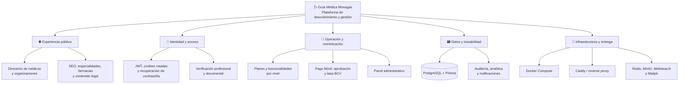
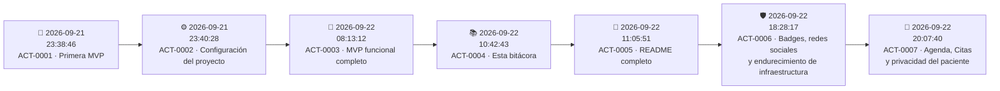

# 🩺 Guía Médica Monagas · Registro de actualizaciones

> Bitácora central de cambios, implementaciones, decisiones técnicas y tareas de evolución del sistema.
>
> **Repositorio:** [`merchandev/guiamedicamonagas`](https://github.com/merchandev/guiamedicamonagas) · **Rama:** `main`<br>
> **Última actualización de esta bitácora:** `2026-09-22 20:07:57 -04:00` · **Estado:** 🟢 Registro activo


---

## 🧭 Navegación rápida

| Ir a | Contenido |
|---|---|
| [🗺️ Cómo usar este registro](#como-usar-este-registro) | Convenciones, estados y reglas de lectura |
| [🏗️ Mapa del sistema](#mapa-del-sistema) | Vista transversal por dominios |
| [🕰️ Línea de tiempo](#linea-de-tiempo) | Secuencia completa de actividades registradas |
| [🧩 Registro por área](#registro-por-area) | Cambios agrupados por backend, frontend, datos y operación |
| [✅ Control de implementaciones](#control-de-implementaciones) | Funcionalidades entregadas y su estado |
| [📌 Próximas actividades](#proximas-actividades) | Pendientes visibles para continuidad |
| [✍️ Protocolo de registro](#protocolo-de-registro) | Plantilla para documentar cada cambio futuro |
| [🧾 Historial de esta bitácora](#historial-de-esta-bitacora) | Cambios realizados sobre este archivo |

> **Atajos:** usa `Ctrl + F` para localizar un módulo, commit o actividad; abre los bloques `▶` para consultar el detalle sin perder la vista general.

<a id="como-usar-este-registro"></a>

## 🧭 Cómo usar este registro

Esta bitácora combina dos vistas complementarias:

- **Vista temporal:** qué ocurrió y en qué fecha/hora, siguiendo el historial Git.
- **Vista por dominio:** qué partes del sistema fueron afectadas, aunque un mismo cambio atraviese varios módulos.

### Convenciones

| Elemento | Significado |
|---|---|
| `YYYY-MM-DD HH:mm:ss -04:00` | Hora local de Venezuela (`America/Caracas`) |
| 🟢 **Completado** | Implementado en el código y registrado en Git |
| 🟡 **En revisión** | Cambio local pendiente de validación o commit |
| 🔵 **Planificado** | Actividad futura aún no implementada |
| 🔴 **Bloqueado** | Requiere una decisión, credencial o dependencia externa |
| `ACT-XXXX` | Identificador único de una actividad |
| `↗` | Enlace a otra sección de esta misma bitácora |

<p align="right"><a href="#navegacion-rapida">⬆️ Volver a navegación</a></p>

<a id="mapa-del-sistema"></a>

## 🏗️ Mapa del sistema

La evolución del proyecto se organiza como un mapa de dominios conectados, no como una lista aislada de archivos:



### Puntos de entrada del proyecto

| Capa | Ubicación | Responsabilidad | Navegar a |
|---|---|---|---|
| Frontend | [`frontend/src/app`](frontend/src/app) | Rutas públicas, dashboard y administración | [ACT-0003](#act-0003) |
| Componentes | [`frontend/src/components`](frontend/src/components) | UI, formularios, navegación y motion | [ACT-0003](#act-0003) |
| Backend | [`backend/src`](backend/src) | API NestJS, autenticación y dominios | [ACT-0003](#act-0003) |
| Persistencia | [`backend/prisma`](backend/prisma) | Esquema, migración inicial y seed | [ACT-0001](#act-0001), [ACT-0003](#act-0003) |
| Operación | [`docker-compose.yml`](docker-compose.yml), [`Caddyfile`](Caddyfile) | Entorno reproducible y proxy | [ACT-0001](#act-0001), [ACT-0003](#act-0003) |
| Documentación | [`docs`](docs) | Arquitectura, endpoints y roadmap | [ACT-0001](#act-0001) |

<p align="right"><a href="#navegacion-rapida">⬆️ Volver a navegación</a></p>

<a id="linea-de-tiempo"></a>

## 🕰️ Línea de tiempo



### Resumen cuantitativo

| Indicador | Resultado |
|---|---:|
| Actividades históricas importadas desde Git | `3` |
| Actividades documentales añadidas con esta bitácora | `4` |
| Actividades registradas en total | `7` |
| Rama de referencia | `main` |
| Commit base consultado | [`3ded446`](https://github.com/merchandev/guiamedicamonagas/commit/3ded4462565d48ae5b98f35f404fb96eded30c13) |
| Zona horaria de control | `America/Caracas` (`-04:00`) |

<a id="act-0001"></a>

### 🧱 ACT-0001 · Primera MVP

<details>
<summary><strong>2026-09-21 23:38:46 -04:00</strong> · <code>06ae793</code> · 🟢 Completado</summary>

**Responsable:** `Merchan.dev`  · **Tipo:** Fundación técnica  · **Commit:** [`06ae793`](https://github.com/merchandev/guiamedicamonagas/commit/06ae79369ea354aeab528e65436b671356763be2)

**Actividades ejecutadas:**

- Se creó la base del backend con NestJS, controlador de salud, configuración TypeScript y modelo inicial de datos con Prisma.
- Se estableció la primera estructura de despliegue con Dockerfiles, Docker Compose, Caddy y script de deploy.
- Se preparó el frontend Next.js con Tailwind CSS, layout base y primeras rutas públicas y privadas.
- Se agregaron vistas iniciales para médicos, especialidades, farmacias, perfil, pagos, SEO y contenidos legales.
- Se creó la documentación técnica inicial: arquitectura, endpoints y roadmap.

**Impacto:** dejó operativo el esqueleto full-stack sobre el que se construyeron autenticación, monetización y administración.<br>
**Archivos destacados:** [`backend/prisma/schema.prisma`](backend/prisma/schema.prisma), [`docker-compose.yml`](docker-compose.yml), [`docs/ARQUITECTURA.md`](docs/ARQUITECTURA.md), [`docs/ENDPOINTS.md`](docs/ENDPOINTS.md), [`docs/ROADMAP.md`](docs/ROADMAP.md).

</details>

<a id="act-0002"></a>

### ⚙️ ACT-0002 · Configuración del proyecto

<details>
<summary><strong>2026-09-21 23:40:28 -04:00</strong> · <code>44273b7</code> · 🟢 Completado</summary>

**Responsable:** `merchandev`  · **Tipo:** Configuración y documentación  · **Commit:** [`44273b7`](https://github.com/merchandev/guiamedicamonagas/commit/44273b72bdcb5af571ad92aeb9a518f986911b63)

**Actividades ejecutadas:**

- Se incorporó `.env.example` con variables organizadas por entorno, base de datos, almacenamiento, autenticación, correo, WhatsApp y pagos.
- Se actualizó `.gitignore` para proteger secretos, artefactos generados y dependencias locales.
- Se documentó la configuración de ejecución local y el escenario de producción con Docker + Caddy.

**Impacto:** mejoró la reproducibilidad del entorno y redujo el riesgo de exponer credenciales en el repositorio.<br>
**Archivos destacados:** [`.env.example`](.env.example), [`.gitignore`](.gitignore).

</details>

<a id="act-0003"></a>

### 🚀 ACT-0003 · MVP funcional completo

<details>
<summary><strong>2026-09-22 08:13:12 -04:00</strong> · <code>57126a9</code> · 🟢 Completado</summary>

**Responsable:** `merchandev`  · **Tipo:** Implementación funcional transversal  · **Commit:** [`57126a9`](https://github.com/merchandev/guiamedicamonagas/commit/57126a90b3bd645b7ba42d2d01defc2c4d64589c)

#### 🔐 Identidad, seguridad y verificación

- Autenticación con JWT y cookie de refresh rotada.
- Roles y guards para proteger recursos y operaciones administrativas.
- Registro, verificación de correo, recuperación y cambio de contraseña.
- Validación profesional venezolana: MPPS/SACS, Art. 8, Colegio de Médicos de Monagas, INPREMEDICO, solvencia deontológica y documentos.
- Filtro global de excepciones, Helmet, throttling y validación de variables de entorno.

#### 👨‍⚕️ Directorio y perfiles

- Perfiles de profesionales con slug, ubicaciones adicionales y datos de contacto.
- Organizaciones para farmacias, laboratorios y clínicas con múltiples ubicaciones.
- Directorios públicos, fichas dinámicas, especialidades, farmacias y formularios de contacto.

#### 💳 Planes, pagos y monetización

- Niveles `Básico`, `Profesional`, `Plus`, `Premium` y `Organización`.
- Control de funcionalidades según plan, publicaciones y ubicaciones extra.
- Reporte de Pago Móvil con flujo de revisión y aprobación administrativa.
- Scraper de tasa BCV con cron horario, precios en bolívares y sobreescritura manual desde administración.

#### 🛠️ Administración y trazabilidad

- Panel de administración para médicos, organizaciones, especialidades, planes, pagos, verificaciones, cookies y SEO.
- Registro de auditoría, analítica de eventos y notificaciones.
- Integración preparada para WhatsApp y correo transaccional.
- Plantillas de correo, almacenamiento privado compatible con S3/MinIO y requisitos documentales.

#### 🎨 Frontend y experiencia

- Homepage dinámica, búsqueda, directorios, comparación de planes y dashboards.
- Sistema visual con componentes reutilizables, badges, alertas, modales, selects, spinners y estados vacíos.
- Consentimiento de cookies, términos, privacidad, robots y sitemap.
- Animaciones de entrada, contadores, ilustraciones y navegación pública/privada.

#### 🚢 Infraestructura

- Actualización de Dockerfiles y configuración de producción.
- Stack Docker Compose con PostgreSQL, Redis, MinIO, Meilisearch y Mailpit.
- Migración inicial de Prisma y seed de datos.

**Impacto:** consolidó el MVP en una plataforma full-stack con ciclo de acceso, publicación, monetización, verificación y administración.<br>
**Archivos destacados:** [`backend/src/auth`](backend/src/auth), [`backend/src/payments`](backend/src/payments), [`backend/src/exchange-rate`](backend/src/exchange-rate), [`backend/src/documents`](backend/src/documents), [`frontend/src/app/admin`](frontend/src/app/admin), [`frontend/src/app/dashboard`](frontend/src/app/dashboard).

</details>

<a id="act-0004"></a>

### 📚 ACT-0004 · Creación de la bitácora central

<details>
<summary><strong>2026-09-22 10:42:43 -04:00</strong> · <code>commit de incorporación</code> · 🟢 Completado</summary>

**Responsable:** `merchandev / Codex`  · **Tipo:** Documentación y control de cambios

**Actividades ejecutadas:**

- Se creó [`Actualizaciones.md`](Actualizaciones.md) como punto central de control histórico y operativo.
- Se importó el historial Git disponible hasta [`57126a9`](https://github.com/merchandev/guiamedicamonagas/commit/57126a90b3bd645b7ba42d2d01defc2c4d64589c).
- Se añadieron navegación interna, enlaces cruzados, bloques desplegables, emojis, badges, tablas, diagramas Mermaid y una plantilla para futuros cambios.
- Se estableció `America/Caracas` (`-04:00`) como referencia para fecha y hora de modificación.

**Resultado:** la bitácora queda lista para incorporarse al historial del repositorio junto con la documentación principal.

</details>

<a id="act-0005"></a>

### 📘 ACT-0005 · README completo y descripción del repositorio

<details>
<summary><strong>2026-09-22 11:05:51 -04:00</strong> · <code>commit de incorporación</code> · 🟢 Completado</summary>

**Responsable:** `merchandev / Codex`  · **Tipo:** Documentación de producto y onboarding

**Actividades ejecutadas:**

- Se creó [`README.md`](README.md) como guía principal del proyecto.
- Se documentaron el propósito, objetivos, estado actual, funcionalidades públicas, áreas profesionales y panel administrativo.
- Se incorporaron arquitectura, stack tecnológico, estructura de carpetas, requisitos, puesta en marcha, desarrollo local, variables, puertos y comandos útiles.
- Se resumieron los dominios de API, flujos de registro/verificación/pago, seguridad, despliegue, roadmap y contribución.
- Se enlazaron [`Actualizaciones.md`](Actualizaciones.md) y la documentación técnica existente para facilitar la navegación.

**Impacto:** una persona nueva puede entender el producto, levantar el entorno local, localizar los módulos principales y continuar el desarrollo con una única guía de entrada.

</details>

<a id="act-0006"></a>

### 🛡️ ACT-0006 · Badges de verificación, redes sociales y endurecimiento de infraestructura

<details>
<summary><strong>2026-09-22 18:28:17 -04:00</strong> · <code>1877b1b</code> · 🟢 Completado</summary>

**Responsable:** `Claude Sonnet 5`  · **Tipo:** `feature | fix | security`  · **Commit:** [`1877b1b`](https://github.com/merchandev/guiamedicamonagas/commit/1877b1bc90cf973fa53a9f40dc9b5e895abe80e9)

#### 👨‍⚕️ Directorio y perfiles

- Ícono de verificación junto al nombre, coloreado según el plan del médico (gris Básico, azul Profesional, índigo Plus, dorado Premium) y según el tipo de organización (verde farmacias, morado laboratorios, naranja clínicas).
- Redes sociales (Instagram, Facebook, TikTok, Web) gestionables desde el perfil, con límite según plan (0 en Básico/Profesional, 2 en Plus, las 4 en Premium/Organización) y validación server-side de que la URL pertenezca al dominio oficial de cada red — nunca un dominio distinto.
- **Fix:** `/medicos/[slug]` daba 404 intermitente porque Next.js 16 exige `await` sobre `params` (API asíncrona) y la ruta lo leía de forma síncrona.

#### 🛡️ Seguridad de infraestructura (SEC-01) y autenticación (SEC-02 parcial)

- `docker-compose.dev.yml` (puertos solo a `127.0.0.1`) y `docker-compose.prod.yml` (red interna aislada, solo Caddy expuesto a Internet) reemplazan el compose único anterior.
- Contenedores de aplicación corren con usuario sin privilegios (`USER node`), imágenes fijadas a versiones exactas.
- MinIO deja de usarse con credenciales root desde la API: `scripts/minio-init.sh` crea un usuario de servicio con permisos mínimos (`GetObject`/`PutObject`/`DeleteObject` solo sobre el bucket de la app).
- `scripts/deploy.sh` valida 16 variables críticas y aborta si detecta un valor por defecto inseguro conocido; nunca copia `.env.example` automáticamente.
- Migración de contraseñas de `bcrypt` a `Argon2id` con re-hash silencioso en el login (el usuario no nota nada); `env.validation.ts` rechaza secretos con valores inseguros conocidos cuando `NODE_ENV=production`.

**Impacto:** el directorio comunica visualmente el nivel de plan/tipo de cada perfil, los profesionales pueden mostrar sus redes oficiales sin riesgo de enlaces falsificados, y la infraestructura de despliegue deja de exponer servicios internos o usar credenciales root — sin tocar el flujo de autenticación existente (cookie httpOnly + token en memoria) que ya cumplía buenas prácticas.<br>
**Archivos destacados:** [`frontend/src/components/VerificationBadge.tsx`](frontend/src/components/VerificationBadge.tsx), [`backend/src/common/dto/social-link.dto.ts`](backend/src/common/dto/social-link.dto.ts), [`docker-compose.prod.yml`](docker-compose.prod.yml), [`scripts/minio-init.sh`](scripts/minio-init.sh), [`backend/src/common/utils/password.util.ts`](backend/src/common/utils/password.util.ts), [`docs/security/sec-01-infrastructure-hardening.md`](docs/security/sec-01-infrastructure-hardening.md).

</details>

<a id="act-0007"></a>

### 📅 ACT-0007 · Agenda, Citas y privacidad del paciente

<details>
<summary><strong>2026-09-22 20:07:40 -04:00</strong> · <code>3ded446</code> · 🟢 Completado</summary>

**Responsable:** `Claude Sonnet 5`  · **Tipo:** `feature | fix`  · **Commit:** [`3ded446`](https://github.com/merchandev/guiamedicamonagas/commit/3ded4462565d48ae5b98f35f404fb96eded30c13)

Primeras dos fases de la evolución del producto de "directorio médico" a "plataforma de relación paciente↔profesional" (visión completa documentada en el plan de implementación de la sesión).

#### 📅 Agenda (nuevo módulo `backend/src/agenda`, gated a plan Profesional en adelante)

- Configuración de horario: duración de cita, tiempo entre citas (buffer), máximo de citas diarias, confirmación automática opcional.
- Bloques de horario semanal (por día de la semana) y excepciones puntuales (vacaciones, feriados, horario especial), con validación de solapamiento.

#### 🩺 Citas (nuevo módulo `backend/src/appointments`)

- Disponibilidad calculada 100% en el servidor a partir del horario, bloques, excepciones y citas ya tomadas — nunca confía en un horario propuesto por el cliente.
- Máquina de estados completa: `PENDING → CONFIRMED → COMPLETED`, con `CANCELLED` y `NO_SHOW`, más reprogramación (que reabre a `PENDING` salvo confirmación automática).
- **Anti-doble-reserva real:** además de la validación en la aplicación, un índice único parcial de PostgreSQL (`professionalId + startsAt` mientras el estado es `PENDING`/`CONFIRMED`) garantiza que dos pacientes nunca puedan quedarse con el mismo horario, incluso ante una condición de carrera.
- Notificaciones de cita (creada, confirmada, cancelada, reprogramada) extendiendo el `NotificationsService` existente — no un sistema paralelo. El correo de confirmación adjunta un evento `.ics` generado internamente (sin librería externa) para Google Calendar/Outlook/Apple Calendar.
- Recordatorios automáticos 24h y 2h antes de la cita, vía `@nestjs/schedule` (mismo patrón que el scraper de tasa BCV).
- Flujo público de reserva en `/medicos/[slug]/agendar`; el botón "Agendar cita" solo aparece cuando el profesional tiene el plan requerido **y** un horario configurado.

#### 🔒 Privacidad del paciente (nuevo módulo `backend/src/patients`)

- Cada paciente recibe un código pseudónimo único (`GMM-XXXX`) generado por el sistema.
- El médico **nunca** puede buscar pacientes por nombre, teléfono o cédula — la lista de pacientes muestra solo el código, cantidad de citas y última visita.
- Revelar la identidad de un paciente es una acción explícita, solo permitida si existe al menos una cita en común, y queda registrada en `AuditLog` (`PATIENT_IDENTITY_REVEALED`).

#### 🐛 Correcciones encontradas durante la verificación

- `env.validation.ts` usaba `z.coerce.boolean()`, que convierte *cualquier* string no vacío en `true` (incluido literalmente `"false"`). Esto rompía en silencio `SMTP_SECURE=false` (nodemailer intentaba TLS contra Mailpit y fallaba) y `WHATSAPP_ENABLED=false` (el flag de no-op en desarrollo quedaba inactivo). Reemplazado por un parser explícito de `"true"`/`"false"`.
- `FinanceRecord.appointmentId` no tenía relación real en el schema (era un string suelto sin integridad referencial) — corregido antes de construir la auto-generación de ingresos (fase siguiente).

**Verificación realizada:** flujo completo probado por API (`curl`) y en navegador — reserva → confirmación → email con `.ics` válido recibido en Mailpit → intento de doble reserva rechazado con `409` → reprogramación → cancelación → lista de pacientes por código → revelar identidad auditado → bajar el plan del profesional bloquea Agenda y Citas con `403`.

**Impacto:** el producto deja de ser solo un directorio: un médico con plan Profesional o superior ya puede recibir, gestionar y confirmar citas reales, con notificaciones automáticas y sin exponer jamás la identidad de un paciente sin una razón auditable.<br>
**Archivos destacados:** [`backend/src/agenda`](backend/src/agenda), [`backend/src/appointments`](backend/src/appointments), [`backend/src/patients`](backend/src/patients), [`frontend/src/app/dashboard/citas`](frontend/src/app/dashboard/citas), [`frontend/src/app/dashboard/pacientes`](frontend/src/app/dashboard/pacientes), [`frontend/src/app/medicos/[slug]/agendar`](frontend/src/app/medicos/[slug]/agendar).

**Pendiente explícito (línea roja de seguridad):** el modelo `ClinicalNote` (historia clínica) ya existe en el schema pero **no tiene endpoints ni UI todavía por decisión deliberada** — se activa solo después de SEC-05 (cifrado de campos sensibles). Ver [Próximas actividades](#proximas-actividades).

</details>

<p align="right"><a href="#navegacion-rapida">⬆️ Volver a navegación</a></p>

<a id="registro-por-area"></a>

## 🧩 Registro por área

Esta vista permite saltar directamente desde un dominio a las actividades que lo modificaron.

| Área | Implementaciones registradas | Actividades relacionadas |
|---|---|---|
| 🧱 Fundación técnica | NestJS, Next.js, Prisma, Docker, Caddy, Tailwind | [ACT-0001](#act-0001) · [ACT-0003](#act-0003) |
| 🔐 Auth y seguridad | JWT, refresh cookie, roles, correo, recuperación, throttling, Argon2id | [ACT-0003](#act-0003) · [ACT-0006](#act-0006) |
| 👨‍⚕️ Profesionales | Perfiles, ubicaciones, documentos, verificación legal, redes sociales, badges | [ACT-0001](#act-0001) · [ACT-0003](#act-0003) · [ACT-0006](#act-0006) |
| 🏥 Organizaciones | Farmacias, laboratorios, clínicas y ubicaciones | [ACT-0003](#act-0003) · [ACT-0006](#act-0006) |
| 💳 Monetización | Planes, Pago Móvil, aprobación y tasa BCV | [ACT-0001](#act-0001) · [ACT-0003](#act-0003) |
| 📅 Agenda y citas | Horarios, disponibilidad, reservas, máquina de estados, anti-doble-reserva | [ACT-0007](#act-0007) |
| 🔒 Pacientes | Código pseudónimo, listado sin datos personales, revelación auditada | [ACT-0007](#act-0007) |
| 🛠️ Administración | Médicos, pagos, SEO, cookies, especialidades, planes y verificaciones | [ACT-0001](#act-0001) · [ACT-0003](#act-0003) |
| 📊 Observabilidad | Auditoría, analítica, notificaciones y salud | [ACT-0001](#act-0001) · [ACT-0003](#act-0003) · [ACT-0007](#act-0007) |
| 🎨 Experiencia | Directorios, dashboard, componentes UI, motion y legal | [ACT-0001](#act-0001) · [ACT-0003](#act-0003) · [ACT-0007](#act-0007) |
| 🚢 Operación | Variables de entorno, Compose, almacenamiento, correo y proxy | [ACT-0001](#act-0001) · [ACT-0002](#act-0002) · [ACT-0003](#act-0003) · [ACT-0006](#act-0006) |

<p align="right"><a href="#navegacion-rapida">⬆️ Volver a navegación</a></p>

<a id="control-de-implementaciones"></a>

## ✅ Control de implementaciones

| ID | Implementación | Estado | Evidencia / ubicación |
|---|---|---|---|
| IMP-001 | Base full-stack y despliegue reproducible | 🟢 Completado | [`docker-compose.yml`](docker-compose.yml), [`backend`](backend), [`frontend`](frontend) |
| IMP-002 | Modelo de datos, migración y seed | 🟢 Completado | [`backend/prisma`](backend/prisma) |
| IMP-003 | Autenticación, sesiones, roles y recuperación | 🟢 Completado | [`backend/src/auth`](backend/src/auth), [`frontend/src/lib/auth-context.tsx`](frontend/src/lib/auth-context.tsx) |
| IMP-004 | Verificación profesional y gestión documental | 🟢 Completado | [`backend/src/documents`](backend/src/documents), [`frontend/src/app/dashboard/documentos`](frontend/src/app/dashboard/documentos) |
| IMP-005 | Perfiles, directorios y organizaciones | 🟢 Completado | [`backend/src/professionals`](backend/src/professionals), [`frontend/src/app/medicos`](frontend/src/app/medicos) |
| IMP-006 | Planes, Pago Móvil y flujo administrativo | 🟢 Completado | [`backend/src/subscriptions`](backend/src/subscriptions), [`backend/src/payments`](backend/src/payments) |
| IMP-007 | Tasa BCV y precios dinámicos en Bs. | 🟢 Completado | [`backend/src/exchange-rate`](backend/src/exchange-rate), [`frontend/src/components/BcvRateBadge.tsx`](frontend/src/components/BcvRateBadge.tsx) |
| IMP-008 | Panel administrativo transversal | 🟢 Completado | [`frontend/src/app/admin`](frontend/src/app/admin) |
| IMP-009 | SEO, cookies, correo, WhatsApp y analítica | 🟢 Completado | [`backend/src/seo`](backend/src/seo), [`backend/src/mail`](backend/src/mail), [`backend/src/analytics`](backend/src/analytics) |
| IMP-010 | Bitácora central de actividades | 🟢 Completado | [`Actualizaciones.md`](Actualizaciones.md) |
| IMP-011 | README principal y onboarding del repositorio | 🟢 Completado | [`README.md`](README.md) |
| IMP-012 | Badges de verificación por plan/tipo y redes sociales validadas | 🟢 Completado | [`frontend/src/components/VerificationBadge.tsx`](frontend/src/components/VerificationBadge.tsx), [`frontend/src/lib/social.ts`](frontend/src/lib/social.ts) |
| IMP-013 | Aislamiento de red Docker, usuario de servicio MinIO y deploy validado | 🟢 Completado | [`docker-compose.prod.yml`](docker-compose.prod.yml), [`scripts/deploy.sh`](scripts/deploy.sh), [`scripts/minio-init.sh`](scripts/minio-init.sh) |
| IMP-014 | Hashing de contraseñas con Argon2id y migración silenciosa desde bcrypt | 🟢 Completado | [`backend/src/common/utils/password.util.ts`](backend/src/common/utils/password.util.ts) |
| IMP-015 | Agenda: horarios, bloques y excepciones por profesional | 🟢 Completado | [`backend/src/agenda`](backend/src/agenda), [`frontend/src/app/dashboard/agenda`](frontend/src/app/dashboard/agenda) |
| IMP-016 | Citas: disponibilidad, reserva, estados, anti-doble-reserva y recordatorios | 🟢 Completado | [`backend/src/appointments`](backend/src/appointments), [`frontend/src/app/dashboard/citas`](frontend/src/app/dashboard/citas) |
| IMP-017 | Privacidad de pacientes: código pseudónimo y revelación auditada | 🟢 Completado | [`backend/src/patients`](backend/src/patients), [`frontend/src/app/dashboard/pacientes`](frontend/src/app/dashboard/pacientes) |

<p align="right"><a href="#navegacion-rapida">⬆️ Volver a navegación</a></p>

<a id="proximas-actividades"></a>

## 📌 Próximas actividades

> Esta sección funciona como tablero de continuidad. Cada pendiente debe convertirse en una nueva actividad `ACT-XXXX` al comenzar y enlazarse desde aquí al cerrarse.

| Prioridad | Actividad | Estado | Criterio de cierre |
|---|---|---|---|
| 🔴 Alta | Configurar credenciales reales de correo, S3/MinIO, WhatsApp y BCV en producción | 🔵 Planificado | Variables documentadas y prueba de cada integración fuera de dev |
| 🔴 Alta | SEC-03 · Permisos granulares (eliminar el bypass universal de SUPERADMIN) | 🔵 Planificado | Matriz endpoint × rol verificada, sin permiso implícito por rol |
| 🔴 Alta | SEC-05 · Cifrado de campos sensibles del paciente (cédula, teléfono) y de `ClinicalNote` | 🔴 Bloqueado | Habilita activar historia clínica — ver línea roja en [ACT-0007](#act-0007) |
| 🟠 Media | SEC-02 (resto) · `tokenVersion` + detección de reuse de refresh tokens | 🔵 Planificado | Sesión revocada por completo ante cambio de rol/contraseña/compromiso |
| 🟠 Media | Fase 3a · Finanzas: `FinanceRecord` + auto-generación de ingreso al completar cita | 🔵 Planificado | Gated a plan Premium; usa `ExchangeRateService` ya existente |
| 🟠 Media | Fase 3b · Historia clínica (`ClinicalNote`) | 🔴 Bloqueado | Solo después de SEC-05; sin endpoints ni UI hasta entonces |
| 🟡 Baja | Fase 4 · Bandeja de conversaciones unificada (WhatsApp/email/in-app) | 🔵 Planificado | Requiere modelo nuevo; `MessageLog` no alcanza |
| 🟡 Baja | Fase 5 · Notificaciones push web (VAPID) | 🔵 Planificado | Extiende `NotificationsService.notify()`, usa `PushSubscription` ya migrado |
| 🟡 Baja | Fase 6 · Estadísticas avanzadas (embudo de citas, conversión, no-show) | 🔵 Planificado | Extiende `AnalyticsService` existente |
| 🟡 Baja | Fase 7 · Compatibilidad con app Flutter (Android/iOS) | 🔵 Planificado | Variante de autenticación por token para clientes no-navegador |
| 🟢 Continua | Registrar cada modificación nueva con fecha, hora, responsable y evidencia | 🟢 Activo | No existen cambios relevantes sin entrada en esta bitácora |
| 🟢 Continua | Confirmar en el repositorio remoto cada cambio cerrado localmente | 🟢 Activo | `git status` limpio y `origin/main` sincronizado al cierre de cada sesión |

<p align="right"><a href="#navegacion-rapida">⬆️ Volver a navegación</a></p>

<a id="protocolo-de-registro"></a>

## ✍️ Protocolo de registro

Para cada cambio futuro, añadir una entrada en la línea de tiempo y actualizar el control por área cuando corresponda. Mantener siempre la fecha/hora local con zona horaria.

```markdown
<a id="act-XXXX"></a>

### 🧩 ACT-XXXX · Título breve del cambio

<details>
<summary><strong>YYYY-MM-DD HH:mm:ss -04:00</strong> · <code>commit-o-working-tree</code> · 🟢 Completado</summary>

**Responsable:** `nombre` · **Tipo:** `feature | fix | docs | ops | security`

**Actividades ejecutadas:**

- Qué se implementó.
- Qué módulos o archivos fueron afectados.
- Qué validación se realizó.

**Impacto:** resultado funcional o técnico del cambio.<br>
**Evidencia:** [archivo](ruta/al/archivo), [commit](URL), prueba o captura.

</details>
```

### Reglas mínimas de calidad

- Registrar la hora de inicio o de cierre de la modificación usando `America/Caracas`.
- Usar un ID único y mantener la numeración consecutiva.
- Describir el impacto funcional, no solo el nombre del archivo modificado.
- Enlazar evidencia verificable: commit, archivo, endpoint, prueba o decisión.
- Si una actividad cruza varias áreas, enlazarla desde la tabla de [registro por área](#registro-por-area).
- Mantener los estados sincronizados entre la línea de tiempo y [control de implementaciones](#control-de-implementaciones).

<p align="right"><a href="#navegacion-rapida">⬆️ Volver a navegación</a></p>

<a id="historial-de-esta-bitacora"></a>

## 🧾 Historial de esta bitácora

| Fecha y hora | Cambio | Estado |
|---|---|---|
| `2026-09-22 10:42:43 -04:00` | Creación de `Actualizaciones.md`, importación de 3 commits históricos y definición del protocolo de control | 🟢 Completado |
| `2026-09-22 11:05:51 -04:00` | Creación de `README.md` con guía funcional, técnica, operativa y de contribución | 🟢 Completado |
| `2026-09-22 20:07:57 -04:00` | Incorporación de ACT-0006 y ACT-0007 (badges/redes sociales/endurecimiento de infraestructura y Agenda/Citas/Pacientes), actualización de línea de tiempo, resumen cuantitativo, registro por área, control de implementaciones y próximas actividades | 🟢 Completado |

---

<p align="center">
  <sub>🩺 Guía Médica Monagas · Bitácora viva de evolución del sistema</sub><br>
  <a href="#navegacion-rapida">Volver al inicio ↑</a>
</p>
