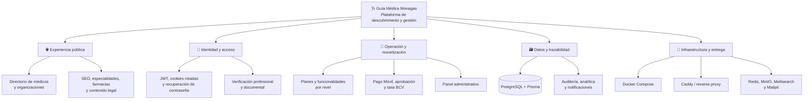

# 🩺 Guía Médica Monagas · Registro de actualizaciones

> Bitácora central de cambios, implementaciones, decisiones técnicas y tareas de evolución del sistema.
>
> **Repositorio:** [`merchandev/guiamedicamonagas`](https://github.com/merchandev/guiamedicamonagas) · **Rama:** `main`<br>
> **Última actualización de esta bitácora:** `2026-09-24 01:45:00 -04:00` · **Estado:** 🟢 Registro activo


---

## 🧭 Navegación rápida

| Ir a | Contenido |
|---|---|
| [🗺️ Cómo usar este registro](#como-usar-este-registro) | Convenciones, estados y reglas de lectura |
| [🏗️ Mapa del sistema](#mapa-del-sistema) | Vista transversal por dominios |
| [🕰️ Línea de tiempo](#linea-de-tiempo) | Secuencia completa de actividades registradas |
| [🧩 Registro por área](#registro-por-area) | Cambios agrupados por backend, frontend, datos y operación |
| [✅ Control de implementaciones](#control-de-implementaciones) | Funcionalidades entregadas y su estado |
| [📌 Próximas actividades](#proximas-actividades) | Pendientes visibles para continuidad |
| [✍️ Protocolo de registro](#protocolo-de-registro) | Plantilla para documentar cada cambio futuro |
| [🧾 Historial de esta bitácora](#historial-de-esta-bitacora) | Cambios realizados sobre este archivo |

> **Atajos:** usa `Ctrl + F` para localizar un módulo, commit o actividad; abre los bloques `▶` para consultar el detalle sin perder la vista general.

<a id="como-usar-este-registro"></a>

## 🧭 Cómo usar este registro

Esta bitácora combina dos vistas complementarias:

- **Vista temporal:** qué ocurrió y en qué fecha/hora, siguiendo el historial Git.
- **Vista por dominio:** qué partes del sistema fueron afectadas, aunque un mismo cambio atraviese varios módulos.

### Convenciones

| Elemento | Significado |
|---|---|
| `YYYY-MM-DD HH:mm:ss -04:00` | Hora local de Venezuela (`America/Caracas`) |
| 🟢 **Completado** | Implementado en el código y registrado en Git |
| 🟡 **En revisión** | Cambio local pendiente de validación o commit |
| 🔵 **Planificado** | Actividad futura aún no implementada |
| 🔴 **Bloqueado** | Requiere una decisión, credencial o dependencia externa |
| `ACT-XXXX` | Identificador único de una actividad |
| `↗` | Enlace a otra sección de esta misma bitácora |

<p align="right"><a href="#navegacion-rapida">⬆️ Volver a navegación</a></p>

<a id="mapa-del-sistema"></a>

## 🏗️ Mapa del sistema

La evolución del proyecto se organiza como un mapa de dominios conectados, no como una lista aislada de archivos:



### Puntos de entrada del proyecto

| Capa | Ubicación | Responsabilidad | Navegar a |
|---|---|---|---|
| Frontend | [`frontend/src/app`](frontend/src/app) | Rutas públicas, dashboard y administración | [ACT-0003](#act-0003) |
| Componentes | [`frontend/src/components`](frontend/src/components) | UI, formularios, navegación y motion | [ACT-0003](#act-0003) |
| Backend | [`backend/src`](backend/src) | API NestJS, autenticación y dominios | [ACT-0003](#act-0003) |
| Persistencia | [`backend/prisma`](backend/prisma) | Esquema, migración inicial y seed | [ACT-0001](#act-0001), [ACT-0003](#act-0003) |
| Operación | [`docker-compose.yml`](docker-compose.yml), [`Caddyfile`](Caddyfile) | Entorno reproducible y proxy | [ACT-0001](#act-0001), [ACT-0003](#act-0003) |
| Documentación | [`docs`](docs) | Arquitectura, endpoints y roadmap | [ACT-0001](#act-0001) |

<p align="right"><a href="#navegacion-rapida">⬆️ Volver a navegación</a></p>

<a id="linea-de-tiempo"></a>

## 🕰️ Línea de tiempo

```mermaid
flowchart LR
    A[🧱 2026-09-21\n23:38:46\nACT-0001 · Primera MVP]
    B[⚙️ 2026-09-21\n23:40:28\nACT-0002 · Configuración del proyecto]
    C[🚀 2026-09-22\n08:13:12\nACT-0003 · MVP funcional completo]
    D[📚 2026-09-22\n10:42:43\nACT-0004 · Esta bitácora]
    E[📘 2026-09-22\n11:05:51\nACT-0005 · README completo]
    F[🛡️ 2026-09-22\n18:28:17\nACT-0006 · Badges, redes sociales\ny endurecimiento de infraestructura]
    G[📅 2026-09-22\n20:07:40\nACT-0007 · Agenda, Citas\ny privacidad del paciente]
    H[🚀 2026-09-23\n05:43:35\nACT-0008 · Despliegue independiente\nen VPS compartido]
    I[🩹 2026-09-23\n06:30:00\nACT-0009 · Correcciones del\nprimer despliegue real]
    J[💱 2026-09-23\n07:20:00\nACT-0010 · Corrección de la tasa BCV\ny retiro de INPREMEDICO]
    K[🔐 2026-09-23\n07:55:00\nACT-0011 · Acceso SSH y reconciliación\nde fixes ya probados en producción]
    L[🧑‍🤝‍🧑 2026-09-23\n10:15:00\nACT-0012 · Perfil de paciente\ny fix crítico de CORS]
    M[📐 2026-09-23\n10:35:00\nACT-0013 · Ancho unificado\n80/10/10 en toda la web]
    N[🧾 2026-09-23\n10:45:00\nACT-0014 · Campos de formulario\nangostos corregidos]
    O[🔏 2026-09-23\n18:00:00\nACT-0015 · Auditoría: salud cifrada,\nconsentimiento y organizaciones]
    P[🧰 2026-09-24\n01:45:00\nACT-0016 · Sesiones, identidad,\nimágenes seguras y antivirus]

    A --> B --> C --> D --> E --> F --> G --> H --> I --> J --> K --> L --> M --> N --> O --> P
```



### Resumen cuantitativo

| Indicador | Resultado |
|---|---:|
| Actividades históricas importadas desde Git | `3` |
| Actividades documentales añadidas con esta bitácora | `13` |
| Actividades registradas en total | `16` |
| Rama de referencia | `main` |
| Commit base consultado | [`c30c03d`](https://github.com/merchandev/guiamedicamonagas/commit/c30c03d) |
| Zona horaria de control | `America/Caracas` (`-04:00`) |

<a id="act-0001"></a>

### 🧱 ACT-0001 · Primera MVP

<details>
<summary><strong>2026-09-21 23:38:46 -04:00</strong> · <code>06ae793</code> · 🟢 Completado</summary>

**Responsable:** `Merchan.dev`  · **Tipo:** Fundación técnica  · **Commit:** [`06ae793`](https://github.com/merchandev/guiamedicamonagas/commit/06ae79369ea354aeab528e65436b671356763be2)

**Actividades ejecutadas:**

- Se creó la base del backend con NestJS, controlador de salud, configuración TypeScript y modelo inicial de datos con Prisma.
- Se estableció la primera estructura de despliegue con Dockerfiles, Docker Compose, Caddy y script de deploy.
- Se preparó el frontend Next.js con Tailwind CSS, layout base y primeras rutas públicas y privadas.
- Se agregaron vistas iniciales para médicos, especialidades, farmacias, perfil, pagos, SEO y contenidos legales.
- Se creó la documentación técnica inicial: arquitectura, endpoints y roadmap.

**Impacto:** dejó operativo el esqueleto full-stack sobre el que se construyeron autenticación, monetización y administración.<br>
**Archivos destacados:** [`backend/prisma/schema.prisma`](backend/prisma/schema.prisma), [`docker-compose.yml`](docker-compose.yml), [`docs/ARQUITECTURA.md`](docs/ARQUITECTURA.md), [`docs/ENDPOINTS.md`](docs/ENDPOINTS.md), [`docs/ROADMAP.md`](docs/ROADMAP.md).

</details>

<a id="act-0002"></a>

### ⚙️ ACT-0002 · Configuración del proyecto

<details>
<summary><strong>2026-09-21 23:40:28 -04:00</strong> · <code>44273b7</code> · 🟢 Completado</summary>

**Responsable:** `merchandev`  · **Tipo:** Configuración y documentación  · **Commit:** [`44273b7`](https://github.com/merchandev/guiamedicamonagas/commit/44273b72bdcb5af571ad92aeb9a518f986911b63)

**Actividades ejecutadas:**

- Se incorporó `.env.example` con variables organizadas por entorno, base de datos, almacenamiento, autenticación, correo, WhatsApp y pagos.
- Se actualizó `.gitignore` para proteger secretos, artefactos generados y dependencias locales.
- Se documentó la configuración de ejecución local y el escenario de producción con Docker + Caddy.

**Impacto:** mejoró la reproducibilidad del entorno y redujo el riesgo de exponer credenciales en el repositorio.<br>
**Archivos destacados:** [`.env.example`](.env.example), [`.gitignore`](.gitignore).

</details>

<a id="act-0003"></a>

### 🚀 ACT-0003 · MVP funcional completo

<details>
<summary><strong>2026-09-22 08:13:12 -04:00</strong> · <code>57126a9</code> · 🟢 Completado</summary>

**Responsable:** `merchandev`  · **Tipo:** Implementación funcional transversal  · **Commit:** [`57126a9`](https://github.com/merchandev/guiamedicamonagas/commit/57126a90b3bd645b7ba42d2d01defc2c4d64589c)

#### 🔐 Identidad, seguridad y verificación

- Autenticación con JWT y cookie de refresh rotada.
- Roles y guards para proteger recursos y operaciones administrativas.
- Registro, verificación de correo, recuperación y cambio de contraseña.
- Validación profesional venezolana: MPPS/SACS, Art. 8, Colegio de Médicos de Monagas, INPREMEDICO, solvencia deontológica y documentos.
- Filtro global de excepciones, Helmet, throttling y validación de variables de entorno.

#### 👨‍⚕️ Directorio y perfiles

- Perfiles de profesionales con slug, ubicaciones adicionales y datos de contacto.
- Organizaciones para farmacias, laboratorios y clínicas con múltiples ubicaciones.
- Directorios públicos, fichas dinámicas, especialidades, farmacias y formularios de contacto.

#### 💳 Planes, pagos y monetización

- Niveles `Básico`, `Profesional`, `Plus`, `Premium` y `Organización`.
- Control de funcionalidades según plan, publicaciones y ubicaciones extra.
- Reporte de Pago Móvil con flujo de revisión y aprobación administrativa.
- Scraper de tasa BCV con cron horario, precios en bolívares y sobreescritura manual desde administración.

#### 🛠️ Administración y trazabilidad

- Panel de administración para médicos, organizaciones, especialidades, planes, pagos, verificaciones, cookies y SEO.
- Registro de auditoría, analítica de eventos y notificaciones.
- Integración preparada para WhatsApp y correo transaccional.
- Plantillas de correo, almacenamiento privado compatible con S3/MinIO y requisitos documentales.

#### 🎨 Frontend y experiencia

- Homepage dinámica, búsqueda, directorios, comparación de planes y dashboards.
- Sistema visual con componentes reutilizables, badges, alertas, modales, selects, spinners y estados vacíos.
- Consentimiento de cookies, términos, privacidad, robots y sitemap.
- Animaciones de entrada, contadores, ilustraciones y navegación pública/privada.

#### 🚢 Infraestructura

- Actualización de Dockerfiles y configuración de producción.
- Stack Docker Compose con PostgreSQL, Redis, MinIO, Meilisearch y Mailpit.
- Migración inicial de Prisma y seed de datos.

**Impacto:** consolidó el MVP en una plataforma full-stack con ciclo de acceso, publicación, monetización, verificación y administración.<br>
**Archivos destacados:** [`backend/src/auth`](backend/src/auth), [`backend/src/payments`](backend/src/payments), [`backend/src/exchange-rate`](backend/src/exchange-rate), [`backend/src/documents`](backend/src/documents), [`frontend/src/app/admin`](frontend/src/app/admin), [`frontend/src/app/dashboard`](frontend/src/app/dashboard).

</details>

<a id="act-0004"></a>

### 📚 ACT-0004 · Creación de la bitácora central

<details>
<summary><strong>2026-09-22 10:42:43 -04:00</strong> · <code>commit de incorporación</code> · 🟢 Completado</summary>

**Responsable:** `merchandev / Codex`  · **Tipo:** Documentación y control de cambios

**Actividades ejecutadas:**

- Se creó [`Actualizaciones.md`](Actualizaciones.md) como punto central de control histórico y operativo.
- Se importó el historial Git disponible hasta [`57126a9`](https://github.com/merchandev/guiamedicamonagas/commit/57126a90b3bd645b7ba42d2d01defc2c4d64589c).
- Se añadieron navegación interna, enlaces cruzados, bloques desplegables, emojis, badges, tablas, diagramas Mermaid y una plantilla para futuros cambios.
- Se estableció `America/Caracas` (`-04:00`) como referencia para fecha y hora de modificación.

**Resultado:** la bitácora queda lista para incorporarse al historial del repositorio junto con la documentación principal.

</details>

<a id="act-0005"></a>

### 📘 ACT-0005 · README completo y descripción del repositorio

<details>
<summary><strong>2026-09-22 11:05:51 -04:00</strong> · <code>commit de incorporación</code> · 🟢 Completado</summary>

**Responsable:** `merchandev / Codex`  · **Tipo:** Documentación de producto y onboarding

**Actividades ejecutadas:**

- Se creó [`README.md`](README.md) como guía principal del proyecto.
- Se documentaron el propósito, objetivos, estado actual, funcionalidades públicas, áreas profesionales y panel administrativo.
- Se incorporaron arquitectura, stack tecnológico, estructura de carpetas, requisitos, puesta en marcha, desarrollo local, variables, puertos y comandos útiles.
- Se resumieron los dominios de API, flujos de registro/verificación/pago, seguridad, despliegue, roadmap y contribución.
- Se enlazaron [`Actualizaciones.md`](Actualizaciones.md) y la documentación técnica existente para facilitar la navegación.

**Impacto:** una persona nueva puede entender el producto, levantar el entorno local, localizar los módulos principales y continuar el desarrollo con una única guía de entrada.

</details>

<a id="act-0006"></a>

### 🛡️ ACT-0006 · Badges de verificación, redes sociales y endurecimiento de infraestructura

<details>
<summary><strong>2026-09-22 18:28:17 -04:00</strong> · <code>1877b1b</code> · 🟢 Completado</summary>

**Responsable:** `Claude Sonnet 5`  · **Tipo:** `feature | fix | security`  · **Commit:** [`1877b1b`](https://github.com/merchandev/guiamedicamonagas/commit/1877b1bc90cf973fa53a9f40dc9b5e895abe80e9)

#### 👨‍⚕️ Directorio y perfiles

- Ícono de verificación junto al nombre, coloreado según el plan del médico (gris Básico, azul Profesional, índigo Plus, dorado Premium) y según el tipo de organización (verde farmacias, morado laboratorios, naranja clínicas).
- Redes sociales (Instagram, Facebook, TikTok, Web) gestionables desde el perfil, con límite según plan (0 en Básico/Profesional, 2 en Plus, las 4 en Premium/Organización) y validación server-side de que la URL pertenezca al dominio oficial de cada red — nunca un dominio distinto.
- **Fix:** `/medicos/[slug]` daba 404 intermitente porque Next.js 16 exige `await` sobre `params` (API asíncrona) y la ruta lo leía de forma síncrona.

#### 🛡️ Seguridad de infraestructura (SEC-01) y autenticación (SEC-02 parcial)

- `docker-compose.dev.yml` (puertos solo a `127.0.0.1`) y `docker-compose.prod.yml` (red interna aislada, solo Caddy expuesto a Internet) reemplazan el compose único anterior.
- Contenedores de aplicación corren con usuario sin privilegios (`USER node`), imágenes fijadas a versiones exactas.
- MinIO deja de usarse con credenciales root desde la API: `scripts/minio-init.sh` crea un usuario de servicio con permisos mínimos (`GetObject`/`PutObject`/`DeleteObject` solo sobre el bucket de la app).
- `scripts/deploy.sh` valida 16 variables críticas y aborta si detecta un valor por defecto inseguro conocido; nunca copia `.env.example` automáticamente.
- Migración de contraseñas de `bcrypt` a `Argon2id` con re-hash silencioso en el login (el usuario no nota nada); `env.validation.ts` rechaza secretos con valores inseguros conocidos cuando `NODE_ENV=production`.

**Impacto:** el directorio comunica visualmente el nivel de plan/tipo de cada perfil, los profesionales pueden mostrar sus redes oficiales sin riesgo de enlaces falsificados, y la infraestructura de despliegue deja de exponer servicios internos o usar credenciales root — sin tocar el flujo de autenticación existente (cookie httpOnly + token en memoria) que ya cumplía buenas prácticas.<br>
**Archivos destacados:** [`frontend/src/components/VerificationBadge.tsx`](frontend/src/components/VerificationBadge.tsx), [`backend/src/common/dto/social-link.dto.ts`](backend/src/common/dto/social-link.dto.ts), [`docker-compose.prod.yml`](docker-compose.prod.yml), [`scripts/minio-init.sh`](scripts/minio-init.sh), [`backend/src/common/utils/password.util.ts`](backend/src/common/utils/password.util.ts), [`docs/security/sec-01-infrastructure-hardening.md`](docs/security/sec-01-infrastructure-hardening.md).

</details>

<a id="act-0007"></a>

### 📅 ACT-0007 · Agenda, Citas y privacidad del paciente

<details>
<summary><strong>2026-09-22 20:07:40 -04:00</strong> · <code>3ded446</code> · 🟢 Completado</summary>

**Responsable:** `Claude Sonnet 5`  · **Tipo:** `feature | fix`  · **Commit:** [`3ded446`](https://github.com/merchandev/guiamedicamonagas/commit/3ded4462565d48ae5b98f35f404fb96eded30c13)

Primeras dos fases de la evolución del producto de "directorio médico" a "plataforma de relación paciente↔profesional" (visión completa documentada en el plan de implementación de la sesión).

#### 📅 Agenda (nuevo módulo `backend/src/agenda`, gated a plan Profesional en adelante)

- Configuración de horario: duración de cita, tiempo entre citas (buffer), máximo de citas diarias, confirmación automática opcional.
- Bloques de horario semanal (por día de la semana) y excepciones puntuales (vacaciones, feriados, horario especial), con validación de solapamiento.

#### 🩺 Citas (nuevo módulo `backend/src/appointments`)

- Disponibilidad calculada 100% en el servidor a partir del horario, bloques, excepciones y citas ya tomadas — nunca confía en un horario propuesto por el cliente.
- Máquina de estados completa: `PENDING → CONFIRMED → COMPLETED`, con `CANCELLED` y `NO_SHOW`, más reprogramación (que reabre a `PENDING` salvo confirmación automática).
- **Anti-doble-reserva real:** además de la validación en la aplicación, un índice único parcial de PostgreSQL (`professionalId + startsAt` mientras el estado es `PENDING`/`CONFIRMED`) garantiza que dos pacientes nunca puedan quedarse con el mismo horario, incluso ante una condición de carrera.
- Notificaciones de cita (creada, confirmada, cancelada, reprogramada) extendiendo el `NotificationsService` existente — no un sistema paralelo. El correo de confirmación adjunta un evento `.ics` generado internamente (sin librería externa) para Google Calendar/Outlook/Apple Calendar.
- Recordatorios automáticos 24h y 2h antes de la cita, vía `@nestjs/schedule` (mismo patrón que el scraper de tasa BCV).
- Flujo público de reserva en `/medicos/[slug]/agendar`; el botón "Agendar cita" solo aparece cuando el profesional tiene el plan requerido **y** un horario configurado.

#### 🔒 Privacidad del paciente (nuevo módulo `backend/src/patients`)

- Cada paciente recibe un código pseudónimo único (`GMM-XXXX`) generado por el sistema.
- El médico **nunca** puede buscar pacientes por nombre, teléfono o cédula — la lista de pacientes muestra solo el código, cantidad de citas y última visita.
- Revelar la identidad de un paciente es una acción explícita, solo permitida si existe al menos una cita en común, y queda registrada en `AuditLog` (`PATIENT_IDENTITY_REVEALED`).

#### 🐛 Correcciones encontradas durante la verificación

- `env.validation.ts` usaba `z.coerce.boolean()`, que convierte *cualquier* string no vacío en `true` (incluido literalmente `"false"`). Esto rompía en silencio `SMTP_SECURE=false` (nodemailer intentaba TLS contra Mailpit y fallaba) y `WHATSAPP_ENABLED=false` (el flag de no-op en desarrollo quedaba inactivo). Reemplazado por un parser explícito de `"true"`/`"false"`.
- `FinanceRecord.appointmentId` no tenía relación real en el schema (era un string suelto sin integridad referencial) — corregido antes de construir la auto-generación de ingresos (fase siguiente).

**Verificación realizada:** flujo completo probado por API (`curl`) y en navegador — reserva → confirmación → email con `.ics` válido recibido en Mailpit → intento de doble reserva rechazado con `409` → reprogramación → cancelación → lista de pacientes por código → revelar identidad auditado → bajar el plan del profesional bloquea Agenda y Citas con `403`.

**Impacto:** el producto deja de ser solo un directorio: un médico con plan Profesional o superior ya puede recibir, gestionar y confirmar citas reales, con notificaciones automáticas y sin exponer jamás la identidad de un paciente sin una razón auditable.<br>
**Archivos destacados:** [`backend/src/agenda`](backend/src/agenda), [`backend/src/appointments`](backend/src/appointments), [`backend/src/patients`](backend/src/patients), [`frontend/src/app/dashboard/citas`](frontend/src/app/dashboard/citas), [`frontend/src/app/dashboard/pacientes`](frontend/src/app/dashboard/pacientes), [`frontend/src/app/medicos/[slug]/agendar`](frontend/src/app/medicos/[slug]/agendar).

**Pendiente explícito (línea roja de seguridad):** el modelo `ClinicalNote` (historia clínica) ya existe en el schema pero **no tiene endpoints ni UI todavía por decisión deliberada** — se activa solo después de SEC-05 (cifrado de campos sensibles). Ver [Próximas actividades](#proximas-actividades).

</details>

<a id="act-0008"></a>

### 🚀 ACT-0008 · Despliegue independiente en VPS compartido

<details>
<summary><strong>2026-09-23 05:43:35 -04:00</strong> · <code>4dbd800</code> · 🟢 Completado</summary>

**Responsable:** `Claude Sonnet 5`  · **Tipo:** `fix | ops`  · **Commit:** [`4dbd800`](https://github.com/merchandev/guiamedicamonagas/commit/4dbd800f768407a4746d46bafafc340bceca78d9)

El usuario entregó una lista de 11 bloqueos técnicos concretos para desplegar el proyecto en un VPS de Hostinger que ya tiene otros proyectos Docker corriendo (`diario-mercantil`, `saas--mt`, `traefik-ivzc`), ocupando los puertos 80/443/3000/25/587 en la única IP pública disponible. Cada punto se verificó contra el repo real antes de tocar nada — no eran hipótesis, los 11 reprodujeron.

#### 🐛 Bloqueo crítico: cadena de migraciones de Prisma
La migración `20260922_feat_schedule_appointments_patients_finance_push` volvía a declarar `CREATE TYPE "Role"`, `CREATE TABLE "User"`, etc. — objetos que la migración `20260922112504_init` ya creaba. `prisma migrate deploy` contra una base vacía (como sería la del VPS) habría fallado a mitad de camino con "already exists". Se regeneró como una única migración limpia (`20260923093427_init`) y se **verificó de verdad**: se aplicó con `migrate deploy` contra una base de datos Postgres recién creada, vacía, sin errores.

#### 🔐 Sesiones para lanzamiento HTTP temporal
- Cookie renombrada `refresh_token` → `gmm_refresh_token`.
- `secure` de la cookie pasa de estar atado a `NODE_ENV` a una variable `COOKIE_SECURE` configurable — verificado en ambos estados (con/sin el flag `Secure` en el header `Set-Cookie` real).

#### 📄 Next.js 16 y URLs internas
- `farmacias/page.tsx` tenía el mismo bug de `searchParams` síncrono ya corregido en `medicos/[slug]` esta sesión, pero no en este archivo.
- Nueva variable `API_INTERNAL_URL`: el contenedor `web` ahora puede hacer sus fetches SSR contra `http://api:4000` en vez de intentar usar la URL pública, que no resuelve útilmente dentro de la red de Docker.

#### 🪣 URLs firmadas de MinIO detrás de proxy
Las URLs firmadas se generaban contra `http://minio:9000`, inalcanzable desde el navegador. Se agregó un segundo cliente S3 (`S3_PUBLIC_ENDPOINT`) usado solo para firmar, y Caddy proxea `/<bucket>/*` a MinIO usando el propio nombre del bucket como prefijo — sin reescritura de ruta. **Verificado con una prueba real**: objeto subido vía el cliente interno, URL firmada contra un Caddy local en el puerto alterno, descargada con éxito a través del proxy con firma SigV4 válida.

#### 🐳 Aislamiento del stack en el VPS
- `docker-compose.prod.yml` ahora declara `name: gmm-independent` — ningún `docker compose down` corrido desde otro proyecto puede alcanzarlo por accidente.
- Caddy publica un único puerto alterno (`8088` por defecto vía `CADDY_PORT`) en vez de 80/443, ya ocupados.
- `mem_limit`/`cpus` en cada servicio, para que este stack nuevo no pueda ahogar a los proyectos existentes del mismo VPS.
- `scripts/deploy.sh`: `docker compose pull` ya no intenta traer `gmm_api`/`gmm_web` (build-only, sin registro) y todas las invocaciones quedan fijadas a `-p gmm-independent`.
- `scripts/minio-init.sh`: la creación de usuario/política ahora tolera "ya existe" — una re-ejecución (ej. un redeploy) no aborta a mitad de camino.
- `prisma/seed.ts`: si falta `SEED_SUPERADMIN_PASSWORD` en producción, aborta con error explícito en vez de omitir el superadmin en silencio; su hash pasa de `bcrypt` a `Argon2id` (`hashPassword()`), consistente con el resto del sistema desde [ACT-0006](#act-0006).

**Verificación realizada:** migración aplicada de punta a punta contra una base vacía real; login probado con ambos valores de `COOKIE_SECURE` (header `Set-Cookie` real, no solo lectura de código); flujo completo de subida→firma pública→descarga vía proxy de MinIO probado con un contenedor Caddy real; superadmin re-sembrado y login confirmado con el nuevo hash Argon2id; `tsc --noEmit` limpio en backend y frontend.

**Pendiente (fuera del alcance de este repo):** ejecutar el despliegue real en el VPS, crear `.env.prod` con secretos reales ahí, abrir el puerto `8088` en el firewall, y confirmar en el panel de Hostinger que `diario-mercantil`/`saas--mt`/`traefik-ivzc` quedaron intactos tras el despliegue — ninguna de estas acciones es posible sin acceso directo al servidor.

**Impacto:** el proyecto queda listo para desplegarse junto a los proyectos existentes del VPS sin arriesgarlos, con una cadena de migraciones que de verdad funciona contra una base vacía y URLs de archivos que de verdad abren desde un navegador externo.<br>
**Archivos destacados:** [`backend/prisma/migrations/20260923093427_init`](backend/prisma/migrations/20260923093427_init), [`backend/src/storage/storage.service.ts`](backend/src/storage/storage.service.ts), [`Caddyfile`](Caddyfile), [`docker-compose.prod.yml`](docker-compose.prod.yml), [`scripts/deploy.sh`](scripts/deploy.sh), [`scripts/minio-init.sh`](scripts/minio-init.sh).

</details>

<a id="act-0009"></a>

### 🩹 ACT-0009 · Correcciones del primer despliegue real en el VPS

<details>
<summary><strong>2026-09-23 06:30:00 -04:00</strong> · <code>b9851e6</code> · 🟡 En revisión</summary>

**Responsable:** `Claude Sonnet 5` (reconciliando correcciones aplicadas en el servidor por el usuario)  · **Tipo:** `fix | ops`  · **Commit:** [`b9851e6`](https://github.com/merchandev/guiamedicamonagas/commit/b9851e6)

El usuario ejecutó el primer despliegue real en el VPS (`/docker/guiamedicamonagas`, proyecto `gmm-independent`, puerto `8088`) y reportó un informe detallado paso a paso. Varios fallos solo aparecen al construir y correr los contenedores de verdad, no se veían en revisión de código. Las correcciones se habían aplicado directamente en el servidor (fuera de Git); este commit las reconcilia con el repositorio para que queden versionadas.

#### 🐛 Arranque del backend
`nest build` genera `dist/src/main.js`, no `dist/main` — el `CMD` de `backend/Dockerfile` y `start:prod` en `package.json` nunca coincidían con la salida real del compilador. El seed en producción (`node dist/prisma/seed.js`) además necesitaba `tsconfig.json` y `password.util.ts` copiados a la imagen final, que antes no estaban.

#### 📄 Build del frontend
El build de Next.js fallaba al prerenderizar: `NEXT_PUBLIC_API_URL` puede ser una ruta relativa (`/api/v1`) válida para el navegador pero no para un `fetch()` del propio servidor durante SSR/build. `server-fetch.ts` ahora solo usa la URL pública como respaldo si es absoluta; si no, cae a `API_INTERNAL_URL` o a un valor local por defecto. También se limitó el build a 1 CPU (`NEXT_BUILD_CPUS`, vía `next.config.js`) y se corrigieron permisos de `.next/cache` para el usuario `node`, y se agregaron `.dockerignore` en backend y frontend para no arrastrar `node_modules`/`dist`/`.next` locales al contexto de build.

#### 🪣 Etiqueta de imagen de MinIO
La etiqueta `RELEASE.2025-07-23T15-29-46Z` no existe en el registro — se fijó `RELEASE.2025-09-07T16-13-09Z`.

#### 🩺 Healthcheck del frontend usando una ruta que no existe
`docker-compose.prod.yml` agregó healthchecks a `api` y `web` (con `depends_on: condition: service_healthy` para que Caddy no arranque contra un backend no listo), pero el de `web` probaba `GET /login`, que no existe en esta app (`404`) — la ruta real es `/iniciar-sesion`. Con el healthcheck fallando, Docker marcaba `web` como `unhealthy` y Caddy nunca llegaba a arrancar (esperaba `web` saludable). **Corregido en este commit** antes de reconciliar los demás cambios, verificando primero que `frontend/src/app/iniciar-sesion/page.tsx` existe y que ninguna ruta `/login` existe en el árbol de `frontend/src/app`.

#### 🐳 Aislamiento adicional
- Nueva red `gmm_storage` (interna) dedicada a Caddy↔MinIO, separada de `gmm_dmz`.
- Subredes propias para las tres redes del proyecto (`172.31.77.0/24`, `.78.0/24`, `.79.0/24`) para no chocar con las redes Docker de otros proyectos del mismo VPS.
- Imágenes renombradas a `gmm-independent-api`/`gmm-independent-web` (antes `gmm_api`/`gmm_web`) para no colisionar por nombre con imágenes de otros proyectos.
- Se quitó `container_name` fijo de cada servicio — Docker exige nombres de contenedor únicos en todo el host, así que un nombre genérico (`gmm_postgres`, etc.) podía chocar con algo de otro proyecto; ahora Compose genera nombres con el prefijo del proyecto (`gmm-independent-...`).
- Límite de logs por contenedor (`json-file`, 10 MB × 3 archivos) para que ningún servicio llene el disco del VPS compartido.
- Mailpit propio (`mailpit:1025`, sin salida a Internet) para capturar correo de prueba mientras no haya SMTP real, con su interfaz web solo en loopback (`127.0.0.1:18025`, accesible por túnel SSH).
- `scripts/deploy.sh`/`scripts/minio-init.sh` reescritos: resuelven su propio directorio (invocables desde cualquier ruta), esperan disponibilidad real con plazos en vez de bucles sin límite, corren `migrate deploy`/seed vía `compose run` antes de publicar `api`/`web`/`caddy`, y el init de MinIO revisa el estado real (usuario, política asignada) en vez de tragarse cualquier error como "ya existía".

**Verificación realizada:** `tsc --noEmit` limpio en backend y frontend; `docker compose config --quiet` válido contra variables de entorno de prueba; `bash -n` limpio en ambos scripts; confirmado por el árbol de rutas de Next.js que `/iniciar-sesion` existe y `/login` no.

**Pendiente (fuera del alcance de este repo, según el informe del usuario):** reanudar el despliegue en el VPS con el healthcheck corregido, validar el arranque de Caddy y el acceso público en `http://72.61.77.167:8088`, y completar las validaciones de la lista del informe (login/refresh/logout, subida y descarga firmada de archivos, correo de prueba, y una nueva comparación de los contenedores/hashes de `diario-mercantil`/`saas--mt`/`traefik-ivzc` tras el arranque completo). El informe del usuario también señaló que un directorio de despliegue en el VPS (`/docker/guiamedicamonagas`) desapareció sin causa identificada durante un intento anterior — no hay evidencia suficiente para atribuirlo a nada concreto; queda como aviso a vigilar, no como algo resuelto aquí.

**Impacto:** el stack ahora arranca con el comando y la ruta de salida reales que produce el build (no los asumidos), el build del frontend ya no falla por una URL relativa en SSR, y el aislamiento de red/nombre de imagen/logs reduce el riesgo de colisión con los otros proyectos del mismo VPS más allá de solo el puerto.<br>
**Archivos destacados:** [`backend/Dockerfile`](backend/Dockerfile), [`frontend/src/lib/server-fetch.ts`](frontend/src/lib/server-fetch.ts), [`docker-compose.prod.yml`](docker-compose.prod.yml), [`scripts/deploy.sh`](scripts/deploy.sh), [`scripts/minio-init.sh`](scripts/minio-init.sh), [`docs/DEPLOYMENT-INDEPENDENT.md`](docs/DEPLOYMENT-INDEPENDENT.md).

</details>

<a id="act-0010"></a>

### 💱 ACT-0010 · Corrección de la tasa BCV y retiro de INPREMEDICO del sitio

<details>
<summary><strong>2026-09-23 07:20:00 -04:00</strong> · <code>c152b79</code> · 🟢 Completado</summary>

**Responsable:** `Claude Sonnet 5`  · **Tipo:** `fix | contenido`  · **Commit:** [`c152b79`](https://github.com/merchandev/guiamedicamonagas/commit/c152b79)

El usuario reportó dos problemas del sitio en producción: la tasa BCV mostrada no era correcta, y pidió retirar "INPREMEDICO" del contenido visible de la web.

#### 🐛 Tasa BCV: causa raíz real, no solo el síntoma
La barra superior mostraba siempre `Bs 50,00` etiquetado como "USD BCV" — el valor manual de respaldo (`DEFAULT_EXCHANGE_RATE`), nunca el real. Se diagnosticó con `openssl s_client -showcerts -connect www.bcv.org.ve:443`: el servidor del BCV solo envía su certificado hoja (`*.bcv.org.ve`), **no** el intermedio (`Sectigo Public Server Authentication CA DV R36`) — un error de configuración del propio servidor del BCV, no del cliente. La raíz (`Sectigo Public Server Authentication Root R46`) sí está en el almacén de confianza por defecto de Node; solo faltaba el intermedio, por lo que cualquier cliente que no lo tuviera cacheado de antes fallaba con `UNABLE_TO_VERIFY_LEAF_SIGNATURE` — exactamente el tipo de fallo silencioso que un contenedor Docker recién creado (sin caché de certificados previa) sufriría siempre.

**Se reprodujo el fallo antes de arreglarlo**: un cliente Node limpio con solo las raíces por defecto (`tls.rootCertificates`) falla de verdad contra `bcv.org.ve`. La corrección obtiene el certificado intermedio exacto desde la URL "CA Issuers" que la propia extensión AIA del certificado del BCV publica (`crt.sectigo.com`), lo agrega explícitamente vía un `https.Agent` propio en `bcv-scraper.service.ts`, y **nunca** desactiva `rejectUnauthorized` (eso habría sido inseguro). `fetchRate()` se reescribió de `fetch()` global a `https.request()` para poder pasar ese agente.

**Verificado en tres niveles**: (1) reproducción del fallo con solo las raíces por defecto; (2) éxito del mismo código compilado (`dist/`) ejecutado standalone contra el sitio real del BCV; (3) el backend de desarrollo, corriendo en caliente, pasó de servir `source":"MANUAL"` con `Bs 50` a `source":"BCV"` con `Bs 853,4993` (la tasa real del día) tras el fix, confirmado tanto por `curl` directo al backend como visualmente en el navegador.

Adicionalmente, `BcvRateBadge.tsx` (la barra superior visible en todo el sitio) imprimía el texto literal "USD BCV" sin importar el valor real de `rate.source` — mostraba "BCV" incluso cuando la tasa era la manual de respaldo. Ahora solo dice "BCV" cuando de verdad proviene de una sincronización exitosa; en caso contrario dice "(manual)".

#### 🩹 Retiro de INPREMEDICO del contenido visible
Se quitó de: portada (pasos de verificación, FAQ, hero, CTA final), pie de página, modal de términos, página de términos y condiciones, página de privacidad, tarjeta de transparencia del perfil público (`medicos/[slug]`), formulario de edición de perfil, demo comparativa de planes (texto **e** ilustración del hero — esta última no apareció en la búsqueda inicial de texto por usar un array `['MPPS', 'COLMED', 'INPREM.']` y se encontró solo al verificar la página cargada en el navegador), y el correo de "perfil verificado". También se quitó de `BASE_REQUIRED_DOCUMENTS`: ya no es un documento obligatorio para publicar un perfil. Se conservó a propósito el campo `inpremedicoNumber` en la base de datos, el valor `INPREMEDICO` del enum `DocumentType` y su etiqueta en `DOCUMENT_LABELS` — para no perder números ya registrados ni romper documentos ya subidos bajo ese tipo.

**Verificación realizada:** `tsc --noEmit` limpio en backend y frontend; verificación visual en el navegador contra los servidores de desarrollo corriendo (`/`, un perfil de médico, `/planes` y la barra superior) confirmando ausencia de "INPREMEDICO" y la tasa BCV real y bien etiquetada.

**Impacto:** la tasa mostrada en todo el sitio (barra superior, planes, pagos) ahora refleja el valor real del BCV en vez de un valor fijo de hace meses, y la etiqueta ya no miente sobre su origen cuando cae al valor manual; el contenido público ya no menciona un requisito que el usuario pidió retirar, sin perder los datos de los profesionales que ya lo tenían registrado.<br>
**Archivos destacados:** [`backend/src/exchange-rate/bcv-scraper.service.ts`](backend/src/exchange-rate/bcv-scraper.service.ts), [`frontend/src/components/BcvRateBadge.tsx`](frontend/src/components/BcvRateBadge.tsx), [`backend/src/documents/document-requirements.ts`](backend/src/documents/document-requirements.ts).

</details>

<a id="act-0011"></a>

### 🔐 ACT-0011 · Acceso SSH al VPS y reconciliación de los fixes ya probados en producción

<details>
<summary><strong>2026-09-23 07:55:00 -04:00</strong> · <code>3cc2389</code> · 🟢 Completado</summary>

**Responsable:** `Claude Sonnet 5`  · **Tipo:** `ops | fix`  · **Commit:** [`3cc2389`](https://github.com/merchandev/guiamedicamonagas/commit/3cc2389)

El usuario pidió conexión directa por SSH al VPS para trabajar sobre producción. Se generó una llave ed25519 dedicada para la sesión (no se reutilizó ninguna llave personal del usuario) y se agregó a `~/.ssh/authorized_keys` del servidor. El primer intento de conexión falló (`Permission denied`); el diagnóstico mostró que la entrada anterior del archivo no terminaba en salto de línea, así que la llave nueva quedó pegada al comentario de la anterior (`...#hostinger-managed-keyssh-ed25519...`) formando una sola línea inválida — corregido con `sed` para separarlas, confirmado con una segunda conexión exitosa.

#### 🔎 Hallazgo al conectar: el despliegue ya estaba arriba, con más de lo que había en git
Antes de tocar nada se hizo un reconocimiento de solo lectura (`docker ps`, `curl` a los endpoints públicos, `git log`/`git status` en el checkout del servidor). Resultado:

- El stack `gmm-independent` (API, web y Caddy) ya estaba corriendo y saludable, publicando `:8088`, con el healthcheck de `/iniciar-sesion` de [ACT-0009](#act-0009) funcionando.
- El directorio del proyecto no había desaparecido (el aviso pendiente de ACT-0009): está en `/opt/guiamedicamonagas`, fuera de `/docker` (que solo contiene `diario-mercantil`/`saas--mt`/`traefik-ivzc`) — un movimiento deliberado de aislamiento, no una pérdida.
- El checkout del servidor estaba en `b6fb700` (2 commits detrás de `origin/main`) pero con cambios locales reales sin commitear, hechos y verificados directamente en el servidor — nunca llegaron a GitHub. `git diff -b` (ignorando el ruido de fin de línea CRLF/LF que inflaba el diff crudo a 232 archivos) redujo esto a ~18 archivos con diferencias de contenido reales.

Cada diferencia real se revisó y verificó antes de decidir adoptarla — no se asumió que "ya está en producción" significaba "es correcta":

- **Fix del BCV, versión mejor que la de** [ACT-0010](#act-0010): misma causa raíz (certificado intermedio faltante), pero el certificado se carga desde un archivo (`backend/certs/sectigo-dv-r36.pem`, con su propio `README.md` explicando el porqué) en vez de una constante inline, valida el formato del valor crudo antes de parsearlo, y extrae la **fecha valor** que el propio BCV publica (`effectiveDate`), no solo la hora de consulta. Se volvió a probar de punta a punta contra el sitio real del BCV desde este checkout antes de adoptarlo (resultado: `853.4993`, fecha `2026-09-23`).
- **Bug financiero real, no detectado en** [ACT-0010](#act-0010): la tasa de respaldo pasó de `50` (un número plausible pero falso) a `0` (un centinela inequívoco), acompañada de un guardado nuevo en `subscriptions.service.ts` que **rechaza crear una suscripción si la tasa no está disponible**, en vez de cobrarla en silencio a Bs 0. `BcvRateBadge.tsx` se actualizó en conjunto para mostrar "Tasa USD no disponible" en vez de "Bs 0,00".
- **Cierre real del retiro de INPREMEDICO de ACT-0010**: la etiqueta del tipo de documento pasó de `'Registro INPREMEDICO'` a `'Registro complementario (histórico)'` — cierra un hueco que ACT-0010 había dejado: cualquier profesional con un documento histórico de ese tipo seguía viendo la palabra "INPREMEDICO" en pantalla.
- `docker-compose.prod.yml`: healthcheck de PostgreSQL ahora verifica la base de datos específica, no solo que el servidor acepte conexiones; Mailpit se unió también a la red no interna del proyecto (su publicación en loopback `127.0.0.1:18025` lo necesitaba).
- Se incorporó a git, por primera vez, [`scripts/smoke-deployment.cjs`](scripts/smoke-deployment.cjs): el script real de humo post-despliegue que existía solo en el disco del VPS — prueba login/refresh/logout de administrador, registro, verificación de correo vía el Mailpit propio del proyecto, subida y descarga firmada de una foto privada, y que el acceso anónimo al archivo sea rechazado; limpia sus propios datos de prueba al terminar.
- **No se adoptó** un cambio del VPS en `dashboard/perfil/page.tsx` (`sm:grid-cols-3` dejando una tercera columna vacía, ya que solo quedan 2 campos tras retirar INPREMEDICO) — se conservó la versión de ACT-0010 (`sm:grid-cols-2`), que es la correcta.

**Verificación realizada:** `tsc --noEmit` limpio en backend y frontend tras la reconciliación; build del backend confirma que `certs/` se recoge igual que lo copia el Dockerfile; comparación de `docker ps` de los tres proyectos existentes antes y después de toda la sesión SSH — mismos tiempos de actividad, sin reinicios, coincide con la propia evidencia del despliegue (`/var/lib/gmm-deploy-20260923/final-verification.json`, `existingChanges: []`). No se reconstruyó ni se reinició ningún contenedor durante esta actividad — solo se puso a git al día con lo que ya estaba corriendo.

**Pendiente (opcional, no urgente):** el checkout de `/opt/guiamedicamonagas` en el VPS sigue mostrando diferencias frente a `origin/main` por line endings (CRLF vs LF) — no afecta a los contenedores en ejecución, que corren desde la imagen ya construida, no desde ese checkout. Un `git pull`/reset allí es seguro pero no se hizo sin confirmación explícita, por tratarse de una operación que descarta cambios locales en el servidor de producción.

**Impacto:** el repositorio deja de depender de una sola capa de una imagen Docker en un único servidor para conservar el fix real de la tasa BCV; se cierra un bug financiero (suscripciones cobrables a Bs 0 mientras la tasa no estuviera lista) que ninguna sesión anterior había detectado; y el retiro de INPREMEDICO queda completo incluso para documentos históricos.<br>
**Archivos destacados:** [`backend/src/exchange-rate/bcv-scraper.service.ts`](backend/src/exchange-rate/bcv-scraper.service.ts), [`backend/certs/README.md`](backend/certs/README.md), [`backend/src/subscriptions/subscriptions.service.ts`](backend/src/subscriptions/subscriptions.service.ts), [`scripts/smoke-deployment.cjs`](scripts/smoke-deployment.cjs).

</details>

<a id="act-0012"></a>

### 🧑‍🤝‍🧑 ACT-0012 · Perfil de paciente autoservicio y corrección crítica de CORS

<details>
<summary><strong>2026-09-23 10:15:00 -04:00</strong> · <code>2d46713</code> · 🟢 Completado</summary>

**Responsable:** `Claude Sonnet 5`  · **Tipo:** `feature | fix`  · **Commit:** [`2d46713`](https://github.com/merchandev/guiamedicamonagas/commit/2d46713)

El usuario pidió un perfil de paciente completo: registro simple (nombre, cédula, correo, contraseña), y luego, en su panel, dirección de emergencia, teléfono, foto de perfil, foto de identificación, medicamentos con horario, resumen de condición (bloqueable con un switch "persona sana"), número de emergencia médica y doctores tratantes — con cédula, teléfono y correo únicos.

#### 🧭 Decisión de diseño: extender `PatientProfile`, no duplicarlo
Ya existía un `PatientProfile` (código pseudónimo `GMM-XXXX`, sin contraseña propia, creado perezosamente solo al reservar cita — el diseño de privacidad de [ACT-0007](#act-0007): el médico nunca ve la identidad real sin una revelación auditada). Sus campos (`firstName`, `lastName`, `cedula`, `phone`) coincidían casi exactamente con lo pedido, así que se extendió ese mismo modelo en vez de crear uno paralelo — el sistema de privacidad queda intacto porque protege exactamente estos datos, ahora más completos. Se usó el modo plan antes de escribir código, dado el tamaño del cambio y esta decisión de arquitectura.

#### 🗃️ Cambios de datos
Migración aditiva `20260923100000_patient_health_profile` (nunca se tocó `20260923093427_init`, ya corrida en producción): `cedula` y `phone` pasan a `@unique` (nullable-safe — Postgres permite múltiples `NULL`, así que las fichas walk-in sin estos datos no se rompen); nuevos campos `emergencyAddress`, `emergencyMedicalPhone`, `medications` (JSON, `{name, schedule}[]`), `conditionSummary`, `isHealthy`, `treatingDoctors` (JSON, `string[]`), `photoKey`, `idPhotoKey`, `identityStatus` (`PENDING|VERIFIED|REJECTED`). Verificada con `prisma migrate deploy` contra una base vacía antes de aplicarla a desarrollo.

#### 🔐 Registro y unicidad
El registro (`role: USER`) ahora exige nombre, apellido y cédula, y crea el `PatientProfile` en la misma transacción que ya usaba el flujo profesional — ya no de forma perezosa en la primera reserva. Cédula se verifica antes de crear la cuenta; teléfono se verifica al actualizar el perfil; ambos casos devuelven `409` con mensaje claro, y una condición de carrera real (dos altas simultáneas) queda cubierta por el propio `@unique` de Postgres, traducido a `ConflictException`.

#### 🔒 El switch "persona sana" bloquea de verdad
No es solo una deshabilitación visual: si `isHealthy` llega en `true`, el backend fuerza `conditionSummary` a `null` sin importar qué texto venga en la petición — verificado enviando ambos campos juntos y confirmando que el resumen no se guardó.

#### 🐛 Bug real #1: pacientes sin ningún panel propio
Encontrado durante la investigación previa al plan: tras iniciar sesión o registrarse, un paciente (`role: USER`) era enviado a `/dashboard`, protegido con `roles={['PROFESSIONAL']}` — rebotado de inmediato a `/`. **Hoy el paciente no tenía ningún área autenticada.** Corregido en tres lugares (`iniciar-sesion/page.tsx`, `Header.tsx`, el botón "ver mis citas" tras reservar) para enviar a `role: USER` a `/paciente`, la nueva sección construida en este cambio.

#### 🐛 Bug real #2, más grave: CORS bloqueaba PATCH/PUT/DELETE desde el navegador en toda la app
Al probar el guardado del nuevo perfil **en el navegador** (no solo con `curl`), la petición fallaba con `net::ERR_FAILED`. La consola reveló la causa real: `Access-Control-Allow-Methods` en el preflight solo incluía `GET, HEAD, POST` — `app.enableCors({ origin, credentials })` sin una lista explícita de métodos dejaba que `@fastify/cors` calculara el preflight de forma dinámica, omitiendo `PATCH`. **Esto no era un bug de esta funcionalidad — afectaba a toda la aplicación**: cualquier `PATCH`/`PUT`/`DELETE` hecho desde un navegador (incluida la edición del perfil profesional) fallaba en silencio, mientras que `curl`/Postman funcionaban perfecto porque CORS es una restricción exclusiva del navegador, no del servidor — por eso nunca se había detectado con pruebas por API directa. Corregido fijando `methods: ['GET','HEAD','POST','PUT','PATCH','DELETE']` explícitamente en `main.ts`.

**Verificación realizada:** migración aplicada contra BD vacía; `tsc --noEmit` y build de producción (`next build`/`nest build`) limpios en ambos lados; flujo completo en el navegador real (registro → redirección a `/paciente` → completar teléfono/dirección/medicamentos/doctores → activar "persona sana" y confirmar bloqueo visual e inmediato → guardar → recargar y confirmar persistencia vía `GET /patients/me`); `409` confirmado para cédula duplicada (registro), correo duplicado (registro, comportamiento preexistente) y teléfono duplicado (actualización de perfil), cada uno con una segunda cuenta real; ambos endpoints de foto probados con una subida multipart real — prefijos de storage correctos, URLs firmadas que de verdad descargan los bytes subidos.

**Pendiente (fuera de alcance deliberado de este cambio):** no se construyó una cola de administración para revisar `identityStatus` — queda visible como "En revisión" en el propio perfil del paciente. El formulario de reserva de cita (`medicos/[slug]/agendar`) sigue pidiendo nombre/teléfono en cada reserva sin precargar desde el nuevo perfil del paciente logueado.

**Desplegado en producción el mismo día (2026-09-23 ~09:50 -04:00), vía SSH, con aprobación explícita del usuario antes de cada paso destructivo:** respaldo de la base de datos de producción (`backups/postgres-20260923T133241Z-pre-act0012.dump`, 86 KB) antes de tocar nada; checkout del VPS actualizado a este commit; imágenes `api`/`web` reconstruidas con el builder dedicado (`gmm-build-20260923`); migración `20260923100000_patient_health_profile` aplicada contra la base real; `api`, `web` y `caddy` recreados y saludables. Verificado en producción: registro real de un paciente de prueba (`POST /auth/register` contra `http://72.61.77.167:8088`), `GET /patients/me` devolviendo el perfil creado, y el preflight CORS de producción confirmando `PATCH` ya permitido — la cuenta de prueba se eliminó de la base de datos al terminar. Los 10 contenedores de los tres proyectos existentes conservan exactamente sus tiempos de actividad previos, sin reinicios.

**Impacto:** los pacientes ahora tienen una cuenta y un panel propio real, con datos de salud básicos accesibles para ellos mismos y, en emergencia, para quien los atienda; y se cerró un bug de CORS que silenciosamente rompía toda edición de datos desde el navegador en la aplicación completa, no solo en esta funcionalidad nueva.<br>
**Archivos destacados:** [`backend/prisma/schema.prisma`](backend/prisma/schema.prisma), [`backend/src/main.ts`](backend/src/main.ts), [`backend/src/patients/patients.service.ts`](backend/src/patients/patients.service.ts), [`frontend/src/app/paciente/page.tsx`](frontend/src/app/paciente/page.tsx).

</details>

<a id="act-0013"></a>

### 📐 ACT-0013 · Ancho unificado 80/10/10 en toda la web

<details>
<summary><strong>2026-09-23 10:35:00 -04:00</strong> · <code>c548a02</code> · 🟢 Completado</summary>

**Responsable:** `Claude Sonnet 5`  · **Tipo:** `fix | diseño`  · **Commit:** [`c548a02`](https://github.com/merchandev/guiamedicamonagas/commit/c548a02)

El usuario pidió que la web ocupe el 80% de la pantalla del dispositivo, con 10% de margen a cada lado, en todos lados, para unificar el diseño.

Toda la web (unas 20 páginas y los layouts de cabecera/pie/barra superior) comparte un único punto de control: la clase `.container-page` en `globals.css`. Antes era `max-w-6xl` (1152px fijo) con relleno en píxeles fijos (`px-4 sm:px-6 lg:px-8`) — el margen real variaba mucho según el ancho de pantalla: casi sin margen por debajo de 1152px, margen grande y fijo por encima. Se cambió a `w-4/5` (80% de ancho, centrado con `mx-auto`, sin límite máximo), lo que da matemáticamente 10% de margen a cada lado en cualquier tamaño de pantalla, sin excepciones.

Las páginas que ya combinaban `container-page` con un `max-w-*` más angosto para mantener una línea de lectura cómoda (formularios de login/registro/recuperar contraseña, términos, perfil público de un médico) no cambiaron de comportamiento: el `max-width` sigue limitando la caja por debajo del 80% en pantallas anchas, ahora medido contra una caja porcentual en vez de una fija — un formulario de login sigue viéndose como un formulario, no estirado a todo lo ancho.

**Verificación realizada:** medido con `getBoundingClientRect()` contra `document.documentElement.clientWidth` (no `window.innerWidth`, que incluye la barra de scroll y desvía el cálculo) en 375px, 450px y 1425px de ancho efectivo — exactamente 80%/10%/10% en las 12 instancias de `.container-page` de la portada. Confirmado visualmente en `/medicos` (ancho completo) y `/iniciar-sesion` (formulario angosto centrado, sin estirarse) en escritorio y móvil. `tsc --noEmit` limpio.

**Impacto:** el margen lateral ahora es proporcional y consistente en toda la aplicación en vez de depender de en qué punto de quiebre cae cada pantalla — un solo cambio en un único archivo, sin tocar ninguna página individual.<br>
**Archivos destacados:** [`frontend/src/app/globals.css`](frontend/src/app/globals.css).

**Desplegado en producción el mismo día, vía SSH, con aprobación explícita del usuario:** solo CSS del frontend, sin migración ni cambios de base de datos, así que se reconstruyó únicamente la imagen `web` con el builder dedicado y se recreó solo ese contenedor — `api`, datos y Caddy no se tocaron. Verificado con `curl` contra `http://72.61.77.167:8088/` (home y `/medicos`, ambos `200`) y confirmando `container-page` en el HTML servido. Los tres proyectos existentes conservan sus tiempos de actividad previos.

</details>

<a id="act-0014"></a>

### 🧾 ACT-0014 · Campos de formulario angostos corregidos en toda la web

<details>
<summary><strong>2026-09-23 10:45:00 -04:00</strong> · <code>2d51c56</code> · 🟢 Completado</summary>

**Responsable:** `Claude Sonnet 5`  · **Tipo:** `fix | diseño`  · **Commit:** [`2d51c56`](https://github.com/merchandev/guiamedicamonagas/commit/2d51c56)

El usuario mostró una captura del formulario "Farmacias, laboratorios y clínicas" del panel de administración: el campo "Nombre" se veía plano y angosto junto al `<Select>` "Tipo", que sí tiene un alto y relleno propios (`h-11 px-3`). Al revisar `Input.tsx`, `fieldBase` —la clase compartida detrás de `<Input>` y `<Textarea>` en **toda** la aplicación (registro, login, cada formulario del panel de administración, el perfil del profesional y el nuevo perfil del paciente)— no tenía ni alto ni relleno horizontal definidos: el campo se renderizaba con el tamaño por defecto del navegador, muy por debajo de cualquier `<Select>` con el que compartiera fila. No era un problema de un formulario en particular, sino una sola regla de estilo faltante que afectaba a todos por igual.

Se igualó `fieldBase` al mismo `px-3.5 py-2.5` y se le dio a `<Input>` (no a `<Textarea>`, que se dimensiona con `rows`) el mismo `h-11` del `<Select>`. De paso, se subió el tamaño `md` (por defecto) de `<Button>` de `h-10` a `h-11`, para que un botón junto a un campo en la misma fila (ej. "Agregar red" junto al campo de URL) quede alineado en vez de quedar 4px más corto.

**Verificación realizada:** confirmado visualmente contra los servidores de desarrollo reales, en escritorio (1440px) y móvil (375px): `admin/organizaciones` (el formulario exacto de la captura — "Nombre" ya iguala la altura de "Tipo", "Agregar red" alineado con su fila) y `/registro`. Build de producción (`next build`) limpio.

**Impacto:** todos los campos de texto de la aplicación —no solo el formulario señalado— ahora se ven consistentes entre sí y con los `<Select>` que los acompañan, con un solo cambio en dos componentes compartidos.<br>
**Archivos destacados:** [`frontend/src/components/ui/Input.tsx`](frontend/src/components/ui/Input.tsx), [`frontend/src/components/ui/Button.tsx`](frontend/src/components/ui/Button.tsx).

**Desplegado en producción el mismo día, vía SSH, con aprobación explícita del usuario:** solo frontend, sin migración ni cambios de base de datos — se reconstruyó únicamente la imagen `web` y se recreó solo ese contenedor. Verificado con `curl` contra `http://72.61.77.167:8088/` (home, `/admin/organizaciones` y `/registro`, los tres `200`) y confirmando la clase `h-11` presente en el HTML servido de `/registro`. Los tres proyectos existentes conservan sus tiempos de actividad previos.

</details>

<a id="act-0015"></a>

### 🔏 ACT-0015 · Auditoría de privacidad y seguridad: datos de salud cifrados, consentimiento, organizaciones autogestionadas y QA

<details>
<summary><strong>2026-09-23 18:00:00 -04:00</strong> · <code>ver commit de ACT-0015</code> · 🟢 Completado</summary>

**Responsable:** `Claude Opus 5.5` · **Tipo:** `security | feature | fix | docs | ops`

El usuario compartió una auditoría estática externa del repositorio (arquitectura 8.5/10, pero **datos médicos/privacidad 4.5/10** y QA 4/10) con 10 cambios prioritarios, y pidió aplicarlos y desplegar. Cada hallazgo se verificó contra el código antes de corregirlo; todos los P0 eran reales.

**P0 — corregidos**

- **Datos de salud en claro → cifrado en aplicación (SEC-05).** Cédula, teléfono, datos de salud y contacto de emergencia del paciente, y el motivo de consulta de cada cita, se guardan con AES-256-GCM (IV aleatorio, AAD por campo, llavero versionado con rotación). La unicidad de cédula/teléfono usa HMAC-SHA256 con una clave distinta (no un SHA-256 enumerable). Las claves viven fuera de PostgreSQL. La migración conserva cualquier dato heredado en una tabla temporal que la API cifra y elimina en su primer arranque (probado con datos en claro reales: 2 fichas cifradas, 0 fugas).
- **Revelación sin consentimiento → `PatientDataGrant`.** El médico ya no "revela" datos por tener una cita: necesita una autorización del paciente con alcance (nombre / contacto / salud), vencimiento y revocación inmediata. Cada lectura queda auditada. El paciente la otorga en el nuevo panel **Permisos** o al reservar (nada marcado por defecto); el médico puede **solicitar acceso** (una vez cada 24 h). Las fichas walk-in solo las ve el médico que las cargó.
- **Política de privacidad y Términos reescritos** con versión fija (v2.0, 23-09-2026) en vez de `new Date()`, datos de salud, consentimiento, conservación, derechos, proveedores y Argon2id descrito correctamente ("no se guarda la contraseña"). Los términos ya no dicen que hay que pagar para aparecer: verificación y perfil básico gratuitos. La aceptación queda registrada por usuario y versión, con re-aceptación obligatoria si cambia.
- **Analítica sin consentimiento → corregida.** Los eventos solo se envían si el visitante aceptó la analítica, y el servidor dejó de guardar IP y user-agent (columnas eliminadas).
- **Subidas (SEC-04).** Tipo real por magic bytes (el MIME del cliente se ignora), imágenes re-codificadas con `sharp` (sin EXIF/GPS ni polyglots), PDF con JavaScript/acciones/archivos incrustados rechazados, nombre y extensión saneados, ClamAV opcional que falla cerrado. `sharp` se actualizó a 0.35.4 porque 0.34 arrastraba CVE de libvips.

**P0/P1 — autorización y sesiones:** permisos granulares por función (un ADMIN verifica documentos y pagos; solo SUPERADMIN cambia planes, tasa manual y SEO) y **sin bypass universal de SUPERADMIN**; detección de reutilización de refresh tokens (revoca todas las sesiones); segundo factor por correo para administradores, implementado pero **desactivado** (`ADMIN_MFA_ENABLED=false`) porque producción aún usa Mailpit — no se usó Google Authenticator, respetando la instrucción del usuario.

**P1 — producto**

- **Organizaciones autogestionadas:** registro como farmacia/laboratorio/clínica, verificación por un admin antes de publicarse, panel propio (perfil, sedes, servicios, aseguradoras, métodos de pago, logo), equipo con roles dueño/admin/editor, suscripción al plan de organizaciones por Pago Móvil, estadísticas y **médicos asociados con aceptación del médico**. Página pública `/organizaciones/[slug]` con JSON-LD.
- **Venezuela como datos:** tablas Estado → Municipio → Parroquia (24 estados, Monagas activo con sus 13 municipios; las parroquias se cargan desde el panel), `ProfessionalRegistration` por emisor y jurisdicción (backfill desde MPPS/Colegio/INPREMÉDICO), catálogo de bancos administrable (antes fijo en el frontend) y requisitos documentales clasificados (legal, habilitación, gremial, especialidad, identidad, fiscal, complementario).
- **Pagos:** cada cuota guarda precio USD, tasa BCV, fuente, fecha valor y momento de captura; una referencia de Pago Móvil no puede reutilizarse; la aprobación es idempotente ante doble clic.
- **Directorio y SEO:** orden por completitud del perfil + impulso acotado del plan (Premium incompleto no supera a Básico completo), franja «Destacado» señalada como patrocinada, sitemap con **todos** los médicos (antes solo 48) y páginas reales `/especialidades/[slug]` y `/especialidades/[slug]/[municipio]` solo si tienen médicos.
- **Agenda:** zona horaria `America/Caracas` en vez de `-04:00` fijo. Se encontró y corrigió un **bug real**: las excepciones de agenda (vacaciones/días bloqueados) bloqueaban el día anterior. También el selector de fechas de la reserva mostraba "mañana" después de las 8 p. m. Los correos al paciente enlazaban a una ruta solo de médicos: ahora existe **Mis citas** del paciente.

**QA:** 31 pruebas unitarias (Vitest: cifrado, manipulación, rotación, magic bytes, EXIF/polyglot, PDF activo, agenda, permisos, orden del directorio, recorte por alcance) y una suite **e2e de 42 comprobaciones** contra API + PostgreSQL reales. GitHub Actions: CI (tipos, unitarias, build, migraciones sin desvío, e2e) y seguridad (gitleaks, npm audit, CodeQL, Trivy de imagen y configuración).

**Verificación realizada:** migración probada simulando producción (migraciones antiguas + datos en claro → migración nueva → arranque de la API → 0 texto plano en la BD, `migrate diff` sin desvío); unitarias y e2e en verde; `next build` limpio (43 rutas); flujos probados en el navegador: registro de paciente, ficha con datos de salud, reserva con consentimiento solo de "Salud", lista de pacientes del médico mostrando únicamente esos datos, registro y autogestión de una organización, aprobación por admin, página pública, aviso de re-aceptación legal, catálogos de bancos/geografía, landing especialidad+municipio y sitemap.

**Impacto:** la plataforma pasa de "directorio que además guarda salud en claro" a un modelo donde los datos sensibles están cifrados, el paciente controla quién los ve y por cuánto tiempo, y cada acceso es trazable.<br>
**Desplegado en producción el mismo día (autorizado por el usuario):** respaldo previo de la BD (`backups/pre-act15-*.dump`) y de `.env.prod`; claves `DATA_ENCRYPTION_KEYS`/`DATA_LOOKUP_KEY` generadas en el propio VPS (nunca salieron del servidor ni pasaron por Git); reconstrucción de `api` y `web`, `prisma migrate deploy`, seed de planes y reinicio solo de `api`/`web`. Verificado por la URL pública: 9 rutas en `200`, política v2.0, 13 municipios y 23 bancos desde la BD, textos de planes corregidos; un paciente temporal quedó con cédula, teléfono y salud cifrados (`gmm1.v1…`, 0 texto plano) y luego se eliminó. `diario-mercantil`, `saas--mt` y `traefik-ivzc` sin cambios. CI de GitHub en verde (backend con e2e, frontend); el job de Trivy se corrigió a `aquasecurity/trivy-action@v0.36.0`.<br>
**Archivos destacados:** [`backend/src/crypto`](backend/src/crypto), [`backend/src/patients`](backend/src/patients), [`backend/src/uploads`](backend/src/uploads), [`backend/src/common/permissions.ts`](backend/src/common/permissions.ts), [`backend/src/organizations`](backend/src/organizations), [`backend/prisma/migrations/20260923180000_privacy_security_hardening`](backend/prisma/migrations/20260923180000_privacy_security_hardening), [`frontend/src/app/paciente/permisos`](frontend/src/app/paciente/permisos), [`frontend/src/app/organizacion`](frontend/src/app/organizacion), [`docs/security/sec-02-05-privacidad-y-acceso.md`](docs/security/sec-02-05-privacidad-y-acceso.md), [`.github/workflows`](.github/workflows).

</details>

<p align="right"><a href="#navegacion-rapida">⬆️ Volver a navegación</a></p>

<a id="act-0016"></a>

### 🧰 ACT-0016 · Configuraciones pendientes: sesiones con `tokenVersion`, verificación de identidad, imágenes endurecidas, CI y antivirus

<details>
<summary><strong>2026-09-24 01:45:00 -04:00</strong> · <code>c30c03d</code> · <code>7944698</code> · <code>db6c7aa</code> · 🟢 Completado</summary>

**Responsable:** `Claude Opus 5.5` · **Tipo:** `security | feature | ops | ci` · **Commits:** [`c30c03d`](https://github.com/merchandev/guiamedicamonagas/commit/c30c03d) · [`7944698`](https://github.com/merchandev/guiamedicamonagas/commit/7944698) · [`db6c7aa`](https://github.com/merchandev/guiamedicamonagas/commit/db6c7aa)

El usuario pidió continuar con el resto de las configuraciones pendientes, actualizar el repositorio y esta bitácora y subir los cambios a producción.

**Actividades ejecutadas:**

- **Pipeline de seguridad en verde.** El job de Trivy de [ACT-0015](#act-0015) fallaba por CVE críticas reales en la imagen de la API: OpenSSL 3.5.4 de la base Alpine (CVE-2026-31789), el `tar` del npm que trae la imagen de Node (CVE-2026-59873) y `vitest`, que llegaba a producción porque el runtime copiaba también las dependencias de desarrollo. Corrección: base `node:24.21.0-alpine3.24`, `apk upgrade` en el build, runtime **sin npm/yarn/corepack**, `npm prune --omit=dev` (la CLI de Prisma pasó a dependencias porque el contenedor aplica las migraciones, ahora con `node_modules/.bin/prisma`) y `vitest` 3.2.7. Lo mismo en la imagen `web`, que ahora también se escanea.
- **CI al día:** `actions/checkout@v7`, `actions/setup-node@v7` y `github/codeql-action@v4` (la v3 queda obsoleta en diciembre de 2026); el SARIF de configuración ya no rompe el job cuando no existe; Dependabot con actualizaciones mensuales agrupadas (npm de backend y frontend, Docker y Actions).
- **SEC-02 completo: `tokenVersion`.** Cada access token lleva la versión de sesión del usuario. Cambiar o restablecer la contraseña, «cerrar sesión en todos los dispositivos» y el reuso de un refresh token la incrementan, y la API rechaza al instante los tokens anteriores (antes seguían valiendo hasta 15 minutos). El rol y el estado de la cuenta se leen de la base en cada petición. Cambiar la contraseña mantiene conectado el dispositivo actual con una sesión nueva.
- **Página «Seguridad de la cuenta»** (`/cuenta/seguridad`, enlazada en la cabecera para todos los roles): cambiar la contraseña y cerrar todas las sesiones, con confirmación dentro de la página.
- **Cola de verificación de identidad del paciente** (pendiente desde [ACT-0012](#act-0012)): permiso nuevo `VERIFY_PATIENT_IDENTITY` (ADMIN y SUPERADMIN). La lista no muestra cédulas; abrir un caso descifra la cédula y firma la foto por 5 minutos, y queda auditado (`PATIENT_IDENTITY_VIEWED`). Rechazar exige motivo, **borra la foto** y avisa al paciente (notificación y correo), que ve el motivo en su perfil. El médico con autorización de identidad ve «Identidad verificada».
- **Reserva de cita con la ficha del paciente** (pendiente desde [ACT-0012](#act-0012)): ya no vuelve a pedir nombre y teléfono; esos campos solo aparecen en una primera reserva sin ficha.
- **Antivirus de subidas (ClamAV).** Servicio `clamav` 1.5.4 opcional (perfil `antivirus`) en la red interna, más una red propia de salida solo para descargar firmas, con tope de 2 GB y recarga de firmas no concurrente para no duplicar la RAM en el VPS compartido ([`scripts/clamd.conf`](scripts/clamd.conf)). **Activado en producción:** con el VPS en 7,9 GB de RAM y ~5 GB disponibles, clamd quedó sano con ~970 MB (tope de 2 GB) y detecta EICAR desde el contenedor de la API por la red interna; basta con `COMPOSE_PROFILES=antivirus` y `CLAMAV_HOST=clamav` en `.env.prod`. La API falla cerrado: si clamd no responde, las subidas se rechazan con un mensaje hasta que vuelva.
- `.gitignore` excluye `backups/` y `*.dump`: los respaldos de base de datos del VPS no pueden terminar en Git. El smoke test de despliegue se actualizó (aceptación legal, imágenes re-codificadas, `tokenVersion` sobre la cuenta temporal y EICAR si hay antivirus).
- El checkout del VPS quedó sin divergencias de line endings (`git status` solo muestra archivos no versionados), así que ese pendiente se cierra.

**Verificación:** 31 unitarias; e2e **56/56** contra API + PostgreSQL reales (14 nuevas: cola de identidad sin cédulas, apertura auditada, rechazo sin motivo → 400, el rechazo borra la foto, el paciente ve el motivo, token anterior → 401 tras cambiar la contraseña y tras cerrar todas las sesiones); `next build` limpio; en el navegador se probaron la cola de identidad (verificar un caso: estado, auditoría y notificación), la página de seguridad (cambio de contraseña sin perder la sesión, cerrar todas → vuelve a «Iniciar sesión») y la reserva precargada.

**Impacto:** una contraseña comprometida o una sesión robada se cortan al instante; la identidad del paciente se verifica sin exponer cédulas en listados y sin conservar documentos rechazados; las imágenes de producción ya no llevan herramientas ni dependencias que no usan.<br>
**Desplegado en producción el 2026-09-24 (autorizado por el usuario):** respaldo previo de la BD (`backups/pre-act16-20260924-013039.dump`) y de `.env.prod`; imágenes anteriores etiquetadas `:pre-act16` para poder volver atrás; `api` y `web` reconstruidas con el builder dedicado (`api` pasó de 1,05 GB a 902 MB); migración `20260924012600_sessions_and_identity_review` aplicada con la CLI de Prisma de la imagen nueva (sin npm); reinicio solo de `api`/`web` y alta de `clamav`. Smoke test en producción **24/24**: páginas y catálogos, sesión del administrador, registro con verificación de correo, subida de foto re-codificada y analizada por ClamAV, descarga firmada, acceso anónimo denegado, token anterior rechazado tras cambiar la contraseña (`tokenVersion`), EICAR detectado; la cuenta temporal se eliminó. El smoke test también destapó que su propio PNG de prueba estaba dañado (la API lo rechazaba con razón); se reemplazó por uno válido. `diario-mercantil`, `saas--mt` y `traefik-ivzc` conservaron sus tiempos de actividad. GitHub: CI y Seguridad en verde, con Trivy sin CVE críticas en `api` ni en `web`.<br>
**Archivos destacados:** [`backend/src/auth`](backend/src/auth), [`backend/src/patients/patient-identity-admin.controller.ts`](backend/src/patients/patient-identity-admin.controller.ts), [`backend/prisma/migrations/20260924012600_sessions_and_identity_review`](backend/prisma/migrations/20260924012600_sessions_and_identity_review), [`frontend/src/app/admin/identidades`](frontend/src/app/admin/identidades), [`frontend/src/app/cuenta/seguridad`](frontend/src/app/cuenta/seguridad), [`backend/Dockerfile`](backend/Dockerfile), [`frontend/Dockerfile`](frontend/Dockerfile), [`.github`](.github), [`docker-compose.prod.yml`](docker-compose.prod.yml).

</details>

<p align="right"><a href="#navegacion-rapida">⬆️ Volver a navegación</a></p>

<a id="registro-por-area"></a>

## 🧩 Registro por área

Esta vista permite saltar directamente desde un dominio a las actividades que lo modificaron.

| Área | Implementaciones registradas | Actividades relacionadas |
|---|---|---|
| 🧱 Fundación técnica | NestJS, Next.js, Prisma, Docker, Caddy, Tailwind | [ACT-0001](#act-0001) · [ACT-0003](#act-0003) |
| 🔐 Auth y seguridad | JWT, refresh cookie, roles, correo, recuperación, throttling, Argon2id, permisos granulares, reuso de tokens, `tokenVersion`, cerrar todas las sesiones, MFA por correo, subidas seguras y antivirus | [ACT-0003](#act-0003) · [ACT-0006](#act-0006) · [ACT-0012](#act-0012) · [ACT-0015](#act-0015) · [ACT-0016](#act-0016) |
| 👨‍⚕️ Profesionales | Perfiles, ubicaciones, documentos, verificación legal, redes sociales, badges | [ACT-0001](#act-0001) · [ACT-0003](#act-0003) · [ACT-0006](#act-0006) |
| 🏥 Organizaciones | Farmacias, laboratorios, clínicas, ubicaciones, autogestión, equipo, médicos asociados y plan propio | [ACT-0003](#act-0003) · [ACT-0006](#act-0006) · [ACT-0015](#act-0015) |
| 💳 Monetización | Planes, Pago Móvil, aprobación, tasa BCV, evidencia de tasa por cuota y catálogo de bancos | [ACT-0001](#act-0001) · [ACT-0003](#act-0003) · [ACT-0010](#act-0010) · [ACT-0011](#act-0011) · [ACT-0015](#act-0015) |
| 📅 Agenda y citas | Horarios, disponibilidad, reservas, máquina de estados, anti-doble-reserva, zona America/Caracas | [ACT-0007](#act-0007) · [ACT-0015](#act-0015) |
| 🔒 Pacientes | Código pseudónimo, cifrado de datos de salud, consentimiento por alcance y tiempo, lecturas auditadas, registro propio, foto de identificación verificada por un admin y reserva con la ficha propia | [ACT-0007](#act-0007) · [ACT-0012](#act-0012) · [ACT-0015](#act-0015) · [ACT-0016](#act-0016) |
| 🛠️ Administración | Médicos, pagos, SEO, cookies, especialidades, planes, verificaciones, organizaciones, bancos, geografía e identidad de pacientes | [ACT-0001](#act-0001) · [ACT-0003](#act-0003) · [ACT-0015](#act-0015) · [ACT-0016](#act-0016) |
| 📊 Observabilidad | Auditoría, analítica con consentimiento y sin IP, notificaciones, salud, pruebas, CI, escaneo de imágenes y Dependabot | [ACT-0001](#act-0001) · [ACT-0003](#act-0003) · [ACT-0007](#act-0007) · [ACT-0015](#act-0015) · [ACT-0016](#act-0016) |
| 🎨 Experiencia | Directorios, dashboard, componentes UI, motion y legal | [ACT-0001](#act-0001) · [ACT-0003](#act-0003) · [ACT-0007](#act-0007) · [ACT-0012](#act-0012) · [ACT-0013](#act-0013) · [ACT-0014](#act-0014) · [ACT-0015](#act-0015) · [ACT-0016](#act-0016) |
| 🚢 Operación | Variables de entorno, Compose, almacenamiento, correo, proxy, imágenes mínimas y antivirus | [ACT-0001](#act-0001) · [ACT-0002](#act-0002) · [ACT-0003](#act-0003) · [ACT-0006](#act-0006) · [ACT-0008](#act-0008) · [ACT-0009](#act-0009) · [ACT-0011](#act-0011) · [ACT-0016](#act-0016) |

<p align="right"><a href="#navegacion-rapida">⬆️ Volver a navegación</a></p>

<a id="control-de-implementaciones"></a>

## ✅ Control de implementaciones

| ID | Implementación | Estado | Evidencia / ubicación |
|---|---|---|---|
| IMP-001 | Base full-stack y despliegue reproducible | 🟢 Completado | [`docker-compose.yml`](docker-compose.yml), [`backend`](backend), [`frontend`](frontend) |
| IMP-002 | Modelo de datos, migración y seed | 🟢 Completado | [`backend/prisma`](backend/prisma) |
| IMP-003 | Autenticación, sesiones, roles y recuperación | 🟢 Completado | [`backend/src/auth`](backend/src/auth), [`frontend/src/lib/auth-context.tsx`](frontend/src/lib/auth-context.tsx) |
| IMP-004 | Verificación profesional y gestión documental | 🟢 Completado | [`backend/src/documents`](backend/src/documents), [`frontend/src/app/dashboard/documentos`](frontend/src/app/dashboard/documentos) |
| IMP-005 | Perfiles, directorios y organizaciones | 🟢 Completado | [`backend/src/professionals`](backend/src/professionals), [`frontend/src/app/medicos`](frontend/src/app/medicos) |
| IMP-006 | Planes, Pago Móvil y flujo administrativo | 🟢 Completado | [`backend/src/subscriptions`](backend/src/subscriptions), [`backend/src/payments`](backend/src/payments) |
| IMP-007 | Tasa BCV y precios dinámicos en Bs. | 🟢 Completado | [`backend/src/exchange-rate`](backend/src/exchange-rate), [`frontend/src/components/BcvRateBadge.tsx`](frontend/src/components/BcvRateBadge.tsx) |
| IMP-008 | Panel administrativo transversal | 🟢 Completado | [`frontend/src/app/admin`](frontend/src/app/admin) |
| IMP-009 | SEO, cookies, correo, WhatsApp y analítica | 🟢 Completado | [`backend/src/seo`](backend/src/seo), [`backend/src/mail`](backend/src/mail), [`backend/src/analytics`](backend/src/analytics) |
| IMP-010 | Bitácora central de actividades | 🟢 Completado | [`Actualizaciones.md`](Actualizaciones.md) |
| IMP-011 | README principal y onboarding del repositorio | 🟢 Completado | [`README.md`](README.md) |
| IMP-012 | Badges de verificación por plan/tipo y redes sociales validadas | 🟢 Completado | [`frontend/src/components/VerificationBadge.tsx`](frontend/src/components/VerificationBadge.tsx), [`frontend/src/lib/social.ts`](frontend/src/lib/social.ts) |
| IMP-013 | Aislamiento de red Docker, usuario de servicio MinIO y deploy validado | 🟢 Completado | [`docker-compose.prod.yml`](docker-compose.prod.yml), [`scripts/deploy.sh`](scripts/deploy.sh), [`scripts/minio-init.sh`](scripts/minio-init.sh) |
| IMP-014 | Hashing de contraseñas con Argon2id y migración silenciosa desde bcrypt | 🟢 Completado | [`backend/src/common/utils/password.util.ts`](backend/src/common/utils/password.util.ts) |
| IMP-015 | Agenda: horarios, bloques y excepciones por profesional | 🟢 Completado | [`backend/src/agenda`](backend/src/agenda), [`frontend/src/app/dashboard/agenda`](frontend/src/app/dashboard/agenda) |
| IMP-016 | Citas: disponibilidad, reserva, estados, anti-doble-reserva y recordatorios | 🟢 Completado | [`backend/src/appointments`](backend/src/appointments), [`frontend/src/app/dashboard/citas`](frontend/src/app/dashboard/citas) |
| IMP-017 | Privacidad de pacientes: código pseudónimo y revelación auditada | 🟢 Completado | [`backend/src/patients`](backend/src/patients), [`frontend/src/app/dashboard/pacientes`](frontend/src/app/dashboard/pacientes) |
| IMP-018 | Cadena de migraciones de Prisma corregida (verificada contra BD vacía real) | 🟢 Completado | [`backend/prisma/migrations/20260923093427_init`](backend/prisma/migrations/20260923093427_init) |
| IMP-019 | Despliegue independiente en VPS compartido (puerto alterno, proxy de MinIO, aislamiento de proyecto) | 🟢 Completado | [`docker-compose.prod.yml`](docker-compose.prod.yml), [`Caddyfile`](Caddyfile), [`scripts/deploy.sh`](scripts/deploy.sh) |
| IMP-020 | Correcciones de build/runtime del primer despliegue real (arranque backend, build frontend, healthchecks, redes propias) | 🟡 En revisión | [`backend/Dockerfile`](backend/Dockerfile), [`frontend/src/lib/server-fetch.ts`](frontend/src/lib/server-fetch.ts), [`docker-compose.prod.yml`](docker-compose.prod.yml) |
| IMP-021 | Sincronización real de la tasa BCV (certificado intermedio faltante corregido) y etiqueta honesta BCV/manual | 🟢 Completado | [`backend/src/exchange-rate/bcv-scraper.service.ts`](backend/src/exchange-rate/bcv-scraper.service.ts), [`frontend/src/components/BcvRateBadge.tsx`](frontend/src/components/BcvRateBadge.tsx) |
| IMP-022 | Perfil de paciente autoservicio: registro con cédula única, panel propio, medicamentos, condición, contacto de emergencia y foto de identificación | 🟢 Completado | [`frontend/src/app/paciente/page.tsx`](frontend/src/app/paciente/page.tsx), [`backend/src/patients/patients.service.ts`](backend/src/patients/patients.service.ts) |
| IMP-023 | Corrección de CORS: `PATCH`/`PUT`/`DELETE` habilitados desde el navegador en toda la API (antes solo `GET/HEAD/POST`) | 🟢 Completado | [`backend/src/main.ts`](backend/src/main.ts) |
| IMP-024 | Ancho unificado 80%/10%/10% en toda la web, responsivo en cualquier tamaño de pantalla | 🟢 Completado | [`frontend/src/app/globals.css`](frontend/src/app/globals.css) |
| IMP-025 | Campos de texto (`Input`/`Textarea`) con alto y relleno propios, alineados con `Select`/`Button` en toda la web | 🟢 Completado | [`frontend/src/components/ui/Input.tsx`](frontend/src/components/ui/Input.tsx) |
| IMP-026 | SEC-05: cifrado AES-256-GCM de cédula, teléfono, salud y motivo de consulta, con HMAC para unicidad y migración sin pérdida de datos heredados | 🟢 Completado | [`backend/src/crypto`](backend/src/crypto), [`backend/src/patients/patient-data.codec.ts`](backend/src/patients/patient-data.codec.ts) |
| IMP-027 | Consentimiento paciente → médico (`PatientDataGrant`): alcance, vencimiento, revocación, solicitud de acceso y lecturas auditadas | 🟢 Completado | [`backend/src/patients/patients.service.ts`](backend/src/patients/patients.service.ts), [`frontend/src/app/paciente/permisos`](frontend/src/app/paciente/permisos) |
| IMP-028 | Textos legales versionados (v2.0) con aceptación registrada y re-aceptación obligatoria | 🟢 Completado | [`frontend/src/app/privacidad`](frontend/src/app/privacidad), [`backend/src/common/legal-versions.ts`](backend/src/common/legal-versions.ts) |
| IMP-029 | SEC-04: subidas verificadas por contenido, imágenes re-codificadas, PDF activos rechazados, ClamAV opcional | 🟢 Completado | [`backend/src/uploads`](backend/src/uploads) |
| IMP-030 | SEC-03/SEC-02: permisos granulares sin bypass de SUPERADMIN, reuso de refresh tokens, MFA por correo para administradores (desactivado hasta SMTP real) | 🟢 Completado | [`backend/src/common/permissions.ts`](backend/src/common/permissions.ts), [`backend/src/auth/auth.service.ts`](backend/src/auth/auth.service.ts) |
| IMP-031 | Organizaciones autogestionadas: registro, verificación, panel, equipo, médicos asociados con aceptación, plan propio y página pública | 🟢 Completado | [`backend/src/organizations`](backend/src/organizations), [`frontend/src/app/organizacion`](frontend/src/app/organizacion) |
| IMP-032 | Geografía y catálogos como datos (estados/municipios/parroquias, registros profesionales por jurisdicción, bancos) | 🟢 Completado | [`backend/src/geo`](backend/src/geo), [`frontend/src/app/admin/catalogos`](frontend/src/app/admin/catalogos) |
| IMP-033 | Directorio justo y SEO: orden por completitud + impulso acotado, «Destacado» patrocinado, sitemap completo y landings especialidad+municipio | 🟢 Completado | [`backend/src/professionals/directory-score.ts`](backend/src/professionals/directory-score.ts), [`frontend/src/app/sitemap.ts`](frontend/src/app/sitemap.ts) |
| IMP-034 | QA: 31 unitarias, 42 comprobaciones e2e y pipelines de CI y seguridad | 🟢 Completado | [`backend/test`](backend/test), [`.github/workflows`](.github/workflows) |
| IMP-035 | SEC-02: `tokenVersion` (invalidación inmediata de access tokens), «cerrar todas las sesiones» y página de seguridad de la cuenta | 🟢 Completado | [`backend/src/auth/strategies/jwt.strategy.ts`](backend/src/auth/strategies/jwt.strategy.ts), [`frontend/src/app/cuenta/seguridad/page.tsx`](frontend/src/app/cuenta/seguridad/page.tsx) |
| IMP-036 | Cola administrativa de verificación de identidad del paciente (auditada, sin cédulas en la lista, borrado de la foto al rechazar) | 🟢 Completado | [`backend/src/patients/patient-identity-admin.controller.ts`](backend/src/patients/patient-identity-admin.controller.ts), [`frontend/src/app/admin/identidades/page.tsx`](frontend/src/app/admin/identidades/page.tsx) |
| IMP-037 | Imágenes de contenedor mínimas (sin npm/yarn ni dependencias de desarrollo, parches de Alpine) y Trivy en `api` y `web` | 🟢 Completado | [`backend/Dockerfile`](backend/Dockerfile), [`frontend/Dockerfile`](frontend/Dockerfile), [`.github/workflows/security.yml`](.github/workflows/security.yml) |
| IMP-038 | Antivirus ClamAV para subidas (servicio opcional con límites de memoria y red de salida propia) | 🟢 Completado | [`docker-compose.prod.yml`](docker-compose.prod.yml), [`scripts/clamd.conf`](scripts/clamd.conf) |
| IMP-039 | Reserva de cita con la ficha del paciente logueado y QA ampliada a 56 comprobaciones e2e | 🟢 Completado | [`frontend/src/app/medicos/[slug]/agendar/page.tsx`](frontend/src/app/medicos/%5Bslug%5D/agendar/page.tsx), [`backend/test/e2e/api.e2e.mjs`](backend/test/e2e/api.e2e.mjs) |

<p align="right"><a href="#navegacion-rapida">⬆️ Volver a navegación</a></p>

<a id="proximas-actividades"></a>

## 📌 Próximas actividades

> Esta sección funciona como tablero de continuidad. Cada pendiente debe convertirse en una nueva actividad `ACT-XXXX` al comenzar y enlazarse desde aquí al cerrarse.

| Prioridad | Actividad | Estado | Criterio de cierre |
|---|---|---|---|
| 🟢 Continua | ~~Reanudar el despliegue en el VPS con el healthcheck de `web` corregido~~ — hecho: `api`/`web`/`caddy` saludables, `:8088` responde | 🟢 Completado | Ver [ACT-0011](#act-0011) |
| 🟢 Continua | ~~Validar de extremo a extremo tras el arranque~~ — hecho vía `scripts/smoke-deployment.cjs`: login/refresh/logout, registro, correo de prueba en Mailpit, subida/descarga firmada y rechazo anónimo | 🟢 Completado | Ver [ACT-0011](#act-0011), [`scripts/smoke-deployment.cjs`](scripts/smoke-deployment.cjs) |
| 🟢 Continua | ~~Nueva comparación de contenedores/hashes de los proyectos existentes tras el arranque completo~~ — hecho, sin diferencias | 🟢 Completado | Ver [ACT-0011](#act-0011) |
| 🔴 Alta | Configurar dominio/HTTPS real, SMTP real y datos reales de Pago Móvil en producción (BCV ya es automático desde [ACT-0011](#act-0011)) | 🔵 Planificado | Variables documentadas y prueba de cada integración fuera de dev |
| 🟢 Continua | ~~Limpiar la divergencia de line endings del checkout del VPS~~ — ya no existe: `git status` solo muestra archivos no versionados | 🟢 Completado | Ver [ACT-0016](#act-0016) |
| 🟢 Continua | ~~Cola de administración para revisar `identityStatus`~~ | 🟢 Completado | Ver [ACT-0016](#act-0016) |
| 🟢 Continua | ~~Precargar el formulario de reserva con la ficha del paciente~~ | 🟢 Completado | Ver [ACT-0016](#act-0016) |
| 🟢 Continua | ~~SEC-03 · Permisos granulares (eliminar el bypass universal de SUPERADMIN)~~ | 🟢 Completado | Ver [ACT-0015](#act-0015) |
| 🟢 Continua | ~~SEC-05 · Cifrado de campos sensibles del paciente~~ — hecho para el perfil y las citas; `ClinicalNote` deberá usar el mismo servicio al implementarse | 🟢 Completado | Ver [ACT-0015](#act-0015) |
| 🟢 Continua | ~~SEC-02 (resto) · `tokenVersion` para invalidar access tokens vigentes~~ | 🟢 Completado | Ver [ACT-0016](#act-0016) |
| 🔴 Alta | Respaldar fuera del VPS las claves `DATA_ENCRYPTION_KEYS`/`DATA_LOOKUP_KEY` de producción (sin ellas los datos cifrados son irrecuperables) | 🔴 Bloqueado | Copia en una bóveda del usuario, separada de los respaldos de la BD — ver [`docs/security/sec-02-05-privacidad-y-acceso.md`](docs/security/sec-02-05-privacidad-y-acceso.md) |
| 🟠 Media | Activar `ADMIN_MFA_ENABLED` cuando haya SMTP real (ClamAV: ver [ACT-0016](#act-0016)) | 🔴 Bloqueado | Login de administrador con código por correo en producción; requiere las credenciales SMTP del usuario |
| 🟠 Media | Pagos C2P/P2C o API bancaria autorizada en lugar del reporte manual de Pago Móvil | 🔵 Planificado | Conciliación automática con evidencia del banco |
| 🟡 Baja | Agenda: duración por servicio, consulta online, precio, política de cancelación, feriados, varias agendas y lista de espera | 🔵 Planificado | Sugeridos por la auditoría de [ACT-0015](#act-0015) |
| 🟠 Media | Fase 3a · Finanzas: `FinanceRecord` + auto-generación de ingreso al completar cita | 🔵 Planificado | Gated a plan Premium; usa `ExchangeRateService` ya existente |
| 🟠 Media | Fase 3b · Historia clínica (`ClinicalNote`) | 🔴 Bloqueado | Solo después de SEC-05; sin endpoints ni UI hasta entonces |
| 🟡 Baja | Fase 4 · Bandeja de conversaciones unificada (WhatsApp/email/in-app) | 🔵 Planificado | Requiere modelo nuevo; `MessageLog` no alcanza |
| 🟡 Baja | Fase 5 · Notificaciones push web (VAPID) | 🔵 Planificado | Extiende `NotificationsService.notify()`, usa `PushSubscription` ya migrado |
| 🟡 Baja | Fase 6 · Estadísticas avanzadas (embudo de citas, conversión, no-show) | 🔵 Planificado | Extiende `AnalyticsService` existente |
| 🟡 Baja | Fase 7 · Compatibilidad con app Flutter (Android/iOS) | 🔵 Planificado | Variante de autenticación por token para clientes no-navegador |
| 🟢 Continua | Registrar cada modificación nueva con fecha, hora, responsable y evidencia | 🟢 Activo | No existen cambios relevantes sin entrada en esta bitácora |
| 🟢 Continua | Confirmar en el repositorio remoto cada cambio cerrado localmente | 🟢 Activo | `git status` limpio y `origin/main` sincronizado al cierre de cada sesión |

<p align="right"><a href="#navegacion-rapida">⬆️ Volver a navegación</a></p>

<a id="protocolo-de-registro"></a>

## ✍️ Protocolo de registro

Para cada cambio futuro, añadir una entrada en la línea de tiempo y actualizar el control por área cuando corresponda. Mantener siempre la fecha/hora local con zona horaria.

```markdown
<a id="act-XXXX"></a>

### 🧩 ACT-XXXX · Título breve del cambio

<details>
<summary><strong>YYYY-MM-DD HH:mm:ss -04:00</strong> · <code>commit-o-working-tree</code> · 🟢 Completado</summary>

**Responsable:** `nombre` · **Tipo:** `feature | fix | docs | ops | security`

**Actividades ejecutadas:**

- Qué se implementó.
- Qué módulos o archivos fueron afectados.
- Qué validación se realizó.

**Impacto:** resultado funcional o técnico del cambio.<br>
**Evidencia:** [archivo](ruta/al/archivo), [commit](URL), prueba o captura.

</details>
```

### Reglas mínimas de calidad

- Registrar la hora de inicio o de cierre de la modificación usando `America/Caracas`.
- Usar un ID único y mantener la numeración consecutiva.
- Describir el impacto funcional, no solo el nombre del archivo modificado.
- Enlazar evidencia verificable: commit, archivo, endpoint, prueba o decisión.
- Si una actividad cruza varias áreas, enlazarla desde la tabla de [registro por área](#registro-por-area).
- Mantener los estados sincronizados entre la línea de tiempo y [control de implementaciones](#control-de-implementaciones).

<p align="right"><a href="#navegacion-rapida">⬆️ Volver a navegación</a></p>

<a id="historial-de-esta-bitacora"></a>

## 🧾 Historial de esta bitácora

| Fecha y hora | Cambio | Estado |
|---|---|---|
| `2026-09-22 10:42:43 -04:00` | Creación de `Actualizaciones.md`, importación de 3 commits históricos y definición del protocolo de control | 🟢 Completado |
| `2026-09-22 11:05:51 -04:00` | Creación de `README.md` con guía funcional, técnica, operativa y de contribución | 🟢 Completado |
| `2026-09-22 20:07:57 -04:00` | Incorporación de ACT-0006 y ACT-0007 (badges/redes sociales/endurecimiento de infraestructura y Agenda/Citas/Pacientes), actualización de línea de tiempo, resumen cuantitativo, registro por área, control de implementaciones y próximas actividades | 🟢 Completado |
| `2026-09-23 05:43:45 -04:00` | Incorporación de ACT-0008 (despliegue independiente en VPS compartido: migraciones, cookies, proxy de MinIO, aislamiento de Compose), actualización de línea de tiempo, resumen cuantitativo, registro por área, control de implementaciones y próximas actividades | 🟢 Completado |
| `2026-09-23 06:30:00 -04:00` | Incorporación de ACT-0009 (correcciones del primer despliegue real en el VPS: arranque del backend, build del frontend, etiqueta de MinIO, healthcheck de `web` corregido, redes/nombres de imagen propios), actualización de línea de tiempo, resumen cuantitativo, registro por área, control de implementaciones y próximas actividades | 🟢 Completado |
| `2026-09-23 07:20:00 -04:00` | Incorporación de ACT-0010 (certificado intermedio faltante del BCV corregido y verificado en vivo, etiqueta BCV/manual honesta, retiro de INPREMEDICO del contenido visible del sitio), actualización de línea de tiempo, resumen cuantitativo, registro por área y control de implementaciones | 🟢 Completado |
| `2026-09-23 07:55:00 -04:00` | Incorporación de ACT-0011 (acceso SSH al VPS de producción, reconciliación de fixes reales ya probados en el servidor pero nunca commiteados: tasa BCV con fecha valor, guardado financiero contra tasa Bs 0, cierre del retiro de INPREMEDICO, script de smoke-test), actualización de línea de tiempo, resumen cuantitativo, registro por área, control de implementaciones y próximas actividades | 🟢 Completado |
| `2026-09-23 10:15:00 -04:00` | Incorporación de ACT-0012 (perfil de paciente autoservicio: registro con cédula/teléfono/correo únicos, medicamentos, condición bloqueable, contacto de emergencia, foto de identificación; corrección de un bug real de CORS que bloqueaba PATCH/PUT/DELETE desde el navegador en toda la app), actualización de línea de tiempo, resumen cuantitativo, registro por área, control de implementaciones y próximas actividades | 🟢 Completado |
| `2026-09-23 10:35:00 -04:00` | Incorporación de ACT-0013 (ancho unificado 80%/10%/10% en toda la web mediante un único cambio en `.container-page`), actualización de línea de tiempo, resumen cuantitativo, registro por área y control de implementaciones | 🟢 Completado |
| `2026-09-23 10:45:00 -04:00` | Incorporación de ACT-0014 (campos `Input`/`Textarea` sin alto ni relleno propios corregidos en toda la web, `Button` alineado con `Select`), actualización de línea de tiempo, resumen cuantitativo, registro por área y control de implementaciones | 🟢 Completado |
| `2026-09-23 18:00:00 -04:00` | Incorporación de ACT-0015 (respuesta a la auditoría externa: cifrado de datos de salud, consentimiento paciente → médico, textos legales versionados, analítica sin IP, subidas seguras, permisos granulares, organizaciones autogestionadas, geografía/bancos como datos, SEO y QA con CI), actualización de línea de tiempo, resumen cuantitativo, registro por área, control de implementaciones y próximas actividades | 🟢 Completado |
| `2026-09-24 01:45:00 -04:00` | Incorporación de ACT-0016 (`tokenVersion` y cierre de todas las sesiones, cola de verificación de identidad del paciente, reserva con la ficha propia, imágenes de contenedor mínimas con Trivy en verde, CI actualizado con Dependabot y antivirus ClamAV), actualización de línea de tiempo, resumen cuantitativo, registro por área, control de implementaciones y próximas actividades | 🟢 Completado |

---

<p align="center">
  <sub>🩺 Guía Médica Monagas · Bitácora viva de evolución del sistema</sub><br>
  <a href="#navegacion-rapida">Volver al inicio ↑</a>
</p>
