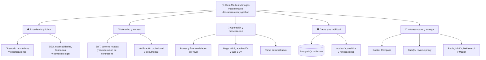

# 🩺 Guía Médica Monagas · Registro de actualizaciones

> Bitácora central de cambios, implementaciones, decisiones técnicas y tareas de evolución del sistema.
>
> **Repositorio:** [`merchandev/guiamedicamonagas`](https://github.com/merchandev/guiamedicamonagas) · **Rama:** `main`<br>
> **Última actualización de esta bitácora:** `2026-10-06 20:51:30 -04:00` · **Estado:** 🟢 Registro activo


---

## 🧭 Navegación rápida

| Ir a | Contenido |
|---|---|
| [🗺️ Cómo usar este registro](#como-usar-este-registro) | Convenciones, estados y reglas de lectura |
| [🏗️ Mapa del sistema](#mapa-del-sistema) | Vista transversal por dominios |
| [🕰️ Línea de tiempo](#linea-de-tiempo) | Secuencia completa de actividades registradas |
| [🧩 Registro por área](#registro-por-area) | Cambios agrupados por backend, frontend, datos y operación |
| [✅ Control de implementaciones](#control-de-implementaciones) | Funcionalidades entregadas y su estado |
| [📌 Próximas actividades](#proximas-actividades) | Pendientes visibles para continuidad |
| [✍️ Protocolo de registro](#protocolo-de-registro) | Plantilla para documentar cada cambio futuro |
| [🧾 Historial de esta bitácora](#historial-de-esta-bitacora) | Cambios realizados sobre este archivo |

> **Atajos:** usa `Ctrl + F` para localizar un módulo, commit o actividad; abre los bloques `▶` para consultar el detalle sin perder la vista general.

<a id="como-usar-este-registro"></a>

## 🧭 Cómo usar este registro

Esta bitácora combina dos vistas complementarias:

- **Vista temporal:** qué ocurrió y en qué fecha/hora, siguiendo el historial Git.
- **Vista por dominio:** qué partes del sistema fueron afectadas, aunque un mismo cambio atraviese varios módulos.

### Convenciones

| Elemento | Significado |
|---|---|
| `YYYY-MM-DD HH:mm:ss -04:00` | Hora local de Venezuela (`America/Caracas`) |
| 🟢 **Completado** | Implementado en el código y registrado en Git |
| 🟡 **En revisión** | Cambio local pendiente de validación o commit |
| 🔵 **Planificado** | Actividad futura aún no implementada |
| 🔴 **Bloqueado** | Requiere una decisión, credencial o dependencia externa |
| `ACT-XXXX` | Identificador único de una actividad |
| `↗` | Enlace a otra sección de esta misma bitácora |

<p align="right"><a href="#navegacion-rapida">⬆️ Volver a navegación</a></p>

<a id="mapa-del-sistema"></a>

## 🏗️ Mapa del sistema

La evolución del proyecto se organiza como un mapa de dominios conectados, no como una lista aislada de archivos:


```mermaid
flowchart TB
    CORE[🩺 Guía Médica Monagas\nPlataforma de descubrimiento y gestión]

    CORE --> PUBLIC[🌐 Experiencia pública]
    CORE --> AUTH[🔐 Identidad y acceso]
    CORE --> BUSINESS[💼 Operación y monetización]
    CORE --> DATA[🗃️ Datos y trazabilidad]
    CORE --> OPS[🚀 Infraestructura y entrega]

    PUBLIC --> DIRECTORY[Directorio de médicos\ny organizaciones]
    PUBLIC --> CONTENT[SEO, especialidades, farmacias\ny contenido legal]

    AUTH --> SESSION[JWT, cookies rotadas\ny recuperación de contraseña]
    AUTH --> VERIFY[Verificación profesional\ny documental]

    BUSINESS --> PLANS[Planes y funcionalidades\npor nivel]
    BUSINESS --> PAYMENTS[Pago Móvil, aprobación\ny tasa BCV]
    BUSINESS --> ADMIN[Panel administrativo]

    DATA --> POSTGRES[(PostgreSQL + Prisma)]
    DATA --> AUDIT[Auditoría, analítica\ny notificaciones]

    OPS --> DOCKER[Docker Compose]
    OPS --> CADDY[Caddy / reverse proxy]
    OPS --> SERVICES[Redis, MinIO, Meilisearch\ny Mailpit]
```

### Puntos de entrada del proyecto

| Capa | Ubicación | Responsabilidad | Navegar a |
|---|---|---|---|
| Frontend | [`frontend/src/app`](frontend/src/app) | Rutas públicas, dashboard y administración | [ACT-0003](#act-0003) |
| Componentes | [`frontend/src/components`](frontend/src/components) | UI, formularios, navegación y motion | [ACT-0003](#act-0003) |
| Backend | [`backend/src`](backend/src) | API NestJS, autenticación y dominios | [ACT-0003](#act-0003) |
| Persistencia | [`backend/prisma`](backend/prisma) | Esquema, migración inicial y seed | [ACT-0001](#act-0001), [ACT-0003](#act-0003) |
| Operación | [`docker-compose.yml`](docker-compose.yml), [`Caddyfile`](Caddyfile) | Entorno reproducible y proxy | [ACT-0001](#act-0001), [ACT-0003](#act-0003) |
| Documentación | [`docs`](docs) | Arquitectura, endpoints y roadmap | [ACT-0001](#act-0001) |

<p align="right"><a href="#navegacion-rapida">⬆️ Volver a navegación</a></p>

<a id="linea-de-tiempo"></a>

## 🕰️ Línea de tiempo

```mermaid
flowchart LR
    A[🧱 2026-09-21\n23:38:46\nACT-0001 · Primera MVP]
    B[⚙️ 2026-09-21\n23:40:28\nACT-0002 · Configuración del proyecto]
    C[🚀 2026-09-22\n08:13:12\nACT-0003 · MVP funcional completo]
    D[📚 2026-09-22\n10:42:43\nACT-0004 · Esta bitácora]
    E[📘 2026-09-22\n11:05:51\nACT-0005 · README completo]
    F[🛡️ 2026-09-22\n18:28:17\nACT-0006 · Badges, redes sociales\ny endurecimiento de infraestructura]
    G[📅 2026-09-22\n20:07:40\nACT-0007 · Agenda, Citas\ny privacidad del paciente]
    H[🚀 2026-09-23\n05:43:35\nACT-0008 · Despliegue independiente\nen VPS compartido]
    I[🩹 2026-09-23\n06:30:00\nACT-0009 · Correcciones del\nprimer despliegue real]
    J[💱 2026-09-23\n07:20:00\nACT-0010 · Corrección de la tasa BCV\ny retiro de INPREMEDICO]
    K[🔐 2026-09-23\n07:55:00\nACT-0011 · Acceso SSH y reconciliación\nde fixes ya probados en producción]
    L[🧑‍🤝‍🧑 2026-09-23\n10:15:00\nACT-0012 · Perfil de paciente\ny fix crítico de CORS]
    M[📐 2026-09-23\n10:35:00\nACT-0013 · Ancho unificado\n80/10/10 en toda la web]
    N[🧾 2026-09-23\n10:45:00\nACT-0014 · Campos de formulario\nangostos corregidos]
    O[🔏 2026-09-23\n18:00:00\nACT-0015 · Auditoría: salud cifrada,\nconsentimiento y organizaciones]
    P[🧰 2026-09-23\n21:45:00\nACT-0016 · Sesiones, identidad,\nimágenes seguras y antivirus]
    Q[🩺 2026-09-23\n21:48:30\nACT-0017 · HEALTHCHECK en los\nDockerfiles (alertas de Trivy)]
    R[🌐 2026-09-24\n06:40:26\nACT-0018 · Dominio propio vía\nTraefik del VPS (espera DNS)]
    S[🛡️ 2026-09-24\n08:36:50\nACT-0019 · Plan de producción:\nMFA, ClamAV, equipos y respaldos]
    T[📄 2026-09-24\n17:39:26\nACT-0020 · Requisitos del médico:\nsin solvencia y en orden de obtención]
    U[📈 2026-09-24\n18:14:00\nACT-0021 · Publicación con 60%,\nPlus/Premium con 100% y progreso]
    V[⌨️ 2026-09-24\n18:31:52\nACT-0022 · Formularios claros\ny con teclado]
    W[🧑‍🤝‍🧑 2026-09-25\n06:25:35\nACT-0023 · Registro de pacientes\nen el inicio]
    X[🔒 2026-09-25\n14:29:46\nACT-0024 · HTTPS en\nguiamedicamonagas.com]
    Y[🏷️ 2026-09-25\n14:45:46\nACT-0025 · Farmacias «Próximamente»\ny HTTPS reforzado]
    Z[🔤 2026-09-25\n15:09:34\nACT-0026 · Tipografía corporativa\nMontserrat + Open Sans]
    AA[🪪 2026-09-25\n15:39:56\nACT-0027 · Código y QR del paciente,\nbóveda y noindex]
    AB[🩹 2026-09-25\n16:20:34\nACT-0028 · Guardado, subidas\ny controles corregidos]
    AC[🔎 2026-09-25\n16:20:34\nACT-0029 · Código y QR del médico,\nbuscador solo de médicos]
    AD[🏷️ 2026-09-25\n16:20:34\nACT-0030 · SEO automático\ny tarjeta al compartir]
    AE[🛂 2026-09-29\n12:48:40\nACT-0031 · Cuentas, planes pagados\ny eliminación definitiva]
    AF[🎬 2026-09-29\n14:17:09\nACT-0032 · Precios nuevos y plan\nAgencia con video de presentación]
    AG[⚖️ 2026-09-30\n08:03:13\nACT-0033 · Marco legal venezolano,\nreclamos y derechos del paciente]
    AH[🗑️ 2026-09-30\n10:15:59\nACT-0034 · Reactivar desde «Médicos»\ny eliminar cuentas desactivadas]
    AI[💳 2026-09-30\n19:44:09\nACT-0035 · Plan Plus, actividad\ndesplegable y Pago Móvil propio]
    AJ[🎬 2026-09-30\n19:44:09\nACT-0036 · Marca Médica y\nestadísticas del médico]
    AK[🧹 2026-09-30\n21:35:16\nACT-0037 · Lint, versión verificable\ny portada sin ceros]
    AL[🛰️ 2026-10-01\n00:07:32\nACT-0038 · Alertas, respaldos externos\ny custodia de claves]
    AM[🧪 2026-10-01\n05:22:09\nACT-0039 · Pruebas de punta a punta,\nseguridad y accesibilidad]
    AN[🕰️ 2026-10-02\n08:01:30\nACT-0040 · Citas en hora\nde Caracas]
    AO[🔔 2026-10-02\n08:20:16\nACT-0041 · Centro de\nnotificaciones]
    AP[📅 2026-10-05\n07:15:08\nACT-0042 · Calendario\ne historial de citas]
    AQ[⭐ 2026-10-05\n08:08:03\nACT-0043 · Valoraciones\nde pacientes]
    AR[🛡️ 2026-10-05\n08:33:33\nACT-0044 · Moderación\ny sanciones por días]
    AS[📨 2026-10-05\n20:33:18\nACT-0045 · Pedidos de contacto\ny apariciones en búsquedas]
    AT[💊 2026-10-05\n21:44:58\nACT-0046 · Récipes\ndigitales]
    AU[🧮 2026-10-06\n10:36:42\nACT-0047 · Resumen de\nadministración]
    AV[🔽 2026-10-06\n11:03:20\nACT-0048 · Lista del\nbuscador del inicio]
    AW[🔄 2026-10-06\n14:51:05\nACT-0049 · Tiempo real\nweb y app]
    AX[📴 2026-10-06\n16:04:50\nACT-0050 · Sin conexión\napp móvil]
    AY[🩺 2026-10-06\n20:51:30\nACT-0051 · Ficha mínima\napp móvil]

    A --> B --> C --> D --> E --> F --> G --> H --> I --> J --> K --> L --> M --> N --> O --> P --> Q --> R --> S --> T --> U --> V --> W --> X --> Y --> Z --> AA --> AB --> AC --> AD --> AE --> AF --> AG --> AH --> AI --> AJ --> AK --> AL --> AM --> AN --> AO --> AP --> AQ --> AR --> AS --> AT --> AU --> AV --> AW --> AX --> AY
```

### Resumen cuantitativo

| Indicador | Resultado |
|---|---:|
| Actividades históricas importadas desde Git | `3` |
| Actividades documentales añadidas con esta bitácora | `48` |
| Actividades registradas en total | `51` |
| Rama de referencia | `main` |
| Commit base consultado | [`81b1091`](https://github.com/merchandev/guiamedicamonagas/commit/81b1091) |
| Zona horaria de control | `America/Caracas` (`-04:00`) |

<a id="act-0001"></a>

### 🧱 ACT-0001 · Primera MVP

<details>
<summary><strong>2026-09-21 23:38:46 -04:00</strong> · <code>06ae793</code> · 🟢 Completado</summary>

**Responsable:** `Merchan.dev`  · **Tipo:** Fundación técnica  · **Commit:** [`06ae793`](https://github.com/merchandev/guiamedicamonagas/commit/06ae79369ea354aeab528e65436b671356763be2)

**Actividades ejecutadas:**

- Se creó la base del backend con NestJS, controlador de salud, configuración TypeScript y modelo inicial de datos con Prisma.
- Se estableció la primera estructura de despliegue con Dockerfiles, Docker Compose, Caddy y script de deploy.
- Se preparó el frontend Next.js con Tailwind CSS, layout base y primeras rutas públicas y privadas.
- Se agregaron vistas iniciales para médicos, especialidades, farmacias, perfil, pagos, SEO y contenidos legales.
- Se creó la documentación técnica inicial: arquitectura, endpoints y roadmap.

**Impacto:** dejó operativo el esqueleto full-stack sobre el que se construyeron autenticación, monetización y administración.<br>
**Archivos destacados:** [`backend/prisma/schema.prisma`](backend/prisma/schema.prisma), [`docker-compose.yml`](docker-compose.yml), [`docs/ARQUITECTURA.md`](docs/ARQUITECTURA.md), [`docs/ENDPOINTS.md`](docs/ENDPOINTS.md), [`docs/ROADMAP.md`](docs/ROADMAP.md).

</details>

<a id="act-0002"></a>

### ⚙️ ACT-0002 · Configuración del proyecto

<details>
<summary><strong>2026-09-21 23:40:28 -04:00</strong> · <code>44273b7</code> · 🟢 Completado</summary>

**Responsable:** `merchandev`  · **Tipo:** Configuración y documentación  · **Commit:** [`44273b7`](https://github.com/merchandev/guiamedicamonagas/commit/44273b72bdcb5af571ad92aeb9a518f986911b63)

**Actividades ejecutadas:**

- Se incorporó `.env.example` con variables organizadas por entorno, base de datos, almacenamiento, autenticación, correo, WhatsApp y pagos.
- Se actualizó `.gitignore` para proteger secretos, artefactos generados y dependencias locales.
- Se documentó la configuración de ejecución local y el escenario de producción con Docker + Caddy.

**Impacto:** mejoró la reproducibilidad del entorno y redujo el riesgo de exponer credenciales en el repositorio.<br>
**Archivos destacados:** [`.env.example`](.env.example), [`.gitignore`](.gitignore).

</details>

<a id="act-0003"></a>

### 🚀 ACT-0003 · MVP funcional completo

<details>
<summary><strong>2026-09-22 08:13:12 -04:00</strong> · <code>57126a9</code> · 🟢 Completado</summary>

**Responsable:** `merchandev`  · **Tipo:** Implementación funcional transversal  · **Commit:** [`57126a9`](https://github.com/merchandev/guiamedicamonagas/commit/57126a90b3bd645b7ba42d2d01defc2c4d64589c)

#### 🔐 Identidad, seguridad y verificación

- Autenticación con JWT y cookie de refresh rotada.
- Roles y guards para proteger recursos y operaciones administrativas.
- Registro, verificación de correo, recuperación y cambio de contraseña.
- Validación profesional venezolana: MPPS/SACS, Art. 8, Colegio de Médicos de Monagas, INPREMEDICO, solvencia deontológica y documentos.
- Filtro global de excepciones, Helmet, throttling y validación de variables de entorno.

#### 👨‍⚕️ Directorio y perfiles

- Perfiles de profesionales con slug, ubicaciones adicionales y datos de contacto.
- Organizaciones para farmacias, laboratorios y clínicas con múltiples ubicaciones.
- Directorios públicos, fichas dinámicas, especialidades, farmacias y formularios de contacto.

#### 💳 Planes, pagos y monetización

- Niveles `Básico`, `Profesional`, `Plus`, `Premium` y `Organización`.
- Control de funcionalidades según plan, publicaciones y ubicaciones extra.
- Reporte de Pago Móvil con flujo de revisión y aprobación administrativa.
- Scraper de tasa BCV con cron horario, precios en bolívares y sobreescritura manual desde administración.

#### 🛠️ Administración y trazabilidad

- Panel de administración para médicos, organizaciones, especialidades, planes, pagos, verificaciones, cookies y SEO.
- Registro de auditoría, analítica de eventos y notificaciones.
- Integración preparada para WhatsApp y correo transaccional.
- Plantillas de correo, almacenamiento privado compatible con S3/MinIO y requisitos documentales.

#### 🎨 Frontend y experiencia

- Homepage dinámica, búsqueda, directorios, comparación de planes y dashboards.
- Sistema visual con componentes reutilizables, badges, alertas, modales, selects, spinners y estados vacíos.
- Consentimiento de cookies, términos, privacidad, robots y sitemap.
- Animaciones de entrada, contadores, ilustraciones y navegación pública/privada.

#### 🚢 Infraestructura

- Actualización de Dockerfiles y configuración de producción.
- Stack Docker Compose con PostgreSQL, Redis, MinIO, Meilisearch y Mailpit.
- Migración inicial de Prisma y seed de datos.

**Impacto:** consolidó el MVP en una plataforma full-stack con ciclo de acceso, publicación, monetización, verificación y administración.<br>
**Archivos destacados:** [`backend/src/auth`](backend/src/auth), [`backend/src/payments`](backend/src/payments), [`backend/src/exchange-rate`](backend/src/exchange-rate), [`backend/src/documents`](backend/src/documents), [`frontend/src/app/admin`](frontend/src/app/admin), [`frontend/src/app/dashboard`](frontend/src/app/dashboard).

</details>

<a id="act-0004"></a>

### 📚 ACT-0004 · Creación de la bitácora central

<details>
<summary><strong>2026-09-22 10:42:43 -04:00</strong> · <code>commit de incorporación</code> · 🟢 Completado</summary>

**Responsable:** `merchandev / Codex`  · **Tipo:** Documentación y control de cambios

**Actividades ejecutadas:**

- Se creó [`Actualizaciones.md`](Actualizaciones.md) como punto central de control histórico y operativo.
- Se importó el historial Git disponible hasta [`57126a9`](https://github.com/merchandev/guiamedicamonagas/commit/57126a90b3bd645b7ba42d2d01defc2c4d64589c).
- Se añadieron navegación interna, enlaces cruzados, bloques desplegables, emojis, badges, tablas, diagramas Mermaid y una plantilla para futuros cambios.
- Se estableció `America/Caracas` (`-04:00`) como referencia para fecha y hora de modificación.

**Resultado:** la bitácora queda lista para incorporarse al historial del repositorio junto con la documentación principal.

</details>

<a id="act-0005"></a>

### 📘 ACT-0005 · README completo y descripción del repositorio

<details>
<summary><strong>2026-09-22 11:05:51 -04:00</strong> · <code>commit de incorporación</code> · 🟢 Completado</summary>

**Responsable:** `merchandev / Codex`  · **Tipo:** Documentación de producto y onboarding

**Actividades ejecutadas:**

- Se creó [`README.md`](README.md) como guía principal del proyecto.
- Se documentaron el propósito, objetivos, estado actual, funcionalidades públicas, áreas profesionales y panel administrativo.
- Se incorporaron arquitectura, stack tecnológico, estructura de carpetas, requisitos, puesta en marcha, desarrollo local, variables, puertos y comandos útiles.
- Se resumieron los dominios de API, flujos de registro/verificación/pago, seguridad, despliegue, roadmap y contribución.
- Se enlazaron [`Actualizaciones.md`](Actualizaciones.md) y la documentación técnica existente para facilitar la navegación.

**Impacto:** una persona nueva puede entender el producto, levantar el entorno local, localizar los módulos principales y continuar el desarrollo con una única guía de entrada.

</details>

<a id="act-0006"></a>

### 🛡️ ACT-0006 · Badges de verificación, redes sociales y endurecimiento de infraestructura

<details>
<summary><strong>2026-09-22 18:28:17 -04:00</strong> · <code>1877b1b</code> · 🟢 Completado</summary>

**Responsable:** `Claude Sonnet 5`  · **Tipo:** `feature | fix | security`  · **Commit:** [`1877b1b`](https://github.com/merchandev/guiamedicamonagas/commit/1877b1bc90cf973fa53a9f40dc9b5e895abe80e9)

#### 👨‍⚕️ Directorio y perfiles

- Ícono de verificación junto al nombre, coloreado según el plan del médico (gris Básico, azul Profesional, índigo Plus, dorado Premium) y según el tipo de organización (verde farmacias, morado laboratorios, naranja clínicas).
- Redes sociales (Instagram, Facebook, TikTok, Web) gestionables desde el perfil, con límite según plan (0 en Básico/Profesional, 2 en Plus, las 4 en Premium/Organización) y validación server-side de que la URL pertenezca al dominio oficial de cada red — nunca un dominio distinto.
- **Fix:** `/medicos/[slug]` daba 404 intermitente porque Next.js 16 exige `await` sobre `params` (API asíncrona) y la ruta lo leía de forma síncrona.

#### 🛡️ Seguridad de infraestructura (SEC-01) y autenticación (SEC-02 parcial)

- `docker-compose.dev.yml` (puertos solo a `127.0.0.1`) y `docker-compose.prod.yml` (red interna aislada, solo Caddy expuesto a Internet) reemplazan el compose único anterior.
- Contenedores de aplicación corren con usuario sin privilegios (`USER node`), imágenes fijadas a versiones exactas.
- MinIO deja de usarse con credenciales root desde la API: `scripts/minio-init.sh` crea un usuario de servicio con permisos mínimos (`GetObject`/`PutObject`/`DeleteObject` solo sobre el bucket de la app).
- `scripts/deploy.sh` valida 16 variables críticas y aborta si detecta un valor por defecto inseguro conocido; nunca copia `.env.example` automáticamente.
- Migración de contraseñas de `bcrypt` a `Argon2id` con re-hash silencioso en el login (el usuario no nota nada); `env.validation.ts` rechaza secretos con valores inseguros conocidos cuando `NODE_ENV=production`.

**Impacto:** el directorio comunica visualmente el nivel de plan/tipo de cada perfil, los profesionales pueden mostrar sus redes oficiales sin riesgo de enlaces falsificados, y la infraestructura de despliegue deja de exponer servicios internos o usar credenciales root — sin tocar el flujo de autenticación existente (cookie httpOnly + token en memoria) que ya cumplía buenas prácticas.<br>
**Archivos destacados:** [`frontend/src/components/VerificationBadge.tsx`](frontend/src/components/VerificationBadge.tsx), [`backend/src/common/dto/social-link.dto.ts`](backend/src/common/dto/social-link.dto.ts), [`docker-compose.prod.yml`](docker-compose.prod.yml), [`scripts/minio-init.sh`](scripts/minio-init.sh), [`backend/src/common/utils/password.util.ts`](backend/src/common/utils/password.util.ts), [`docs/security/sec-01-infrastructure-hardening.md`](docs/security/sec-01-infrastructure-hardening.md).

</details>

<a id="act-0007"></a>

### 📅 ACT-0007 · Agenda, Citas y privacidad del paciente

<details>
<summary><strong>2026-09-22 20:07:40 -04:00</strong> · <code>3ded446</code> · 🟢 Completado</summary>

**Responsable:** `Claude Sonnet 5`  · **Tipo:** `feature | fix`  · **Commit:** [`3ded446`](https://github.com/merchandev/guiamedicamonagas/commit/3ded4462565d48ae5b98f35f404fb96eded30c13)

Primeras dos fases de la evolución del producto de "directorio médico" a "plataforma de relación paciente↔profesional" (visión completa documentada en el plan de implementación de la sesión).

#### 📅 Agenda (nuevo módulo `backend/src/agenda`, gated a plan Profesional en adelante)

- Configuración de horario: duración de cita, tiempo entre citas (buffer), máximo de citas diarias, confirmación automática opcional.
- Bloques de horario semanal (por día de la semana) y excepciones puntuales (vacaciones, feriados, horario especial), con validación de solapamiento.

#### 🩺 Citas (nuevo módulo `backend/src/appointments`)

- Disponibilidad calculada 100% en el servidor a partir del horario, bloques, excepciones y citas ya tomadas — nunca confía en un horario propuesto por el cliente.
- Máquina de estados completa: `PENDING → CONFIRMED → COMPLETED`, con `CANCELLED` y `NO_SHOW`, más reprogramación (que reabre a `PENDING` salvo confirmación automática).
- **Anti-doble-reserva real:** además de la validación en la aplicación, un índice único parcial de PostgreSQL (`professionalId + startsAt` mientras el estado es `PENDING`/`CONFIRMED`) garantiza que dos pacientes nunca puedan quedarse con el mismo horario, incluso ante una condición de carrera.
- Notificaciones de cita (creada, confirmada, cancelada, reprogramada) extendiendo el `NotificationsService` existente — no un sistema paralelo. El correo de confirmación adjunta un evento `.ics` generado internamente (sin librería externa) para Google Calendar/Outlook/Apple Calendar.
- Recordatorios automáticos 24h y 2h antes de la cita, vía `@nestjs/schedule` (mismo patrón que el scraper de tasa BCV).
- Flujo público de reserva en `/medicos/[slug]/agendar`; el botón "Agendar cita" solo aparece cuando el profesional tiene el plan requerido **y** un horario configurado.

#### 🔒 Privacidad del paciente (nuevo módulo `backend/src/patients`)

- Cada paciente recibe un código pseudónimo único (`GMM-XXXX`) generado por el sistema.
- El médico **nunca** puede buscar pacientes por nombre, teléfono o cédula — la lista de pacientes muestra solo el código, cantidad de citas y última visita.
- Revelar la identidad de un paciente es una acción explícita, solo permitida si existe al menos una cita en común, y queda registrada en `AuditLog` (`PATIENT_IDENTITY_REVEALED`).

#### 🐛 Correcciones encontradas durante la verificación

- `env.validation.ts` usaba `z.coerce.boolean()`, que convierte *cualquier* string no vacío en `true` (incluido literalmente `"false"`). Esto rompía en silencio `SMTP_SECURE=false` (nodemailer intentaba TLS contra Mailpit y fallaba) y `WHATSAPP_ENABLED=false` (el flag de no-op en desarrollo quedaba inactivo). Reemplazado por un parser explícito de `"true"`/`"false"`.
- `FinanceRecord.appointmentId` no tenía relación real en el schema (era un string suelto sin integridad referencial) — corregido antes de construir la auto-generación de ingresos (fase siguiente).

**Verificación realizada:** flujo completo probado por API (`curl`) y en navegador — reserva → confirmación → email con `.ics` válido recibido en Mailpit → intento de doble reserva rechazado con `409` → reprogramación → cancelación → lista de pacientes por código → revelar identidad auditado → bajar el plan del profesional bloquea Agenda y Citas con `403`.

**Impacto:** el producto deja de ser solo un directorio: un médico con plan Profesional o superior ya puede recibir, gestionar y confirmar citas reales, con notificaciones automáticas y sin exponer jamás la identidad de un paciente sin una razón auditable.<br>
**Archivos destacados:** [`backend/src/agenda`](backend/src/agenda), [`backend/src/appointments`](backend/src/appointments), [`backend/src/patients`](backend/src/patients), [`frontend/src/app/dashboard/citas`](frontend/src/app/dashboard/citas), [`frontend/src/app/dashboard/pacientes`](frontend/src/app/dashboard/pacientes), [`frontend/src/app/medicos/[slug]/agendar`](frontend/src/app/medicos/[slug]/agendar).

**Pendiente explícito (línea roja de seguridad):** el modelo `ClinicalNote` (historia clínica) ya existe en el schema pero **no tiene endpoints ni UI todavía por decisión deliberada** — se activa solo después de SEC-05 (cifrado de campos sensibles). Ver [Próximas actividades](#proximas-actividades).

</details>

<a id="act-0008"></a>

### 🚀 ACT-0008 · Despliegue independiente en VPS compartido

<details>
<summary><strong>2026-09-23 05:43:35 -04:00</strong> · <code>4dbd800</code> · 🟢 Completado</summary>

**Responsable:** `Claude Sonnet 5`  · **Tipo:** `fix | ops`  · **Commit:** [`4dbd800`](https://github.com/merchandev/guiamedicamonagas/commit/4dbd800f768407a4746d46bafafc340bceca78d9)

El usuario entregó una lista de 11 bloqueos técnicos concretos para desplegar el proyecto en un VPS de Hostinger que ya tiene otros proyectos Docker corriendo (`diario-mercantil`, `saas--mt`, `traefik-ivzc`), ocupando los puertos 80/443/3000/25/587 en la única IP pública disponible. Cada punto se verificó contra el repo real antes de tocar nada — no eran hipótesis, los 11 reprodujeron.

#### 🐛 Bloqueo crítico: cadena de migraciones de Prisma
La migración `20260922_feat_schedule_appointments_patients_finance_push` volvía a declarar `CREATE TYPE "Role"`, `CREATE TABLE "User"`, etc. — objetos que la migración `20260922112504_init` ya creaba. `prisma migrate deploy` contra una base vacía (como sería la del VPS) habría fallado a mitad de camino con "already exists". Se regeneró como una única migración limpia (`20260923093427_init`) y se **verificó de verdad**: se aplicó con `migrate deploy` contra una base de datos Postgres recién creada, vacía, sin errores.

#### 🔐 Sesiones para lanzamiento HTTP temporal
- Cookie renombrada `refresh_token` → `gmm_refresh_token`.
- `secure` de la cookie pasa de estar atado a `NODE_ENV` a una variable `COOKIE_SECURE` configurable — verificado en ambos estados (con/sin el flag `Secure` en el header `Set-Cookie` real).

#### 📄 Next.js 16 y URLs internas
- `farmacias/page.tsx` tenía el mismo bug de `searchParams` síncrono ya corregido en `medicos/[slug]` esta sesión, pero no en este archivo.
- Nueva variable `API_INTERNAL_URL`: el contenedor `web` ahora puede hacer sus fetches SSR contra `http://api:4000` en vez de intentar usar la URL pública, que no resuelve útilmente dentro de la red de Docker.

#### 🪣 URLs firmadas de MinIO detrás de proxy
Las URLs firmadas se generaban contra `http://minio:9000`, inalcanzable desde el navegador. Se agregó un segundo cliente S3 (`S3_PUBLIC_ENDPOINT`) usado solo para firmar, y Caddy proxea `/<bucket>/*` a MinIO usando el propio nombre del bucket como prefijo — sin reescritura de ruta. **Verificado con una prueba real**: objeto subido vía el cliente interno, URL firmada contra un Caddy local en el puerto alterno, descargada con éxito a través del proxy con firma SigV4 válida.

#### 🐳 Aislamiento del stack en el VPS
- `docker-compose.prod.yml` ahora declara `name: gmm-independent` — ningún `docker compose down` corrido desde otro proyecto puede alcanzarlo por accidente.
- Caddy publica un único puerto alterno (`8088` por defecto vía `CADDY_PORT`) en vez de 80/443, ya ocupados.
- `mem_limit`/`cpus` en cada servicio, para que este stack nuevo no pueda ahogar a los proyectos existentes del mismo VPS.
- `scripts/deploy.sh`: `docker compose pull` ya no intenta traer `gmm_api`/`gmm_web` (build-only, sin registro) y todas las invocaciones quedan fijadas a `-p gmm-independent`.
- `scripts/minio-init.sh`: la creación de usuario/política ahora tolera "ya existe" — una re-ejecución (ej. un redeploy) no aborta a mitad de camino.
- `prisma/seed.ts`: si falta `SEED_SUPERADMIN_PASSWORD` en producción, aborta con error explícito en vez de omitir el superadmin en silencio; su hash pasa de `bcrypt` a `Argon2id` (`hashPassword()`), consistente con el resto del sistema desde [ACT-0006](#act-0006).

**Verificación realizada:** migración aplicada de punta a punta contra una base vacía real; login probado con ambos valores de `COOKIE_SECURE` (header `Set-Cookie` real, no solo lectura de código); flujo completo de subida→firma pública→descarga vía proxy de MinIO probado con un contenedor Caddy real; superadmin re-sembrado y login confirmado con el nuevo hash Argon2id; `tsc --noEmit` limpio en backend y frontend.

**Pendiente (fuera del alcance de este repo):** ejecutar el despliegue real en el VPS, crear `.env.prod` con secretos reales ahí, abrir el puerto `8088` en el firewall, y confirmar en el panel de Hostinger que `diario-mercantil`/`saas--mt`/`traefik-ivzc` quedaron intactos tras el despliegue — ninguna de estas acciones es posible sin acceso directo al servidor.

**Impacto:** el proyecto queda listo para desplegarse junto a los proyectos existentes del VPS sin arriesgarlos, con una cadena de migraciones que de verdad funciona contra una base vacía y URLs de archivos que de verdad abren desde un navegador externo.<br>
**Archivos destacados:** [`backend/prisma/migrations/20260923093427_init`](backend/prisma/migrations/20260923093427_init), [`backend/src/storage/storage.service.ts`](backend/src/storage/storage.service.ts), [`Caddyfile`](Caddyfile), [`docker-compose.prod.yml`](docker-compose.prod.yml), [`scripts/deploy.sh`](scripts/deploy.sh), [`scripts/minio-init.sh`](scripts/minio-init.sh).

</details>

<a id="act-0009"></a>

### 🩹 ACT-0009 · Correcciones del primer despliegue real en el VPS

<details>
<summary><strong>2026-09-23 06:30:00 -04:00</strong> · <code>b9851e6</code> · 🟡 En revisión</summary>

**Responsable:** `Claude Sonnet 5` (reconciliando correcciones aplicadas en el servidor por el usuario)  · **Tipo:** `fix | ops`  · **Commit:** [`b9851e6`](https://github.com/merchandev/guiamedicamonagas/commit/b9851e6)

El usuario ejecutó el primer despliegue real en el VPS (`/docker/guiamedicamonagas`, proyecto `gmm-independent`, puerto `8088`) y reportó un informe detallado paso a paso. Varios fallos solo aparecen al construir y correr los contenedores de verdad, no se veían en revisión de código. Las correcciones se habían aplicado directamente en el servidor (fuera de Git); este commit las reconcilia con el repositorio para que queden versionadas.

#### 🐛 Arranque del backend
`nest build` genera `dist/src/main.js`, no `dist/main` — el `CMD` de `backend/Dockerfile` y `start:prod` en `package.json` nunca coincidían con la salida real del compilador. El seed en producción (`node dist/prisma/seed.js`) además necesitaba `tsconfig.json` y `password.util.ts` copiados a la imagen final, que antes no estaban.

#### 📄 Build del frontend
El build de Next.js fallaba al prerenderizar: `NEXT_PUBLIC_API_URL` puede ser una ruta relativa (`/api/v1`) válida para el navegador pero no para un `fetch()` del propio servidor durante SSR/build. `server-fetch.ts` ahora solo usa la URL pública como respaldo si es absoluta; si no, cae a `API_INTERNAL_URL` o a un valor local por defecto. También se limitó el build a 1 CPU (`NEXT_BUILD_CPUS`, vía `next.config.js`) y se corrigieron permisos de `.next/cache` para el usuario `node`, y se agregaron `.dockerignore` en backend y frontend para no arrastrar `node_modules`/`dist`/`.next` locales al contexto de build.

#### 🪣 Etiqueta de imagen de MinIO
La etiqueta `RELEASE.2025-07-23T15-29-46Z` no existe en el registro — se fijó `RELEASE.2025-09-07T16-13-09Z`.

#### 🩺 Healthcheck del frontend usando una ruta que no existe
`docker-compose.prod.yml` agregó healthchecks a `api` y `web` (con `depends_on: condition: service_healthy` para que Caddy no arranque contra un backend no listo), pero el de `web` probaba `GET /login`, que no existe en esta app (`404`) — la ruta real es `/iniciar-sesion`. Con el healthcheck fallando, Docker marcaba `web` como `unhealthy` y Caddy nunca llegaba a arrancar (esperaba `web` saludable). **Corregido en este commit** antes de reconciliar los demás cambios, verificando primero que `frontend/src/app/iniciar-sesion/page.tsx` existe y que ninguna ruta `/login` existe en el árbol de `frontend/src/app`.

#### 🐳 Aislamiento adicional
- Nueva red `gmm_storage` (interna) dedicada a Caddy↔MinIO, separada de `gmm_dmz`.
- Subredes propias para las tres redes del proyecto (`172.31.77.0/24`, `.78.0/24`, `.79.0/24`) para no chocar con las redes Docker de otros proyectos del mismo VPS.
- Imágenes renombradas a `gmm-independent-api`/`gmm-independent-web` (antes `gmm_api`/`gmm_web`) para no colisionar por nombre con imágenes de otros proyectos.
- Se quitó `container_name` fijo de cada servicio — Docker exige nombres de contenedor únicos en todo el host, así que un nombre genérico (`gmm_postgres`, etc.) podía chocar con algo de otro proyecto; ahora Compose genera nombres con el prefijo del proyecto (`gmm-independent-...`).
- Límite de logs por contenedor (`json-file`, 10 MB × 3 archivos) para que ningún servicio llene el disco del VPS compartido.
- Mailpit propio (`mailpit:1025`, sin salida a Internet) para capturar correo de prueba mientras no haya SMTP real, con su interfaz web solo en loopback (`127.0.0.1:18025`, accesible por túnel SSH).
- `scripts/deploy.sh`/`scripts/minio-init.sh` reescritos: resuelven su propio directorio (invocables desde cualquier ruta), esperan disponibilidad real con plazos en vez de bucles sin límite, corren `migrate deploy`/seed vía `compose run` antes de publicar `api`/`web`/`caddy`, y el init de MinIO revisa el estado real (usuario, política asignada) en vez de tragarse cualquier error como "ya existía".

**Verificación realizada:** `tsc --noEmit` limpio en backend y frontend; `docker compose config --quiet` válido contra variables de entorno de prueba; `bash -n` limpio en ambos scripts; confirmado por el árbol de rutas de Next.js que `/iniciar-sesion` existe y `/login` no.

**Pendiente (fuera del alcance de este repo, según el informe del usuario):** reanudar el despliegue en el VPS con el healthcheck corregido, validar el arranque de Caddy y el acceso público en `http://72.61.77.167:8088`, y completar las validaciones de la lista del informe (login/refresh/logout, subida y descarga firmada de archivos, correo de prueba, y una nueva comparación de los contenedores/hashes de `diario-mercantil`/`saas--mt`/`traefik-ivzc` tras el arranque completo). El informe del usuario también señaló que un directorio de despliegue en el VPS (`/docker/guiamedicamonagas`) desapareció sin causa identificada durante un intento anterior — no hay evidencia suficiente para atribuirlo a nada concreto; queda como aviso a vigilar, no como algo resuelto aquí.

**Impacto:** el stack ahora arranca con el comando y la ruta de salida reales que produce el build (no los asumidos), el build del frontend ya no falla por una URL relativa en SSR, y el aislamiento de red/nombre de imagen/logs reduce el riesgo de colisión con los otros proyectos del mismo VPS más allá de solo el puerto.<br>
**Archivos destacados:** [`backend/Dockerfile`](backend/Dockerfile), [`frontend/src/lib/server-fetch.ts`](frontend/src/lib/server-fetch.ts), [`docker-compose.prod.yml`](docker-compose.prod.yml), [`scripts/deploy.sh`](scripts/deploy.sh), [`scripts/minio-init.sh`](scripts/minio-init.sh), [`docs/DEPLOYMENT-INDEPENDENT.md`](docs/DEPLOYMENT-INDEPENDENT.md).

</details>

<a id="act-0010"></a>

### 💱 ACT-0010 · Corrección de la tasa BCV y retiro de INPREMEDICO del sitio

<details>
<summary><strong>2026-09-23 07:20:00 -04:00</strong> · <code>c152b79</code> · 🟢 Completado</summary>

**Responsable:** `Claude Sonnet 5`  · **Tipo:** `fix | contenido`  · **Commit:** [`c152b79`](https://github.com/merchandev/guiamedicamonagas/commit/c152b79)

El usuario reportó dos problemas del sitio en producción: la tasa BCV mostrada no era correcta, y pidió retirar "INPREMEDICO" del contenido visible de la web.

#### 🐛 Tasa BCV: causa raíz real, no solo el síntoma
La barra superior mostraba siempre `Bs 50,00` etiquetado como "USD BCV" — el valor manual de respaldo (`DEFAULT_EXCHANGE_RATE`), nunca el real. Se diagnosticó con `openssl s_client -showcerts -connect www.bcv.org.ve:443`: el servidor del BCV solo envía su certificado hoja (`*.bcv.org.ve`), **no** el intermedio (`Sectigo Public Server Authentication CA DV R36`) — un error de configuración del propio servidor del BCV, no del cliente. La raíz (`Sectigo Public Server Authentication Root R46`) sí está en el almacén de confianza por defecto de Node; solo faltaba el intermedio, por lo que cualquier cliente que no lo tuviera cacheado de antes fallaba con `UNABLE_TO_VERIFY_LEAF_SIGNATURE` — exactamente el tipo de fallo silencioso que un contenedor Docker recién creado (sin caché de certificados previa) sufriría siempre.

**Se reprodujo el fallo antes de arreglarlo**: un cliente Node limpio con solo las raíces por defecto (`tls.rootCertificates`) falla de verdad contra `bcv.org.ve`. La corrección obtiene el certificado intermedio exacto desde la URL "CA Issuers" que la propia extensión AIA del certificado del BCV publica (`crt.sectigo.com`), lo agrega explícitamente vía un `https.Agent` propio en `bcv-scraper.service.ts`, y **nunca** desactiva `rejectUnauthorized` (eso habría sido inseguro). `fetchRate()` se reescribió de `fetch()` global a `https.request()` para poder pasar ese agente.

**Verificado en tres niveles**: (1) reproducción del fallo con solo las raíces por defecto; (2) éxito del mismo código compilado (`dist/`) ejecutado standalone contra el sitio real del BCV; (3) el backend de desarrollo, corriendo en caliente, pasó de servir `source":"MANUAL"` con `Bs 50` a `source":"BCV"` con `Bs 853,4993` (la tasa real del día) tras el fix, confirmado tanto por `curl` directo al backend como visualmente en el navegador.

Adicionalmente, `BcvRateBadge.tsx` (la barra superior visible en todo el sitio) imprimía el texto literal "USD BCV" sin importar el valor real de `rate.source` — mostraba "BCV" incluso cuando la tasa era la manual de respaldo. Ahora solo dice "BCV" cuando de verdad proviene de una sincronización exitosa; en caso contrario dice "(manual)".

#### 🩹 Retiro de INPREMEDICO del contenido visible
Se quitó de: portada (pasos de verificación, FAQ, hero, CTA final), pie de página, modal de términos, página de términos y condiciones, página de privacidad, tarjeta de transparencia del perfil público (`medicos/[slug]`), formulario de edición de perfil, demo comparativa de planes (texto **e** ilustración del hero — esta última no apareció en la búsqueda inicial de texto por usar un array `['MPPS', 'COLMED', 'INPREM.']` y se encontró solo al verificar la página cargada en el navegador), y el correo de "perfil verificado". También se quitó de `BASE_REQUIRED_DOCUMENTS`: ya no es un documento obligatorio para publicar un perfil. Se conservó a propósito el campo `inpremedicoNumber` en la base de datos, el valor `INPREMEDICO` del enum `DocumentType` y su etiqueta en `DOCUMENT_LABELS` — para no perder números ya registrados ni romper documentos ya subidos bajo ese tipo.

**Verificación realizada:** `tsc --noEmit` limpio en backend y frontend; verificación visual en el navegador contra los servidores de desarrollo corriendo (`/`, un perfil de médico, `/planes` y la barra superior) confirmando ausencia de "INPREMEDICO" y la tasa BCV real y bien etiquetada.

**Impacto:** la tasa mostrada en todo el sitio (barra superior, planes, pagos) ahora refleja el valor real del BCV en vez de un valor fijo de hace meses, y la etiqueta ya no miente sobre su origen cuando cae al valor manual; el contenido público ya no menciona un requisito que el usuario pidió retirar, sin perder los datos de los profesionales que ya lo tenían registrado.<br>
**Archivos destacados:** [`backend/src/exchange-rate/bcv-scraper.service.ts`](backend/src/exchange-rate/bcv-scraper.service.ts), [`frontend/src/components/BcvRateBadge.tsx`](frontend/src/components/BcvRateBadge.tsx), [`backend/src/documents/document-requirements.ts`](backend/src/documents/document-requirements.ts).

</details>

<a id="act-0011"></a>

### 🔐 ACT-0011 · Acceso SSH al VPS y reconciliación de los fixes ya probados en producción

<details>
<summary><strong>2026-09-23 07:55:00 -04:00</strong> · <code>3cc2389</code> · 🟢 Completado</summary>

**Responsable:** `Claude Sonnet 5`  · **Tipo:** `ops | fix`  · **Commit:** [`3cc2389`](https://github.com/merchandev/guiamedicamonagas/commit/3cc2389)

El usuario pidió conexión directa por SSH al VPS para trabajar sobre producción. Se generó una llave ed25519 dedicada para la sesión (no se reutilizó ninguna llave personal del usuario) y se agregó a `~/.ssh/authorized_keys` del servidor. El primer intento de conexión falló (`Permission denied`); el diagnóstico mostró que la entrada anterior del archivo no terminaba en salto de línea, así que la llave nueva quedó pegada al comentario de la anterior (`...#hostinger-managed-keyssh-ed25519...`) formando una sola línea inválida — corregido con `sed` para separarlas, confirmado con una segunda conexión exitosa.

#### 🔎 Hallazgo al conectar: el despliegue ya estaba arriba, con más de lo que había en git
Antes de tocar nada se hizo un reconocimiento de solo lectura (`docker ps`, `curl` a los endpoints públicos, `git log`/`git status` en el checkout del servidor). Resultado:

- El stack `gmm-independent` (API, web y Caddy) ya estaba corriendo y saludable, publicando `:8088`, con el healthcheck de `/iniciar-sesion` de [ACT-0009](#act-0009) funcionando.
- El directorio del proyecto no había desaparecido (el aviso pendiente de ACT-0009): está en `/opt/guiamedicamonagas`, fuera de `/docker` (que solo contiene `diario-mercantil`/`saas--mt`/`traefik-ivzc`) — un movimiento deliberado de aislamiento, no una pérdida.
- El checkout del servidor estaba en `b6fb700` (2 commits detrás de `origin/main`) pero con cambios locales reales sin commitear, hechos y verificados directamente en el servidor — nunca llegaron a GitHub. `git diff -b` (ignorando el ruido de fin de línea CRLF/LF que inflaba el diff crudo a 232 archivos) redujo esto a ~18 archivos con diferencias de contenido reales.

Cada diferencia real se revisó y verificó antes de decidir adoptarla — no se asumió que "ya está en producción" significaba "es correcta":

- **Fix del BCV, versión mejor que la de** [ACT-0010](#act-0010): misma causa raíz (certificado intermedio faltante), pero el certificado se carga desde un archivo (`backend/certs/sectigo-dv-r36.pem`, con su propio `README.md` explicando el porqué) en vez de una constante inline, valida el formato del valor crudo antes de parsearlo, y extrae la **fecha valor** que el propio BCV publica (`effectiveDate`), no solo la hora de consulta. Se volvió a probar de punta a punta contra el sitio real del BCV desde este checkout antes de adoptarlo (resultado: `853.4993`, fecha `2026-09-23`).
- **Bug financiero real, no detectado en** [ACT-0010](#act-0010): la tasa de respaldo pasó de `50` (un número plausible pero falso) a `0` (un centinela inequívoco), acompañada de un guardado nuevo en `subscriptions.service.ts` que **rechaza crear una suscripción si la tasa no está disponible**, en vez de cobrarla en silencio a Bs 0. `BcvRateBadge.tsx` se actualizó en conjunto para mostrar "Tasa USD no disponible" en vez de "Bs 0,00".
- **Cierre real del retiro de INPREMEDICO de ACT-0010**: la etiqueta del tipo de documento pasó de `'Registro INPREMEDICO'` a `'Registro complementario (histórico)'` — cierra un hueco que ACT-0010 había dejado: cualquier profesional con un documento histórico de ese tipo seguía viendo la palabra "INPREMEDICO" en pantalla.
- `docker-compose.prod.yml`: healthcheck de PostgreSQL ahora verifica la base de datos específica, no solo que el servidor acepte conexiones; Mailpit se unió también a la red no interna del proyecto (su publicación en loopback `127.0.0.1:18025` lo necesitaba).
- Se incorporó a git, por primera vez, [`scripts/smoke-deployment.cjs`](scripts/smoke-deployment.cjs): el script real de humo post-despliegue que existía solo en el disco del VPS — prueba login/refresh/logout de administrador, registro, verificación de correo vía el Mailpit propio del proyecto, subida y descarga firmada de una foto privada, y que el acceso anónimo al archivo sea rechazado; limpia sus propios datos de prueba al terminar.
- **No se adoptó** un cambio del VPS en `dashboard/perfil/page.tsx` (`sm:grid-cols-3` dejando una tercera columna vacía, ya que solo quedan 2 campos tras retirar INPREMEDICO) — se conservó la versión de ACT-0010 (`sm:grid-cols-2`), que es la correcta.

**Verificación realizada:** `tsc --noEmit` limpio en backend y frontend tras la reconciliación; build del backend confirma que `certs/` se recoge igual que lo copia el Dockerfile; comparación de `docker ps` de los tres proyectos existentes antes y después de toda la sesión SSH — mismos tiempos de actividad, sin reinicios, coincide con la propia evidencia del despliegue (`/var/lib/gmm-deploy-20260923/final-verification.json`, `existingChanges: []`). No se reconstruyó ni se reinició ningún contenedor durante esta actividad — solo se puso a git al día con lo que ya estaba corriendo.

**Pendiente (opcional, no urgente):** el checkout de `/opt/guiamedicamonagas` en el VPS sigue mostrando diferencias frente a `origin/main` por line endings (CRLF vs LF) — no afecta a los contenedores en ejecución, que corren desde la imagen ya construida, no desde ese checkout. Un `git pull`/reset allí es seguro pero no se hizo sin confirmación explícita, por tratarse de una operación que descarta cambios locales en el servidor de producción.

**Impacto:** el repositorio deja de depender de una sola capa de una imagen Docker en un único servidor para conservar el fix real de la tasa BCV; se cierra un bug financiero (suscripciones cobrables a Bs 0 mientras la tasa no estuviera lista) que ninguna sesión anterior había detectado; y el retiro de INPREMEDICO queda completo incluso para documentos históricos.<br>
**Archivos destacados:** [`backend/src/exchange-rate/bcv-scraper.service.ts`](backend/src/exchange-rate/bcv-scraper.service.ts), [`backend/certs/README.md`](backend/certs/README.md), [`backend/src/subscriptions/subscriptions.service.ts`](backend/src/subscriptions/subscriptions.service.ts), [`scripts/smoke-deployment.cjs`](scripts/smoke-deployment.cjs).

</details>

<a id="act-0012"></a>

### 🧑‍🤝‍🧑 ACT-0012 · Perfil de paciente autoservicio y corrección crítica de CORS

<details>
<summary><strong>2026-09-23 10:15:00 -04:00</strong> · <code>2d46713</code> · 🟢 Completado</summary>

**Responsable:** `Claude Sonnet 5`  · **Tipo:** `feature | fix`  · **Commit:** [`2d46713`](https://github.com/merchandev/guiamedicamonagas/commit/2d46713)

El usuario pidió un perfil de paciente completo: registro simple (nombre, cédula, correo, contraseña), y luego, en su panel, dirección de emergencia, teléfono, foto de perfil, foto de identificación, medicamentos con horario, resumen de condición (bloqueable con un switch "persona sana"), número de emergencia médica y doctores tratantes — con cédula, teléfono y correo únicos.

#### 🧭 Decisión de diseño: extender `PatientProfile`, no duplicarlo
Ya existía un `PatientProfile` (código pseudónimo `GMM-XXXX`, sin contraseña propia, creado perezosamente solo al reservar cita — el diseño de privacidad de [ACT-0007](#act-0007): el médico nunca ve la identidad real sin una revelación auditada). Sus campos (`firstName`, `lastName`, `cedula`, `phone`) coincidían casi exactamente con lo pedido, así que se extendió ese mismo modelo en vez de crear uno paralelo — el sistema de privacidad queda intacto porque protege exactamente estos datos, ahora más completos. Se usó el modo plan antes de escribir código, dado el tamaño del cambio y esta decisión de arquitectura.

#### 🗃️ Cambios de datos
Migración aditiva `20260923100000_patient_health_profile` (nunca se tocó `20260923093427_init`, ya corrida en producción): `cedula` y `phone` pasan a `@unique` (nullable-safe — Postgres permite múltiples `NULL`, así que las fichas walk-in sin estos datos no se rompen); nuevos campos `emergencyAddress`, `emergencyMedicalPhone`, `medications` (JSON, `{name, schedule}[]`), `conditionSummary`, `isHealthy`, `treatingDoctors` (JSON, `string[]`), `photoKey`, `idPhotoKey`, `identityStatus` (`PENDING|VERIFIED|REJECTED`). Verificada con `prisma migrate deploy` contra una base vacía antes de aplicarla a desarrollo.

#### 🔐 Registro y unicidad
El registro (`role: USER`) ahora exige nombre, apellido y cédula, y crea el `PatientProfile` en la misma transacción que ya usaba el flujo profesional — ya no de forma perezosa en la primera reserva. Cédula se verifica antes de crear la cuenta; teléfono se verifica al actualizar el perfil; ambos casos devuelven `409` con mensaje claro, y una condición de carrera real (dos altas simultáneas) queda cubierta por el propio `@unique` de Postgres, traducido a `ConflictException`.

#### 🔒 El switch "persona sana" bloquea de verdad
No es solo una deshabilitación visual: si `isHealthy` llega en `true`, el backend fuerza `conditionSummary` a `null` sin importar qué texto venga en la petición — verificado enviando ambos campos juntos y confirmando que el resumen no se guardó.

#### 🐛 Bug real #1: pacientes sin ningún panel propio
Encontrado durante la investigación previa al plan: tras iniciar sesión o registrarse, un paciente (`role: USER`) era enviado a `/dashboard`, protegido con `roles={['PROFESSIONAL']}` — rebotado de inmediato a `/`. **Hoy el paciente no tenía ningún área autenticada.** Corregido en tres lugares (`iniciar-sesion/page.tsx`, `Header.tsx`, el botón "ver mis citas" tras reservar) para enviar a `role: USER` a `/paciente`, la nueva sección construida en este cambio.

#### 🐛 Bug real #2, más grave: CORS bloqueaba PATCH/PUT/DELETE desde el navegador en toda la app
Al probar el guardado del nuevo perfil **en el navegador** (no solo con `curl`), la petición fallaba con `net::ERR_FAILED`. La consola reveló la causa real: `Access-Control-Allow-Methods` en el preflight solo incluía `GET, HEAD, POST` — `app.enableCors({ origin, credentials })` sin una lista explícita de métodos dejaba que `@fastify/cors` calculara el preflight de forma dinámica, omitiendo `PATCH`. **Esto no era un bug de esta funcionalidad — afectaba a toda la aplicación**: cualquier `PATCH`/`PUT`/`DELETE` hecho desde un navegador (incluida la edición del perfil profesional) fallaba en silencio, mientras que `curl`/Postman funcionaban perfecto porque CORS es una restricción exclusiva del navegador, no del servidor — por eso nunca se había detectado con pruebas por API directa. Corregido fijando `methods: ['GET','HEAD','POST','PUT','PATCH','DELETE']` explícitamente en `main.ts`.

**Verificación realizada:** migración aplicada contra BD vacía; `tsc --noEmit` y build de producción (`next build`/`nest build`) limpios en ambos lados; flujo completo en el navegador real (registro → redirección a `/paciente` → completar teléfono/dirección/medicamentos/doctores → activar "persona sana" y confirmar bloqueo visual e inmediato → guardar → recargar y confirmar persistencia vía `GET /patients/me`); `409` confirmado para cédula duplicada (registro), correo duplicado (registro, comportamiento preexistente) y teléfono duplicado (actualización de perfil), cada uno con una segunda cuenta real; ambos endpoints de foto probados con una subida multipart real — prefijos de storage correctos, URLs firmadas que de verdad descargan los bytes subidos.

**Pendiente (fuera de alcance deliberado de este cambio):** no se construyó una cola de administración para revisar `identityStatus` — queda visible como "En revisión" en el propio perfil del paciente. El formulario de reserva de cita (`medicos/[slug]/agendar`) sigue pidiendo nombre/teléfono en cada reserva sin precargar desde el nuevo perfil del paciente logueado.

**Desplegado en producción el mismo día (2026-09-23 ~09:50 -04:00), vía SSH, con aprobación explícita del usuario antes de cada paso destructivo:** respaldo de la base de datos de producción (`backups/postgres-20260923T133241Z-pre-act0012.dump`, 86 KB) antes de tocar nada; checkout del VPS actualizado a este commit; imágenes `api`/`web` reconstruidas con el builder dedicado (`gmm-build-20260923`); migración `20260923100000_patient_health_profile` aplicada contra la base real; `api`, `web` y `caddy` recreados y saludables. Verificado en producción: registro real de un paciente de prueba (`POST /auth/register` contra `http://72.61.77.167:8088`), `GET /patients/me` devolviendo el perfil creado, y el preflight CORS de producción confirmando `PATCH` ya permitido — la cuenta de prueba se eliminó de la base de datos al terminar. Los 10 contenedores de los tres proyectos existentes conservan exactamente sus tiempos de actividad previos, sin reinicios.

**Impacto:** los pacientes ahora tienen una cuenta y un panel propio real, con datos de salud básicos accesibles para ellos mismos y, en emergencia, para quien los atienda; y se cerró un bug de CORS que silenciosamente rompía toda edición de datos desde el navegador en la aplicación completa, no solo en esta funcionalidad nueva.<br>
**Archivos destacados:** [`backend/prisma/schema.prisma`](backend/prisma/schema.prisma), [`backend/src/main.ts`](backend/src/main.ts), [`backend/src/patients/patients.service.ts`](backend/src/patients/patients.service.ts), [`frontend/src/app/paciente/page.tsx`](frontend/src/app/paciente/page.tsx).

</details>

<a id="act-0013"></a>

### 📐 ACT-0013 · Ancho unificado 80/10/10 en toda la web

<details>
<summary><strong>2026-09-23 10:35:00 -04:00</strong> · <code>c548a02</code> · 🟢 Completado</summary>

**Responsable:** `Claude Sonnet 5`  · **Tipo:** `fix | diseño`  · **Commit:** [`c548a02`](https://github.com/merchandev/guiamedicamonagas/commit/c548a02)

El usuario pidió que la web ocupe el 80% de la pantalla del dispositivo, con 10% de margen a cada lado, en todos lados, para unificar el diseño.

Toda la web (unas 20 páginas y los layouts de cabecera/pie/barra superior) comparte un único punto de control: la clase `.container-page` en `globals.css`. Antes era `max-w-6xl` (1152px fijo) con relleno en píxeles fijos (`px-4 sm:px-6 lg:px-8`) — el margen real variaba mucho según el ancho de pantalla: casi sin margen por debajo de 1152px, margen grande y fijo por encima. Se cambió a `w-4/5` (80% de ancho, centrado con `mx-auto`, sin límite máximo), lo que da matemáticamente 10% de margen a cada lado en cualquier tamaño de pantalla, sin excepciones.

Las páginas que ya combinaban `container-page` con un `max-w-*` más angosto para mantener una línea de lectura cómoda (formularios de login/registro/recuperar contraseña, términos, perfil público de un médico) no cambiaron de comportamiento: el `max-width` sigue limitando la caja por debajo del 80% en pantallas anchas, ahora medido contra una caja porcentual en vez de una fija — un formulario de login sigue viéndose como un formulario, no estirado a todo lo ancho.

**Verificación realizada:** medido con `getBoundingClientRect()` contra `document.documentElement.clientWidth` (no `window.innerWidth`, que incluye la barra de scroll y desvía el cálculo) en 375px, 450px y 1425px de ancho efectivo — exactamente 80%/10%/10% en las 12 instancias de `.container-page` de la portada. Confirmado visualmente en `/medicos` (ancho completo) y `/iniciar-sesion` (formulario angosto centrado, sin estirarse) en escritorio y móvil. `tsc --noEmit` limpio.

**Impacto:** el margen lateral ahora es proporcional y consistente en toda la aplicación en vez de depender de en qué punto de quiebre cae cada pantalla — un solo cambio en un único archivo, sin tocar ninguna página individual.<br>
**Archivos destacados:** [`frontend/src/app/globals.css`](frontend/src/app/globals.css).

**Desplegado en producción el mismo día, vía SSH, con aprobación explícita del usuario:** solo CSS del frontend, sin migración ni cambios de base de datos, así que se reconstruyó únicamente la imagen `web` con el builder dedicado y se recreó solo ese contenedor — `api`, datos y Caddy no se tocaron. Verificado con `curl` contra `http://72.61.77.167:8088/` (home y `/medicos`, ambos `200`) y confirmando `container-page` en el HTML servido. Los tres proyectos existentes conservan sus tiempos de actividad previos.

</details>

<a id="act-0014"></a>

### 🧾 ACT-0014 · Campos de formulario angostos corregidos en toda la web

<details>
<summary><strong>2026-09-23 10:45:00 -04:00</strong> · <code>2d51c56</code> · 🟢 Completado</summary>

**Responsable:** `Claude Sonnet 5`  · **Tipo:** `fix | diseño`  · **Commit:** [`2d51c56`](https://github.com/merchandev/guiamedicamonagas/commit/2d51c56)

El usuario mostró una captura del formulario "Farmacias, laboratorios y clínicas" del panel de administración: el campo "Nombre" se veía plano y angosto junto al `<Select>` "Tipo", que sí tiene un alto y relleno propios (`h-11 px-3`). Al revisar `Input.tsx`, `fieldBase` —la clase compartida detrás de `<Input>` y `<Textarea>` en **toda** la aplicación (registro, login, cada formulario del panel de administración, el perfil del profesional y el nuevo perfil del paciente)— no tenía ni alto ni relleno horizontal definidos: el campo se renderizaba con el tamaño por defecto del navegador, muy por debajo de cualquier `<Select>` con el que compartiera fila. No era un problema de un formulario en particular, sino una sola regla de estilo faltante que afectaba a todos por igual.

Se igualó `fieldBase` al mismo `px-3.5 py-2.5` y se le dio a `<Input>` (no a `<Textarea>`, que se dimensiona con `rows`) el mismo `h-11` del `<Select>`. De paso, se subió el tamaño `md` (por defecto) de `<Button>` de `h-10` a `h-11`, para que un botón junto a un campo en la misma fila (ej. "Agregar red" junto al campo de URL) quede alineado en vez de quedar 4px más corto.

**Verificación realizada:** confirmado visualmente contra los servidores de desarrollo reales, en escritorio (1440px) y móvil (375px): `admin/organizaciones` (el formulario exacto de la captura — "Nombre" ya iguala la altura de "Tipo", "Agregar red" alineado con su fila) y `/registro`. Build de producción (`next build`) limpio.

**Impacto:** todos los campos de texto de la aplicación —no solo el formulario señalado— ahora se ven consistentes entre sí y con los `<Select>` que los acompañan, con un solo cambio en dos componentes compartidos.<br>
**Archivos destacados:** [`frontend/src/components/ui/Input.tsx`](frontend/src/components/ui/Input.tsx), [`frontend/src/components/ui/Button.tsx`](frontend/src/components/ui/Button.tsx).

**Desplegado en producción el mismo día, vía SSH, con aprobación explícita del usuario:** solo frontend, sin migración ni cambios de base de datos — se reconstruyó únicamente la imagen `web` y se recreó solo ese contenedor. Verificado con `curl` contra `http://72.61.77.167:8088/` (home, `/admin/organizaciones` y `/registro`, los tres `200`) y confirmando la clase `h-11` presente en el HTML servido de `/registro`. Los tres proyectos existentes conservan sus tiempos de actividad previos.

</details>

<a id="act-0015"></a>

### 🔏 ACT-0015 · Auditoría de privacidad y seguridad: datos de salud cifrados, consentimiento, organizaciones autogestionadas y QA

<details>
<summary><strong>2026-09-23 18:00:00 -04:00</strong> · <code>ver commit de ACT-0015</code> · 🟢 Completado</summary>

**Responsable:** `Claude Opus 5.5` · **Tipo:** `security | feature | fix | docs | ops`

El usuario compartió una auditoría estática externa del repositorio (arquitectura 8.5/10, pero **datos médicos/privacidad 4.5/10** y QA 4/10) con 10 cambios prioritarios, y pidió aplicarlos y desplegar. Cada hallazgo se verificó contra el código antes de corregirlo; todos los P0 eran reales.

**P0 — corregidos**

- **Datos de salud en claro → cifrado en aplicación (SEC-05).** Cédula, teléfono, datos de salud y contacto de emergencia del paciente, y el motivo de consulta de cada cita, se guardan con AES-256-GCM (IV aleatorio, AAD por campo, llavero versionado con rotación). La unicidad de cédula/teléfono usa HMAC-SHA256 con una clave distinta (no un SHA-256 enumerable). Las claves viven fuera de PostgreSQL. La migración conserva cualquier dato heredado en una tabla temporal que la API cifra y elimina en su primer arranque (probado con datos en claro reales: 2 fichas cifradas, 0 fugas).
- **Revelación sin consentimiento → `PatientDataGrant`.** El médico ya no "revela" datos por tener una cita: necesita una autorización del paciente con alcance (nombre / contacto / salud), vencimiento y revocación inmediata. Cada lectura queda auditada. El paciente la otorga en el nuevo panel **Permisos** o al reservar (nada marcado por defecto); el médico puede **solicitar acceso** (una vez cada 24 h). Las fichas walk-in solo las ve el médico que las cargó.
- **Política de privacidad y Términos reescritos** con versión fija (v2.0, 23-09-2026) en vez de `new Date()`, datos de salud, consentimiento, conservación, derechos, proveedores y Argon2id descrito correctamente ("no se guarda la contraseña"). Los términos ya no dicen que hay que pagar para aparecer: verificación y perfil básico gratuitos. La aceptación queda registrada por usuario y versión, con re-aceptación obligatoria si cambia.
- **Analítica sin consentimiento → corregida.** Los eventos solo se envían si el visitante aceptó la analítica, y el servidor dejó de guardar IP y user-agent (columnas eliminadas).
- **Subidas (SEC-04).** Tipo real por magic bytes (el MIME del cliente se ignora), imágenes re-codificadas con `sharp` (sin EXIF/GPS ni polyglots), PDF con JavaScript/acciones/archivos incrustados rechazados, nombre y extensión saneados, ClamAV opcional que falla cerrado. `sharp` se actualizó a 0.35.4 porque 0.34 arrastraba CVE de libvips.

**P0/P1 — autorización y sesiones:** permisos granulares por función (un ADMIN verifica documentos y pagos; solo SUPERADMIN cambia planes, tasa manual y SEO) y **sin bypass universal de SUPERADMIN**; detección de reutilización de refresh tokens (revoca todas las sesiones); segundo factor por correo para administradores, implementado pero **desactivado** (`ADMIN_MFA_ENABLED=false`) porque producción aún usa Mailpit — no se usó Google Authenticator, respetando la instrucción del usuario.

**P1 — producto**

- **Organizaciones autogestionadas:** registro como farmacia/laboratorio/clínica, verificación por un admin antes de publicarse, panel propio (perfil, sedes, servicios, aseguradoras, métodos de pago, logo), equipo con roles dueño/admin/editor, suscripción al plan de organizaciones por Pago Móvil, estadísticas y **médicos asociados con aceptación del médico**. Página pública `/organizaciones/[slug]` con JSON-LD.
- **Venezuela como datos:** tablas Estado → Municipio → Parroquia (24 estados, Monagas activo con sus 13 municipios; las parroquias se cargan desde el panel), `ProfessionalRegistration` por emisor y jurisdicción (backfill desde MPPS/Colegio/INPREMÉDICO), catálogo de bancos administrable (antes fijo en el frontend) y requisitos documentales clasificados (legal, habilitación, gremial, especialidad, identidad, fiscal, complementario).
- **Pagos:** cada cuota guarda precio USD, tasa BCV, fuente, fecha valor y momento de captura; una referencia de Pago Móvil no puede reutilizarse; la aprobación es idempotente ante doble clic.
- **Directorio y SEO:** orden por completitud del perfil + impulso acotado del plan (Premium incompleto no supera a Básico completo), franja «Destacado» señalada como patrocinada, sitemap con **todos** los médicos (antes solo 48) y páginas reales `/especialidades/[slug]` y `/especialidades/[slug]/[municipio]` solo si tienen médicos.
- **Agenda:** zona horaria `America/Caracas` en vez de `-04:00` fijo. Se encontró y corrigió un **bug real**: las excepciones de agenda (vacaciones/días bloqueados) bloqueaban el día anterior. También el selector de fechas de la reserva mostraba "mañana" después de las 8 p. m. Los correos al paciente enlazaban a una ruta solo de médicos: ahora existe **Mis citas** del paciente.

**QA:** 31 pruebas unitarias (Vitest: cifrado, manipulación, rotación, magic bytes, EXIF/polyglot, PDF activo, agenda, permisos, orden del directorio, recorte por alcance) y una suite **e2e de 42 comprobaciones** contra API + PostgreSQL reales. GitHub Actions: CI (tipos, unitarias, build, migraciones sin desvío, e2e) y seguridad (gitleaks, npm audit, CodeQL, Trivy de imagen y configuración).

**Verificación realizada:** migración probada simulando producción (migraciones antiguas + datos en claro → migración nueva → arranque de la API → 0 texto plano en la BD, `migrate diff` sin desvío); unitarias y e2e en verde; `next build` limpio (43 rutas); flujos probados en el navegador: registro de paciente, ficha con datos de salud, reserva con consentimiento solo de "Salud", lista de pacientes del médico mostrando únicamente esos datos, registro y autogestión de una organización, aprobación por admin, página pública, aviso de re-aceptación legal, catálogos de bancos/geografía, landing especialidad+municipio y sitemap.

**Impacto:** la plataforma pasa de "directorio que además guarda salud en claro" a un modelo donde los datos sensibles están cifrados, el paciente controla quién los ve y por cuánto tiempo, y cada acceso es trazable.<br>
**Desplegado en producción el mismo día (autorizado por el usuario):** respaldo previo de la BD (`backups/pre-act15-*.dump`) y de `.env.prod`; claves `DATA_ENCRYPTION_KEYS`/`DATA_LOOKUP_KEY` generadas en el propio VPS (nunca salieron del servidor ni pasaron por Git); reconstrucción de `api` y `web`, `prisma migrate deploy`, seed de planes y reinicio solo de `api`/`web`. Verificado por la URL pública: 9 rutas en `200`, política v2.0, 13 municipios y 23 bancos desde la BD, textos de planes corregidos; un paciente temporal quedó con cédula, teléfono y salud cifrados (`gmm1.v1…`, 0 texto plano) y luego se eliminó. `diario-mercantil`, `saas--mt` y `traefik-ivzc` sin cambios. CI de GitHub en verde (backend con e2e, frontend); el job de Trivy se corrigió a `aquasecurity/trivy-action@v0.36.0`.<br>
**Archivos destacados:** [`backend/src/crypto`](backend/src/crypto), [`backend/src/patients`](backend/src/patients), [`backend/src/uploads`](backend/src/uploads), [`backend/src/common/permissions.ts`](backend/src/common/permissions.ts), [`backend/src/organizations`](backend/src/organizations), [`backend/prisma/migrations/20260923180000_privacy_security_hardening`](backend/prisma/migrations/20260923180000_privacy_security_hardening), [`frontend/src/app/paciente/permisos`](frontend/src/app/paciente/permisos), [`frontend/src/app/organizacion`](frontend/src/app/organizacion), [`docs/security/sec-02-05-privacidad-y-acceso.md`](docs/security/sec-02-05-privacidad-y-acceso.md), [`.github/workflows`](.github/workflows).

</details>

<p align="right"><a href="#navegacion-rapida">⬆️ Volver a navegación</a></p>

<a id="act-0016"></a>

### 🧰 ACT-0016 · Configuraciones pendientes: sesiones con `tokenVersion`, verificación de identidad, imágenes endurecidas, CI y antivirus

<details>
<summary><strong>2026-09-23 21:45:00 -04:00</strong> · <code>c30c03d</code> · <code>7944698</code> · <code>db6c7aa</code> · 🟢 Completado</summary>

**Responsable:** `Claude Opus 5.5` · **Tipo:** `security | feature | ops | ci` · **Commits:** [`c30c03d`](https://github.com/merchandev/guiamedicamonagas/commit/c30c03d) · [`7944698`](https://github.com/merchandev/guiamedicamonagas/commit/7944698) · [`db6c7aa`](https://github.com/merchandev/guiamedicamonagas/commit/db6c7aa)

El usuario pidió continuar con el resto de las configuraciones pendientes, actualizar el repositorio y esta bitácora y subir los cambios a producción.

**Actividades ejecutadas:**

- **Pipeline de seguridad en verde.** El job de Trivy de [ACT-0015](#act-0015) fallaba por CVE críticas reales en la imagen de la API: OpenSSL 3.5.4 de la base Alpine (CVE-2026-31789), el `tar` del npm que trae la imagen de Node (CVE-2026-59873) y `vitest`, que llegaba a producción porque el runtime copiaba también las dependencias de desarrollo. Corrección: base `node:24.21.0-alpine3.24`, `apk upgrade` en el build, runtime **sin npm/yarn/corepack**, `npm prune --omit=dev` (la CLI de Prisma pasó a dependencias porque el contenedor aplica las migraciones, ahora con `node_modules/.bin/prisma`) y `vitest` 3.2.7. Lo mismo en la imagen `web`, que ahora también se escanea.
- **CI al día:** `actions/checkout@v7`, `actions/setup-node@v7` y `github/codeql-action@v4` (la v3 queda obsoleta en diciembre de 2026); el SARIF de configuración ya no rompe el job cuando no existe; Dependabot con actualizaciones mensuales agrupadas (npm de backend y frontend, Docker y Actions).
- **SEC-02 completo: `tokenVersion`.** Cada access token lleva la versión de sesión del usuario. Cambiar o restablecer la contraseña, «cerrar sesión en todos los dispositivos» y el reuso de un refresh token la incrementan, y la API rechaza al instante los tokens anteriores (antes seguían valiendo hasta 15 minutos). El rol y el estado de la cuenta se leen de la base en cada petición. Cambiar la contraseña mantiene conectado el dispositivo actual con una sesión nueva.
- **Página «Seguridad de la cuenta»** (`/cuenta/seguridad`, enlazada en la cabecera para todos los roles): cambiar la contraseña y cerrar todas las sesiones, con confirmación dentro de la página.
- **Cola de verificación de identidad del paciente** (pendiente desde [ACT-0012](#act-0012)): permiso nuevo `VERIFY_PATIENT_IDENTITY` (ADMIN y SUPERADMIN). La lista no muestra cédulas; abrir un caso descifra la cédula y firma la foto por 5 minutos, y queda auditado (`PATIENT_IDENTITY_VIEWED`). Rechazar exige motivo, **borra la foto** y avisa al paciente (notificación y correo), que ve el motivo en su perfil. El médico con autorización de identidad ve «Identidad verificada».
- **Reserva de cita con la ficha del paciente** (pendiente desde [ACT-0012](#act-0012)): ya no vuelve a pedir nombre y teléfono; esos campos solo aparecen en una primera reserva sin ficha.
- **Antivirus de subidas (ClamAV).** Servicio `clamav` 1.5.4 opcional (perfil `antivirus`) en la red interna, más una red propia de salida solo para descargar firmas, con tope de 2 GB y recarga de firmas no concurrente para no duplicar la RAM en el VPS compartido ([`scripts/clamd.conf`](scripts/clamd.conf)). **Activado en producción:** con el VPS en 7,9 GB de RAM y ~5 GB disponibles, clamd quedó sano con ~970 MB (tope de 2 GB) y detecta EICAR desde el contenedor de la API por la red interna; basta con `COMPOSE_PROFILES=antivirus` y `CLAMAV_HOST=clamav` en `.env.prod`. La API falla cerrado: si clamd no responde, las subidas se rechazan con un mensaje hasta que vuelva.
- `.gitignore` excluye `backups/` y `*.dump`: los respaldos de base de datos del VPS no pueden terminar en Git. El smoke test de despliegue se actualizó (aceptación legal, imágenes re-codificadas, `tokenVersion` sobre la cuenta temporal y EICAR si hay antivirus).
- El checkout del VPS quedó sin divergencias de line endings (`git status` solo muestra archivos no versionados), así que ese pendiente se cierra.

**Verificación:** 31 unitarias; e2e **56/56** contra API + PostgreSQL reales (14 nuevas: cola de identidad sin cédulas, apertura auditada, rechazo sin motivo → 400, el rechazo borra la foto, el paciente ve el motivo, token anterior → 401 tras cambiar la contraseña y tras cerrar todas las sesiones); `next build` limpio; en el navegador se probaron la cola de identidad (verificar un caso: estado, auditoría y notificación), la página de seguridad (cambio de contraseña sin perder la sesión, cerrar todas → vuelve a «Iniciar sesión») y la reserva precargada.

**Impacto:** una contraseña comprometida o una sesión robada se cortan al instante; la identidad del paciente se verifica sin exponer cédulas en listados y sin conservar documentos rechazados; las imágenes de producción ya no llevan herramientas ni dependencias que no usan.<br>
**Desplegado en producción el 2026-09-23 por la noche (autorizado por el usuario):** respaldo previo de la BD (`backups/pre-act16-20260924-013039.dump`) y de `.env.prod`; imágenes anteriores etiquetadas `:pre-act16` para poder volver atrás; `api` y `web` reconstruidas con el builder dedicado (`api` pasó de 1,05 GB a 902 MB); migración `20260924012600_sessions_and_identity_review` aplicada con la CLI de Prisma de la imagen nueva (sin npm); reinicio solo de `api`/`web` y alta de `clamav`. Smoke test en producción **24/24**: páginas y catálogos, sesión del administrador, registro con verificación de correo, subida de foto re-codificada y analizada por ClamAV, descarga firmada, acceso anónimo denegado, token anterior rechazado tras cambiar la contraseña (`tokenVersion`), EICAR detectado; la cuenta temporal se eliminó. El smoke test también destapó que su propio PNG de prueba estaba dañado (la API lo rechazaba con razón); se reemplazó por uno válido. `diario-mercantil`, `saas--mt` y `traefik-ivzc` conservaron sus tiempos de actividad. GitHub: CI y Seguridad en verde, con Trivy sin CVE críticas en `api` ni en `web`.<br>
**Archivos destacados:** [`backend/src/auth`](backend/src/auth), [`backend/src/patients/patient-identity-admin.controller.ts`](backend/src/patients/patient-identity-admin.controller.ts), [`backend/prisma/migrations/20260924012600_sessions_and_identity_review`](backend/prisma/migrations/20260924012600_sessions_and_identity_review), [`frontend/src/app/admin/identidades`](frontend/src/app/admin/identidades), [`frontend/src/app/cuenta/seguridad`](frontend/src/app/cuenta/seguridad), [`backend/Dockerfile`](backend/Dockerfile), [`frontend/Dockerfile`](frontend/Dockerfile), [`.github`](.github), [`docker-compose.prod.yml`](docker-compose.prod.yml).

</details>

<p align="right"><a href="#navegacion-rapida">⬆️ Volver a navegación</a></p>

<a id="act-0017"></a>

### 🩺 ACT-0017 · `HEALTHCHECK` en los Dockerfiles: alertas de Trivy en «Security and quality»

<details>
<summary><strong>2026-09-23 21:48:30 -04:00</strong> · <code>ver commit de ACT-0017</code> · 🟢 Completado</summary>

**Responsable:** `Claude Opus 5.5` · **Tipo:** `security | ops`

El usuario compartió la portada del repositorio en GitHub, que mostraba **2 alertas** en «Security and quality» y el aviso de rama `main` sin proteger.

**Actividades ejecutadas:**

- Las 2 alertas eran del escaneo de configuración de Trivy agregado en [ACT-0015](#act-0015): `DS-0026 — No HEALTHCHECK defined` (severidad baja) en [`backend/Dockerfile`](backend/Dockerfile) y [`frontend/Dockerfile`](frontend/Dockerfile). Los chequeos ya existían en `docker-compose.prod.yml`, pero no en las imágenes. Se agregó a cada Dockerfile el mismo chequeo (`/api/v1/health` y `/iniciar-sesion`), que cubre un `docker run` directo; en producción manda el de Compose, así que no cambia el comportamiento y no hizo falta reconstruir.
- La protección de la rama `main` y la activación de las alertas de Dependabot son ajustes del repositorio: quedan a decisión del usuario (una regla que exija PR o checks bloquearía el flujo actual de *push* directo a `main`).

**Impacto:** «Security and quality» vuelve a 0 alertas cuando el escaneo de configuración de este commit se sube a GitHub.<br>
**Evidencia:** [`backend/Dockerfile`](backend/Dockerfile), [`frontend/Dockerfile`](frontend/Dockerfile), [`.github/workflows/security.yml`](.github/workflows/security.yml).

</details>

<p align="right"><a href="#navegacion-rapida">⬆️ Volver a navegación</a></p>

<a id="act-0018"></a>

### 🌐 ACT-0018 · Dominio `guiamedicamonagas.com` enrutado por el Traefik del VPS (a la espera del DNS)

<details>
<summary><strong>2026-09-24 06:40:26 -04:00</strong> · <code>78df3df</code> · 🟢 Completado</summary>

**Responsable:** `Claude Opus 5.5` · **Tipo:** `ops` · **Commit:** [`78df3df`](https://github.com/merchandev/guiamedicamonagas/commit/78df3df)

El usuario pidió configurar el proxy del proyecto para que reconozca su dominio. Otro asistente le había dicho que el DNS ya apuntaba al VPS y le sugería servir el dominio desde Caddy: se revisó el servidor antes de cambiar nada.

**Diagnóstico:**

- **El DNS no está publicado.** El dominio está registrado en Hostinger (vence en 2028) y delega en `ns1/ns2.dns-parking.com`, pero esos mismos servidores responden `NXDOMAIN` y sin SOA para `guiamedicamonagas.com` y `www`: la zona DNS no existe en Hostinger. Cloudflare y Google responden lo mismo. A las 06:52, más de 20 minutos después de la supuesta configuración (06:30), los propios servidores de Hostinger seguían sin la zona, cuando normalmente publican los cambios en pocos minutos.
- Los puertos 80/443 son del Traefik del proyecto `traefik-ivzc` (red del host, Let's Encrypt por HTTP-01), que ya sirve `diariomercantil.com` y `transfersinbarcelona.com` leyendo etiquetas de sus contenedores. Caddy no puede emitir certificados propios en este VPS, y la configuración sugerida por el otro asistente (`handle_path /api/*`, `NEXT_PUBLIC_API_URL=…/api`) habría roto las rutas de la API.

**Actividades ejecutadas:**

- Etiquetas de Traefik en el servicio `caddy` de [`docker-compose.prod.yml`](docker-compose.prod.yml) (router `gmm`, `websecure`, resolver `letsencrypt`, `www` → dominio principal con 301), activadas desde `.env.prod` con `GMM_DOMAIN` y `GMM_TRAEFIK_ENABLE=true`. La configuración de Traefik no se tocó: descubre el contenedor igual que a los otros proyectos.
- [`Caddyfile`](Caddyfile): solo acepta `X-Forwarded-*` de Traefik (la puerta de enlace `172.31.78.1` de `gmm_dmz`) y reenvía `{client_ip}`, porque si no todos los visitantes del dominio compartirían la IP del proxy en los límites de peticiones de login y registro.
- En producción: respaldo de `.env.prod` (`backups/env.prod.pre-domain`), las dos variables nuevas y recreación **solo** de `caddy`.
- **Análisis de los logs que compartió el usuario (06:50):** sin errores de aplicación. `api` arrancó limpio con todas las rutas y sincroniza la tasa BCV cada hora; `clamav` sano (sus dos «Eicar FOUND» son las pruebas del despliegue); el único `ERROR` de `postgres` es una consulta manual de verificación de [ACT-0015](#act-0015) con comillas mal escapadas; las advertencias de `redis` (*overcommit*, irrelevante sin persistencia) y `minio` (un solo disco) son esperables. Las peticiones al dominio que aparecen en `caddy` eran las pruebas forzadas de esta actividad (`curl` desde la IP del operador), no visitantes reales: otro asistente las interpretó como que el dominio ya funcionaba. Se corrigió además el aviso de formato de Caddy (una línea en blanco antes del bloque global).

**Verificación** (forzando que el dominio resuelva a la IP del VPS, como hará el DNS): `https://guiamedicamonagas.com/`, `/medicos` y `/api/v1/health` → 200 con la app; `https://www…/x?y=1` → 301 a `https://guiamedicamonagas.com/x?y=1`; `http://` → 301 a HTTPS; `http://72.61.77.167:8088` sigue en 200. La API recibe la IP real del visitante y un `X-Forwarded-For` falso desde fuera se ignora. Traefik intenta el certificado y Let's Encrypt lo rechaza con `NXDOMAIN`, como se esperaba: mientras tanto se sirve el certificado temporal de Traefik.

**Queda (🟡):** (1) el usuario debe crear la zona DNS en Hostinger con `A @` y `A www` → `72.61.77.167`; (2) confirmar el certificado de Let's Encrypt (si Traefik no reintenta solo, basta con recrear `caddy`); (3) pasar las URL públicas al dominio (`FRONTEND_URL`, `NEXT_PUBLIC_*`, `S3_PUBLIC_ENDPOINT`), activar `COOKIE_SECURE=true`, reconstruir `web` y decidir si el acceso por IP redirige al dominio.

**Cierre (2026-09-25):** los tres puntos se completaron en [ACT-0024](#act-0024); el acceso por IP se cerró en lugar de redirigir.

</details>

<p align="right"><a href="#navegacion-rapida">⬆️ Volver a navegación</a></p>

<a id="act-0019"></a>

### 🛡️ ACT-0019 · Plan de producción (sin dominio): MFA y ClamAV obligatorios, equipos de organizaciones, notas clínicas cifradas, respaldos y CI endurecido

<details>
<summary><strong>2026-09-24 08:36:50 -04:00</strong> · <code>81b1091</code> · <code>7d7d68c</code> · <code>2db43df</code> · 🟢 Completado</summary>

**Responsable:** `Claude Opus 5.5` · **Tipo:** `security | feature | ops | ci` · **Commit:** [`81b1091`](https://github.com/merchandev/guiamedicamonagas/commit/81b1091)

El usuario compartió un plan de acción completo de producción (segunda auditoría, commit de referencia `bca1528`) y pidió aplicarlo todo **excepto la configuración del dominio**. El enrutamiento del dominio ya estaba listo desde [ACT-0018](#act-0018); aquí no se tocaron DNS, TLS, HSTS, las URL públicas ni `COOKIE_SECURE`.

**P0 / P1 — hecho**

- **MFA obligatorio para ADMIN/SUPERADMIN en producción (P0-02).** La API no arranca con `NODE_ENV=production` sin `ADMIN_MFA_ENABLED=true`. Única salida: una excepción **fechada** (`ADMIN_MFA_WAIVER_UNTIL`), porque producción aún usa el Mailpit interno y el código de acceso no llegaría a ningún buzón. `deploy.sh` se niega a desplegar cuando vence. Se fijó hasta el 2026-10-24. Sin Google Authenticator, respetando la instrucción del usuario.
- **ClamAV obligatorio (P1-01).** Sin `CLAMAV_HOST` la API no arranca en producción. El servicio `clamav` deja de ser un perfil opcional y `deploy.sh` espera a que tenga las firmas cargadas antes de levantar la API.
- **Puerto 8088 (P0-01, parte de código).** Caddy se publica por defecto solo en `127.0.0.1`; el acceso público es el Traefik del VPS. Mientras el dominio no tenga HTTPS, `.env.prod` declara `CADDY_BIND_ADDRESS=0.0.0.0`, porque hoy es el único acceso, y el despliegue lo marca como NO-GO.
- **Equipos de organizaciones (P1-02).** La pertenencia (`OrganizationMember`) ya no depende del rol global de la cuenta: un paciente o un médico puede ser editor de una clínica. Invitaciones por correo (`OrganizationInvitation`): token de 32 bytes del que solo se guarda el hash, 72 h, un solo uso, atado al correo invitado. Registrarse desde la invitación une la cuenta al equipo **sin crear otra organización** (antes era imposible sumar a alguien sin que se creara una organización nueva).
- **Roles internos (P1-03).** Matriz única OWNER / ADMIN / EDITOR (`organization-roles.ts`): el editor solo edita contenido; nombre, tipo y RIF solo el dueño; admin gestiona equipo, médicos y plan; nadie invita por encima de su rol; transferir la propiedad y no quedarse nunca sin dueño. El panel oculta lo que el rol no permite y el backend lo vuelve a comprobar.
- **Pago Móvil atómico (P1-04).** Índice único parcial `Payment_reference_active_unique` (banco emisor + referencia en pagos no rechazados). Dos reportes simultáneos: uno se guarda y el otro recibe 409, y su comprobante se borra.
- **Notas clínicas (P1-05).** `ClinicalNote` pierde sus columnas en claro: todo el contenido va en `clinicalDataEnc` mediante `ClinicalNoteCodec`. La migración se detiene si hubiera notas, en vez de borrarlas; en producción había 0. Un test garantiza que ningún controlador expone notas clínicas.
- **Tabla heredada en claro (P1-06).** Verificado en producción que `_PatientPlaintextLegacy` no existe; `deploy.sh` falla si reaparece, y el e2e también lo comprueba.

**P2 — hecho**

- **Rotación de claves (P2-02).** Script `rotate-encryption-keys` (simulación / `--apply`, escrituras que exigen que el valor no haya cambiado, idempotente, solo conteos). Probado con datos reales en local: 54 valores de v1 a v2 y de vuelta; si falta una clave, se niega y avisa que no se retire ninguna.
- **Respaldos cifrados y restauración (P2-03).** `backup.sh`: `pg_dump` directo a gpg AES-256, sin archivo en claro. Diario, más los archivos de MinIO semanales, con manifiesto de conteos y retención. `restore-test.sh` semanal: restaura en un PostgreSQL desechable aislado, compara conteos, descifra **todos** los campos con las claves reales y comprueba que con claves al azar no se lee ninguno. Cron en `/etc/cron.d/guiamedicamonagas`.
- **CI (P2-04, P2-05, P2-06).** Acciones fijadas por SHA. Puerta de dependencias: las CRITICAL nunca pasan; las HIGH solo con excepción fechada en `security/audit-exceptions.json`, y una excepción vencida vuelve a bloquear. ClamAV real en CI para las pruebas de subida (EICAR, archivo limpio, subida completa, antivirus caído → rechazo).
- **Concurrencia (P2-07):** 10 reservas simultáneas del mismo horario → 1; 10 pagos con la misma referencia → 1.
- **Auditoría de descargas (P2-08):** `PROFESSIONAL_DOCUMENT_DOWNLOADED`, `PAYMENT_RECEIPT_VIEWED` y `PATIENT_IDENTITY_DOCUMENT_VIEWED`, sin contenido sensible en el registro.
- **Monitoreo mínimo:** `healthcheck.sh` cada 5 minutos (API, contenedores, disco, memoria, antigüedad de respaldos y restauraciones, certificado cuando exista). Registra solo los cambios de estado y admite un webhook opcional.
- **Despliegue:** `deploy.sh` hace un respaldo previo, etiqueta `:rollback` las imágenes anteriores, deja registro en `deploys.log`, imprime el informe GO/NO-GO (`GMM_REQUIRE_GO=true` lo hace bloqueante), comprueba la tabla heredada y corre la prueba de humo. La guía de despliegue apuntaba a una ruta inexistente (`/docker/...`): corregida a `/opt/guiamedicamonagas`.
- WhatsApp revisado: solo avisa a médicos y organizaciones (verificación y pagos), nunca datos médicos de pacientes.

**Queda del plan (depende del titular):** dominio y HTTPS ([ACT-0018](#act-0018)), SMTP real (luego activar MFA y retirar la excepción), copia de respaldos fuera del VPS, canal de alertas, y los datos del responsable legal para la Política de privacidad (la estructura `DATA_CONTROLLER` está lista, sin inventar datos). Ver [`docs/operations/go-no-go.md`](docs/operations/go-no-go.md).

**Verificación:** 50 pruebas unitarias en local (+4 contra ClamAV real en CI); e2e **80/80** (invitaciones, roles, concurrencia, descargas auditadas, tabla heredada); `next build` limpio; en el navegador: enlace de invitación → alta sin selector de tipo → panel como editor con identidad bloqueada; vista del dueño con roles, invitaciones pendientes y `?next=` tras iniciar sesión.<br>
**Desplegado en producción el 2026-09-24 (autorizado por el usuario):** frase de cifrado de respaldos generada en el propio VPS (no se imprimió); `.env.prod` respaldado (`backups/env.prod.pre-act19`) y ajustado: sin perfil de antivirus, excepción de MFA hasta el 2026-10-24 y `CADDY_BIND_ADDRESS=0.0.0.0` mientras no haya dominio. Primer despliegue con el nuevo `deploy.sh`: respaldo cifrado previo y migración `20260924114150_production_hardening` aplicada (en producción había 0 notas clínicas y 0 pagos: ningún dato afectado). **Incidente:** la API no arrancó porque `docker-compose.prod.yml` no le pasaba `ADMIN_MFA_WAIVER_UNTIL`, y la validación nueva hizo lo que debía (negarse a arrancar sin MFA). El sitio estuvo caído unos 5 minutos (08:21–08:26 de Caracas) hasta el arreglo (`7d7d68c`). Para que no se repita, `deploy.sh` valida ahora la configuración con la imagen nueva **antes** de reemplazar los contenedores, y una excepción vacía cuenta como inexistente (`2db43df`). Segundo despliegue limpio: configuración válida, ClamAV sano, tabla heredada inexistente y prueba de humo **24/24**. Respaldos probados: base de datos diaria y archivos semanal (cifrados, sha256 correcto, descifrables). Prueba de restauración aislada con un paciente temporal: conteos idénticos, **3/3** campos cifrados legibles con las claves reales y 0 con claves al azar; el paciente y ese respaldo se eliminaron. Cron instalado (`/etc/cron.d/guiamedicamonagas`) y monitoreo sin alertas. El barrido de logs de producción no encontró contraseñas, tokens, cédulas ni datos de salud. Aparte: el VPS se reinició a las 07:20 de Caracas, después de una actualización automática del kernel instalada a las 02:23; todos los proyectos volvieron solos y no lo causó este trabajo. GitHub: CI (54 unitarias con ClamAV real, e2e 80/80) y Seguridad en verde.<br>
**Archivos destacados:** [`backend/src/config/env.validation.ts`](backend/src/config/env.validation.ts), [`backend/src/organizations`](backend/src/organizations), [`backend/src/clinical/clinical-note.codec.ts`](backend/src/clinical/clinical-note.codec.ts), [`backend/src/scripts/rotate-encryption-keys.ts`](backend/src/scripts/rotate-encryption-keys.ts), [`backend/prisma/migrations/20260924114150_production_hardening`](backend/prisma/migrations/20260924114150_production_hardening), [`scripts`](scripts), [`docs/operations`](docs/operations), [`docs/security/vulnerabilidades.md`](docs/security/vulnerabilidades.md), [`.github/workflows`](.github/workflows).

</details>

<p align="right"><a href="#navegacion-rapida">⬆️ Volver a navegación</a></p>

<a id="act-0020"></a>

### 📄 ACT-0020 · Requisitos de verificación del médico: sin Solvencia Deontológica y en orden de obtención

<details>
<summary><strong>2026-09-24 17:39:26 -04:00</strong> · <code>93410dc</code> · <code>8150634</code> · <code>f6eb21e</code> · 🟢 Completado</summary>

**Responsable:** `Claude Opus 5.5` · **Tipo:** `feature | legal | ops` · **Commit:** [`93410dc`](https://github.com/merchandev/guiamedicamonagas/commit/93410dc)

El titular pidió quitar la **Solvencia Deontológica** de los documentos que se piden al médico («no aplica»). Aparecía en su panel de documentos como «Requisito gremial (Colegio de Médicos)» y además bloqueaba la verificación: sin ella aprobada, el perfil no se publicaba.

**Cambios:**

- **Backend:** sale de los requisitos base (`BASE_REQUIRED_DOCUMENTS`), así que la verificación se completa con título, MPPS/SACS, Artículo 8, matrícula del Colegio de Monagas, cédula y RIF (más postgrado y credencial para especialistas). Deja de ser un documento con vigencia anual (`EXPIRING_DOCUMENT_TYPES` queda vacío) y pasa a `RETIRED_DOCUMENT_TYPES`: no aparece en el catálogo de documentos y la API rechaza subirla (400 «Este documento ya no se exige»). El valor se conserva en el enum de PostgreSQL solo por datos históricos, igual que INPREMEDICO en [ACT-0010](#act-0010); no hace falta migración.
- **Panel de administración:** la revisión ya no pide fecha de vigencia para ese tipo.
- **Textos:** se quitó de la página de inicio (paso «Subes tus documentos», respuesta de las preguntas frecuentes y la pregunta sobre su vencimiento), de los **Términos** (bloque «Requisito gremial») y de la lista de documentos de la **Política de privacidad**.
- **Versiones legales:** según la regla del proyecto (todo cambio de un texto legal sube su versión), Términos y Privacidad pasan a **v2.1**, vigentes desde el 24 de septiembre de 2026. Cada usuario verá el aviso para aceptar la nueva versión al volver a entrar; en producción hay 2 cuentas.

**Orden de obtención.** Después, y con miras a segmentar la verificación, el titular pidió ordenar los requisitos como se obtienen en Venezuela, empezando por la cédula y el RIF. Quedan así en `BASE_REQUIRED_DOCUMENTS`, en el panel del médico (numerados) y en los Términos (lista numerada con la naturaleza de cada uno):

1. Cédula de identidad · 2. RIF · 3. Título de Médico Cirujano · 4. Registro del título ante el MPPS (SACS) · 5. Inscripción en el Colegio de Médicos · 6. Constancia del Artículo 8 (tras el servicio rural). Especialistas, además: 7. Título de postgrado · 8. Credencial de la especialidad del Colegio.

La página de inicio usa el mismo orden. Como la versión 2.1 de los Términos aún no se había publicado, este cambio entra en la misma versión.

**Efecto en producción:** hay 1 médico registrado, en estado `PENDING` y sin documentos subidos: no hay perfiles que recalcular ni solvencias guardadas.

**Verificación:** 54 pruebas unitarias en local, más las de ClamAV real en CI. CI y Seguridad en verde para `93410dc` y `8150634`, con dos comprobaciones e2e nuevas: los requisitos del médico llegan en orden de obtención y sin solvencia, y el catálogo no ofrece tipos retirados. En el navegador (build local): Términos v2.1 con la lista numerada del 1 al 8, Privacidad v2.1 y página de inicio sin mención a la solvencia.<br>
**Desplegado en producción el 2026-09-24:** el primer intento se detuvo después del respaldo cifrado previo y antes de cambiar nada, por dos motivos. El checkout del VPS está en una rama local sin remota (`codex/bcv-content-fix`), así que `git pull` no trajo los commits; y `quay.io` respondió 401 al volver a descargar la imagen fijada de MinIO, que el servidor ya tenía. `deploy.sh` usa ahora la copia local cuando un registro no responde y solo se detiene si falta una imagen (`f6eb21e`). La guía de despliegue documenta la actualización con `git merge --ff-only origin/main`. El segundo intento fue limpio: `api` y `web` reconstruidos, prueba de humo **23/23** y, en la IP pública, Términos y Privacidad v2.1, sin solvencia y con el nuevo orden. Los otros proyectos del VPS no se tocaron.<br>
**Archivos destacados:** [`backend/src/documents/document-requirements.ts`](backend/src/documents/document-requirements.ts), [`backend/src/documents/documents.service.ts`](backend/src/documents/documents.service.ts), [`frontend/src/app/terminos-y-condiciones/page.tsx`](frontend/src/app/terminos-y-condiciones/page.tsx), [`frontend/src/lib/legal.ts`](frontend/src/lib/legal.ts).

</details>

<p align="right"><a href="#navegacion-rapida">⬆️ Volver a navegación</a></p>

<a id="act-0021"></a>

### 📈 ACT-0021 · Publicación del médico con el 60% de documentos, Plus y Premium con el 100%, y barra de progreso del registro

<details>
<summary><strong>2026-09-24 18:14:00 -04:00</strong> · <code>9b23a4e</code> · 🟢 Completado</summary>

**Responsable:** `Claude Opus 5.5` · **Tipo:** `feature | legal` · **Commit:** [`9b23a4e`](https://github.com/merchandev/guiamedicamonagas/commit/9b23a4e)

El titular pidió que un perfil no se publique sin al menos el 60% de sus documentos, su biografía y su foto de perfil; que Profesional Plus y Premium exijan el 100% de los documentos; y una barra de progreso con todo lo que debe hacer el médico. Se le consultaron dos puntos antes de construir: los porcentajes cuentan documentos **aprobados** por un administrador (no solo subidos), y «extractos» es el **resumen corto** del perfil (la antigua «meta descripción»).

**Reglas** ([`publication-rules.ts`](backend/src/professionals/publication-rules.ts), una sola fuente para backend y panel):

- **Público** cuando hay al menos el 60% de los documentos requeridos aprobados (redondeado hacia arriba: 4 de 6 para médico general, 5 de 8 para especialista), una biografía de al menos 80 caracteres y una foto de perfil, y el perfil no está suspendido.
- **Sello «Verificado»** solo con el 100% aprobado. Por debajo, el perfil público muestra el sello en contorno con un reloj y el texto «verificación en curso».
- **Profesional Plus y Premium** solo se contratan con el 100% aprobado (403 con el conteo; en el panel, el botón queda bloqueado). El plan Profesional no cambia.
- `isPublished` es ahora el único filtro público: directorio, perfil, sitemap, páginas especialidad + municipio, contacto, médicos de una organización y reservas. Antes se exigía además `VERIFIED`.
- Cuando el perfil pasa a ser público, el médico recibe aviso en el panel, por correo y por WhatsApp (plantilla `profile_published`).

**Barra de progreso** (inicio del panel del médico): registro, correo confirmado, número de contacto, foto, biografía, especialidades, resumen corto, documentos (con avance parcial y cuántos faltan para publicarse), redes sociales y sitio web. Las redes y la web se muestran bloqueadas hasta Profesional Plus y Premium, y no restan porcentaje. Arriba dice qué falta para aparecer en el directorio. En el formulario del perfil, biografía y foto indican que son obligatorias, y «Meta descripción» pasa a llamarse «Resumen corto (extracto)».

**Correcciones encontradas en el camino:**

- «Medicina General» está en el catálogo de especialidades, y elegirla convertía al médico en especialista (le pedía título de postgrado y credencial). Ahora solo cuenta como especialista quien elige otra especialidad.
- Editar la biografía, el contacto o el resumen de un perfil verificado lo despublicaba y lo dejaba «en revisión» indefinidamente. Ahora solo un cambio de identidad (nombres, cédula, RIF, MPPS o Colegio) lo devuelve a revisión.
- Revisar un documento de un perfil suspendido levantaba la suspensión. Ahora solo un administrador lo reactiva, y al reactivarlo la verificación y la publicación salen de los documentos.
- La API aceptaba reservas de pacientes con médicos no publicados o sin plan con agenda. Ahora las rechaza.

**Textos legales:** los Términos decían que un perfil sin verificar no aparece en el directorio y no mencionaban el requisito de Plus y Premium. Pasan a **v2.2** (la Privacidad sigue en v2.1). También se actualizaron la página de inicio y la página de documentos del médico.

**Verificación:** 66 pruebas unitarias en CI (8 nuevas sobre las reglas) y e2e **87/87**, con 5 comprobaciones nuevas: con 3 de 6 documentos, biografía y foto no se publica; la barra de progreso trae documentos, redes y web bloqueadas por plan; con 4 de 6 se publica como `IN_REVIEW`; Plus sin el 100% devuelve 403; y sin biografía completa el perfil deja de ser público. La primera corrida de CI falló por el propio test: enviaba solo la biografía y el DTO exige los nombres; se corrigió en `6abf943`. En local, en el navegador: barra de progreso y ambos sellos, en escritorio y a 375 px, sin desbordes.<br>
**Desplegado en producción el 2026-09-24:** `api` y `web` reconstruidos, prueba de humo **23/23** y Términos v2.2 publicados con las reglas nuevas. El único médico en producción no tiene documentos, así que sigue sin publicarse.<br>
**Archivos destacados:** [`backend/src/professionals/publication-rules.ts`](backend/src/professionals/publication-rules.ts), [`backend/src/documents/documents.service.ts`](backend/src/documents/documents.service.ts), [`backend/src/subscriptions/subscriptions.service.ts`](backend/src/subscriptions/subscriptions.service.ts), [`frontend/src/components/ProfessionalProgressCard.tsx`](frontend/src/components/ProfessionalProgressCard.tsx), [`frontend/src/components/VerificationBadge.tsx`](frontend/src/components/VerificationBadge.tsx).

</details>

<p align="right"><a href="#navegacion-rapida">⬆️ Volver a navegación</a></p>

<a id="act-0022"></a>

### ⌨️ ACT-0022 · Formularios más claros y utilizables con teclado

<details>
<summary><strong>2026-09-24 18:31:52 -04:00</strong> · <code>55a9a6a</code> · 🟢 Completado</summary>

**Responsable:** `Claude Opus 5.5` · **Tipo:** `ux | a11y` · **Commit:** [`55a9a6a`](https://github.com/merchandev/guiamedicamonagas/commit/55a9a6a)

El titular compartió una captura del perfil del médico y pidió que los elementos no se vean juntos ni superpuestos, y que los formularios funcionen con teclado. Al revisar, el problema visual era de contraste y espaciado: el borde de los campos (`ink-200` sobre tarjeta blanca) casi no se veía, así que los campos parecían fundirse entre sí. Y cinco botones de subida eran inaccesibles por teclado.

**Diseño (todos los formularios, vía los componentes compartidos):** borde visible (`ink-300`) con estado al pasar el mouse; más aire entre etiqueta, campo y ayuda; en el perfil del médico, secciones con título propio (incluida «Foto de perfil»), separación uniforme entre campos (`gap-x-6 gap-y-5`), botón de guardar separado del contenido, y la cabecera de completitud apilada en pantallas angostas.

**Teclado y lectores de pantalla:**

- **Subidas de archivos** (foto y documentos del médico, logo de la organización, foto y foto de identificación del paciente): el `<input type="file">` tenía `display:none` y Tab nunca llegaba. El nuevo componente `FileButton` lo oculta solo visualmente: Tab lo alcanza, Enter o Espacio abren el selector y el botón muestra el anillo de foco.
- **Selector desplegable** (municipios, sexo, etc.): antes se abría con el teclado, pero las flechas no recorrían las opciones porque el foco nunca pasaba a la lista. Ahora sigue el patrón combobox de WAI-ARIA: flechas, Inicio y Fin para moverse, Enter o Espacio para elegir, Escape para cerrar, Tab para seguir, y escribir letras salta a la opción («pu» → Punceres). El foco se queda en el campo y la opción activa se anuncia.
- **Diálogos:** el foco entra al abrir, Tab queda dentro, Escape cierra y el foco vuelve al botón que lo abrió.
- **Campos:** `aria-invalid`, `aria-required` y `aria-describedby`, para que se lean la ayuda y el error. Además: `aria-pressed` en especialidades y en los días y horas de la reserva, anillo de foco visible en el tipo de cuenta del registro, mensajes nuevos que se marcan con Enter o Espacio, y la etiqueta del comprobante de Pago Móvil asociada a su campo.

**Verificación en el navegador** (página temporal con el formulario real del perfil, borrada antes del commit): en el selector, flecha abajo abre la lista y mueve la opción activa; Enter elige y el foco se queda; End va a la última opción; Escape cierra sin cambiar; teclear salta a la opción; Tab pasa al siguiente campo. En el diálogo, el foco entra al campo, Tab da la vuelta dentro y Escape devuelve el foco. «Subir foto» se alcanza con Tab, muestra el anillo y anuncia su ayuda. A 375 px no hay desbordes. `tsc` y `next build` limpios. CI y Seguridad en verde, e2e **87/87**.<br>
**Desplegado en producción el 2026-09-24:** `web` reconstruido (la API no cambió), prueba de humo **23/23**. El sitio público ya sirve el selector con teclado y el tipo de cuenta como grupo de opciones.<br>
**Archivos destacados:** [`frontend/src/components/ui/FileButton.tsx`](frontend/src/components/ui/FileButton.tsx), [`frontend/src/components/ui/Select.tsx`](frontend/src/components/ui/Select.tsx), [`frontend/src/components/ui/Input.tsx`](frontend/src/components/ui/Input.tsx), [`frontend/src/components/ui/Modal.tsx`](frontend/src/components/ui/Modal.tsx), [`frontend/src/app/dashboard/perfil/page.tsx`](frontend/src/app/dashboard/perfil/page.tsx).

</details>

<p align="right"><a href="#navegacion-rapida">⬆️ Volver a navegación</a></p>

<a id="act-0023"></a>

### 🧑‍🤝‍🧑 ACT-0023 · Registro de pacientes visible en el inicio y botón «Quiero registrarme»

<details>
<summary><strong>2026-09-25 06:25:35 -04:00</strong> · <code>1ee6bf7</code> · 🟢 Completado</summary>

**Responsable:** `Claude Opus 5.5` · **Tipo:** `ux | contenido` · **Commit:** [`1ee6bf7`](https://github.com/merchandev/guiamedicamonagas/commit/1ee6bf7)

El titular pidió que el botón junto a «Iniciar sesión» dijera solo «Quiero registrarme» (decía «Soy médico», aunque el registro también es para pacientes) y que el inicio tuviera una sección para que los pacientes se registren. La cuenta de paciente existía desde ACT-0012, pero el sitio público no la mencionaba en ningún lado.

- **Encabezado:** el botón ahora dice «Quiero registrarme» y lleva al registro general. Con el texto más largo, entre 768 y 1024 px el encabezado ya no cabía (el logo se partía en tres líneas y la fila se desbordaba), así que por debajo de 1024 px se usa el menú móvil. El botón del menú anuncia si está abierto (`aria-expanded`).
- **Sección «¿Eres paciente? Crea tu cuenta gratis»** en el inicio, entre las organizaciones y «Cómo verificamos cada perfil», con cuatro beneficios que el sistema ya ofrece: agenda en línea con recordatorios, ficha de salud (alergias, grupo sanguíneo, medicamentos con horario, contacto de emergencia), acceso solo con el permiso del paciente y con cada consulta registrada, y alta gratuita con nombre, cédula y correo. Botones «Crear mi cuenta de paciente» y «Ya tengo cuenta».
- **Hero:** debajo de los botones, una línea «¿Eres paciente? Crea tu cuenta gratis». En las preguntas frecuentes, nueva entrada «¿Necesito una cuenta de paciente?».
- **Tipo de cuenta preseleccionado:** `/registro?tipo=paciente|medico|organizacion` marca el tipo correspondiente. Lo usan el inicio, los planes, la página de farmacias y el pie de página, que suma «Crear cuenta de paciente». Sin parámetro, el registro sigue abriendo en «Soy médico».

**Verificación en el navegador:** a 1280, 1024, 820 y 375 px no hay desbordes. El botón queda en una línea y, en el menú móvil, «Quiero registrarme» aparece al final. `?tipo=paciente` marca «Soy paciente» y muestra nombres, apellidos y cédula; `?tipo=organizacion` marca la organización; sin parámetro queda «Soy médico». `tsc` limpio; CI y Seguridad en verde.<br>
**Desplegado en producción el 2026-09-25:** `web` reconstruido (la API no cambió), prueba de humo **23/23**, los demás proyectos del VPS intactos. El inicio público ya muestra el botón y la sección de pacientes.<br>
**Archivos destacados:** [`frontend/src/app/page.tsx`](frontend/src/app/page.tsx), [`frontend/src/components/layout/Header.tsx`](frontend/src/components/layout/Header.tsx), [`frontend/src/app/registro/page.tsx`](frontend/src/app/registro/page.tsx).

</details>

<p align="right"><a href="#navegacion-rapida">⬆️ Volver a navegación</a></p>

<a id="act-0024"></a>

### 🔒 ACT-0024 · HTTPS completo en `guiamedicamonagas.com`

<details>
<summary><strong>2026-09-25 14:29:46 -04:00</strong> · <code>9909ae6</code> · 🟢 Completado</summary>

**Responsable:** `Claude Opus 5.5` · **Tipo:** `ops | seguridad` · **Commit:** [`9909ae6`](https://github.com/merchandev/guiamedicamonagas/commit/9909ae6)

El titular avisó que el dominio ya estaba conectado y pidió que el SSL funcione por completo. Cierra los pendientes de [ACT-0018](#act-0018).

**Diagnóstico:** el DNS ya resolvía bien (`@` y `www` → `72.61.77.167` en Google, Cloudflare y los servidores de Hostinger; sin registros AAAA ni CAA que interfieran), pero Traefik seguía sirviendo su certificado temporal («TRAEFIK DEFAULT CERT»). Su último intento con Let's Encrypt fue el 2026-09-24 a las 13:39 UTC, cuando el dominio todavía daba `NXDOMAIN`, y Traefik no reintenta solo. Los errores `Cannot retrieve the ACME challenge` del log no eran de Traefik: llegan con tokens desconocidos también para `transfersinbarcelona.com` cada dos horas, aunque su certificado está vigente. Probablemente vienen del SSL automático de Hostinger y no afectan.

**Actividades ejecutadas:**

- **Certificado:** se recreó solo el contenedor `caddy` del proyecto, y Traefik pidió el certificado de nuevo. Let's Encrypt lo emitió en 15 segundos para `guiamedicamonagas.com` y `www` (vence el 2026-12-24; Traefik lo renueva solo). La configuración de Traefik no se tocó.
- **HSTS de un año en todo el dominio** con un middleware en las etiquetas de `caddy` ([`docker-compose.prod.yml`](docker-compose.prod.yml)). Hasta ahora solo la API lo enviaba.
- **Producción al dominio** (respaldo previo en `backups/env.prod.pre-https-20260925`): `FRONTEND_URL`, `NEXT_PUBLIC_SITE_URL` y `S3_PUBLIC_ENDPOINT` → `https://guiamedicamonagas.com`, `COOKIE_SECURE=true` y se retiró `CADDY_BIND_ADDRESS`, así que el puerto 8088 queda solo en `127.0.0.1`. Se desplegó con `deploy.sh`, que reconstruyó `web` con la URL nueva.
- `deploy.sh` acepta una `NEXT_PUBLIC_API_URL` relativa (`/api/v1`) en el informe GO/NO-GO, porque hereda el HTTPS de la página. Se actualizaron [`docs/DEPLOYMENT-INDEPENDENT.md`](docs/DEPLOYMENT-INDEPENDENT.md), [`docs/operations/go-no-go.md`](docs/operations/go-no-go.md), el [`Caddyfile`](Caddyfile) y [`.env.example`](.env.example), incluido cómo hacer que Traefik reintente un certificado.

**Verificación:**

- `https://guiamedicamonagas.com` responde 200 con certificado válido (lo acepta el almacén de certificados de Windows) y HSTS en las páginas y en la API.
- `http://` y `www` redirigen con 301 al dominio con HTTPS y conservan la ruta.
- `http://72.61.77.167:8088` ya no responde desde Internet.
- El sitemap y robots usan `https://guiamedicamonagas.com` y la página no contiene la IP.
- En el navegador: contexto seguro, 17 recursos todos por HTTPS, sin errores de consola y la API responde desde el dominio.
- Prueba de humo **23/23**, incluidas la cookie de sesión con `Secure` y la descarga de una foto firmada a través del dominio.
- El informe GO/NO-GO bajó a dos puntos pendientes del titular: la excepción de MFA hasta el SMTP real y la copia de respaldos fuera del servidor.
- `diariomercantil.com` y `transfersinbarcelona.com` siguen respondiendo con sus certificados.

**Efecto para los usuarios:** las sesiones abiertas por la IP no pasan al dominio: hay que iniciar sesión otra vez en `https://guiamedicamonagas.com`.<br>
**Archivos destacados:** [`docker-compose.prod.yml`](docker-compose.prod.yml), [`scripts/deploy.sh`](scripts/deploy.sh), [`docs/operations/go-no-go.md`](docs/operations/go-no-go.md).

</details>

<p align="right"><a href="#navegacion-rapida">⬆️ Volver a navegación</a></p>

<a id="act-0025"></a>

### 🏷️ ACT-0025 · Farmacias, laboratorios y clínicas como «Próximamente» y HTTPS reforzado

<details>
<summary><strong>2026-09-25 14:45:46 -04:00</strong> · <code>51b5ff0</code> · 🟢 Completado</summary>

**Responsable:** `Claude Opus 5.5` · **Tipo:** `ux | contenido | seguridad` · **Commit:** [`51b5ff0`](https://github.com/merchandev/guiamedicamonagas/commit/51b5ff0)

El titular compartió una captura de Chrome con «No es seguro» y el visor mostrando el certificado de Let's Encrypt, y pidió forzar el SSL. También pidió dejar el apartado de farmacias como «Próximamente», porque todavía no hay alianzas con farmacias.

**SSL:** la cadena que sirve el servidor es completa y válida (dominio → Let's Encrypt YR1 → ISRG Root YR → ISRG Root X1, igual que `transfersinbarcelona.com`), y `openssl` la verifica desde fuera. El aviso de Chrome venía de una visita anterior, cuando se servía el certificado temporal de Traefik: Chrome recuerda la excepción aceptada hasta que se cierra por completo. HTTPS ya era obligatorio (301 desde `http://` y HSTS de [ACT-0024](#act-0024)). Como refuerzo, las páginas envían `Content-Security-Policy: upgrade-insecure-requests` (solo cuando `NEXT_PUBLIC_SITE_URL` es https, para no romper el desarrollo local): cualquier recurso enlazado por `http://` se pide por HTTPS y nunca vuelve la página contenido mixto.

**«Próximamente»:** un solo interruptor, `ORGANIZATIONS_LAUNCHED = false` en [`frontend/src/lib/features.ts`](frontend/src/lib/features.ts). Ponerlo en `true` reabre todo; el backend no cambia.

- `/farmacias` muestra una página «Próximamente» con farmacias, laboratorios y clínicas, y enlaces a buscar médicos y ver especialidades.
- Menú: «Farmacias» con la pastilla «Pronto».
- Inicio: el contador «0+ Farmacias y clínicas» ahora dice «Pronto», y la vista previa de organizaciones se reemplaza por una tarjeta «Próximamente» que lleva a `/farmacias`.
- Registro: ya no ofrece el tipo organización (`?tipo=organizacion` abre en «Soy médico»). Las invitaciones a equipos siguen funcionando.
- Planes: el bloque del plan de organizaciones, si se activa, lleva a «Próximamente» en lugar del registro. Hoy ese plan no está activo en producción.
- La descripción general del sitio para buscadores deja de prometer farmacias y clínicas verificadas.

**Encabezado:** con la pastilla, el menú completo ya no cabía por debajo de 1280 px dentro del ancho de 80% (el logo se partía en tres líneas a 1024 px). Ahora el menú completo aparece desde 1280 px y, por debajo, el botón de menú.

**Verificación:** `tsc` limpio; en el navegador, sin desbordes a 1280, 1100 y 375 px, y el encabezado en una sola línea a 1280 px. CI y Seguridad en verde.<br>
**Desplegado en producción el 2026-09-25:** `web` reconstruido, prueba de humo **23/23** y los demás proyectos del VPS intactos. En el dominio: cabeceras HSTS y `upgrade-insecure-requests`; `/farmacias` en «Próximamente»; el registro solo ofrece médico y paciente; sin errores de consola ni recursos `http://`.<br>
**Archivos destacados:** [`frontend/src/lib/features.ts`](frontend/src/lib/features.ts), [`frontend/src/components/OrganizationsComingSoon.tsx`](frontend/src/components/OrganizationsComingSoon.tsx), [`frontend/src/components/layout/Header.tsx`](frontend/src/components/layout/Header.tsx), [`frontend/next.config.js`](frontend/next.config.js).

</details>

<p align="right"><a href="#navegacion-rapida">⬆️ Volver a navegación</a></p>

<a id="act-0026"></a>

### 🔤 ACT-0026 · Tipografía corporativa: Montserrat para títulos y Open Sans para el texto

<details>
<summary><strong>2026-09-25 15:09:34 -04:00</strong> · <code>085cc07</code> · 🟢 Completado</summary>

**Responsable:** `Claude Opus 5.5` · **Tipo:** `ux | marca` · **Commit:** [`085cc07`](https://github.com/merchandev/guiamedicamonagas/commit/085cc07)

El titular pidió fuentes más corporativas, porque las anteriores no se veían profesionales, y **como máximo dos**: una para los títulos y otra para los párrafos y lo demás.

- **Antes:** Fraunces, una serif decorativa, en los títulos, e Inter en el texto.
- **Ahora:** **Montserrat** (600/700) en h1–h4 y el logo, y **Open Sans** en párrafos, botones, formularios y menús. Es una combinación sans-serif habitual en sitios de salud y empresas. Se cargan con `next/font`: los archivos se sirven desde el propio dominio, sin pedir nada a Google en cada visita, y siguen siendo exactamente dos familias.
- Los títulos pasan a seminegrita (antes `font-medium`) y el respaldo de títulos es sans-serif en lugar de Georgia. El título principal del inicio baja de 48 a 44 px para seguir ocupando tres líneas con la fuente más ancha.

**Verificación:** en el navegador, las únicas familias con texto en la página son Montserrat y Open Sans (en desarrollo aparece además la del botón de Next.js, que no existe en producción). El encabezado sigue en una línea a 1280 px y no hay desbordes a 375 px. `tsc` limpio.

En CI, el trabajo «Imagen web (Trivy)» falló la primera vez porque Next.js no pudo descargar Montserrat de Google Fonts al construir la imagen (`Can't resolve '@vercel/turbopack-next/internal/font/google/font'`); Open Sans sí bajó. Al reintentar solo ese trabajo, pasó: fue un fallo de red momentáneo. Si se repite en el VPS, `deploy.sh` se detiene antes de reemplazar los contenedores y el sitio sigue con la versión anterior.<br>
**Desplegado en producción el 2026-09-25:** `web` reconstruido, prueba de humo **23/23** y los demás proyectos intactos. En `https://guiamedicamonagas.com`, el h1 usa Montserrat a 44 px y el texto Open Sans, con cuatro archivos `woff2` servidos desde el dominio.<br>
**Archivos destacados:** [`frontend/src/app/layout.tsx`](frontend/src/app/layout.tsx), [`frontend/src/app/globals.css`](frontend/src/app/globals.css), [`frontend/tailwind.config.js`](frontend/tailwind.config.js).

</details>

<p align="right"><a href="#navegacion-rapida">⬆️ Volver a navegación</a></p>

<a id="act-0027"></a>

### 🪪 ACT-0027 · Código de paciente con QR, directorio del médico por código, bóveda de administración y pacientes fuera de buscadores

<details>
<summary><strong>2026-09-25 15:39:56 -04:00</strong> · <code>9b89ee5</code> · 🟢 Completado</summary>

**Responsable:** `Claude Opus 5.5` · **Tipo:** `privacidad | seguridad | funcionalidad` · **Commits:** [`9b89ee5`](https://github.com/merchandev/guiamedicamonagas/commit/9b89ee5), [`94ff8c9`](https://github.com/merchandev/guiamedicamonagas/commit/94ff8c9)

El titular pidió cuatro cosas:
- que cada paciente genere un QR y un código único, aleatorio y alfanumérico, para compartirlo con su médico y proteger su identidad (a diferencia de los médicos, que tienen página pública con su nombre en el slug);
- que los pacientes estén forzados a **noindex**;
- que sus registros estén blindados incluso para los administradores, con un código de seguridad obligatorio para verlos;
- que, cuando un médico registre a un paciente con quien ya tuvo contacto, la información del paciente aparezca en su directorio del panel.

**Punto de partida:** ya existían el seudónimo de agenda `GMM-XXXX`, los datos del paciente cifrados y los consentimientos por alcance y tiempo ([ACT-0015](#act-0015)). Pero el seudónimo tiene solo 65.536 combinaciones (no sirve para ubicar a nadie), el médico solo veía pacientes con citas, y un administrador con permiso veía la cola de identidad (nombre, cédula y foto del documento) solo con su sesión.

**Código de paciente y QR:**
- En «Mi código» ([`/paciente/codigo`](frontend/src/app/paciente/codigo/page.tsx)) el paciente genera un código de 12 caracteres de un alfabeto sin ambiguos (sin 0/O/1/I/L): unas 7,9·10¹⁷ combinaciones. Se muestra como `K7Q4-M9TX-P3WD` y se acepta con o sin guiones ni mayúsculas.
- El código se guarda **cifrado**, igual que la cédula (AES-GCM + HMAC para buscarlo), entra en la rotación de claves y nunca sale en la ficha.
- El QR se dibuja en el navegador (`uqr`, sin dependencias) y se descarga en PNG.
- El paciente elige qué verá el médico que lo registre (nombre, contacto y/o salud). Si genera uno nuevo, el anterior deja de servir al instante.
- El QR abre [`/p/<código>`](frontend/src/app/p/[code]/page.tsx), una página que no consulta la API ni muestra datos: solo lleva al médico a registrarlo desde su panel, y tras iniciar sesión vuelve con el código (`RequireAuth` conserva `?next=`).

**Directorio del médico:**
- En «Pacientes», el médico ingresa el código o escanea el QR con su teléfono (`POST /appointments/me/patients/register`, 10 por minuto).
- Entregar el código es el consentimiento (texto v1.1): se crea el vínculo `ProfessionalPatient` y una autorización de un año con los alcances elegidos. Queda auditado y el paciente recibe aviso por correo y notificación, con enlace a Permisos.
- Solo pueden registrar médicos publicados o verificados.
- Si el paciente revoca ese acceso, el **mismo código ya no lo devuelve** (`accessRevokedAt`): hace falta un código nuevo.
- El directorio muestra los pacientes con citas y los registrados. El nombre solo aparece con autorización de identidad, y verlo queda auditado (`PATIENT_DIRECTORY_VIEWED`).
- El médico puede quitar a un paciente de su directorio, lo que también cierra el acceso.
- Un código inexistente responde igual que cualquier código inválido y queda auditado.

**Bóveda de administración:**
- La cola y los casos de identidad exigen, además de sesión y permiso, una bóveda abierta con el **código de seguridad**. Aplica también a SUPERADMIN.
- En `.env.prod` solo queda su hash Argon2id en base64 (`PATIENT_VAULT_CODE_HASH`); el código no está en Git ni en ningún archivo.
- Cada apertura dura 15 minutos, en una cookie httpOnly `SameSite=Strict` limitada a `/api/v1/patients/admin`. En la BD (`PatientVaultSession`) solo queda el hash del token, y la sesión está ligada a esa cuenta.
- 5 intentos fallidos bloquean a esa cuenta durante 15 minutos. Aperturas, cierres y fallos quedan auditados.
- El panel muestra la cuenta regresiva y el botón «Cerrar ahora» ([`PatientVaultGate`](frontend/src/components/PatientVaultGate.tsx)).
- [`scripts/set-patient-vault-code.sh`](scripts/set-patient-vault-code.sh) define o cambia el código sin mostrarlo, cierra las bóvedas abiertas y recrea solo `api`.
- El resumen del panel de administración ya no muestra correos de pacientes.
- El filtro de errores deja pasar un `code` estable (`PATIENT_VAULT_LOCKED`) para que la interfaz sepa pedir el código.

**Noindex:**
- `X-Robots-Tag: noindex, nofollow, noarchive, nosnippet` en `/paciente`, `/p/`, `/dashboard`, `/admin` y `/cuenta` ([`next.config.js`](frontend/next.config.js)), y en la API y los archivos ([`Caddyfile`](Caddyfile)).
- `<meta robots>` en el panel del paciente y en la página del QR.
- `/paciente` sale de los `Disallow` de `robots.txt` a propósito: un buscador solo respeta el noindex de una página que puede rastrear.
- Las páginas de los médicos siguen indexables.

**Legal:** Política de privacidad **2.2**: el código y QR del paciente en la sección 5, y la bóveda de administración en la 6. Los usuarios vuelven a aceptarla.

**Verificación:**
- Unitarias **68**.
- e2e **114/114** (antes 87): flujo completo de código, 404 para códigos inexistentes, registro sin guiones, directorio con nombre, revocación que bloquea el mismo código, rotación, quitar del directorio, bóveda cerrada para ADMIN y SUPERADMIN, código incorrecto, cookie, token solo como hash, bóveda no transferible entre cuentas, cierre, bloqueo por fallos y feed sin correos de pacientes.
- En el navegador: la página del QR y las cabeceras.
- CI y Seguridad en verde (el primer CI marcó que la ficha incluía la fecha del código; se retiró en [`94ff8c9`](https://github.com/merchandev/guiamedicamonagas/commit/94ff8c9)).

**Despliegue en producción (2026-09-25):**
- Antes de desplegar, código de seguridad definido con el script, pasado por la entrada estándar de SSH; queda solo el hash. Se comprobó dentro de la API que el hash acepta el código indicado por el titular y rechaza cualquier otro, sin abrir sesión con ninguna cuenta.
- Migración aditiva `20260925194000_patient_share_code_and_vault` aplicada.
- Prueba de humo **25/25**, con dos pruebas nuevas: bóveda configurada, y registros cerrados sin el código incluso para SUPERADMIN.
- `X-Robots-Tag` en `/paciente`, `/p/`, `/dashboard` y `/api`; `/medicos` y el inicio siguen indexables. Los demás proyectos del VPS, intactos.
- `caddy` no se había recreado (el `Caddyfile` se monta como archivo y `git merge` le cambia el inodo). Se validó el nuevo y se recreó solo `caddy`. Desde ahora `deploy.sh` compara el `Caddyfile` del contenedor con el del repositorio y, si difiere, lo valida en un contenedor sin etiquetas de Traefik y recrea `caddy`.

**Decisión pendiente del titular:** el directorio de pacientes (y por tanto el registro por código) sigue siendo un beneficio desde el plan Profesional, igual que la agenda. Abrirlo al plan básico es un cambio de una línea.<br>
**Archivos destacados:** [`backend/src/patients/patients.service.ts`](backend/src/patients/patients.service.ts), [`backend/src/patients/patient-vault.service.ts`](backend/src/patients/patient-vault.service.ts), [`backend/src/patients/share-code.util.ts`](backend/src/patients/share-code.util.ts), [`frontend/src/app/dashboard/pacientes/page.tsx`](frontend/src/app/dashboard/pacientes/page.tsx), [`scripts/set-patient-vault-code.sh`](scripts/set-patient-vault-code.sh).

</details>

<p align="right"><a href="#navegacion-rapida">⬆️ Volver a navegación</a></p>

<a id="act-0028"></a>

### 🩹 ACT-0028 · Errores al guardar y subir documentos, suiches, botones y campos que se deformaban

<details>
<summary><strong>2026-09-25 16:20:34 -04:00</strong> · <code>e94302d</code> · 🟢 Completado</summary>

**Responsable:** `Claude Opus 5.5` · **Tipo:** `corrección | ux | a11y` · **Commit:** [`e94302d`](https://github.com/merchandev/guiamedicamonagas/commit/e94302d) (junto con [ACT-0029](#act-0029) y [ACT-0030](#act-0030))

El titular compartió tres capturas: el suiche «Soy una persona sana» deformado, el campo «Título SEO» con borde doble al hacer clic, y el perfil del médico con el error «property id should not exist… Cédula inválida. RIF inválido. Teléfono inválido» al guardar. También reportó errores al subir documentos y pidió revisar cabos sueltos de cambios anteriores.

**Guardado:**
- **Perfil del médico:** reenviaba el perfil completo recibido de la API (`id`, `slug`, `progress`…) y los campos vacíos como texto vacío, que no pasaba el formato de cédula, RIF o teléfono. Ahora envía solo sus campos, y la API recorta espacios y entiende un campo vacío como «borrar el dato».
- El mismo defecto (reenviar filas guardadas con `id` y fechas) hacía fallar la **configuración de la agenda**, las **redes sociales** a partir de la segunda y el **SEO de páginas** del panel de administración. Se corrigieron los tres.
- `syncRegistrations` ya no falla al borrar un número de registro.

**Documentos:**
- El detector de «contenido activo» en PDF revisaba también los datos binarios de las imágenes escaneadas, donde los 3 bytes `/JS` aparecen por azar: en una simulación, rechazaba **11 de cada 100** PDF escaneados de 2 MB. Ahora revisa solo la estructura del PDF, y una acción JavaScript real se sigue bloqueando (prueba unitaria nueva).
- Las fotos grandes del teléfono se reducen en el navegador antes de subirlas; el tope de 5 MB de la foto de perfil las rechazaba.
- La página de documentos avisa del tope de 10 MB antes de subir.

**Controles:**
- **Suiche:** a la bolita le faltaba `left`; el botón la centraba y el desplazamiento la sacaba del riel, encima del texto.
- **Campos de texto y desplegables:** el anillo de foco global, con separación, se veía como borde doble al hacer clic. Ahora el foco se marca con borde verde y un halo suave.
- **Botones que cargan:** se volvían grises (usaban el color de «deshabilitado») y crecían con la ruedita. Ahora conservan color y tamaño y anuncian `aria-busy`.
- **Cabo suelto de ACT-0021:** el perfil mostraba el viejo «Perfil completo al 0%». Ahora muestra la misma barra de progreso del inicio del panel.

**Verificación:** en una página temporal con los componentes reales (borrada antes del commit), la bolita queda dentro del riel, el botón mide lo mismo antes y durante la carga (146 px) y sigue verde, y el campo enfocado tiene borde verde y halo sin separación. En e2e: vaciar teléfono y cédula los borra, y reenviar el perfil completo sigue dando 400.<br>
**Archivos destacados:** [`frontend/src/app/dashboard/perfil/page.tsx`](frontend/src/app/dashboard/perfil/page.tsx), [`backend/src/professionals/dto/update-professional-profile.dto.ts`](backend/src/professionals/dto/update-professional-profile.dto.ts), [`backend/src/uploads/file-inspection.ts`](backend/src/uploads/file-inspection.ts), [`frontend/src/components/ui/Switch.tsx`](frontend/src/components/ui/Switch.tsx), [`frontend/src/components/ui/Button.tsx`](frontend/src/components/ui/Button.tsx).

</details>

<p align="right"><a href="#navegacion-rapida">⬆️ Volver a navegación</a></p>

<a id="act-0029"></a>

### 🔎 ACT-0029 · Código y QR del médico, y buscador que solo busca médicos

<details>
<summary><strong>2026-09-25 16:20:34 -04:00</strong> · <code>e94302d</code> · 🟢 Completado</summary>

**Responsable:** `Claude Opus 5.5` · **Tipo:** `funcionalidad | privacidad` · **Commit:** [`e94302d`](https://github.com/merchandev/guiamedicamonagas/commit/e94302d)

El titular pidió que los médicos también tengan un código y un QR para compartir su ficha, que ese código sirva en el buscador, y que el buscador solo busque en el directorio de médicos: nunca por cédula, RIF, correo ni dirección, y nunca datos de pacientes.

**Código del médico:**
- Cada médico tiene un código público `GM-XXXXXX`: se asigna al registrarse, y la API se lo dio al arrancar al único perfil existente.
- En el inicio de su panel ve el código y su QR, con botones para copiar código o enlace, descargar el QR y compartir por WhatsApp.
- El QR abre `/m/<código>`, que siempre lleva a la ficha actual aunque cambie el slug.
- La ficha pública muestra el código y un enlace «Compartir por WhatsApp».
- No es un secreto; un código de un médico no publicado responde 404.

**Buscador:**
- Busca solo por nombre (columna nueva `searchName`: sin importar tildes, mayúsculas ni orden, así «perez» encuentra a «Pérez»), por especialidad o por código.
- La consulta es únicamente sobre médicos publicados, así que nunca toca pacientes, cédula, RIF, correo, teléfono ni dirección.
- Una sola letra no devuelve todo el directorio, y un `?search=` repetido se ignora (antes podía fallar).
- Los cuadros de búsqueda dicen «Nombre, especialidad o código (GM-…)»; el del directorio no tenía su etiqueta asociada al campo.

**Verificación:** unitarias del código y de la normalización, incluida una que comprueba que el filtro nunca menciona campos sensibles. En e2e: encuentra por nombre completo, por orden inverso con tildes y por código sin guion; no encuentra por cédula, RIF, correo ni dirección, ni pacientes por nombre o por su código; `by-code` lleva a la ficha, y la ficha pública trae el código sin cédula, RIF ni correo. En producción: migración aplicada, código asignado al médico existente, 404 para códigos inexistentes y 0 resultados para una letra.<br>
**Archivos destacados:** [`backend/src/professionals/professional-search.util.ts`](backend/src/professionals/professional-search.util.ts), [`frontend/src/components/DoctorShareCodeCard.tsx`](frontend/src/components/DoctorShareCodeCard.tsx), [`frontend/src/app/m/[code]/page.tsx`](frontend/src/app/m/%5Bcode%5D/page.tsx).

</details>

<p align="right"><a href="#navegacion-rapida">⬆️ Volver a navegación</a></p>

<a id="act-0030"></a>

### 🏷️ ACT-0030 · SEO automático del médico y tarjeta con su foto al compartir

<details>
<summary><strong>2026-09-25 16:20:34 -04:00</strong> · <code>e94302d</code> · 🟢 Completado</summary>

**Responsable:** `Claude Opus 5.5` · **Tipo:** `seo | contenido` · **Commit:** [`e94302d`](https://github.com/merchandev/guiamedicamonagas/commit/e94302d)

El titular pidió SEO automático con lo que carga el médico: título «Nombre - Especialidad y el nombre de la plataforma», descripción con el nombre, la especialidad y parte del resumen o la biografía, terminada en «Agenda cita» y con el largo que permite Google. Pidió además la foto del médico al compartir su ficha en redes, Telegram y WhatsApp, y que «Biografía» pase a llamarse «Biografía profesional».

**Título y descripción ([`lib/seo.ts`](frontend/src/lib/seo.ts)):**
- Título: «Ana Pérez - Cardiología | Guía Médica Monagas», con un máximo de 60 caracteres. Si no cabe, usa primer nombre y primer apellido, y luego recorta la especialidad sin cortar en un conector.
- Descripción: «Ana Pérez, Cardiología en Maturín, Monagas. <resumen corto o biografía recortado…> Agenda cita.», con un máximo de ~155 caracteres.
- «Agenda cita.» solo aparece si el médico recibe citas en línea; si no, termina en «Ver perfil y contacto.», para no prometer algo que su ficha no ofrece.
- La biografía entra solo si su plan la muestra en público (igual que la ficha).
- Se retiró el campo manual «Título SEO». El resumen corto sigue siendo del médico y el panel muestra en vivo «Así te verán en Google».
- La etiqueta dice «Biografía profesional» en el formulario y en la barra de progreso.

**Tarjeta para compartir:**
- `/medicos/<slug>/opengraph-image` genera una tarjeta de 1200×630 centrada, para que el recorte cuadrado de WhatsApp conserve lo esencial: foto (o iniciales), nombre, especialidad, municipio, «Médico verificado», código y la marca.
- Antes se usaba la foto firmada, que **vencía en una hora**.
- La foto sale de un endpoint nuevo, `/professionals/<slug>/share-photo`: JPEG cuadrado, solo si la ficha está publicada y su plan muestra la foto (el plan básico la oculta en público, y ahí la tarjeta usa iniciales).
- Se agregaron la tarjeta para X (`summary_large_image`), la URL canónica y un JSON-LD más completo (url, imagen, descripción, código, redes).

**Verificación:** las funciones de SEO se probaron con nombres largos, sin especialidad y sin resumen. La tarjeta se renderizó con y sin foto; se corrigió un «✓» que la fuente de la imagen no trae. `next build` limpio, 132/132 en e2e, y en producción la tarjeta de respaldo responde 200 en PNG.<br>
**Nota:** todavía no hay médicos publicados en producción, así que la tarjeta con foto real se verá con el primero que se publique.<br>
**Despliegue de ACT-0028 a ACT-0030 (2026-09-25):** migración `20260925210000_professional_public_code_and_search_name` aplicada, prueba de humo **25/25**, los demás proyectos del VPS intactos. En el sitio, el buscador del directorio muestra la nueva etiqueta y el nuevo texto, sin errores de consola.<br>
**Archivos destacados:** [`frontend/src/lib/seo.ts`](frontend/src/lib/seo.ts), [`frontend/src/app/medicos/[slug]/opengraph-image.tsx`](frontend/src/app/medicos/%5Bslug%5D/opengraph-image.tsx), [`frontend/src/lib/doctor-share-card.tsx`](frontend/src/lib/doctor-share-card.tsx).

</details>

<p align="right"><a href="#navegacion-rapida">⬆️ Volver a navegación</a></p>

<a id="act-0031"></a>

### 🛂 ACT-0031 · Gestión de cuentas y planes pagados: revisión, eliminación definitiva y despliegue

<details>
<summary><strong>2026-09-29 12:48:40 -04:00</strong> · <code>05294c8</code> · 🟢 Completado</summary>

**Responsable:** `Claude Opus 5.5` (revisión y mejoras) sobre el trabajo de Codex ([PR #10](https://github.com/merchandev/guiamedicamonagas/pull/10)–[#12](https://github.com/merchandev/guiamedicamonagas/pull/12)) · **Tipo:** `administración | privacidad | seguridad | despliegue` · **Commits:** [`9c802c5`](https://github.com/merchandev/guiamedicamonagas/commit/9c802c5) (Codex), [`05294c8`](https://github.com/merchandev/guiamedicamonagas/commit/05294c8) y [`342745a`](https://github.com/merchandev/guiamedicamonagas/commit/342745a) (revisión)

El titular pidió que la administración pueda suspender y eliminar médicos y pacientes, y asignar al médico el plan que pagó. Codex lo implementó en `main` (PR #10). Luego el titular pidió revisar lo implementado, mejorarlo, subirlo y desplegarlo. El detalle técnico completo está en [`CONTROLES-ADMINISTRATIVOS.md`](CONTROLES-ADMINISTRATIVOS.md).

**Lo que trajo el PR #10 (Codex):**
- Secciones «Cuentas y planes de médicos» y «Cuentas de pacientes»; la de pacientes exige la bóveda.
- Suspensión, baja reversible y reactivación, con motivo obligatorio y auditadas. Cierran sesiones y revocan autorizaciones y el código del paciente.
- Registro de un pago recibido por fuera de la plataforma, con asignación del plan en una transacción serializable. Rechaza referencias repetidas, pagos futuros y planes Plus o Premium sin documentos completos.
- Permisos `MANAGE_ACCOUNTS` y `ASSIGN_PAID_PLANS`. Migración `20260929160000_account_moderation`.

**Mejoras de la revisión:**
- **Avisos:** el titular recibe en su panel y por correo la suspensión, la baja, la reactivación o el plan asignado, con el motivo.
- **Inicio de sesión:** antes, una cuenta suspendida solo veía «Credenciales inválidas». Ahora, con la contraseña correcta, se explica que está suspendida o dada de baja. Con una incorrecta sigue diciendo «Credenciales inválidas», para no revelar el estado.
- **Reactivar a un médico** lo dejaba «en revisión» y oculto, sin nada pendiente de revisar. Ahora se recalculan verificación y publicación con sus documentos.
- **Suspender a un paciente** ya no vacía qué datos compartiría con su próximo código. El código anterior sí se invalida.
- **Planes pagados:**
  - Se pueden registrar de 1 a 12 períodos en un mismo pago.
  - Renovar antes de tiempo el mismo plan suma el tiempo al final del período vigente, en vez de cortarlo.
  - El formulario muestra la vigencia resultante antes de guardar.
- **Eliminación definitiva:**
  - Solo SUPERADMIN (permiso `PURGE_ACCOUNTS`), solo sobre cuentas dadas de baja, y escribiendo «ELIMINAR».
  - Borra los datos personales y los archivos.
  - Del médico conserva pagos y suscripciones (normativa tributaria), así que su cuenta queda como registro anónimo. Las autorizaciones que recibió se revocan y se conservan como evidencia.
  - La cuenta del paciente se borra. Si un médico lo atendió, su ficha queda solo con el código `GMM-XXXX`.
  - Las citas futuras se cancelan con aviso a la otra parte, y el registro de envíos se anonimiza.
  - Migración `20260929190000_account_purge`.
- **Búsqueda de pacientes** por cédula o teléfono exactos, a través del hash, sin descifrar la tabla.
- **Seguridad:** Next **16.3.7**, que corrige GHSA-vcvr-r3jv-pc5j, una ejecución remota de código crítica en `next/og` que usa la tarjeta para compartir. También framer-motion 13.4.6 y AWS SDK 3.1142. Esto reemplaza los PR #8 y #9 de Dependabot.
- **Dependencias del PR #7** (React 19, class-validator 0.15, tipos de Node 24), que se fusionó el 25/09 y no se había desplegado.

**Verificación local:**
- PostgreSQL desechable, con migraciones sin desvío frente al esquema.
- 79 pruebas unitarias.
- Suite general e2e `TODO OK`.
- Suite administrativa **62/62**; antes eran 29.
- En el navegador, con una base de prueba:
  - La vista previa de la vigencia calculó «3 meses, hasta el 29 de diciembre de 2026».
  - Asignar Profesional Plus sin documentos mostró el error dentro del formulario.
  - Asignar Profesional funcionó.
  - La eliminación definitiva no se habilita hasta escribir exactamente «ELIMINAR» y funcionó.

**CI de GitHub:** backend (tipos, unitarias, build y las dos suites e2e) y frontend en verde, igual que CodeQL, Trivy y `npm audit`.
- gitleaks marcó como clave la contraseña de prueba que la suite administrativa tenía escrita en el código. No era un secreto real.
- En [`342745a`](https://github.com/merchandev/guiamedicamonagas/commit/342745a) la contraseña se genera al azar en cada ejecución, y la huella histórica revisada quedó en [`.gitleaksignore`](.gitleaksignore). gitleaks 8.28 en local: «no leaks found».

**Despliegue en el VPS** (`gmm-independent`, log `/var/log/guiamedicamonagas/deploy-act31.log`):
- Pasó de `90fbe1c` a `05294c8`: incluye el PR #7, los PR #10–#12 de Codex y esta revisión.
- Respaldo cifrado previo (`gmm-db-20260929T164254Z-pre-deploy.dump.gpg`).
- Migraciones `20260929160000_account_moderation` y `20260929190000_account_purge` aplicadas. Se verificaron las columnas `deletedAt`, `moderationReason` y `purgedAt` y las restricciones `User_deleted_inactive` y `User_purged_deleted`.
- Solo se recrearon `api`, `web` y el antivirus `clamav` de este proyecto, que quedaron *healthy*. Caddy, Postgres, MinIO, Redis, Meilisearch y Mailpit siguen desde hace días. `deploy.sh` solo opera sobre el proyecto de Compose `gmm-independent`: no reinicia Traefik ni otros proyectos.
- Prueba de humo **25/25**.
- Producción corre **Next 16.3.7** y **React 19.3.0**.
- Las rutas nuevas responden 401 sin sesión. Las cuentas existentes siguen igual: 1 paciente, 2 médicos y 1 superadministrador, todos activos. En producción no se hicieron pruebas destructivas.
- El script suelto `scripts/test-bcv.cjs` del servidor, sin seguimiento en git, se dejó intacto.

**Archivos destacados:**
- [`backend/src/admin/account-management.service.ts`](backend/src/admin/account-management.service.ts)
- [`backend/src/admin/account-purge.service.ts`](backend/src/admin/account-purge.service.ts)
- [`backend/src/subscriptions/admin-plan-assignments.service.ts`](backend/src/subscriptions/admin-plan-assignments.service.ts)
- [`frontend/src/components/AdminAccountManager.tsx`](frontend/src/components/AdminAccountManager.tsx)
- [`backend/test/e2e/admin-accounts.e2e.mjs`](backend/test/e2e/admin-accounts.e2e.mjs)

</details>

<p align="right"><a href="#navegacion-rapida">⬆️ Volver a navegación</a></p>

<a id="act-0032"></a>

### 🎬 ACT-0032 · Precios nuevos y plan Agencia con video de presentación

<details>
<summary><strong>2026-09-29 14:17:09 -04:00</strong> · <code>81e5f22</code> · 🟢 Completado</summary>

**Responsable:** `Claude Opus 5.5` · **Tipo:** `monetización | profesionales | experiencia | despliegue` · **Commits:** [`81e5f22`](https://github.com/merchandev/guiamedicamonagas/commit/81e5f22) y [`01fd269`](https://github.com/merchandev/guiamedicamonagas/commit/01fd269)

El titular pidió bajar los precios de los planes, agregar el plan Agencia con 2 videos en colaboración con la Guía, permitir que la ficha de ese plan incruste un video de YouTube de presentación y darle la insignia dorada. Al terminar, subirlo al repositorio y a producción.

**Precios (USD al mes):**

| Plan | Antes | Ahora |
|---|---:|---:|
| Profesional | 10 | **3,99** |
| Profesional Plus | 15 | **5,99** |
| Premium | 25 | **10,99** |
| Agencia (nuevo) | — | **69,99** |

- Van en la migración de datos `20260929220100_plan_prices_and_agency_catalog`, que también da de alta el plan Agencia. Es repetible: no duplica el plan si ya existe.
- Las cuotas ya emitidas conservan su precio, porque cada una guarda el monto y la tasa con que se creó. En producción no había suscripciones.

**Plan Agencia:**
- Incluye todo lo de Premium: redes y web, 5 sedes, publicaciones ilimitadas y el espacio «Destacado».
- 2 videos en colaboración con Guía Médica Monagas y el video de presentación de YouTube en la ficha.
- Insignia de verificado dorada con borde y brillo, para distinguirla del dorado liso de Premium.
- Prioridad en la franja «Destacado»: primero Agencia y, si sobra lugar, Premium, cada grupo rotando. Sigue señalada como patrocinada.
- No sube el puntaje del directorio por encima de Premium (+15): la regla de que un plan pago no supera a un perfil gratuito mucho más completo se mantiene.
- Como Plus y Premium, solo se contrata con el 100% de los documentos aprobados.

**Video de presentación:**
- Se guarda solo el ID de 11 caracteres del video, nunca una URL libre. Lo garantiza también una restricción `CHECK` en la base (migración `20260929220000_agency_plan`).
- Acepta enlaces `youtube.com/watch`, `youtu.be`, `shorts`, `embed` y `live`. Rechaza cualquier otro dominio, incluidos los que imitan a YouTube.
- **El médico** lo pega en «Mi perfil» (sección «Video de presentación»), con vista previa. Solo con el plan Agencia; quitarlo siempre puede.
- **La administración** lo carga o cambia desde «Médicos: cuentas y planes» (botón «Video de presentación»), queda auditado. Puede cargarlo antes de asignar el plan.
- **La ficha pública** lo muestra solo mientras el plan sea Agencia. Si el médico baja de plan, el video queda guardado y oculto.
- La ficha solo carga la miniatura. El reproductor de YouTube, en modo de privacidad mejorada (`youtube-nocookie.com`), se carga cuando el paciente pulsa «Reproducir».
- La barra de progreso del perfil suma el ítem «Video de presentación» (bloqueado hasta Agencia en los demás planes).

**Otros cambios:**
- La página de planes muestra Agencia en una tarjeta dorada aparte, y el comparador de planes suma la pestaña «Agencia».
- Los textos que decían «Profesional Plus o Premium» ahora incluyen Agencia.
- **La semilla ya no sobrescribe los planes.** Cada despliegue la ejecuta y antes volvía a poner precio, textos y estado de todos los planes, borrando lo editado en «Administración → Planes». Ahora solo crea los planes que falten. Los cambios de catálogo que vienen con el código van en una migración.

**Verificación local:**
- PostgreSQL desechable: migraciones sin desvío frente al esquema y semilla correcta.
- Con los precios viejos cargados, la migración de precios los actualizó y crea Agencia una sola vez aunque se ejecute dos veces.
- 105 pruebas unitarias, entre ellas las del lector de enlaces de YouTube (10 enlaces aceptados y 11 rechazados).
- Suite general e2e `TODO OK`.
- Suite administrativa **75/75** (13 comprobaciones nuevas: precios del catálogo, asignación de Agencia, permisos del video, ficha pública, orden de «Destacado», baja de plan y eliminación definitiva).
- Build de producción del frontend correcto.
- En el navegador, con una base de prueba:
  - La página de planes mostró los precios nuevos y la tarjeta de Agencia.
  - La ficha mostró la insignia dorada, «Destacado», la miniatura y, al pulsar, el reproductor de `youtube-nocookie.com`.
  - El panel del médico mostró la sección del video y el ítem de progreso completo.

**CI de GitHub** para [`01fd269`](https://github.com/merchandev/guiamedicamonagas/commit/01fd269):
- Backend (tipos, unitarias, build y las dos suites e2e) y frontend en verde.
- «Seguridad» en verde: CodeQL, Trivy, `npm audit` y gitleaks. gitleaks 8.28 en local también dio «no leaks found».
- La ejecución de `81e5f22` quedó cancelada porque la reemplazó la de `01fd269`; su parte de seguridad pasó completa.

**Despliegue en el VPS** (`gmm-independent`, log `/var/log/guiamedicamonagas/deploy-act32.log`):
- Pasó de `05294c8` a `01fd269`.
- Respaldo cifrado previo (`gmm-db-20260929T180637Z-pre-deploy.dump.gpg`).
- Migraciones `20260929220000_agency_plan` y `20260929220100_plan_prices_and_agency_catalog` aplicadas. En la base: Profesional 3,99, Plus 5,99, Premium 10,99 y Agencia 69,99, todos activos, y la restricción `ProfessionalProfile_presentationVideoId_format`.
- Solo se recrearon `api` y `web`, que quedaron *healthy*. El resto de `gmm-independent` y los otros proyectos del servidor (Diario Mercantil, SaaS MT y Traefik) siguen con 3 días de actividad, sin reinicios.
- Prueba de humo **25/25**, sin fallos.
- La API y la página `/planes` publican los precios nuevos y la tarjeta de Agencia. Las rutas nuevas del video responden 401 sin sesión.
- Cuentas sin cambios (1 paciente, 2 médicos y 1 superadministrador, todos activos) y ninguna suscripción. Hoy no hay médicos publicados, así que el video todavía no se ve en ninguna ficha real. En producción no se hicieron pruebas que escriban datos.

**Pendiente del titular:**
- Los Términos y condiciones (versión 2.2) nombran solo a Plus y Premium en la regla del 100% de documentos y en «Destacado». Agencia ya cumple ambas reglas.
- Decidido por el titular: la ficha muestra **un solo video** y los 2 videos del plan son **para el cliente**. Falta definir en los términos dónde se publican y qué pasa con el de la ficha si el médico deja el plan.
- Cambiar el texto legal obliga a subir la versión y a que todos los usuarios la acepten de nuevo.

**Archivos destacados:**
- [`backend/prisma/migrations/20260929220100_plan_prices_and_agency_catalog/migration.sql`](backend/prisma/migrations/20260929220100_plan_prices_and_agency_catalog/migration.sql)
- [`backend/src/professionals/presentation-video.ts`](backend/src/professionals/presentation-video.ts)
- [`backend/src/subscriptions/plan-tiers.ts`](backend/src/subscriptions/plan-tiers.ts)
- [`frontend/src/components/YouTubePresentation.tsx`](frontend/src/components/YouTubePresentation.tsx)
- [`frontend/src/components/PresentationVideoManager.tsx`](frontend/src/components/PresentationVideoManager.tsx)
- [`frontend/src/app/planes/page.tsx`](frontend/src/app/planes/page.tsx)

</details>

<p align="right"><a href="#navegacion-rapida">⬆️ Volver a navegación</a></p>

<a id="act-0033"></a>

### ⚖️ ACT-0033 · Marco legal venezolano: 21 documentos, aceptaciones con evidencia, canal de reclamos y derechos del paciente

<details>
<summary><strong>2026-09-30 08:03:13 -04:00</strong> · <code>d0dc5fd</code> · 🟢 Completado</summary>

**Responsable:** `Claude Opus 5.5` · **Tipo:** `legal | privacidad | seguridad | experiencia | despliegue` · **Commits:** [`2caa911`](https://github.com/merchandev/guiamedicamonagas/commit/2caa911), [`6ced522`](https://github.com/merchandev/guiamedicamonagas/commit/6ced522) y [`d0dc5fd`](https://github.com/merchandev/guiamedicamonagas/commit/d0dc5fd)

El titular pidió «blindarse legalmente» y adaptar el sistema a las leyes venezolanas, y entregó una matriz con 20 páginas, principios contractuales, base legal (Constitución arts. 28 y 60, Ley Especial contra los Delitos Informáticos, Ley de Ejercicio de la Medicina, Código de Deontología Médica), matriz de consentimientos, evidencias que debe guardar el servidor y avisos breves. La matriz advierte que no se inventen datos del operador, plazos ni condiciones de pago, y que un abogado venezolano revise los textos antes del lanzamiento comercial.

**Documentos publicados** (cada uno con versión y fecha; todos en el [Centro legal](frontend/src/app/legal/page.tsx), `/legal`):

| N.º | Documento | URL | Versión |
|---:|---|---|---:|
| 1 | Aviso legal e identificación del operador | `/aviso-legal` | 1.0 |
| 2 | Términos y condiciones generales | `/terminos-y-condiciones` | **3.0** |
| 3 | Política de privacidad y protección de datos | `/privacidad` | **3.0** |
| 4 | Política de datos de salud y datos sensibles | `/privacidad/datos-de-salud` | 1.0 |
| 5 | Consentimiento del paciente | `/consentimiento-paciente` | 1.0 |
| 6 | Autorización de acceso médico por código o QR | `/privacidad/autorizacion-medica` | **2.0** |
| 7 | Descargo de responsabilidad médica | `/descargo-medico` | 1.0 |
| 8 | Política de verificación de profesionales | `/verificacion-profesionales` | 1.0 |
| 9 | Condiciones específicas para profesionales | `/profesionales/condiciones` | 1.0 |
| 10 | Política de cookies | `/cookies` | 1.0 |
| 11 | Pagos, planes y suscripciones | `/pagos-y-suscripciones` | 1.0 |
| 12 | Cancelación, reembolsos y devoluciones | `/reembolsos` | 1.0 |
| 13 | Retención y eliminación de datos | `/privacidad/retencion` | 1.0 |
| 14 | Publicidad y contenido médico | `/publicidad-medica` | 1.0 |
| 15 | Seguridad y uso aceptable | `/seguridad/uso-aceptable` | 1.0 |
| 15 bis | Seguridad y reporte de vulnerabilidades | `/seguridad` | 1.0 |
| 16 | Centro de privacidad y ejercicio de derechos | `/privacidad/derechos` | 1.0 |
| 17 | Política de edad y menores | `/menores` | 1.0 |
| 18 | Proveedores y transferencias | `/privacidad/proveedores` | 1.0 |
| 19 | Canal de reclamos, denuncias y solicitudes legales | `/reclamos` (+ `/reclamos/estado`) | 1.0 |
| 20 | Propiedad intelectual y contenido de usuarios | `/propiedad-intelectual` | 1.0 |

**Criterios de redacción:**
- Los textos describen lo que el sistema hace de verdad; cada afirmación técnica se contrastó con el código (cookies, vigencia de autorizaciones, qué borra la eliminación de cuentas, rotación de respaldos, contenido de terceros incrustado).
- Nada inventado. Razón social, RIF, domicilio y correos aparecen como «pendiente de publicación» en el Aviso legal; los nombres de proveedores y el país de alojamiento, como «en proceso de publicación»; los plazos fijos de retención, como «en definición». Mientras tanto, el medio oficial de contacto es el canal de reclamos.
- Sin cláusulas absolutas: ni «nunca responde por ningún daño» ni «pagos no reembolsables». Las limitaciones se aplican «dentro de lo que la ley permite» y no excluyen la responsabilidad propia de la plataforma.
- No se cita una «ley venezolana de cookies», no se nombran técnicas criptográficas, no se llama «historia clínica» al perfil del paciente, no se afirma el segundo factor (hoy exonerado) y los datos personales se tratan con lenguaje de titularidad, no de «propiedad».
- «Verificado» = el 100% de los documentos aprobados. No es certificación estatal, recomendación clínica ni garantía de resultados. Un plan no compra la verificación ni indica superioridad clínica.
- Compromisos repetidos de forma idéntica en todos los textos: no se venden datos, no se usan para publicidad ni para estudiar hábitos de consumo, y no se entrena inteligencia artificial con datos privados.
- Además de las normas de la matriz, el Aviso legal menciona la Ley sobre Mensajes de Datos y Firmas Electrónicas (valor de las aceptaciones electrónicas). Queda señalada para la revisión del abogado.

**Aceptaciones con evidencia** (matriz de consentimientos):
- Tabla `LegalAcceptance` de solo inserción: cuenta, documento, versión, fecha y hora, contexto (registro o nueva versión), IP y navegador. Un disparador impide modificarla o borrarla; solo admite la anonimización al eliminar la cuenta.
- Cada tipo de cuenta acepta sus documentos con una casilla por documento:
  - Todas: Términos (con el descargo médico) y Privacidad.
  - Paciente: además, consentimiento de datos de salud y declaración de mayoría de edad (18 años o más).
  - Profesional: además, Condiciones para profesionales.
- El registro rechaza una cuenta sin sus consentimientos. `/auth/accept-legal` exige la lista completa de documentos pendientes y `/auth/me` informa cuáles faltan.
- Términos y Privacidad pasan a la versión 3.0: **todas las cuentas deben aceptar de nuevo al iniciar sesión**. El aviso ya no tapa las páginas legales, para que se puedan leer antes de aceptar.
- La autorización del paciente al médico pasa a la versión 2.0; cada autorización guarda la versión vigente.

**Canal de reclamos (`/reclamos`):**
- Formulario público con 12 categorías (derechos sobre datos, cierre de cuenta, acceso indebido, identidad o credencial falsa, profesional suspendido, contenido engañoso, seguridad, pagos, propiedad intelectual, requerimiento de autoridad y otras).
- Entrega un número de seguimiento (`R-XXXXXXXX`). El estado se consulta con el número y el correo en `/reclamos/estado`; con otro correo responde 404.
- Con sesión, la solicitud queda a nombre de la cuenta y usa su correo.
- Bandeja en «Administración → Solicitudes legales» (permiso nuevo `MANAGE_LEGAL_REQUESTS`). Para resolver o rechazar hay que escribir la respuesta, que se envía al solicitante y queda como constancia. Cada paso queda en la auditoría.
- Límite de envíos por IP.

**Derechos del paciente (Constitución, art. 28):**
- «Privacidad y mis datos» en el panel del paciente (`/paciente/privacidad`):
  - **Descargar mis datos:** cuenta, perfil y datos de salud descifrados, citas, autorizaciones, historial de accesos, textos aceptados y solicitudes. La descarga queda auditada.
  - **Historial de accesos:** quién consultó sus datos, cuándo y con qué alcance; autorizaciones dadas y revocadas.
  - **Solicitudes:** corrección o consulta, denuncia de acceso indebido y cierre de cuenta, con el estado de cada una.
- El Centro de privacidad (`/privacidad/derechos`) enlaza cada derecho con la función que lo hace efectivo.

**Avisos breves de la matriz:**
- Descargo médico («directorio tecnológico, no presta atención médica…») y aviso de emergencias: pie de página, directorio, ficha del médico y reserva de citas.
- Ficha del médico: qué significa la verificación y qué no garantiza.
- Código y QR del paciente: advertencia antes de compartirlo.
- Área del paciente: para qué se usa su información y qué no se hace con ella.
- Formulario de mensaje al médico: no es para emergencias.
- Selección de plan: enlaces a las condiciones comerciales y de reembolso.
- El pie de página ya no dice «antes de aparecer públicamente»: explica que la insignia de verificado se otorga solo con todos los documentos aprobados.

**Cookies:** el aviso ya no ofrece la categoría «Marketing» (el sitio no tiene cookies publicitarias), muestra «Rechazar no esenciales» y enlaza la política. La elección se sigue guardando como constancia.

**Verificación local:**
- Docker Desktop estaba apagado y no se reinició. Las pruebas corrieron contra un PostgreSQL embebido (versión 17) en una base nueva y desechable.
- Todas las migraciones aplican en una base vacía, sin desvío frente al esquema; semilla correcta.
- 105 pruebas unitarias.
- Suite general e2e `TODO OK` (148 comprobaciones), con las nuevas: consentimientos obligatorios, evidencia de aceptación, tabla de solo inserción, historial de accesos, descarga de datos sin campos cifrados, aceptación parcial rechazada y canal de reclamos.
- Suite administrativa **79/79** (4 nuevas: bandeja, respuesta obligatoria, correo al solicitante y auditoría).
- Build de producción del frontend correcto; las páginas legales se generan estáticas.
- En el navegador, con la base de prueba:
  - Las 21 páginas y el Centro legal responden 200 con su título y versión; los 39 enlaces internos resuelven; el mapa del sitio incluye las 22 URL.
  - Se envió un reclamo, se obtuvo el número y se consultó su estado; apareció en la bandeja de administración.
  - El registro de paciente mostró las 4 casillas, rechazó el envío sin marcarlas y creó la cuenta con las 4 aceptaciones registradas.
  - El aviso de nueva versión mostró los documentos pendientes y se cerró al aceptarlos (4 filas con contexto `UPDATE`).
  - «Privacidad y mis datos» descargó la copia (sin campos cifrados) y mostró el historial.
  - En pantalla de teléfono las tablas se apilan como fichas y no hay desplazamiento horizontal.
- No se pudo pulsar «Guardar» en la bandeja desde el panel de pruebas (bloquea `PATCH` hacia `localhost`); esa acción la cubre la suite administrativa.

**CI de GitHub** para [`6ced522`](https://github.com/merchandev/guiamedicamonagas/commit/6ced522):
- Backend (tipos, unitarias, build y las dos suites e2e) y frontend en verde.
- «Seguridad» en verde: CodeQL, Trivy, `npm audit` y gitleaks. gitleaks en local, sobre lo preparado para confirmar, también dio «no leaks found».

**Despliegue en el VPS** (`gmm-independent`), en dos pasos:
- **Primero `6ced522`** (log `/var/log/guiamedicamonagas/deploy-act33.log`), desde `01fd269` (código; la bitácora estaba en `fd91e96`):
  - Respaldo cifrado previo (`gmm-db-20260930T114848Z-pre-deploy.dump.gpg`).
  - Migración `20260929230000_legal_acceptances_and_requests` aplicada: tablas `LegalAcceptance` y `LegalRequest` y el disparador `LegalAcceptance_append_only`.
  - Se recrearon `api` y `web`, que quedaron *healthy*. Prueba de humo **25/25**.
- **Después [`d0dc5fd`](https://github.com/merchandev/guiamedicamonagas/commit/d0dc5fd)** (log `deploy-act33b.log`): la política de pagos nombra los planes con espacio «Destacado» (Premium y Agencia) y explica que el video de la ficha se oculta, sin borrarse, si el plan Agencia vence. CI y «Seguridad» en verde; respaldo previo (`gmm-db-20260930T120103Z-pre-deploy.dump.gpg`), sin migraciones, solo se recreó `web`, prueba de humo **25/25**.
- El resto de `gmm-independent` y los otros proyectos del servidor (Diario Mercantil, SaaS MT y Traefik) siguen con 4 días de actividad, sin reinicios.
- La cuenta temporal de cada prueba de humo deja 3 filas de aceptación sin cuenta, IP ni navegador (hoy 6): la tabla es de solo inserción.
- Las 23 direcciones nuevas o reescritas responden 200 en `https://guiamedicamonagas.com`; Términos y Privacidad muestran la versión 3.0 del 30 de septiembre de 2026; `/reclamos/estado` lleva `noindex`; el mapa del sitio incluye las 22 URL legales.
- Las rutas nuevas de la API responden 401 sin sesión, y la consulta de una solicitud inexistente, 404.
- El aviso de cookies usa el texto nuevo (no había uno personalizado guardado).
- Cuentas sin cambios (1 paciente, 2 médicos y 1 superadministrador) y ninguna solicitud legal. **Las 4 cuentas deberán aceptar los textos nuevos en su próximo inicio de sesión.** En producción no se hicieron pruebas que escriban datos.

**Pendiente del titular** (los textos son borradores hasta completarlo):
- Datos del operador: nombre o razón social, RIF, domicilio, responsable del tratamiento y correos (legal, privacidad, soporte y seguridad). Van en `DATA_CONTROLLER` de [`frontend/src/lib/legal.ts`](frontend/src/lib/legal.ts).
- Plazos fijos de retención (accesos y auditoría, autorizaciones, reclamos, constancias de cookies) y plazo entre la baja y la eliminación definitiva.
- Reembolsos: plazos de respuesta y de devolución, medio y moneda.
- Jurisdicción: hoy dice «tribunales venezolanos competentes», sin sede.
- Nombre de los proveedores de alojamiento y correo, y país de almacenamiento.
- Decidir si se exige el título y el registro del MPPS aprobados antes de publicar un perfil con el 60% (borrador en la rama `wip`). Hoy un perfil «en curso» puede publicarse sin ellos; la política lo describe tal cual.
- Revisión final de los 21 textos por un abogado venezolano.
- Sin SMTP real, los correos del canal de reclamos no salen del servidor: el solicitante ve la respuesta en `/reclamos/estado`.

**Archivos destacados:**
- [`frontend/src/lib/legal.ts`](frontend/src/lib/legal.ts)
- [`frontend/src/components/legal/LegalPage.tsx`](frontend/src/components/legal/LegalPage.tsx)
- [`frontend/src/components/legal/LegalConsentChecklist.tsx`](frontend/src/components/legal/LegalConsentChecklist.tsx)
- [`frontend/src/app/paciente/privacidad/page.tsx`](frontend/src/app/paciente/privacidad/page.tsx)
- [`frontend/src/app/admin/solicitudes/page.tsx`](frontend/src/app/admin/solicitudes/page.tsx)
- [`backend/prisma/migrations/20260929230000_legal_acceptances_and_requests/migration.sql`](backend/prisma/migrations/20260929230000_legal_acceptances_and_requests/migration.sql)
- [`backend/src/legal/legal-requests.service.ts`](backend/src/legal/legal-requests.service.ts)
- [`backend/src/patients/patient-privacy.service.ts`](backend/src/patients/patient-privacy.service.ts)
- [`backend/src/common/legal-versions.ts`](backend/src/common/legal-versions.ts)

</details>

<p align="right"><a href="#navegacion-rapida">⬆️ Volver a navegación</a></p>

<a id="act-0034"></a>

### 🗑️ ACT-0034 · «Reactivar» desde la lista de médicos y eliminación definitiva de cuentas desactivadas

<details>
<summary><strong>2026-09-30 10:15:59 -04:00</strong> · <code>1ac6272</code> · 🟢 Completado</summary>

**Responsable:** `Claude Opus 5.5` · **Tipo:** `administración | corrección | privacidad | despliegue` · **Commit:** [`1ac6272`](https://github.com/merchandev/guiamedicamonagas/commit/1ac6272)

El titular reportó, con una captura de «Médicos registrados», que tras dar de baja a un médico el botón «Reactivar» no funcionaba. Pidió además que una cuenta desactivada, de médico o de paciente, se pueda borrar permanentemente, para que la persona pueda registrarse de nuevo. El detalle técnico está en [`CONTROLES-ADMINISTRATIVOS.md`](CONTROLES-ADMINISTRATIVOS.md).

**Causa del botón que no respondía:**
- «Reactivar» en «Médicos» llamaba al control del **perfil** (`PATCH /professionals/admin/:id/suspend`). Ese control rechaza con 403 una cuenta suspendida o dada de baja, y la página no mostraba el error.
- La eliminación definitiva ya existía desde [ACT-0031](#act-0031), pero solo en «Cuentas y planes de médicos» y con el filtro «Dadas de baja». Sin filtro, la cuenta dada de baja desaparecía de la vista.

**Cambios:**
- **Lista «Médicos»:** recibe el estado de la cuenta y lo muestra («Cuenta suspendida» o «Cuenta dada de baja»).
  - Con la cuenta desactivada, «Reactivar» reactiva la **cuenta**, con motivo y aviso al titular, y al lado aparece «Eliminar definitivamente».
  - Con la cuenta activa, el botón actúa solo sobre el perfil y ahora dice «Suspender perfil» o «Reactivar perfil».
  - Los errores y el resultado de cada acción se muestran en la página.
- **Eliminación definitiva:** se puede aplicar a cualquier cuenta desactivada, suspendida o dada de baja; antes solo a las bajas. Una cuenta activa sigue rechazándose. Lo demás no cambia: solo el SUPERADMIN, con motivo y escribiendo «ELIMINAR».
- **Gestión de cuentas (médicos y pacientes):** la vista sin filtro lista todas las cuentas, y «Suspendidas» ya no incluye las bajas.
- **Volver a registrarse:** el correo (y la cédula del paciente) queda libre. La persona entra como una cuenta nueva, sin documentos, verificación ni historial anteriores. El último correo al titular se lo dice.
- **Reactivar a un médico sin documentos cargados** lo deja en «Pendiente de documentos»; antes quedaba «En revisión» sin nada que revisar.
- Un solo diálogo compartido ([`AccountActionDialog`](frontend/src/components/admin/AccountActionDialog.tsx)) reemplaza los dos modales que tenía la gestión de cuentas.
- Sin migración: la restricción `User_purged_deleted` se cumple porque, al eliminar una cuenta que solo estaba suspendida, `deletedAt` se fija en ese momento.

**Verificación local** (PostgreSQL desechable):
- 105 pruebas unitarias, tipos y compilación de backend y frontend.
- Suite general e2e `TODO OK` y suite administrativa **85/85** (antes 79), en el mismo orden que el CI. Casos nuevos: eliminar una cuenta suspendida, registrarse de nuevo con el mismo correo, filtros de la lista y estado de la cuenta en la lista de médicos.
- En el navegador, con cuentas de prueba:
  - «Reactivar» sobre una cuenta dada de baja desde «Médicos» funcionó.
  - «Eliminar definitivamente» sobre una cuenta suspendida no se habilitó hasta escribir «ELIMINAR», y la cuenta salió de la lista.
  - Baja y reactivación desde la gestión de cuentas: la baja siguió visible sin filtro.
  - Eliminación de un paciente suspendido, con la bóveda abierta.
  - Médico y paciente eliminados se registraron de nuevo con el mismo correo (y la misma cédula).
- No se pudo capturar pantalla ni probar el ancho móvil: el panel del navegador no estaba dibujando. El contenido se comprobó leyendo la página.
- «Suspender perfil» sigue pidiendo el motivo con un cuadro del navegador y no se probó con clics.

**CI de GitHub:** «CI» y «Seguridad» en verde para `1ac6272`.

**Despliegue en el VPS** (`gmm-independent`):
- El primer intento (log `deploy-act34.log`) falló al construir la imagen web: la descarga de las tipografías de Google durante `next build` agotó el tiempo. No llegó a migrar ni a recrear contenedores; producción siguió con la versión anterior.
- El segundo intento (log `deploy-act34b.log`) terminó bien, sin cambios en el código.
- Respaldos cifrados previos: `gmm-db-20260930T140859Z-pre-deploy.dump.gpg` y `gmm-db-20260930T141047Z-pre-deploy.dump.gpg`.
- Sin migraciones pendientes. Se recrearon `api` y `web`, que quedaron *healthy*. Prueba de humo **25/25**.
- Los otros proyectos del servidor siguen desde hace 4 días, sin reinicios.
- Las rutas administrativas responden 401 sin sesión. En producción no se hicieron pruebas de escritura.
- Estado de las cuentas al desplegar: 2 médicos y 2 pacientes dados de baja, y el superadministrador activo. Ningún médico tiene pagos pendientes de revisión, así que la eliminación no se bloquea.

**Archivos destacados:**
- [`frontend/src/app/admin/medicos/page.tsx`](frontend/src/app/admin/medicos/page.tsx)
- [`frontend/src/components/admin/AccountActionDialog.tsx`](frontend/src/components/admin/AccountActionDialog.tsx)
- [`frontend/src/components/AdminAccountManager.tsx`](frontend/src/components/AdminAccountManager.tsx)
- [`backend/src/admin/account-purge.service.ts`](backend/src/admin/account-purge.service.ts)
- [`backend/src/admin/account-management.service.ts`](backend/src/admin/account-management.service.ts)
- [`backend/test/e2e/admin-accounts.e2e.mjs`](backend/test/e2e/admin-accounts.e2e.mjs)

</details>

<p align="right"><a href="#navegacion-rapida">⬆️ Volver a navegación</a></p>

<a id="act-0035"></a>

### 💳 ACT-0035 · Plan «Plus», «Actividad reciente» desplegable y el Pago Móvil de la plataforma registrado desde Pagos

<details>
<summary><strong>2026-09-30 19:44:09 -04:00</strong> · <code>04eb072</code> · 🟢 Completado</summary>

**Responsable:** `Claude Opus 5.5` · **Tipo:** `planes | administración | pagos | privacidad | despliegue` · **Commit:** [`04eb072`](https://github.com/merchandev/guiamedicamonagas/commit/04eb072)

El titular pidió renombrar los planes a Perfil Básico, Profesional, Plus, Premium y Agencia; que «Actividad reciente» del panel de administración sea un desplegable, y registrar desde «Pagos» su propio Pago Móvil (cédula, nombre, número de cuenta, código de banco y teléfono), dejando claro que el médico reporta el pago desde dentro de su perfil. Después pidió verificar lo implementado; la verificación encontró todo funcionando en local, pero sin subir ni desplegar, y un detalle («Básico» en la comparación de planes), que se corrigió en [ACT-0036](#act-0036).

**Cambios:**
- **Planes:** solo había que renombrar «Profesional Plus», que pasa a «Plus». La migración `20260930150000_rename_plus_plan` cambia el catálogo (y la lista de beneficios de Premium, que lo nombraba); los textos del sitio, los correos y los mensajes del servidor lo siguen. El valor interno del enum no cambia.
- **Actividad reciente:** cerrada por defecto, con «Ver las últimas 20» / «Ocultar».
- **Mi Pago Móvil para recibir pagos** (Administración → Pagos): titular, cédula o RIF, banco (del catálogo), teléfono y número de cuenta.
  - Valida 20 dígitos y que la cuenta empiece por el código del banco, y normaliza la cédula y el teléfono.
  - Lo ve quien revisa pagos; solo el superadministrador (`MANAGE_PLANS`) lo cambia, y cada cambio queda auditado (`PAGO_MOVIL_ACCOUNT_UPDATED`, con los campos cambiados y los últimos 4 dígitos).
  - Se guarda en `SiteSettings` (`pago_movil_account`). Las variables `PAGO_MOVIL_*`, que solo tenían valores de ejemplo, dejan de usarse.
- **Desde dentro del perfil:** los datos de pago dejaron de ser públicos. Solo los ve un médico (o un miembro de una organización) con sesión, en «Suscripción y pagos», junto al formulario de reporte y con botón «Copiar» en cada dato. Sin sesión: 401; un paciente: 403. Si aún no están registrados, el panel muestra un aviso en lugar del formulario.
- La cola de pagos nombra también a las organizaciones y muestra el plan.

**Verificación:** unitarias (105), suite general e2e `TODO OK` y administrativa en verde; en el navegador, el guardado del Pago Móvil desde «Pagos» y lo que ve el médico antes y después de registrarlo. CI y Seguridad en verde. Se desplegó junto con [ACT-0036](#act-0036).

**Archivos destacados:**
- [`frontend/src/components/admin/PagoMovilAccountCard.tsx`](frontend/src/components/admin/PagoMovilAccountCard.tsx)
- [`frontend/src/components/PagoMovilReportForm.tsx`](frontend/src/components/PagoMovilReportForm.tsx)
- [`backend/src/payments/payments.service.ts`](backend/src/payments/payments.service.ts)
- [`backend/prisma/migrations/20260930150000_rename_plus_plan/migration.sql`](backend/prisma/migrations/20260930150000_rename_plus_plan/migration.sql)

</details>

<p align="right"><a href="#navegacion-rapida">⬆️ Volver a navegación</a></p>

<a id="act-0036"></a>

### 🎬 ACT-0036 · «Marca Médica»: el plan de $69.99 como servicio de contenido, y estadísticas para el médico

<details>
<summary><strong>2026-09-30 19:44:09 -04:00</strong> · <code>7b1b634</code> · 🟢 Completado</summary>

**Responsable:** `Claude Opus 5.5` · **Tipo:** `planes | experiencia | legal | analítica | despliegue` · **Commit:** [`7b1b634`](https://github.com/merchandev/guiamedicamonagas/commit/7b1b634)

El titular compartió un análisis del plan Agencia: a $69.99 frente a los $10.99 de Premium, la página solo mostraba «Premium + 2 videos»; «2 videos» no decía si eran cada mes; «Agencia» podía entenderse como un plan para agencias, y la insignia dorada con brillo podía leerse como «más verificado». Pidió aplicar esas mejoras.

**Cambios:**
- **Nombre y promesa:** el plan se llama **Marca Médica** (migración `20260930200000_marca_medica_plan`; el enum sigue siendo `AGENCY`). Sus beneficios quedan explícitos:
  - 2 videos profesionales cada mes, con guion, grabación, edición, subtítulos y portada;
  - publicación colaborativa con Guía Médica Monagas;
  - uno de los videos como presentación en la ficha;
  - prioridad en «Destacado»;
  - estadísticas de visitas, contactos y citas, e informe mensual con recomendaciones;
  - el médico puede usar sus videos en sus redes, WhatsApp y su web.
- **Página de planes:** ya no es una franja bajo las tarjetas, sino una sección grande en dos columnas.
  - A la izquierda: «Servicio de producción de contenido», precio, «2 videos profesionales cada mes», Producción / Difusión / Medición, «Quiero impulsar mi marca» y «Sin renovación automática · Pago mensual · Sin permanencia».
  - A la derecha: un teléfono con el **video de muestra** que se carga en Administración → Planes. Si no hay video, muestra una ilustración señalada como tal. Nada se pide a YouTube hasta que el visitante pulsa.
  - Debajo: «Incluido cada mes», leído del catálogo.
- **Sello y plan separados:** Marca Médica usa el mismo sello dorado que Premium, sin brillo, y lleva aparte la etiqueta «MARCA MÉDICA» en la ficha, en las tarjetas del directorio y en la comparación de planes. La etiqueta explica que es el servicio contratado y no una verificación adicional.
- **Estadísticas (nuevo):** los planes anunciaban estadísticas, pero el médico no tenía dónde verlas. Nueva sección «Estadísticas» en su panel:
  - Profesional ve visitas y clics en WhatsApp y teléfono.
  - Plus ve además clics en redes, mensajes y citas pedidas por estado.
  - Premium y Marca Médica ven además la comparación con los 30 días anteriores y los últimos 6 meses.
  - El Perfil Básico no incluye estadísticas.
- **Textos legales:** Pagos y suscripciones, Propiedad intelectual, Cookies y Proveedores pasan a la versión 1.1: servicio mensual, uso de los videos por el médico, el contenido sigue la política de publicidad médica, y el video de muestra.
- La comparación de planes dice «Perfil Básico» (antes «Básico»).

**Verificación local** (PostgreSQL desechable, recreado porque la limpieza de archivos temporales de Windows borró parte del Postgres embebido):
- Las dos migraciones, aplicadas sobre un catálogo igual al de producción: sin menciones viejas.
- 105 unitarias, suite general `TODO OK` y administrativa **104/104**.
- En el navegador: la sección nueva en `/planes`; el video de muestra cargado desde Administración → Planes (rechaza enlaces que no son de YouTube y no pide nada a YouTube antes de pulsar); la etiqueta en la ficha y en el directorio; y «Estadísticas» de una médica de prueba con visitas en tres meses.
- No hubo capturas de pantalla: el panel del navegador no estaba dibujando. El diseño se midió en la página (en 1024 px las columnas se apilan para no apretar el texto).

**CI de GitHub:** «CI» y «Seguridad» en verde para `7b1b634`.

**Despliegue en el VPS** (`gmm-independent`, log `deploy-act35.log`, junto con [ACT-0035](#act-0035)):
- Respaldo cifrado previo `gmm-db-20260930T233847Z-pre-deploy.dump.gpg`.
- Migraciones `20260930150000_rename_plus_plan` y `20260930200000_marca_medica_plan` aplicadas: el catálogo dice Perfil Básico, Profesional, Plus, Premium y Marca Médica.
- Se recrearon `api` y `web` (*healthy*). Prueba de humo **25/25**. Los otros proyectos siguen desde hace 5 días, sin reinicios.
- Sin sesión responden 401 los datos del Pago Móvil, las estadísticas y el cambio del video de muestra. `/planes` ya muestra la sección nueva.
- Todavía no hay Pago Móvil registrado ni video de muestra: los médicos ven el aviso «todavía no están publicados» y la página muestra la ilustración.
- En producción no se hicieron pruebas de escritura. Cuentas sin cambios: 2 médicos, 2 pacientes y el superadministrador.

**Archivos destacados:**
- [`frontend/src/app/planes/page.tsx`](frontend/src/app/planes/page.tsx)
- [`frontend/src/components/MarcaMedicaPhone.tsx`](frontend/src/components/MarcaMedicaPhone.tsx)
- [`frontend/src/components/VerificationBadge.tsx`](frontend/src/components/VerificationBadge.tsx)
- [`frontend/src/app/dashboard/estadisticas/page.tsx`](frontend/src/app/dashboard/estadisticas/page.tsx)
- [`backend/src/analytics/analytics.service.ts`](backend/src/analytics/analytics.service.ts)
- [`backend/prisma/migrations/20260930200000_marca_medica_plan/migration.sql`](backend/prisma/migrations/20260930200000_marca_medica_plan/migration.sql)

</details>

<p align="right"><a href="#navegacion-rapida">⬆️ Volver a navegación</a></p>

<a id="act-0037"></a>

### 🧹 ACT-0037 · Cierre de la V1 (1/3): lint del frontend, versión verificable en producción, portada sin ceros y caché acotada

<details>
<summary><strong>2026-09-30 21:35:16 -04:00</strong> · <code>1195b7f</code> · 🟢 Completado</summary>

**Responsable:** `Claude Opus 5.5` · **Tipo:** `calidad | operación | experiencia | despliegue` · **Commits:** [`1195b7f`](https://github.com/merchandev/guiamedicamonagas/commit/1195b7f), [`7c260a8`](https://github.com/merchandev/guiamedicamonagas/commit/7c260a8), [`fd981db`](https://github.com/merchandev/guiamedicamonagas/commit/fd981db)

El titular compartió un análisis de «qué falta para llegar al 100 %» y pidió mejorarlo y aplicarlo. Antes de tocar nada se revisó contra el código y el servidor. Dos supuestos del análisis no se sostenían:

- **Producción no estaba atrasada:** servía `7dcf4dc`, con Marca Médica y sin «Agencia». La copia vieja que vio el análisis se explica por la caché: Next.js autorizaba a cualquier caché intermedia a servir una página vencida hasta un año (`stale-while-revalidate=31535940`).
- **Los «0 profesionales» eran reales:** no hay médicos publicados (los 2 perfiles de la base están suspendidos). Lo que fallaba era cómo se mostraba.

El resto del análisis se confirmó y se ordenó en la nueva [hoja de ruta](docs/ROADMAP.md) y en el [GO / NO-GO](docs/operations/go-no-go.md).

**Cambios:**
- **Lint:** Next.js 16 eliminó `next lint`, el script fallaba y CI no lo ejecutaba. Ahora ESLint 9 con `eslint-config-next` (Next, React Hooks, accesibilidad y TypeScript); CI corre `typecheck` y `lint` sin advertencias. Se corrigió lo que encontró:
  - estados que se reiniciaban dentro de efectos (ahora en el evento que los cambia o derivados al dibujar);
  - una referencia escrita durante el render (`Modal`, ahora con `useEffectEvent`);
  - una memoización que no se podía conservar y código sin usar.
- **Respuestas tardías:** el directorio y la reserva de citas descartan la respuesta de un filtro o un día anterior. En la reserva ya no se puede elegir una hora del día anterior mientras cargan las del nuevo.
- **Versión verificable:** `/api/v1/health` y la nueva `/version.json` dicen el commit con que se construyó cada imagen. `deploy.sh` falla si, al terminar, producción no responde con el commit recién desplegado.
- **Caché acotada:** con `expireTime: 3600`, una copia en caché nunca tiene más de una hora (`stale-while-revalidate=3540`).
- **Portada sin ceros:**
  - el HTML del servidor trae las cifras reales (antes decía «0+» en todo hasta que corría la animación, y eso veían buscadores y vistas previas);
  - «Pronto» mientras no haya médicos publicados; sin «+» en cifras exactas (18 especialidades, 13 municipios); sin «0 profesionales»;
  - en `/especialidades`, una especialidad sin médicos lleva al directorio filtrado y ya no a una página 404;
  - el directorio vacío explica que se están verificando los primeros médicos e invita a registrarse;
  - `/farmacias` sale del mapa del sitio hasta su lanzamiento.

**Incidencias del camino** (ninguna llegó a producción):
- El build de la imagen web falló: el npm 11.6 local generó un `package-lock.json` sin los paquetes opcionales `@emnapi/*` y `npm ci` falla en Linux. Se regeneró con npm 11.19, el de la imagen (`7c260a8`).
- Ese commit arrastró a medias el traslado de `health.controller.ts`, preparado para [ACT-0038](#act-0038), y el backend no compilaba. Se completó en `fd981db`.

**Verificación local:** typecheck, ESLint sin advertencias y `next build`; 109 unitarias del backend. En el navegador:
- públicas: portada, directorio vacío y filtrado, especialidades, aviso de cookies y diálogo con Escape;
- administración: catálogos, SEO por página, planes, solicitudes, cuentas y bóveda de pacientes (incluido su vencimiento);
- médico: pagos y publicaciones; paciente: permisos y código QR.

**CI de GitHub:** «CI» y «Seguridad» en verde para `fd981db`.

**Despliegue en el VPS** (`fd981db`, log `deploy-act37.log`):
- Respaldo previo `gmm-db-20261001T035948Z-pre-deploy.dump.gpg`; sin migraciones pendientes; Caddy recreado después de validar su configuración nueva.
- Prueba de humo **25/25** y «Versión publicada: fd981db78bb3 (API y web)».
- En producción: cifras «Pronto · 18 · Pronto · 13», sin «0 profesionales» ni «0+», especialidades que llevan al directorio, sin `/farmacias` en el mapa del sitio y `stale-while-revalidate=3540`.
- Los otros proyectos del VPS siguen en marcha desde hace 5 días, sin reinicios.

**Archivos destacados:**
- [`frontend/eslint.config.mjs`](frontend/eslint.config.mjs)
- [`frontend/src/app/version.json/route.ts`](frontend/src/app/version.json/route.ts)
- [`frontend/src/components/motion/Counter.tsx`](frontend/src/components/motion/Counter.tsx)
- [`frontend/src/app/medicos/page.tsx`](frontend/src/app/medicos/page.tsx)
- [`scripts/deploy.sh`](scripts/deploy.sh)

</details>

<p align="right"><a href="#navegacion-rapida">⬆️ Volver a navegación</a></p>

<a id="act-0038"></a>

### 🛰️ ACT-0038 · Cierre de la V1 (2/3): alertas que llegan al teléfono, respaldos fuera del servidor, custodia de claves y GO / NO-GO ampliado

<details>
<summary><strong>2026-10-01 00:07:32 -04:00</strong> · <code>0b25e0f</code> · 🟢 Completado</summary>

**Responsable:** `Claude Opus 5.5` · **Tipo:** `operación | seguridad | respaldos | monitoreo` · **Commits:** [`fd981db`](https://github.com/merchandev/guiamedicamonagas/commit/fd981db), [`0b25e0f`](https://github.com/merchandev/guiamedicamonagas/commit/0b25e0f), [`69a2c9b`](https://github.com/merchandev/guiamedicamonagas/commit/69a2c9b)

Lo que el análisis marcaba como NO-GO de operación ya tenía la base hecha (respaldos cifrados, prueba de restauración, `healthcheck.sh`), pero dependía de configuración que nunca se hizo y no avisaba a nadie. Ahora el código cubre cada punto; lo que falta es elegir proveedores y cargar credenciales, y eso lo hace el titular.

**Cambios:**
- **Estado de las dependencias** (`fd981db`): `/api/v1/health/ready` consulta base de datos, almacenamiento, antivirus y SMTP, con 5 s de límite cada uno. Responde 503 si alguno falla e informa los correos sin entregar de la última hora. Caddy la bloquea desde Internet (404).
- **Alertas** ([`scripts/healthcheck.sh`](scripts/healthcheck.sh)):
  - canales Telegram, correo (solo con SMTP real), ntfy, Slack o Discord, e «interruptor de hombre muerto» (`GMM_HEARTBEAT_URL`); los secretos le llegan a `curl` por la entrada estándar, nunca como argumentos;
  - controles nuevos: web, dominio con HTTPS por Traefik, las cuatro dependencias, correos fallidos, antigüedad de la copia externa y última prueba de restauración fallida;
  - repite cada 12 h lo que siga fallando; modos `--status` y `--test`.
- **Copia fuera del servidor** ([`scripts/backup.sh`](scripts/backup.sh)): `GMM_BACKUP_REMOTE` en `backup.env`, con rclone (B2, R2, S3, SFTP) o rsync por SSH.
  - Solo agrega: nunca borra ni reemplaza en el destino, así una credencial de solo escritura protege de un servidor comprometido.
  - Verifica con `rclone check` el respaldo recién copiado.
  - Si la copia falla, el respaldo local sigue valiendo y el monitoreo avisa.
- **Restauración desde afuera** ([`scripts/restore-test.sh`](scripts/restore-test.sh)): `--from-remote` (mensual por cron, con credencial de solo lectura opcional), `--keys-file`, `--passphrase-file` y `--escrow-file` para el simulacro de desastre. El registro dice el origen del respaldo y de las claves.
- **Custodia de claves** ([`scripts/key-escrow.sh`](scripts/key-escrow.sh)): huellas, copia cifrada con una frase que elige el titular, verificación de esa copia, confirmación y estado. Nunca muestra las claves.
- **GO / NO-GO ampliado** ([`scripts/deploy.sh`](scripts/deploy.sh)):
  - controles nuevos: SMTP real, canal de alertas, custodia vigente (vuelve a NO-GO si las claves cambian), copia externa al día y probada en los últimos 35 días, y datos del titular publicados;
  - avisa 14 días antes de que venza la excepción de MFA;
  - `deploy.sh --informe` imprime el informe sin desplegar;
  - instala el cron del repositorio cuando cambia.
- **Monitor externo:** flujo «Disponibilidad» de GitHub Actions. Revisa el sitio, el directorio, la API y el certificado cada 30 minutos desde Internet, con 3 intentos; si falla, GitHub avisa por correo. No requiere cuentas nuevas.
- **Documentación:**
  - nuevas o reescritas: [monitoreo y alertas](docs/operations/monitoreo-y-alertas.md), [respaldos, custodia y simulacro de desastre](docs/operations/respaldos-y-restauracion.md), [GO / NO-GO](docs/operations/go-no-go.md) y la [hoja de ruta](docs/ROADMAP.md) (V1 construida, pasos antes del lanzamiento, V1.1, V2, V3 y deuda conocida);
  - [vulnerabilidades](docs/security/vulnerabilidades.md): Prisma 7.10.0 sigue siendo la última 7.x y la 8 es *release candidate*, así que las dos excepciones HIGH (no alcanzables) siguen hasta el 2026-12-31; ESLint 9 figura sin soporte, pero solo corre en desarrollo.
- **Dependabot:** los PR #13 y #14 fallan solo en gitleaks, por el hallazgo histórico que `main` ya ignora; pasan al rebasarlos y se fusionan con la aprobación del titular.

**Verificación:** shellcheck sin advertencias en los cinco scripts. Localmente se probaron la custodia (huellas, detección de una rotación, copia cifrada) y los patrones de `curl`. En el servidor:
- `healthcheck.sh --status`: 14/14 controles en verde; `--test` confirma que todavía no hay canal configurado.
- Respaldo de verificación `gmm-db-20261001T040750Z-verificacion-act38.dump.gpg`, sin copia externa: avisa y no falla.
- Prueba de restauración con el script nuevo: `origen=local claves=servidor`, cifrados 2/2 y 0 legibles con claves falsas. `--from-remote --if-configured` se omite.
- `key-escrow.sh status`: «Sin custodia confirmada».

**Despliegue en el VPS:** solo scripts, documentación y el flujo de GitHub, así que bastó `git merge --ff-only` en el servidor (sin reconstruir imágenes) e instalar el cron nuevo.

**Informe GO / NO-GO de hoy** (`deploy.sh --informe`, 6 pendientes, todos del titular):
1. MFA de administradores con excepción hasta el 2026-10-24;
2. sin copia de respaldos fuera del servidor;
3. claves y frase de respaldos sin custodia externa;
4. correo sin SMTP real;
5. sin canal de alertas;
6. datos del titular sin publicar.

</details>

<p align="right"><a href="#navegacion-rapida">⬆️ Volver a navegación</a></p>

<a id="act-0039"></a>

### 🧪 ACT-0039 · Cierre de la V1 (3/3): pruebas de punta a punta del sitio, pruebas de seguridad automáticas, CSP y lo que encontraron

<details>
<summary><strong>2026-10-01 05:22:09 -04:00</strong> · <code>a0a99d7</code> · 🟢 Completado</summary>

**Responsable:** `Claude Opus 5.5` · **Tipo:** `calidad | seguridad | accesibilidad | experiencia | despliegue` · **Commits:** [`a0a99d7`](https://github.com/merchandev/guiamedicamonagas/commit/a0a99d7), [`12fce85`](https://github.com/merchandev/guiamedicamonagas/commit/12fce85), [`0d3de42`](https://github.com/merchandev/guiamedicamonagas/commit/0d3de42), [`ab8e60a`](https://github.com/merchandev/guiamedicamonagas/commit/ab8e60a), [`0c45024`](https://github.com/merchandev/guiamedicamonagas/commit/0c45024), [`0f8304d`](https://github.com/merchandev/guiamedicamonagas/commit/0f8304d)

El análisis señalaba que el backend tenía pruebas serias y el frontend ninguna, y pedía una prueba de seguridad dinámica antes de cargar pacientes reales. Ahora cada cambio pasa por el sitio completo, en el navegador, como lo usa una persona.

**Pruebas de punta a punta** ([`e2e/`](e2e/README.md), Playwright): la web y la API reales, compiladas como en producción, con PostgreSQL, correo de prueba (Mailpit), almacenamiento S3 (S3Mock) y MFA de administradores, en un job nuevo de CI. En escritorio y en un teléfono Android (412 px):
- **Páginas públicas:** cargan sin errores, no se desbordan en el teléfono y no tienen fallas graves de accesibilidad (axe, WCAG 2 A/AA). También: cifras reales en la portada, Marca Médica en `/planes`, versión publicada, cabeceras de seguridad y pacientes fuera de buscadores.
- **Cuentas:** registro de paciente y de médico desde los formularios, salir y volver a entrar, contraseña equivocada; con el correo, verificación de la cuenta y recuperación de la contraseña.
- **Directorio:** un médico publicado se encuentra por apellido, código GM y especialidad; su ficha no muestra nada privado.
- **Paciente:** reserva una cita en línea que el médico recibe; entrega su código, el médico lo registra, el paciente revoca y el médico pierde el acceso.
- **Reclamos:** solicitud sin cuenta, número de seguimiento y consulta del estado (con otro correo no se revela nada).
- **Administración:** inicio de sesión con código por correo (MFA) y aceptación de textos legales nuevos; aprobar el último documento publica al médico con su sello; suspender y eliminar definitivamente una cuenta libera el correo.
- **Pagos:** la administración registra su Pago Móvil, el médico elige un plan, lo ve dentro de su panel, reporta el pago con comprobante y la administración lo aprueba: el plan queda activo.

**Seguridad automatizada** ([detalle y alcance del pentest humano](docs/security/pruebas-de-seguridad.md)):
- **Política de rutas** (unitaria): lee los decoradores de las 178 rutas de la API. Solo 37 responden sin sesión (lista revisada; una nueva hace fallar la prueba), toda ruta de administración exige un permiso concreto y las rutas «me» del médico exigen su rol.
- **En el sitio en marcha:** un médico no lee los datos de un paciente ajeno ni entra a administración (403); un paciente no ve ni cancela citas de otro; sin sesión las rutas privadas responden 401; un token con el rol cambiado o sin firma no sirve; la fuerza bruta en el inicio de sesión se frena (429); un perfil con código incrustado se muestra como texto y no se ejecuta.
- **ZAP pasivo** (OWASP, workflow mensual y a pedido) sobre el sitio publicado: falla si vuelve a faltar una protección básica.
- **CSP** en todas las páginas (solo el propio dominio, más el video de YouTube al pulsar, sus miniaturas y el mapa del consultorio), `X-Frame-Options: DENY` y sin `X-Powered-By`.

**SEO para compartir y buscadores:** la portada, `/planes`, `/especialidades` y `/medicos` no tenían URL canónica ni etiquetas Open Graph, así que al compartir el sitio por WhatsApp no salía tarjeta. Ahora:
- cada una tiene su canónica (con filtros, `/medicos?especialidad=…` sigue apuntando a `/medicos`);
- el sitio tiene su tarjeta 1200×630 con la marca; la ficha de cada médico conserva la suya, con foto;
- el formulario de reserva queda fuera de buscadores;
- la descripción de `/planes` ya no menciona farmacias ni clínicas mientras no estén lanzadas.

**Lo que encontraron las pruebas, ya corregido:**
- **Contraste:** el gris claro de 58 textos (`ink-400`) no llegaba al mínimo de lectura (3,4:1); pasa a `ink-500` (5,3:1).
- **Campos sin etiqueta:** los campos controlados (sin `id` ni `name`) quedaban sin su etiqueta asociada, así que un lector de pantalla no los anunciaba y tocar la etiqueta no los enfocaba («Motivo de consulta», los diálogos de cuentas y de verificación, entre otros). Ahora reciben un `id` propio.
- **Errores sin anunciar:** los 65 mensajes de error del sitio (contraseña equivocada, consultas fallidas…) no se anunciaban a los lectores de pantalla. Ahora los errores son `role="alert"` y los demás avisos `role="status"`.
- Los dos selectores del buscador de la portada no tenían nombre accesible.
- Los enlaces de la ruta de navegación («Centro legal ›», especialidades) se distinguían solo por el color.
- La tabla de comparación de planes, que se desplaza a lo ancho en el teléfono, no se podía mover con el teclado.
- **Aviso de cookies:** en un navegador nuevo quedaba encima de los diálogos y tapaba sus botones.
- **«Salir»:** desde una página privada llevaba a «Iniciar sesión» en vez de a la portada. Ahora salir recarga la portada y borra de la memoria todo lo cargado en la sesión.
- **Contraseña restablecida:** después de cambiarla, la página llevaba a «Iniciar sesión» sin decir nada. Ahora el inicio de sesión confirma «tu contraseña se cambió».

**Incidencia del camino:** en CI falló la verificación del correo, aunque la pantalla decía «Correo verificado correctamente». La prueba tomaba el primer elemento con rol `alert`, y Next.js agrega un anunciador de rutas vacío con ese rol. Al acotar la búsqueda al contenido de la página apareció algo más: dos pruebas de mensajes de error pasaban sin mirar el mensaje real. De ahí salió la corrección de los avisos.

**Verificación local:** suite completa contra la compilación de producción de la web: 51 pruebas en escritorio y teléfono (5 se omiten en local porque necesitan correo o almacenamiento; corren en CI). Tipos y ESLint sin advertencias; 115 unitarias del backend.

**CI de GitHub:** «CI» con el job nuevo (**56/56** pruebas de punta a punta en 1,6 min, con correo, almacenamiento y MFA) y «Seguridad» en verde para `ab8e60a` y `0f8304d`.

**Despliegue en el VPS** (logs `deploy-act39.log` para `ab8e60a` y `deploy-act39b.log` para `0f8304d`):
- Respaldos previos `gmm-db-20261001T094348Z-pre-deploy.dump.gpg` y `gmm-db-20261001T100112Z-pre-deploy.dump.gpg`; sin migraciones; prueba de humo **25/25** las dos veces; «Versión publicada: 0f8304dbb6e5 (API y web)».
- En producción: CSP, `X-Frame-Options: DENY`, COOP y CORP `same-origin`, sin `X-Powered-By`; canónicas y tarjeta para compartir en la portada, `/planes`, `/especialidades` y `/medicos`; las rutas principales responden 200; el monitoreo da 14/14 controles en verde. Los otros proyectos del VPS siguen en marcha desde hace 5 días.
- **ZAP sobre producción:** ninguna regla obligatoria falla. Quedan dos avisos medios por `'unsafe-inline'` en la CSP (necesario para las páginas estáticas de Next.js) y uno bajo por no enviar Cross-Origin-Embedder-Policy, que bloquearía YouTube y el mapa. Los otros dos avisos bajos del primer escaneo (COOP y CORP) se corrigieron en `0f8304d`.
- **Disco:** la caché de compilación del builder propio ocupa 33,7 GB (32,6 GB liberables) y hay 11 imágenes del proyecto sin uso: es casi todo lo que subió el disco (51 % → 56 % en el día). `deploy.sh` ya puede limpiarlas sin tocar los otros proyectos (`GMM_PRUNE_AFTER_DEPLOY=true`, `0c45024`), pero queda apagado hasta que el titular lo apruebe.)

**Archivos destacados:**
- [`e2e/tests/support.ts`](e2e/tests/support.ts)
- [`e2e/tests/seguridad.spec.ts`](e2e/tests/seguridad.spec.ts)
- [`backend/test/unit/route-policy.spec.ts`](backend/test/unit/route-policy.spec.ts)
- [`frontend/next.config.js`](frontend/next.config.js)
- [`frontend/src/components/ui/Input.tsx`](frontend/src/components/ui/Input.tsx)
- [`.github/workflows/zap.yml`](.github/workflows/zap.yml)

</details>

<p align="right"><a href="#navegacion-rapida">⬆️ Volver a navegación</a></p>

<a id="act-0040"></a>

### 🕰️ ACT-0040 · Bloque 0 del plan de agenda: correos y avisos de citas en hora de Caracas

<details>
<summary><strong>2026-10-02 08:01:30 -04:00</strong> · <code>225d267</code> · 🟢 Completado</summary>

**Responsable:** `Claude Opus 5.5` · **Tipo:** `corrección | agenda | despliegue` · **Commits:** [`225d267`](https://github.com/merchandev/guiamedicamonagas/commit/225d267)

Primer bloque del plan aprobado por el titular (calendario, notificaciones, valoraciones y moderación). Al revisar la agenda apareció un error real: los contenedores de producción corren en UTC y los textos de las citas se armaban sin zona horaria. Una cita de las **10:00 a. m. en Caracas salía como «2:00 p. m.»** y una de las 9:00 p. m. caía al día siguiente. Todavía no afectaba a nadie porque no hay médicos publicados.

**Qué cambió:**
- Un único formateador ([`common/caracas-time.ts`](backend/src/common/caracas-time.ts)) escribe en hora de Caracas los correos, los avisos y los recordatorios de citas, el aviso de citas canceladas al eliminar una cuenta y la fecha de vigencia de un plan asignado.
- Las tareas diarias de documentos vencidos y de suscripciones vencidas corren a las 6 y 7 a. m. de Caracas; antes corrían a las 2 y 3 a. m.
- En el sitio, todas las fechas pasan por [`lib/dates.ts`](frontend/src/lib/dates.ts) con la zona de Caracas, también las de páginas que se arman en el servidor (la web también corre en UTC).
- Al reservar, la comprobación del horario carga solo las citas de ese día, no todas las del médico.

**Pruebas:** una unitaria del formateador y, en la prueba de punta a punta de la reserva, el aviso que recibe el médico debe decir la misma hora que eligió el paciente. CI corre en UTC, como producción. En local, con la API en UTC: la reserva pasa y 117 unitarias del backend en verde.

**CI de GitHub:** «CI» (con la suite de punta a punta) y «Seguridad» en verde para `225d267`.

**Despliegue en el VPS** (log `deploy-act40.log`): respaldo previo `gmm-db-20261002T120721Z-pre-deploy.dump.gpg`; sin migraciones; prueba de humo **25/25**; «Versión publicada: 225d2679435b (API y web)». Dentro del contenedor de la API, que sigue en UTC, una cita de las 14:00 UTC se escribe «10:00 a. m.» y una de la 01:00 UTC del 6 de octubre, «lunes, 5 de octubre de 2026 9:00 p. m.».

**Archivos destacados:**
- [`backend/src/common/caracas-time.ts`](backend/src/common/caracas-time.ts)
- [`backend/test/unit/caracas-time.spec.ts`](backend/test/unit/caracas-time.spec.ts)
- [`frontend/src/lib/dates.ts`](frontend/src/lib/dates.ts)
- [`e2e/tests/paciente.spec.ts`](e2e/tests/paciente.spec.ts)

</details>

<p align="right"><a href="#navegacion-rapida">⬆️ Volver a navegación</a></p>

<a id="act-0041"></a>

### 🔔 ACT-0041 · Bloque 1 del plan de agenda: centro de notificaciones

<details>
<summary><strong>2026-10-02 08:20:16 -04:00</strong> · <code>ccbe3ea</code> · 🟢 Completado</summary>

**Responsable:** `Claude Opus 5.5` · **Tipo:** `funcionalidad | experiencia | despliegue` · **Commits:** [`ccbe3ea`](https://github.com/merchandev/guiamedicamonagas/commit/ccbe3ea)

La API ya guardaba avisos internos de citas, documentos, pagos, mensajes de contacto y moderación de cuentas, pero **ninguna pantalla los mostraba**: nadie los veía. Es la base de los bloques siguientes (calendario, valoraciones, moderación y pedidos de contacto).

**Qué hay ahora:**
- **Campana en la cabecera** para cualquier cuenta con sesión. Muestra cuántos avisos faltan por leer (se actualiza cada minuto mientras la pestaña está a la vista), los más recientes, «Marcar todas como leídas» y «Ver todas». En el teléfono el panel ocupa el ancho de la pantalla, debajo de la campana.
- **Página «Notificaciones»** en el panel del médico, del paciente y de la administración (y en `/cuenta/notificaciones` para las demás cuentas), con «Ver anteriores».
- **Correos opcionales:** el paciente puede apagar los recordatorios de citas y el médico los correos de mensajes nuevos de su ficha; el aviso sigue llegando a la campana. Los correos de seguridad, cuenta, verificación, pagos y cambios de citas no se apagan.
- **Cada aviso lleva a su página** (solo rutas internas del sitio): la cita, los documentos, los pagos, los permisos.
- **Avisos a la administración** para quien tenga el permiso de esa tarea: un documento por revisar, la foto de identidad de un paciente, un pago reportado y, como antes, cada reclamo nuevo.
- **Datos:** la migración agrega a `Notification` el enlace, la fecha de lectura y dos índices, y a `User` los correos apagados. `NOTIFICATION_RETENTION_DAYS` (vacía: no se borra nada) borrará los avisos leídos antiguos cuando el titular fije el plazo y lo declare en la política de retención.

**Pruebas:** unitarias de los enlaces internos y de los correos opcionales de cada tipo de cuenta. De punta a punta: la campana avisa al médico de una cita nueva y lo lleva a sus citas; «marcar todas como leídas» apaga el contador; el paciente apaga los recordatorios y queda guardado; la administración recibe el aviso de un reclamo; nadie ve ni marca avisos ajenos. Revisión visual en escritorio y en un teléfono de 412 px (el panel se cortaba a la izquierda en el teléfono y se corrigió antes de subir).

**CI de GitHub:** «CI» y «Seguridad» en verde para `ccbe3ea`.

**Despliegue en el VPS:** el primer intento (`deploy-act41.log`) se detuvo antes de tocar producción porque falló la descarga de las tipografías de Google durante `next build`, el fallo intermitente ya anotado en Próximas actividades. El segundo (`deploy-act41b.log`): respaldo previo `gmm-db-20261002T122804Z-pre-deploy.dump.gpg`; **migración aplicada**; prueba de humo **25/25**; «Versión publicada: ccbe3ea1f716 (API y web)». En producción, las cuatro páginas de notificaciones responden, el contador pide sesión (401) y la base tiene las columnas nuevas.

**Archivos destacados:**
- [`backend/src/notifications/notifications.service.ts`](backend/src/notifications/notifications.service.ts)
- [`backend/src/notifications/notification-types.ts`](backend/src/notifications/notification-types.ts)
- [`frontend/src/components/notifications/NotificationBell.tsx`](frontend/src/components/notifications/NotificationBell.tsx)
- [`frontend/src/components/notifications/NotificationsCenter.tsx`](frontend/src/components/notifications/NotificationsCenter.tsx)
- [`e2e/tests/notificaciones.spec.ts`](e2e/tests/notificaciones.spec.ts)

</details>

<p align="right"><a href="#navegacion-rapida">⬆️ Volver a navegación</a></p>

<a id="act-0042"></a>

### 📅 ACT-0042 · Bloque 2 del plan de agenda: calendario con arrastrar y soltar e historial de citas

<details>
<summary><strong>2026-10-05 07:15:08 -04:00</strong> · <code>d92d9a0</code> · 🟢 Completado</summary>

**Responsable:** `Claude Opus 5.5` · **Tipo:** `funcionalidad | experiencia | datos | despliegue` · **Commits:** [`d92d9a0`](https://github.com/merchandev/guiamedicamonagas/commit/d92d9a0)

Antes, la agenda del médico eran tres formularios y sus citas una lista sin filtros; para reprogramar había que escribir fecha y hora a mano, reprogramar borraba la fecha original y la lista mostraba solo el código GMM del paciente. El paciente elegía entre 14 botones de días, no podía reprogramar desde su panel y el servidor no limitaba qué tan lejos ni con cuánta antelación se reservaba.

**El médico (`/dashboard/agenda`, pestañas Calendario · Horario · Historial):**
- **Calendario** de día, semana, mes y lista, con «Ir al mes» para buscar por mes y año. Marca en claro las horas de atención y en gris lo bloqueado, con su motivo. Siempre en hora de Caracas, aunque el equipo esté en otra zona. Usa FullCalendar 6, solo sus paquetes de licencia MIT, y se carga únicamente en la agenda.
- **Arrastrar una cita** a otro horario la reprograma tras una confirmación («¿Mover la cita…? Se avisará al paciente»); si el horario no está libre, vuelve a su lugar y se explica por qué. Fuera del horario de atención pide marcar «moverla de todas formas».
- **Seleccionar un espacio libre** ofrece «Nueva cita manual» o «Bloquear este horario»; tocar un bloqueo permite quitarlo.
- **Sin arrastrar:** el botón «Mover» del detalle de cada cita abre un calendario de mes con los horarios libres (o una hora fuera de horario), y todo funciona con teclado y en la vista Lista (WCAG 2.2, criterio 2.5.7).
- **Detalle de la cita:** paciente, contacto, motivo (solo ahí, nunca en la cuadrícula), sede, canal, estado, acciones y la línea de tiempo de la cita.
- **Horario semanal en cuadrícula:** pintar, mover y estirar los tramos de atención (pasos de 15 minutos), además de la lista y el formulario de siempre. Dos ajustes nuevos: hasta cuántos días adelante se puede reservar (60 por defecto) y con cuánta antelación mínima (2 horas por defecto).
- **Historial** con filtros por mes, estado, canal y código del paciente, paginado y con los totales por paciente (realizadas, canceladas, inasistencias). `/dashboard/citas` ahora lleva al historial.
- **Datos del paciente con la misma regla de `/dashboard/pacientes`:** el nombre si autorizó su identidad o si el médico cargó la ficha; el teléfono si autorizó el contacto; si no, su código GMM. Cada vez que se muestran nombres o teléfonos queda en la auditoría. No hay exportación a Excel ni CSV.

**El paciente:** calendario de mes con los días que tienen horarios libres en `/medicos/[slug]/agendar`, y botón «Reprogramar» en `/paciente/citas` con el mismo calendario. De cada reprogramación se avisa solo a la otra parte.

**Servidor y datos:**
- Tabla nueva `AppointmentEvent` (creada, confirmada, reprogramada de una fecha a otra, cancelada, realizada, no asistió; quién lo hizo y nota), escrita en la misma transacción de cada cambio. Las citas existentes recibieron su evento «creada» (y «cancelada» si correspondía).
- Rutas del calendario (rango de hasta 62 días), del historial, del detalle de una cita y de los horarios libres para el médico.
- Los límites de reserva (días hacia adelante y antelación mínima) se aplican en el servidor, no solo en la pantalla.
- Bloqueos de parte de un día, horas fuera de horario solo para el médico y reemplazo de todo el horario semanal de una vez.
- **Sin solapes:** una restricción de exclusión de PostgreSQL (`btree_gist`) impide dos citas activas solapadas del mismo médico, también con escrituras simultáneas. Antes solo se impedían dos citas que empezaran a la misma hora.

**De paso:** el menú del panel del médico ya no ensancha la página en el teléfono (desborde horizontal anterior a este cambio).

**Pruebas:** unitarias del plan de días, los bloqueos parciales, las citas a horas sueltas y la antelación. De punta a punta (`e2e/tests/agenda.spec.ts`, 8 pruebas): arrastrar una cita y verla en el historial; «Mover» sin arrastrar; fuera de horario solo del médico y nunca encima de otra cita; antelación mínima y días hacia adelante; tramos bloqueados; horario semanal con el formulario; el paciente reprograma desde «Mis citas»; historial con nombre solo con permiso, filtros y totales; accesibilidad del calendario con axe. En local, la suite completa: 63 pasadas y 5 omitidas (las que necesitan Mailpit o almacenamiento, que corren en CI). Revisión visual en escritorio y en el teléfono; antes de subir se corrigieron el domingo que faltaba en el horario semanal, mayúsculas de más en las fechas, la barra del calendario que no se ajustaba en pantallas pequeñas y el texto cortado de las citas.

**CI de GitHub:** «CI», «Seguridad» y «Disponibilidad» en verde para `d92d9a0`.

**Despliegue en el VPS** (`deploy-act42.log`): antes se comprobó en producción, solo con lecturas, que no había citas activas solapadas (la restricción no se habría podido crear) y que la base puede activar `btree_gist`. Respaldo previo `gmm-db-20261005T110829Z-pre-deploy.dump.gpg`; **migración aplicada**; prueba de humo **25/25**; «Versión publicada: d92d9a0053e3 (API y web)». En producción la base tiene la extensión, la restricción, la tabla `AppointmentEvent` y los dos ajustes nuevos; las páginas de la agenda, el horario, el historial y las citas del paciente responden, y las rutas nuevas de la API piden sesión (401).

**Archivos destacados:**
- [`backend/src/appointments/appointments.service.ts`](backend/src/appointments/appointments.service.ts)
- [`backend/src/appointments/availability.util.ts`](backend/src/appointments/availability.util.ts)
- [`backend/prisma/migrations/20261002140000_agenda_calendar_history/migration.sql`](backend/prisma/migrations/20261002140000_agenda_calendar_history/migration.sql)
- [`frontend/src/components/agenda/AgendaCalendar.tsx`](frontend/src/components/agenda/AgendaCalendar.tsx)
- [`frontend/src/components/agenda/WeeklySchedule.tsx`](frontend/src/components/agenda/WeeklySchedule.tsx)
- [`frontend/src/components/agenda/AppointmentHistory.tsx`](frontend/src/components/agenda/AppointmentHistory.tsx)
- [`e2e/tests/agenda.spec.ts`](e2e/tests/agenda.spec.ts)

</details>

<p align="right"><a href="#navegacion-rapida">⬆️ Volver a navegación</a></p>

<a id="act-0043"></a>

### ⭐ ACT-0043 · Bloque 3 del plan de agenda: valoraciones de pacientes (apagadas en producción)

<details>
<summary><strong>2026-10-05 08:08:03 -04:00</strong> · <code>a292fde</code> · 🟢 Completado</summary>

**Responsable:** `Claude Opus 5.5` · **Tipo:** `funcionalidad | datos | privacidad | despliegue` · **Commits:** [`a292fde`](https://github.com/merchandev/guiamedicamonagas/commit/a292fde) · [`a1ba0e6`](https://github.com/merchandev/guiamedicamonagas/commit/a1ba0e6)

Valoraciones de 1 a 5 estrellas con comentario opcional, con las decisiones que aprobó el titular: registro al 100 % sin datos de salud, cédula aprobada, consulta verificada, moderación previa de los comentarios, autor anónimo por defecto, promedio desde 3 opiniones y sin cambiar el orden del directorio. **En producción quedan apagadas** (`REVIEWS_ENABLED=false`): se encienden cuando estén la moderación (bloque 4), los textos legales nuevos y la revisión del abogado. En CI se prueban encendidas.

**Quién puede valorar (lo comprueba la API, no la pantalla):**
- Cuenta de paciente con el correo verificado y la mayoría de edad declarada al registrarse.
- **Registro al 100 %:** nombre y apellido, cédula, teléfono, municipio, foto de perfil, foto de la cédula y correo verificado. Nunca datos de salud. El perfil del paciente muestra su avance («Tu registro: 86 %. Falta: foto de tu cédula»).
- **Cédula aprobada** en la cola de identidades que ya existe.
- **Consulta verificada** con ese médico: una cita realizada **y ya pasada** en la plataforma, o que el médico lo haya registrado con su código. Marcar como realizada una cita futura no habilita a opinar.
- Una valoración por paciente y médico (editarla la devuelve a moderación si tiene comentario) y un máximo de 3 nuevas por día.

**Cómo se publica:**
- Sin comentario, al enviarla. Con comentario, **queda en revisión** hasta que la administración la apruebe (las pantallas de moderación llegan en el bloque 4). Un filtro automático marca para quien modere teléfonos, correos, enlaces, cédulas, insultos o acusaciones y términos de salud; no publica ni rechaza nada por sí solo.
- Antes de enviar, el paciente acepta unas reglas versionadas (`REVIEW_RULES_VERSION` 1.0, guardada en cada valoración).
- En la ficha del médico, sección «Opiniones de pacientes»: estrellas, comentario, «Paciente verificado» (o «María G.» si el autor lo elige), «Consulta verificada» con el **mes y año** de la consulta y la respuesta del médico. Nunca la cédula, el código, la foto ni la fecha exacta. Promedio y distribución desde 3 opiniones publicadas, junto al nombre en la ficha y en el directorio, y el aviso «No son una recomendación de Guía Médica Monagas». No van en los datos estructurados para Google.
- El promedio y la cantidad se guardan en el perfil del médico y se recalculan en la misma transacción de cada cambio, bloqueando la fila del médico para que dos publicaciones simultáneas no se pisen.

**Paneles:**
- **Paciente** (`/paciente/valoraciones`): requisitos con lo que falta, sus médicos con consulta verificada, valorar, editar y borrar; enlace «Valorar la atención» en las citas realizadas y «Escribe tu opinión» en la ficha del médico.
- **Médico** (`/dashboard/valoraciones`): lo mismo que ve el público, nunca quién es un autor anónimo. Responde una vez en público (con moderación y el aviso del secreto médico) y denuncia (no es mi paciente, datos de salud, ofensiva, falsa u otro). No puede borrar ni ocultar opiniones. Recibe un aviso, y un correo que puede apagar, cuando se publica una opinión.
- **Administración:** permiso nuevo `MODERATE_REVIEWS` (administración y superadministración) y avisos en la campana de valoraciones, respuestas y denuncias por revisar.
- El enlace «Valoraciones» de los menús solo aparece con las valoraciones encendidas.

**Datos:** migración `20261005120000_patient_reviews` (solo agrega): `Review`, `ReviewReply`, `ReviewReport`, `ratingAverage` y `ratingCount` en el perfil, con restricciones en la base (1 a 5 estrellas, mes «AAAA-MM», textos de hasta 1000 caracteres). Eliminar definitivamente una cuenta borra sus valoraciones y recalcula el promedio de cada médico.

**Pruebas:** unitarias del filtro, del autor, del promedio, del mes en hora de Caracas, del registro al 100 % y del permiso nuevo. De punta a punta (`e2e/tests/valoraciones.spec.ts`, 5 pruebas): requisitos (registro incompleto, cédula en revisión, sin consulta, cita futura, reglas sin aceptar, cuenta de médico, sin sesión); publicación inmediata, promedio desde la tercera, nada que identifique al autor y accesibilidad de la sección; comentario en revisión con el teléfono marcado, editar y borrar; respuesta y denuncia del médico, autor con nombre e inicial; máximo diario. La prueba de la API del CI comprueba que sin `REVIEWS_ENABLED` todo responde 404. En local, la suite completa: 67 pasadas, 5 omitidas (las que necesitan Mailpit o almacenamiento, que corren en CI) y 1 que falla solo en la base local, donde se acumularon 83 cardiólogos de corridas anteriores y la ficha de la especialidad ya no lista al de la prueba (en CI la base es nueva); los médicos de las pruebas de valoraciones son de dermatología para no sumarse a esa lista. Con una segunda API con `REVIEWS_ENABLED=false` se comprobó que la ficha y el directorio no muestran promedio y que la lista pública responde que están apagadas. Revisión visual en escritorio y en un teléfono de 412 px (las etiquetas de la distribución se partían en dos líneas y se corrigió antes de subir).

**CI de GitHub:** «CI» en verde para `a292fde`. «Seguridad» falló solo por un aviso publicado ese mismo día para `braces` (GHSA-vfj7-8cjw-p6xm), una dependencia de Tailwind CSS 3 que solo se usa al compilar los estilos: no existe una versión corregida y la única salida que ofrece npm es pasar a Tailwind 4. Se comprobó que el servidor web de producción (salida *standalone*) no incluye Tailwind ni braces y se registró una excepción fechada hasta el 2026-12-31 en `security/audit-exceptions.json` y en `docs/security/vulnerabilidades.md` (`a1ba0e6`), como pide la política. Con eso, «CI» y «Seguridad» en verde para `a1ba0e6`.

**Despliegue en el VPS** (`deploy-act43.log`): respaldo previo `gmm-db-20261005T120220Z-pre-deploy.dump.gpg`; **migración aplicada**; prueba de humo **25/25**; «Versión publicada: a1ba0e6e77f5 (API y web)». En producción existen las tres tablas, las dos columnas del promedio y las cuatro restricciones; `/reviews/config` responde `enabled: false`, crear una valoración sin sesión responde 401 y las páginas nuevas cargan (sin el enlace en los menús). El registro muestra, igual que en los despliegues anteriores, que no se pudo volver a descargar la imagen de MinIO (quay.io responde 401); el contenedor sigue con su imagen local (ver Próximas actividades).

**Archivos destacados:**
- [`backend/src/reviews/reviews.service.ts`](backend/src/reviews/reviews.service.ts)
- [`backend/src/reviews/review-filter.ts`](backend/src/reviews/review-filter.ts)
- [`backend/src/patients/patient-completeness.ts`](backend/src/patients/patient-completeness.ts)
- [`backend/prisma/migrations/20261005120000_patient_reviews/migration.sql`](backend/prisma/migrations/20261005120000_patient_reviews/migration.sql)
- [`frontend/src/app/paciente/valoraciones/page.tsx`](frontend/src/app/paciente/valoraciones/page.tsx)
- [`frontend/src/app/dashboard/valoraciones/page.tsx`](frontend/src/app/dashboard/valoraciones/page.tsx)
- [`frontend/src/components/reviews/DoctorReviews.tsx`](frontend/src/components/reviews/DoctorReviews.tsx)
- [`e2e/tests/valoraciones.spec.ts`](e2e/tests/valoraciones.spec.ts)

</details>

<p align="right"><a href="#navegacion-rapida">⬆️ Volver a navegación</a></p>

<a id="act-0044"></a>

### 🛡️ ACT-0044 · Bloque 4 del plan de agenda: moderación de valoraciones y sanciones por días

<details>
<summary><strong>2026-10-05 08:33:33 -04:00</strong> · <code>cbc4425</code> · 🟢 Completado</summary>

**Responsable:** `Claude Opus 5.5` · **Tipo:** `funcionalidad | seguridad | legal | despliegue` · **Commits:** [`cbc4425`](https://github.com/merchandev/guiamedicamonagas/commit/cbc4425)

La administración ya puede moderar las valoraciones (que siguen **apagadas en producción**) y sancionar por los días que elija, como pidió el titular. Con esto quedan listas las pantallas; para encenderlas faltan la revisión del abogado y los textos legales, que quedaron en un borrador.

**Moderación (`/admin/valoraciones`, permiso `MODERATE_REVIEWS`):**
- Pestañas Pendientes, Respuestas, Denunciadas, Publicadas, Retiradas y Rechazadas, con contadores, búsqueda por médico y filtro por estrellas. La cola muestra el texto y lo que marcó el filtro automático, nunca quién lo escribió.
- **Aprobar**; **rechazar** con un motivo que recibe el autor (puede corregirla); **retirar** una publicada (sale del sitio y del promedio y se guarda sin publicar como evidencia; el autor ya no la puede editar ni borrar); **restaurar**; **eliminar para siempre** escribiendo «ELIMINAR» (en la auditoría queda el motivo, no el texto); **retirar todas las valoraciones de un autor**.
- **Respuestas del médico:** aprobar, rechazar o retirar con motivo (el médico lo recibe por aviso y correo) y restaurar.
- **Denuncias:** dar la razón o desestimar con una respuesta que recibe el médico. Al retirar una opinión denunciada, la denuncia queda procedente y el médico lo sabe.
- **Quién escribió la opinión** es un registro de paciente: se ve solo con la **bóveda de pacientes abierta** (el mismo código de seguridad de «Cuentas de pacientes» e «Identidad de pacientes»), con su código, nombre y a qué otros médicos valoró, y cada consulta queda en la auditoría (`REVIEW_AUTHOR_VIEWED`). Sin la bóveda, el caso muestra el estado de la cuenta, cuántas valoraciones tiene y sus sanciones.
- Cada decisión se audita y avisa al afectado en la campana y, si es un rechazo, un retiro o un borrado, por correo con el motivo y el enlace a reclamos.

**Sanciones por días** (a pacientes y médicos; nunca a la administración):
- **Sin opiniones ni respuestas:** de 1 a 365 días (atajos de 1, 3, 7, 15, 30 y 90) o indefinida. El resto de la cuenta sigue igual.
- **Cuenta suspendida:** de 1 a 365 días; exige además el permiso de administrar cuentas. Cierra sus sesiones al instante y al iniciar sesión ve «Tu cuenta está suspendida hasta el 15 de octubre de 2026. Motivo: …» con el enlace para reclamar. **No revoca sus autorizaciones a médicos ni cancela sus citas** (la suspensión indefinida sigue siendo la de «Cuentas», que sí lo hace).
- Se pueden levantar antes o cambiar su duración. Vencen solas: la API deja de aplicarlas al pasar la fecha y una tarea cada 10 minutos libera la cuenta y avisa al titular. El titular recibe el motivo, la fecha de fin y cómo reclamar.

**También:**
- Reclamos: categoría nueva «Valoración abusiva o falsa» y enlace «Denunciar esta opinión» en cada opinión de la ficha, que abre el formulario con la opinión ya indicada.
- `REVIEW_EVIDENCE_RETENTION_DAYS` (vacía: no se borra nada) borrará las valoraciones y respuestas rechazadas o retiradas cuando el titular fije el plazo con su abogado.
- **Borrador de textos legales** para el abogado en [`docs/legal/borrador-valoraciones.md`](docs/legal/borrador-valoraciones.md): secciones nuevas de Términos, Privacidad, Condiciones para profesionales, Publicidad médica y Retención, con lo que el sistema hace y los plazos marcados «[A DEFINIR]». No se publicó ni se subió ninguna versión: se hará en una sola subida, junto con los datos del titular.

**Datos:** migración `20261006120000_review_moderation_sanctions` (solo agrega): `UserSanction`, `User.suspendedUntil` y el valor `REVIEW_ABUSE` de las categorías de reclamos, con una restricción que impide una suspensión de cuenta sin fecha de fin.

**Pruebas:** unitarias de la duración, las fechas en hora de Caracas y la sanción vigente. De punta a punta (`e2e/tests/moderacion.spec.ts`, 6 pruebas): cada decisión y su aviso, evidencia guardada al retirar y auditoría sin el texto al eliminar; respuestas y denuncias; sanciones (reglas de la duración, permiso, sin opiniones, cuenta suspendida con sesiones cerradas, autorizaciones intactas, mensaje y enlace en el inicio de sesión, vencimiento); identidad del autor solo con la bóveda (en local también con el código abierto y la auditoría); pantalla de moderación con axe; reclamos con el enlace precargado. En local, la suite completa: 73 pasadas, 5 omitidas (Mailpit y almacenamiento, que corren en CI) y la misma falla de la ficha de cardiología que solo ocurre en la base local (ver [ACT-0043](#act-0043)). Revisión visual de la moderación en escritorio y en un teléfono de 412 px.

**CI de GitHub:** «CI» y «Seguridad» en verde para `cbc4425`.

**Despliegue en el VPS** (`deploy-act44.log`): respaldo previo `gmm-db-20261005T122838Z-pre-deploy.dump.gpg`; **migración aplicada**; prueba de humo **25/25**; «Versión publicada: cbc44257efbc (API y web)». En producción existen `UserSanction`, `User.suspendedUntil`, la categoría `REVIEW_ABUSE` y la restricción de las sanciones; las rutas de moderación, de sanciones y de identidad del autor piden sesión (401) y las valoraciones siguen apagadas (`enabled: false`).

**Archivos destacados:**
- [`backend/src/reviews/review-moderation.service.ts`](backend/src/reviews/review-moderation.service.ts)
- [`backend/src/reviews/sanctions.service.ts`](backend/src/reviews/sanctions.service.ts)
- [`backend/src/reviews/sanction-rules.ts`](backend/src/reviews/sanction-rules.ts)
- [`backend/src/auth/auth.service.ts`](backend/src/auth/auth.service.ts)
- [`frontend/src/app/admin/valoraciones/page.tsx`](frontend/src/app/admin/valoraciones/page.tsx)
- [`docs/legal/borrador-valoraciones.md`](docs/legal/borrador-valoraciones.md)
- [`e2e/tests/moderacion.spec.ts`](e2e/tests/moderacion.spec.ts)

</details>

<p align="right"><a href="#navegacion-rapida">⬆️ Volver a navegación</a></p>

<a id="act-0045"></a>

### 📨 ACT-0045 · Bloque 5 del plan de agenda: «Quiero que me contacte» y apariciones en búsquedas

<details>
<summary><strong>2026-10-05 20:33:18 -04:00</strong> · <code>976f243</code> · 🟢 Completado</summary>

**Responsable:** `Claude Opus 5.5` · **Tipo:** `funcionalidad | privacidad | legal | despliegue` · **Commits:** [`976f243`](https://github.com/merchandev/guiamedicamonagas/commit/976f243)

Último bloque del plan aprobado por el titular. En lugar de avisarle al médico «este paciente te buscó» (que revelaría quién busca a quién), el paciente decide pedir que lo contacten y elige qué compartir, y el médico ve cuántas veces apareció en las búsquedas como totales anónimos.

**«Quiero que me contacte»** (ficha del médico, paciente con sesión):
- Hace falta el correo verificado y que el plan del médico reciba mensajes (Profesional Plus o superior). Un pedido abierto por médico y como máximo cinco nuevos por día.
- El paciente elige qué compartir: su nombre, un teléfono para llamada o WhatsApp, el correo de su cuenta, un horario preferido y un mensaje. Acepta un texto versionado (`CONTACT_REQUEST_CONSENT_VERSION` 1.0) que nombra al médico y el plazo.
- El médico lo ve en «Mensajes», con la indicación de si la identidad del paciente está verificada. **El aviso y el correo que recibe no llevan los datos del paciente.** Lo marca como contactado o cerrado y el paciente recibe el aviso.
- El paciente sigue sus pedidos en «Pedidos de contacto» (`/paciente/contactos`) y los **retira cuando quiera: los datos compartidos se borran al instante**. A los **30 días** el pedido vence y sus datos se borran (tarea cada hora); también al eliminar la cuenta. Queda solo el registro de que existió, con su fecha y su estado. Cada paso queda en la auditoría.

**Apariciones en búsquedas:**
- Solo con la analítica aceptada, el directorio y las páginas de especialidad suman una aparición por médico, por día de Caracas y por la especialidad y el municipio filtrados (solo valores de las listas del sitio). **No se guarda lo que la persona escribe, ni quién buscó, ni su IP o navegador.**
- El médico las ve en «Estadísticas» desde el plan Profesional: total de los últimos 30 días, por especialidad y por municipio. No cambian el orden del directorio.
- La Política de cookies (versión 1.2) y el banner nombran las apariciones en búsquedas dentro de la analítica.

**Borrador legal** para el abogado en [`docs/legal/borrador-contacto-y-busquedas.md`](docs/legal/borrador-contacto-y-busquedas.md): párrafos de Privacidad, Condiciones para profesionales y Retención. Conviene sumarlos a la misma subida de versión que las valoraciones. Si las apariciones se borran después de un tiempo queda «[A DEFINIR]».

**Datos:** migración `20261007120000_contact_requests_search_appearances` (solo agrega): columnas del pedido en `ContactMessage` (paciente, estado, canal, horario, identidad verificada, versión del consentimiento, vencimiento), el enum `ContactRequestStatus` y la tabla `SearchAppearance`, una fila por médico, día y filtro, con restricciones de formato.

**Pruebas:** 136 pruebas unitarias en verde. De punta a punta (`e2e/tests/contacto.spec.ts`, 3 pruebas): el paciente elige qué compartir, el médico lo ve solo en el pedido (el aviso no lleva el teléfono ni el mensaje), lo marca como contactado y el paciente lo retira con sus datos borrados; reglas (correo verificado, plan, uno abierto por médico, datos coherentes, 30 días); apariciones solo con la analítica aceptada, sin el texto buscado, y en las estadísticas del médico. Tipos y ESLint del frontend sin errores.

**CI de GitHub:** «CI» (que incluye la suite completa de punta a punta), «Seguridad» y «Disponibilidad» en verde para `976f243`.

**Despliegue en el VPS** (`deploy-act45.log`): respaldo previo `gmm-db-20261006T002527Z-pre-deploy.dump.gpg`; **migración aplicada**; prueba de humo **25/25**; «Versión publicada: 976f243bd1d2 (API y web)». En producción existen `SearchAppearance` (vacía) y las columnas nuevas de `ContactMessage`; `/contact/requests/me` pide sesión (401), `/paciente/contactos` responde y la Política de cookies muestra la versión 1.2 con las apariciones en búsquedas. Sigue el aviso conocido de la imagen de MinIO (401 en `quay.io`, ver Próximas actividades): el despliegue usa la imagen que ya está en el servidor.

**Archivos destacados:**
- [`backend/src/contact/contact-requests.service.ts`](backend/src/contact/contact-requests.service.ts)
- [`backend/src/analytics/analytics.service.ts`](backend/src/analytics/analytics.service.ts)
- [`frontend/src/components/RequestContactForm.tsx`](frontend/src/components/RequestContactForm.tsx)
- [`frontend/src/app/paciente/contactos/page.tsx`](frontend/src/app/paciente/contactos/page.tsx)
- [`frontend/src/app/dashboard/mensajes/page.tsx`](frontend/src/app/dashboard/mensajes/page.tsx)
- [`frontend/src/components/SearchAppearanceTracker.tsx`](frontend/src/components/SearchAppearanceTracker.tsx)
- [`docs/legal/borrador-contacto-y-busquedas.md`](docs/legal/borrador-contacto-y-busquedas.md)
- [`e2e/tests/contacto.spec.ts`](e2e/tests/contacto.spec.ts)

</details>

<p align="right"><a href="#navegacion-rapida">⬆️ Volver a navegación</a></p>

<a id="act-0046"></a>

### 💊 ACT-0046 · Récipes digitales: talonario con firma y sello, PDF, código de verificación y envío al paciente

<details>
<summary><strong>2026-10-05 21:44:58 -04:00</strong> · <code>ad0d21c</code> · 🟢 Completado</summary>

**Responsable:** `Claude Opus 5.5` · **Tipo:** `funcionalidad | legal | privacidad | despliegue` · **Commits:** [`ad0d21c`](https://github.com/merchandev/guiamedicamonagas/commit/ad0d21c)

El titular pidió una sección para que los médicos hagan récipes digitales legales según la normativa venezolana. Debían cargar su sello, su firma y su logo, y compartir el récipe con el paciente dentro de la plataforma y con un código, por WhatsApp, por correo y en PDF. Quedó hecho y **apagado en producción** (`PRESCRIPTIONS_ENABLED=false`), como las valoraciones: maneja datos de salud nuevos y sus textos legales deben pasar por el abogado antes de encenderlo.

**Base legal aplicada** (consultada en los textos oficiales):
- Ley de Medicamentos de 2000, arts. 35, 36, 37 y 40: quién prescribe, identificación clara y legible, tipos de receta y la palabra «insustituible».
- Resolución 031 de 2013 del MPPS (reforma de la 028, normas de prescripción y dispensación), arts. 4 a 7:
  - prescripción por principio activo (DCI);
  - récipe en dos partes, con el cuerpo por duplicado;
  - los datos obligatorios del art. 6;
  - la prohibición de logos o lemas publicitarios.
- Ley sobre Mensajes de Datos y Firmas Electrónicas, arts. 16 a 18: la firma y el sello digitalizados no son una firma electrónica certificada. Así se dice en el borrador legal y en el pie del récipe.

**Talonario** (`/dashboard/recipes/talonario`):
- Datos del establecimiento: nombre, dirección, RIF, teléfono, lugar de emisión y vigencia propuesta.
- Firma, sello y logo opcional en almacenamiento privado. A la firma y al sello se les quita el fondo claro de la foto, y se rechaza una imagen sin trazos.
- Una muestra en PDF para revisar el diseño.
- Las condiciones del récipe digital (versión 1.0), que se aceptan una vez y quedan auditadas.
- Los datos del médico (nombre, cédula, N° MPPS y N° del Colegio) salen de su perfil verificado.

**Quién emite:** solo un médico con el **100 % de sus documentos aprobados**, con N° MPPS y cédula, condiciones aceptadas, establecimiento completo, firma y sello. La lista y el formulario le dicen qué le falta, con el enlace para completarlo.

**Emisión** (`/dashboard/recipes/nuevo`):
- Paciente: nombre, cédula y año de nacimiento. Si es un menor sin cédula, va la de su representante.
- Hasta 8 medicamentos, cada uno con principio activo (DCI), concentración, forma farmacéutica, vía, dosis y duración. Opcionales: cantidad, marcas equivalentes, «insustituible» e indicación para el paciente.
- Indicaciones generales, advertencias al farmacéutico y vigencia (1 a 365 días; vence a las 11:59 p. m., hora de Caracas).
- Recuerda que los estupefacientes y psicotrópicos van en el récipe especial.
- Recibe un número correlativo y un código de verificación de 12 caracteres.
- **No se edita:** la base de datos lo impide. Si tiene un error, se anula con un motivo y se emite otro («Usar como base para uno nuevo»).

**PDF:**
- Hoja carta horizontal partida en dos medias cartas: el récipe para la farmacia a la izquierda y las indicaciones al paciente a la derecha, para cortar por la línea.
- Dos páginas, **original y copia**.
- Membrete con logo, firma y sello sobre la línea de firma.
- QR, código y huella del contenido al pie, sin publicidad de la plataforma.
- Si no cabe en media hoja, no se emite. Un récipe anulado o vencido sale con la marca de agua.

**Compartir:**
- Al paciente de su directorio, dentro de la plataforma (aviso en la campana y correo, sin nombrar medicamentos).
- Descarga del PDF, o «Compartir PDF» con el menú del teléfono.
- Enlace por WhatsApp (al número que escriba el médico o al contacto que elija).
- Correo con el PDF adjunto: máximo 5 envíos por récipe y avisa si falla.
- Copiar enlace y código.

**Paciente:**
- En «Mis récipes» (`/paciente/recipes`) ve, descarga y comparte sus récipes.
- Puede agregar uno con su código **solo si la cédula impresa es la de su cuenta** (también la de representante).

**Verificación pública** (`/recipe`): quien tenga el código o escanee el QR (el paciente o la farmacia) ve el récipe tal como se emitió, si está vigente, vencido o anulado y si su huella coincide, y descarga el PDF.
- El código va después de «#» en el enlace: no llega al servidor ni a la vista previa de WhatsApp.
- Sin buscadores. Nunca muestra el motivo de una anulación.

**Privacidad y seguridad:**
- Cifrado: el contenido completo del récipe, su código y el motivo de una anulación. También entran en la rotación de claves.
- Toda emisión, anulación, entrega, envío y alta con código queda en la auditoría.
- Si se elimina la cuenta del médico, se borran sus récipes e imágenes. Si se elimina la del paciente, los récipes se quitan de su cuenta.
- Los correos opcionales de funciones apagadas, como «Récipes nuevos» u «Opiniones nuevas», ya no se ofrecen en «Notificaciones».

**Borrador legal** para el abogado en [`docs/legal/borrador-recipes.md`](docs/legal/borrador-recipes.md). Trae la base normativa, lo que hace el sistema y los textos propuestos para Privacidad, Condiciones para profesionales, Términos, Descargo y Retención.
- Preguntas abiertas: el valor de la firma digitalizada frente a una firma certificada (SUSCERTE), el duplicado, el plazo de vencimiento, los medicamentos de control especial, los odontólogos y la línea de verificación al pie.
- Retención: **[A DEFINIR]**.

**Datos:** migración `20261008120000_prescriptions` (solo agrega): `PrescriptionPad`, `Prescription` y el enum `PrescriptionStatus`. Incluye restricciones de vigencia, correlativo, anulación y entrega, y un disparador que impide modificar un récipe emitido.

**Pruebas:**
- Unitarias: huella, estados, vencimiento en hora de Caracas, PDF de dos páginas con imágenes, que el récipe quepa en media hoja, fondo transparente de la firma y rotación de claves.
- De punta a punta (`e2e/tests/recipes.spec.ts`): el recorrido del médico, del paciente y de la farmacia con accesibilidad; las reglas de la API; y los PDF, la firma y el correo.
- En local (sin Docker, con un S3 de prueba): las 3 pruebas de récipes y las de notificaciones en verde; la suite completa con 80 pasadas, 4 omitidas (correo, que corre en CI) y la misma falla de la ficha de cardiología que solo ocurre en la base local (ver [ACT-0043](#act-0043)). 148 pruebas unitarias en verde; tipos, ESLint y build de producción del frontend sin errores; revisión visual del talonario, del formulario y del detalle en escritorio y en un teléfono de 412 px, y del PDF.

**CI de GitHub:** «CI» (con la suite completa de punta a punta) y «Seguridad» en verde para `ea89b0c`. El primer intento de Seguridad (`ad0d21c`) falló por un aviso nuevo de `source-map-js` (GHSA-68fv-2mgg-jv7q, alto, sin relación con este cambio): se corrigió subiendo esa dependencia del frontend a 1.2.2 en el lockfile (`ea89b0c`), sin excepción.

**Despliegue en el VPS** (`deploy-act46.log`): respaldo previo `gmm-db-20261006T013817Z-pre-deploy.dump.gpg`; **migración aplicada**; prueba de humo **25/25**; «Versión publicada: ea89b0cd1f52 (API y web)». En producción existen `Prescription` y `PrescriptionPad` con sus seis restricciones y el disparador que impide modificar un récipe. Los récipes están apagados (`enabled: false`): el talonario pide sesión (401) y la verificación responde 404. `/recipe` responde con `X-Robots-Tag: noindex`. Un PDF de prueba se generó dentro del contenedor de la API, con las fuentes y el QR de la imagen de producción.

**Redespliegue** (`deploy-act46-c42d605.log`, a pedido del titular): producción pasa a la última versión del repositorio, sin cambios de código ni migraciones pendientes. Respaldo previo `gmm-db-20261006T080659Z-pre-deploy.dump.gpg`; prueba de humo **25/25**; «Versión publicada: c42d605d599f (API y web)». Los récipes siguen apagados (`enabled: false`) y el PDF de prueba se genera en el contenedor.

**Archivos destacados:**
- [`backend/src/prescriptions/prescriptions.service.ts`](backend/src/prescriptions/prescriptions.service.ts)
- [`backend/src/prescriptions/prescription-pdf.ts`](backend/src/prescriptions/prescription-pdf.ts)
- [`backend/src/prescriptions/pad-images.ts`](backend/src/prescriptions/pad-images.ts)
- [`frontend/src/app/dashboard/recipes`](frontend/src/app/dashboard/recipes)
- [`frontend/src/app/paciente/recipes`](frontend/src/app/paciente/recipes)
- [`frontend/src/app/recipe/page.tsx`](frontend/src/app/recipe/page.tsx)
- [`docs/legal/borrador-recipes.md`](docs/legal/borrador-recipes.md)
- [`e2e/tests/recipes.spec.ts`](e2e/tests/recipes.spec.ts)

</details>

<p align="right"><a href="#navegacion-rapida">⬆️ Volver a navegación</a></p>

<a id="act-0047"></a>

### 🧮 ACT-0047 · Resumen de administración: sin cuentas eliminadas y con el total de pacientes

<details>
<summary><strong>2026-10-06 10:36:42 -04:00</strong> · <code>c7ab5c9</code> · 🟢 Completado</summary>

**Responsable:** `Claude Opus 5.5` · **Tipo:** `corrección | administración | privacidad | despliegue` · **Commits:** [`c7ab5c9`](https://github.com/merchandev/guiamedicamonagas/commit/c7ab5c9) (contador de médicos) · [`58e6720`](https://github.com/merchandev/guiamedicamonagas/commit/58e6720) (tarjeta de pacientes)

El titular eliminó todas las cuentas de médicos y de pacientes, pero el «Resumen» de administración seguía mostrando **«Total de médicos: 2»**. Después pidió agregar al resumen la cantidad de pacientes.

**Causa:** la eliminación definitiva de un médico no borra su fila. La deja como registro anónimo («Cuenta eliminada»: sin correo, nombre, documentos ni datos de contacto), porque de ella cuelgan sus pagos y suscripciones, que hay que conservar (ver [ACT-0033](#act-0033)). La lista de «Médicos» ya ocultaba esos registros, pero el contador del resumen contaba todas las filas.

**Qué había en producción** (consulta de solo lectura, sin datos personales):
- solo la cuenta de superadministrador y ningún paciente;
- los 2 «médicos» eran los registros anónimos de las 2 cuentas eliminadas el 2026-10-01, sin pagos ni suscripciones, sin publicar y fuera de los buscadores;
- el directorio público ya mostraba 0 médicos.

**Qué cambió:**
- El resumen cuenta solo médicos con cuenta vigente, igual que la lista de «Médicos»: el total, los verificados y los que están en revisión.
- Tarjeta nueva **«Pacientes»** con el total de cuentas de paciente, las mismas que lista la página «Pacientes» (también las suspendidas o dadas de baja, no las eliminadas definitivamente). Lleva a esa página. Es solo un número: no muestra datos de nadie.
- Al eliminar definitivamente a un médico también se borran sus apariciones en búsquedas ([ACT-0045](#act-0045)), que hasta ahora quedaban. En producción no había ninguna que limpiar.

**Revisión del resto:** el directorio, la ficha pública, la búsqueda de médicos para organizaciones, el mapa del sitio, las páginas por especialidad y municipio, la gestión de cuentas y la lista de «Médicos» ya dejaban fuera las cuentas eliminadas o sin publicar. Las páginas públicas renuevan sus datos cada 60 segundos.

**Pruebas:** en la suite administrativa de punta a punta ([`admin-accounts.e2e.mjs`](backend/test/e2e/admin-accounts.e2e.mjs)):
- después de eliminar tres médicos, el total del resumen coincide con los médicos de cuenta vigente;
- las apariciones en búsquedas del médico eliminado desaparecen;
- el total de pacientes coincide con las cuentas de paciente y no incluye la eliminada.

En local: la suite administrativa completa en verde (106 comprobaciones); tipos del backend y del frontend y ESLint del frontend sin errores; 148 pruebas unitarias del backend en verde con el primer commit; captura del resumen con la tarjeta «Pacientes» junto a «Total de médicos». En la base local de pruebas hay 238 perfiles de médico y solo 228 con cuenta vigente: el contador anterior no habría pasado la comprobación nueva.

**CI de GitHub:** «CI» (con la suite completa de punta a punta) y «Seguridad» en verde para `c7ab5c9` y para `58e6720`.

**Despliegue en el VPS** (log `deploy-act47.log`): respaldo previo `gmm-db-20261006T142955Z-pre-deploy.dump.gpg`; sin migraciones; prueba de humo **25/25**; «Versión publicada: 58e6720b7894 (API y web)». Con los datos de producción, el resumen pasa de 2 médicos a **0** (las 2 filas anónimas ya no cuentan) y la tarjeta nueva muestra **0 pacientes**. `/admin/stats` sigue pidiendo sesión (401) y el directorio público muestra 0 médicos.

**Archivos destacados:**
- [`backend/src/admin/admin.service.ts`](backend/src/admin/admin.service.ts)
- [`backend/src/admin/account-purge.service.ts`](backend/src/admin/account-purge.service.ts)
- [`frontend/src/app/admin/page.tsx`](frontend/src/app/admin/page.tsx)
- [`backend/test/e2e/admin-accounts.e2e.mjs`](backend/test/e2e/admin-accounts.e2e.mjs)

</details>

<p align="right"><a href="#navegacion-rapida">⬆️ Volver a navegación</a></p>

<a id="act-0048"></a>

### 🔽 ACT-0048 · Inicio: la lista del buscador ya no queda detrás de las secciones

<details>
<summary><strong>2026-10-06 11:03:20 -04:00</strong> · <code>fc0aa3a</code> · 🟢 Completado</summary>

**Responsable:** `Claude Opus 5.5` · **Tipo:** `corrección | ux | despliegue` · **Commits:** [`fc0aa3a`](https://github.com/merchandev/guiamedicamonagas/commit/fc0aa3a) (arreglo) · [`8f11599`](https://github.com/merchandev/guiamedicamonagas/commit/8f11599) (prueba)

El titular avisó que en el inicio las opciones del buscador (especialidad y municipio) quedaban escondidas detrás de las secciones de la página.

**Causa:** la primera sección del inicio tenía `overflow-hidden` para recortar los halos difuminados de la ilustración. El buscador está al pie de esa sección, así que la lista, que se abre hacia abajo, quedaba cortada donde termina la sección y parecía estar detrás de la franja verde.

**Qué cambió:** esa sección ya no recorta su contenido.
- El contenedor de la página ya evitaba el desborde hacia los lados (`overflow-x-clip`).
- El buscador va en una capa por encima de las secciones de abajo, así que la lista se ve completa encima de ellas.
- Ningún otro desplegable del sitio está dentro de un contenedor que lo recorte.

**Errores de consola que mostró el titular:** las fuentes Figtree y Roboto Mono de Google bloqueadas desde `about:srcdoc` no vienen del sitio, que no usa esas fuentes ni ese tipo de ventana interna. En un navegador sin extensiones la consola queda limpia: los produce una extensión del navegador y la política de seguridad del sitio los bloquea. No se cambió nada por eso.

**Pruebas:** prueba nueva en [`publico.spec.ts`](e2e/tests/publico.spec.ts), en escritorio y en teléfono. Abre la lista de especialidades del inicio y comprueba que lo que se ve cerca de su pie es la propia lista. Contra producción falló antes del despliegue y pasó después. En local pasaron las 32 pruebas de páginas públicas en escritorio y teléfono (sin desbordes, sin errores de consola y sin fallas graves de accesibilidad); tipos y ESLint del frontend sin errores.

**CI de GitHub:** «CI» (con la suite completa de punta a punta) y «Seguridad» en verde para `8f11599`.

**Despliegue en el VPS** (log `deploy-act48.log`): respaldo previo `gmm-db-20261006T145858Z-pre-deploy.dump.gpg`; sin migraciones; prueba de humo **25/25**; «Versión publicada: 8f115996e939 (API y web)». La prueba nueva, corrida contra producción, pasa en escritorio y teléfono; antes del despliegue fallaba en ambos.

**Archivos destacados:**
- [`frontend/src/app/page.tsx`](frontend/src/app/page.tsx)
- [`e2e/tests/publico.spec.ts`](e2e/tests/publico.spec.ts)

</details>

<p align="right"><a href="#navegacion-rapida">⬆️ Volver a navegación</a></p>

<a id="act-0049"></a>

### 🔄 ACT-0049 · Sincronización en tiempo real de la web y la app, revisión de la app y su repositorio propio

<details>
<summary><strong>2026-10-06 14:51:05 -04:00</strong> · <code>7d58326</code> · 🟢 Completado</summary>

**Responsable:** `Claude Opus 5.5` · **Tipo:** `funcionalidad | arquitectura | app móvil | seguridad | despliegue` · **Commits:** [`7d58326`](https://github.com/merchandev/guiamedicamonagas/commit/7d58326) (plataforma) · [`3eeb27e`](https://github.com/merchandev/GUIAMEDICA_APP/commit/3eeb27e) (app)

El titular pidió tres cosas:
- revisar si la app móvil (`E:\PROYECTO SEPTIEMBRE 2026\GUIA MEDICA APP`, hecha con otra herramienta) estaba bien conectada y estructurada con la plataforma;
- crear la sincronización con todo el sistema;
- llevar la app en un repositorio aparte, [merchandev/GUIAMEDICA_APP](https://github.com/merchandev/GUIAMEDICA_APP), conectado pero separado.

Al final, actualizar los dos repositorios y producción.

**Revisión de la app** (Expo SDK 57, React Native 0.86):
- **Conexión con la API:** bien. Sus 23 llamadas usan rutas, campos y respuestas que existen; importa porque la API rechaza cualquier campo que no conozca.
- **Código:** tenía componentes enteros en una sola línea (hasta 2.000 caracteres). Se le dio formato con Prettier y quedó con su configuración.
- **Actualización:** consultaba la API cada 15 segundos desde tres lugares distintos. Ahora usa el canal en tiempo real.
- **Sesión:** depende de la cookie de renovación de la web, porque la API no le entrega el token. Queda pendiente un transporte de sesión propio para la app.
- **Repositorio en GitHub:** solo tenía una subida inicial, sin `src/`, `plugins/`, `scripts/`, `test/` ni `android/`, así que no compilaba.

**Cómo funciona la sincronización** (detalle en [ENDPOINTS.md](docs/ENDPOINTS.md#tiempo-real-realtime_enabled-encendido) y [ARQUITECTURA.md](docs/ARQUITECTURA.md)):
- **Bandeja de eventos:** 39 disparadores de PostgreSQL anotan cada cambio en la tabla `RealtimeEvent`, en la misma transacción. Así no se escapa ningún camino: web, app, administración, tareas programadas o SQL directo, y un evento solo existe si el cambio se confirmó.
  - Se guarda solo qué fila cambió y los identificadores que dicen a quién le importa, nunca su contenido.
  - Lo que cambia solo (el puntaje del directorio al arrancar la API, el último inicio de sesión, las marcas de recordatorios) no avisa.
- **Canal:** Socket.IO en `/api/v1/realtime`, en el mismo servidor de la API.
  - El token se valida con las mismas reglas que una petición normal: firma, versión de sesión, cuenta activa y sin suspensión.
  - El servidor asigna las salas: la cuenta, el perfil de médico, las organizaciones y administración. Sin sesión solo se ven el directorio y los horarios libres de un médico publicado.
  - Hay un tope de 50 conexiones por IP.
- **Mensajes:** solo dicen qué tema cambió y, en las salas privadas, qué fila. La pantalla vuelve a pedir los datos a la API con su sesión y sus permisos, así que el canal no abre otro camino a los datos.
- **Sesión cerrada:** un cambio de contraseña, «cerrar sesión en todos lados», una suspensión o una baja cortan también el canal de esa cuenta. Además, todas las sesiones se revisan cada 2 minutos.
- **Reparto:** la API reparte la bandeja cada medio segundo, al menos una vez. No usa un cursor que pueda saltarse una transacción tardía. Al conectarse o reconectarse, cada pantalla vuelve a pedir todo, y lo que tiene más de un día se borra.
- **Interruptor:** `REALTIME_ENABLED` (encendido). Apagado, la web y la app vuelven a consultar cada cierto tiempo.

**En la web:**
- Unas 40 pantallas se actualizan solas, sin indicador de carga, cuando cambia algo de lo que muestran:
  - agenda, historial y detalle de citas;
  - la campana y «Notificaciones»;
  - mensajes y pedidos de contacto, récipes, documentos, pagos y plan, valoraciones;
  - pacientes y permisos, la ficha del paciente;
  - las colas y el resumen de administración, el directorio y las organizaciones.
- Los formularios (perfil del médico, talonario y ficha del paciente) no pisan lo que se está escribiendo: ofrecen «Cargar la versión nueva».
- La campana solo consulta cada minuto si el canal está caído.
- Al reservar o reprogramar, un horario que otra persona acaba de tomar desaparece y se avisa: «El horario que elegiste se acaba de ocupar».
- La política de seguridad del sitio deja abrir el WebSocket solo al origen de la API (`wss://guiamedicamonagas.com` en producción).

**En la app:** se conecta al mismo canal desde que abre (el directorio es público) y otra vez con la sesión al iniciarla o cerrarla.
- Citas, agenda, avisos, pedidos de contacto, ficha, permisos, directorio, horarios del médico abierto y cuenta se actualizan solos.
- En segundo plano el canal se cierra. Al volver al frente, la app se reconecta y se pone al día.
- Sin canal, consulta cada 30 segundos.
- El estado dice «En vivo con la plataforma».

**Error encontrado antes de producción:** sin argumentos (las tablas de catálogos), PostgreSQL pasa `TG_ARGV` como NULL y no como una lista vacía. Eso hacía fallar toda escritura en esas tablas; en local se vio porque falló la API al guardar la tasa del BCV al arrancar. Se corrigió con `COALESCE` antes de subir nada.

**Dependencias:** `sharp` 0.35.5 en el backend y la web por GHSA-wq5f-xc86-pv6w (alta, publicada hoy, en librsvg). Sin excepción.

**Repositorio de la app:** el proyecto completo se subió a [GUIAMEDICA_APP](https://github.com/merchandev/GUIAMEDICA_APP) sobre la subida inicial del titular (commit [`3eeb27e`](https://github.com/merchandev/GUIAMEDICA_APP/commit/3eeb27e), sobre `0177ad7` «Inicio de app»).
- **Qué no se sube:** `node_modules`, las salidas de compilación, `.env`, las claves de firma y los binarios de `artifacts/` (APK y AAB).
- **Ajustes:** `gradlew` quedó ejecutable, para compilar en Linux.
- **README:** explica la relación entre los dos repositorios. La plataforma guarda las cuentas, los datos y el contrato; la app es solo un cliente.

**Pruebas:**
- Unitarias del backend: 158 en verde, 10 de ellas nuevas para las reglas de a quién avisar.
- [`realtime.e2e.mjs`](backend/test/e2e/realtime.e2e.mjs), con 22 comprobaciones y agregada a CI:
  - un token inválido no entra;
  - cada cuenta recibe solo lo suyo y los visitantes solo lo público;
  - los mensajes no llevan contenido;
  - el puntaje del directorio no avisa;
  - cerrar las sesiones corta el canal;
  - la bandeja no deja nada sin repartir.
- [`tiempo-real.spec.ts`](e2e/tests/tiempo-real.spec.ts), 3 pruebas en el navegador:
  - la agenda y la campana del médico muestran al instante una reserva hecha desde otro lado;
  - el paciente ve la cancelación del médico;
  - la reserva avisa cuando otro toma el horario elegido.
- En local, además:
  - las suites de la API (todo en verde) y de administración (106 comprobaciones);
  - la suite completa del sitio: 85 pasadas, 4 omitidas y la misma falla de la página de especialidad que solo ocurre en la base local (ver [ACT-0043](#act-0043));
  - la app: tipos, pruebas y paquete de Android de Hermes generado con el cliente nuevo.

**CI de GitHub:** «CI» (con la suite de punta a punta del canal y las 3 pruebas en el navegador) y «Seguridad» en verde para `7d58326`.

**Despliegue en el VPS** (log `deploy-act49.log`): respaldo previo `gmm-db-20261006T184253Z-pre-deploy.dump.gpg`; **migración `20261010120000_realtime_sync` aplicada**; prueba de humo **25/25**; «Versión publicada: 7d5832616a8f (API y web)». En producción existen la tabla `RealtimeEvent`, los 39 disparadores y su función; la API registra «Canal en tiempo real activo» y no quedó ningún evento sin repartir (7 ya repartidos). La política de seguridad del sitio permite solo `wss://guiamedicamonagas.com`. Desde fuera, una conexión real por WebSocket atraviesa Traefik y Caddy y recibe `ready`; un token inválido y un médico inexistente se rechazan. Los otros proyectos del VPS siguen igual; disco al 72 %.

**Pendiente** (en «Próximas actividades»):
- avisos push (FCM) con la app cerrada;
- transporte de sesión propio de la app;
- App Links verificados;
- pruebas con cuentas de ensayo en un teléfono real;
- lo que corresponde al titular para publicar en Google Play.

**Archivos destacados:**
- [`backend/prisma/migrations/20261010120000_realtime_sync/migration.sql`](backend/prisma/migrations/20261010120000_realtime_sync/migration.sql)
- [`backend/src/realtime/realtime-audience.ts`](backend/src/realtime/realtime-audience.ts)
- [`backend/src/realtime/realtime.server.ts`](backend/src/realtime/realtime.server.ts)
- [`backend/src/realtime/realtime.dispatcher.ts`](backend/src/realtime/realtime.dispatcher.ts)
- [`frontend/src/lib/realtime.ts`](frontend/src/lib/realtime.ts)
- [`frontend/src/components/agenda/SlotPicker.tsx`](frontend/src/components/agenda/SlotPicker.tsx)
- [`docs/PLAN-APP-MOVIL.md`](docs/PLAN-APP-MOVIL.md) y [`docs/PLAN-APP-MOVIL-CONSOLIDADO.md`](docs/PLAN-APP-MOVIL-CONSOLIDADO.md)

</details>

<p align="right"><a href="#navegacion-rapida">⬆️ Volver a navegación</a></p>

<a id="act-0050"></a>

### 📴 ACT-0050 · La app móvil funciona sin conexión y se sincroniza sola al volver la señal

<details>
<summary><strong>2026-10-06 16:04:50 -04:00</strong> · <code>08aba86</code> · 🟢 Completado</summary>

**Responsable:** `Claude Opus 5.5` · **Tipo:** `funcionalidad | app móvil | seguridad` · **Commits:** [`08aba86`](https://github.com/merchandev/GUIAMEDICA_APP/commit/08aba86d69c2946661144c3154a3fd24ee4315ba) en GUIAMEDICA_APP

El titular pidió que la app siga funcionando sin conexión a internet y que, al detectar internet, se vuelva a sincronizar. El cambio está en el repositorio de la app; la plataforma no cambió: la app usa las mismas rutas de la API.

**Sin señal, la app** (detalle en el README de [GUIAMEDICA_APP](https://github.com/merchandev/GUIAMEDICA_APP#sin-conexión)):
- **Muestra** lo último que vio cada pantalla: citas y agenda, avisos, cuenta, ficha y permisos del paciente, pedidos de contacto, páginas del directorio y fichas de médicos abiertas.
  - Arriba dice «Sin conexión» y de cuándo son los datos.
  - Una búsqueda nueva se hace entre los médicos guardados en el teléfono.
- **Deja hacer** estas acciones, que quedan «En espera de conexión», en orden, y se pueden quitar con «No enviar»:
  - cancelar una cita;
  - confirmar, marcar atendida o no asistida (los médicos pueden encadenarlas);
  - marcar avisos como leídos;
  - editar teléfono y municipio;
  - revocar permisos y retirar pedidos de contacto.
- **Pide conexión** para lo que tiene que resolverse en el momento: pedir citas (el horario se confirma con la agenda del médico), pedir contacto, iniciar sesión, registrarse, recuperar o cambiar la contraseña y la solicitud de eliminación. Esos botones se desactivan y lo explican.

**Cómo se vuelve a sincronizar:**
- **Detección:** la app sabe que volvió la red por los avisos del sistema, por cualquier respuesta de la API y por el canal en tiempo real. Sin señal, vuelve a probar con esperas crecientes, de 3 segundos a 1 minuto.
- **Al volver:** renueva la sesión, reabre el canal con ella, envía los cambios en orden y todas las pantallas vuelven a pedir sus datos.
- **Rechazos:** si la plataforma no acepta un cambio (una cita que ya no se puede cancelar, un teléfono inválido…), se muestra con su motivo. Lo que se escribió en la ficha se conserva para corregirlo.
- **Cambios que ya estaban hechos:** si un envío anterior llegó pero se perdió la respuesta, la app revisa el estado de la cita antes de dar un error y lo cuenta como enviado. Así no hay errores falsos ni duplicados.
- **Sesión:** sin señal no se cierra. Si al volver la plataforma dice que terminó, se borran del teléfono los datos de la cuenta. Los cambios en espera se envían si vuelve a entrar la misma cuenta.

**Datos en el teléfono:**
- La copia y la cola se guardan cifradas con una clave del almacén seguro de Android, en la carpeta privada de la app, que no entra en copias de seguridad.
- Al cerrar sesión se borra lo de la cuenta y se cambia la clave: lo anterior ya no se puede descifrar.
- La app no descarga historias clínicas. Su versión web no guarda nada en el navegador.
- Permisos de Android nuevos: `ACCESS_NETWORK_STATE` y `ACCESS_WIFI_STATE`, para saber si hay red. Ninguno pide autorización a la persona.

**Arreglos de paso en la app:**
- Antes, si la renovación de la sesión fallaba por falta de señal, la app cerraba la sesión. Ahora espera a tener conexión.
- La cuenta podía no aparecer al abrir la app si el canal en vivo recargaba la pantalla al mismo tiempo.
- El canal quedaba abierto sin sesión cuando la cuenta se recuperaba de la copia. Ahora se reabre con la sesión.

**Pruebas:**
- `npm test` de la app: 22 en verde, 20 de ellas nuevas. Cubren la cola (orden, duplicados, reintentos, rechazos y cambios ya hechos), la copia local y la detección de la conexión.
- **Emulador Android**, con una compilación de depuración contra la API local, cuentas de ensayo y la red cortada y devuelta:
  - sin red se vieron los datos guardados;
  - tras cerrar y abrir la app sin red siguieron la cuenta, los datos y los cambios en espera;
  - los archivos de la copia no tenían texto legible;
  - al volver la red, la app lo detectó en 3 a 4 segundos y envió los cambios en orden;
  - una cancelación hecha mientras tanto desde la web contó como enviada, sin error;
  - un teléfono inválido se mostró rechazado y, corregido, se guardó;
  - sin red, una médica confirmó una cita y la marcó atendida, y quedó así en la plataforma;
  - al cerrar sesión cambió la clave y no quedó ningún dato de la cuenta.
- **APK de pruebas** (release, contra producción, sin iniciar sesión): arranca, queda «En vivo con la plataforma», detecta el corte, reabre sin red con su copia y se reconecta. El APK queda en `artifacts/` de la app, que no se sube a Git.

**Producción:** la API y la web no cambiaron. En el VPS solo se actualizó la documentación (fast-forward).

**Pendiente:**
- Repetir la prueba en un teléfono físico (en «Próximas actividades»).
- Antes de publicar la app, describir en su política de privacidad y en la ficha de Google Play que guarda en el teléfono una copia cifrada para usarse sin conexión, que se borra al cerrar sesión. Debe revisarlo el abogado.

**Archivos destacados (en GUIAMEDICA_APP):**
- `src/offline/`: `outbox.ts` (cola), `store.ts` (copia), `vault.ts` (cifrado), `net.ts` (conexión) e `index.ts`
- `src/SyncBanner.tsx`, `App.tsx` y `test/offline.test.ts`

</details>

<p align="right"><a href="#navegacion-rapida">⬆️ Volver a navegación</a></p>

<a id="act-0051"></a>

### 🩺 ACT-0051 · La app recibe y guarda solo los datos básicos de la ficha del paciente

<details>
<summary><strong>2026-10-06 20:51:30 -04:00</strong> · <code>f4230e1</code> · 🟢 Completado</summary>

**Responsable:** `Claude Opus 5.5` · **Tipo:** `privacidad | app móvil | API` · **Commits:** [`f4230e1`](https://github.com/merchandev/guiamedicamonagas/commit/f4230e16d2898484b038a826eeb504dc9ed9072d) en la plataforma · [`2609d23`](https://github.com/merchandev/GUIAMEDICA_APP/commit/2609d2363eb32c100db9ece479648e44a44b8e24) en GUIAMEDICA_APP

El titular compartió una auditoría hecha con otra herramienta sobre lo que falta para publicar la app en Google Play. Se comprobó contra el código de los dos repositorios y contra el APK, y el titular eligió corregir primero lo que la app recibe de la ficha del paciente.

**Lo que se encontró:**
- La cuenta del paciente en la app muestra solo nombre, código, teléfono y municipio.
- Pero la app leía `GET /patients/me`, que devuelve la ficha completa: cédula, alergias, medicamentos, condición, contactos de emergencia y enlaces válidos por una hora a la foto y al documento de identidad.
- Desde [ACT-0050](#act-0050), la app guardaba esa respuesta entera en su copia cifrada del teléfono. ACT-0050 dice que la app no descarga historias clínicas, y es cierto, pero esa copia sí contenía datos de salud.

**Cambios:**
- **API:**
  - `GET /patients/me/basic` devuelve solo `firstName`, `lastName`, `patientCode`, `phone` y `municipality`.
  - `PATCH /patients/me/basic` acepta solo `phone` y `municipality` y responde con lo mismo. Usa la misma lógica que `PATCH /patients/me`: el teléfono sigue siendo único y los datos de salud no cambian.
  - La web sigue usando la ficha completa.
- **App:**
  - Pide y guarda solo la ficha reducida.
  - Al abrirse, si encuentra una copia del formato anterior, le quita la ficha completa y la reescribe entera con una clave nueva. Así no queda legible en ninguno de los dos archivos.
  - Los cambios de la ficha que esperaban conexión pasan a la ruta nueva.

**Pruebas:**
- **Plataforma:** una prueba e2e nueva comprueba que la ficha reducida tiene exactamente esos campos, y que esa ruta rechaza un dato de salud, que sigue intacto en la ficha completa. La ruta nueva está en la lista de rutas privadas (401 sin sesión). CI y Seguridad en verde.
- **App:** 23 pruebas en verde, una de ellas nueva para la limpieza de la copia anterior.
- **Emulador Android**, con la API local y una paciente de ensayo con una alergia de prueba:
  - con la app anterior, la copia guardada contenía la ficha completa, alergia incluida;
  - al abrir la app nueva, la ficha completa desapareció de la copia y se reescribieron los dos archivos;
  - sin red, la cuenta mostró la ficha reducida desde la copia;
  - un teléfono cambiado sin red llegó a la plataforma al volver la señal, y la alergia siguió intacta.

**Otros hallazgos de la auditoría** (comprobados; no cambian en esta actividad):
- **Ya se cumplen:**
  - la app apunta a Android 16 (API 36);
  - sus bibliotecas nativas están alineadas a páginas de 16 KB;
  - la eliminación de cuenta se pide desde la app o desde `/reclamos` sin sesión, y el servidor la ejecuta de verdad.
- **No hace falta cambiar el inicio de sesión** para las cuentas de revisión de Google: el código por correo solo se pide a administradores. Pacientes y médicos entran con correo y contraseña.
- **Pendiente** (en «Próximas actividades»):
  - la clave de publicación propia: el APK de pruebas usa la firma de desarrollo;
  - los datos legales del responsable;
  - los plazos de retención que pide la página de eliminación;
  - cuentas de revisión con datos ficticios;
  - el enlace al descargo médico en la app;
  - quitar los permisos biométricos que agrega una biblioteca y que la app no usa.

**Producción:** desplegado el 2026-10-06 por la noche (log `deploy-act51.log`): respaldo previo `gmm-db-20261007T003855Z-pre-deploy.dump.gpg`, sin migraciones, prueba de humo **25/25** y «Versión publicada: f4230e16d289 (API y web)». En el dominio, `/api/v1/patients/me/basic` responde 401 sin sesión (existe y es privada) y una ruta inexistente, 404. Los demás proyectos del VPS siguieron igual. El APK de pruebas se volvió a compilar con este cambio y contra producción (en `artifacts/` de la app, fuera de Git): arranca y queda «En vivo con la plataforma».

**Archivos destacados:**
- **Plataforma:** `backend/src/patients/patients.service.ts`, `patients.controller.ts` y `dto/update-patient-profile.dto.ts`; `e2e/tests/paciente.spec.ts`; `docs/ENDPOINTS.md`.
- **GUIAMEDICA_APP:** `src/offline/store.ts`, `src/PatientAccount.tsx` y `test/offline.test.ts`.

</details>

<p align="right"><a href="#navegacion-rapida">⬆️ Volver a navegación</a></p>

<a id="registro-por-area"></a>

## 🧩 Registro por área

Esta vista permite saltar directamente desde un dominio a las actividades que lo modificaron.

| Área | Implementaciones registradas | Actividades relacionadas |
|---|---|---|
| 🧱 Fundación técnica | NestJS, Next.js, Prisma, Docker, Caddy, Tailwind, sincronización en tiempo real (bandeja de eventos con disparadores y canal Socket.IO), app móvil sin conexión (copia cifrada en el teléfono y cola de cambios que se envía al volver la señal) | [ACT-0001](#act-0001) · [ACT-0003](#act-0003) · [ACT-0049](#act-0049) · [ACT-0050](#act-0050) |
| 🔐 Auth y seguridad | JWT, refresh cookie, roles, correo, recuperación, throttling, Argon2id, permisos granulares, reuso de tokens, `tokenVersion`, cerrar todas las sesiones, MFA obligatorio en producción, subidas seguras, antivirus obligatorio y rotación de claves, bóveda de registros de pacientes con código de seguridad, aceptaciones legales con evidencia de solo inserción, política de uso aceptable y reporte de vulnerabilidades, CSP y pruebas de seguridad automáticas (política de rutas, IDOR/BOLA, tokens, fuerza bruta, XSS, ZAP) | [ACT-0003](#act-0003) · [ACT-0006](#act-0006) · [ACT-0012](#act-0012) · [ACT-0015](#act-0015) · [ACT-0016](#act-0016) · [ACT-0019](#act-0019) · [ACT-0024](#act-0024) · [ACT-0027](#act-0027) · [ACT-0033](#act-0033) · [ACT-0039](#act-0039) |
| 👨‍⚕️ Profesionales | Perfiles, ubicaciones, documentos, verificación legal (sin solvencia deontológica), publicación con el 60% aprobado + biografía + foto, barra de progreso del registro, redes sociales, badges, código y QR del médico, SEO automático, tarjeta para compartir, video de presentación de YouTube (plan Agencia), condiciones para profesionales y políticas de verificación y de publicidad médica | [ACT-0001](#act-0001) · [ACT-0003](#act-0003) · [ACT-0006](#act-0006) · [ACT-0020](#act-0020) · [ACT-0021](#act-0021) · [ACT-0028](#act-0028) · [ACT-0029](#act-0029) · [ACT-0030](#act-0030) · [ACT-0032](#act-0032) · [ACT-0033](#act-0033) |
| 🏥 Organizaciones | Farmacias, laboratorios, clínicas, ubicaciones, autogestión, equipo con invitaciones y roles internos, médicos asociados y plan propio, sección «Próximamente» hasta cerrar alianzas | [ACT-0003](#act-0003) · [ACT-0006](#act-0006) · [ACT-0015](#act-0015) · [ACT-0019](#act-0019) · [ACT-0025](#act-0025) |
| 💳 Monetización | Planes, Pago Móvil, aprobación, tasa BCV, evidencia de tasa por cuota, catálogo de bancos, referencia única atómica, Plus/Premium/Agencia solo con el 100% de documentos, pagos externos registrados por la administración con renovación anticipada, precios de septiembre de 2026 (3,99 / 5,99 / 10,99 / 69,99 USD), planes Perfil Básico, Profesional, Plus, Premium y Marca Médica (servicio de contenido: 2 videos cada mes), Pago Móvil de la plataforma registrado desde Pagos y visible solo dentro del panel, y políticas de pagos y de reembolsos | [ACT-0001](#act-0001) · [ACT-0003](#act-0003) · [ACT-0010](#act-0010) · [ACT-0011](#act-0011) · [ACT-0015](#act-0015) · [ACT-0019](#act-0019) · [ACT-0021](#act-0021) · [ACT-0031](#act-0031) · [ACT-0032](#act-0032) · [ACT-0033](#act-0033) · [ACT-0035](#act-0035) · [ACT-0036](#act-0036) |
| 📅 Agenda y citas | Horarios, disponibilidad, reservas, máquina de estados, anti-doble-reserva y sin solapes, zona America/Caracas (también en correos, avisos y recordatorios), calendario del médico con arrastrar y soltar, horario semanal en cuadrícula, historial de cada cita, reserva y reprogramación con calendario de mes, límites de reserva | [ACT-0007](#act-0007) · [ACT-0015](#act-0015) · [ACT-0040](#act-0040) · [ACT-0042](#act-0042) |
| 🔒 Pacientes | Código pseudónimo, cifrado de datos de salud, consentimiento por alcance y tiempo, lecturas auditadas, registro propio, foto de identificación verificada por un admin, reserva con la ficha propia, código y QR para compartir, directorio del médico por código, bóveda de administración y noindex, registro visible desde el inicio, supresión de la cuenta conservando solo la evidencia legal, consentimiento expreso de datos de salud y mayoría de edad, descarga de los datos propios e historial de accesos, avance del registro (identidad y contacto, sin datos de salud); «Quiero que me contacte»: el paciente elige qué compartir con un médico, lo retira cuando quiera y sus datos se borran a los 30 días; la app móvil recibe y guarda solo nombre, código, teléfono y municipio de la ficha, sin datos de salud ni de identidad | [ACT-0007](#act-0007) · [ACT-0012](#act-0012) · [ACT-0015](#act-0015) · [ACT-0016](#act-0016) · [ACT-0023](#act-0023) · [ACT-0027](#act-0027) · [ACT-0029](#act-0029) · [ACT-0031](#act-0031) · [ACT-0033](#act-0033) · [ACT-0043](#act-0043) · [ACT-0045](#act-0045) · [ACT-0051](#act-0051) |
| ⭐ Valoraciones | Estrellas y comentario de pacientes con registro completo, cédula aprobada y consulta verificada; moderación previa de comentarios con filtro automático; autor anónimo por defecto; promedio desde 3; respuesta y denuncia del médico; moderación de la administración (aprobar, rechazar, retirar como evidencia, restaurar, eliminar), identidad del autor solo con la bóveda, sanciones por días que vencen solas; borrador legal para el abogado; apagadas en producción hasta la revisión legal (`REVIEWS_ENABLED`) | [ACT-0043](#act-0043) · [ACT-0044](#act-0044) |
| 💊 Récipes | Talonario del médico verificado (establecimiento, firma y sello con el fondo vuelto transparente, logo), récipes según la Resolución 031/2013 del MPPS (dos partes, original y copia, datos del art. 6) que no se editan, PDF con QR y huella, verificación pública con el código sin que viaje en la URL, entrega en «Mis récipes» o con el código si la cédula coincide, WhatsApp y correo con el PDF, anulación; contenido cifrado; apagados en producción hasta la revisión legal (`PRESCRIPTIONS_ENABLED`) | [ACT-0046](#act-0046) |
| 🛠️ Administración | Médicos, pagos, SEO, cookies, especialidades, planes, verificaciones, organizaciones, bancos, geografía, identidad de pacientes, cuentas (suspensión, baja, eliminación definitiva), planes pagados, video de presentación de los médicos, bandeja de solicitudes legales, Pago Móvil propio, video de muestra de Marca Médica y actividad reciente desplegable | [ACT-0001](#act-0001) · [ACT-0003](#act-0003) · [ACT-0015](#act-0015) · [ACT-0016](#act-0016) · [ACT-0031](#act-0031) · [ACT-0032](#act-0032) · [ACT-0033](#act-0033) · [ACT-0034](#act-0034) · [ACT-0035](#act-0035) · [ACT-0036](#act-0036) · [ACT-0047](#act-0047) |
| 📊 Observabilidad | Auditoría, analítica con consentimiento y sin IP, estadísticas del médico según su plan, centro de notificaciones (campana, página en cada panel, correos opcionales y avisos a la administración), salud, pruebas, CI, escaneo de imágenes y Dependabot, ESLint del frontend en CI, versión publicada verificable, estado de las dependencias (`/health/ready`), alertas por Telegram/correo/ntfy/webhook, interruptor de hombre muerto y monitor externo de GitHub, pruebas de punta a punta del sitio (Playwright) en escritorio y teléfono, apariciones en búsquedas como totales anónimos (solo con la analítica aceptada y sin el texto buscado) | [ACT-0001](#act-0001) · [ACT-0003](#act-0003) · [ACT-0007](#act-0007) · [ACT-0015](#act-0015) · [ACT-0016](#act-0016) · [ACT-0036](#act-0036) · [ACT-0037](#act-0037) · [ACT-0038](#act-0038) · [ACT-0039](#act-0039) · [ACT-0041](#act-0041) · [ACT-0045](#act-0045) |
| 🎨 Experiencia | Directorios, dashboard, componentes UI, motion, legal, formularios legibles y utilizables con teclado, sección de pacientes en el inicio, tipografía Montserrat + Open Sans, suiches, botones y foco de campos corregidos, centro legal con 21 documentos versionados y avisos breves (descargo médico, verificación, QR), portada con cifras reales y directorio que explica cuando está vacío, accesibilidad revisada con axe (contraste, etiquetas, avisos anunciados, teclado), «Salir» que vuelve a la portada y tarjeta para compartir del sitio | [ACT-0001](#act-0001) · [ACT-0003](#act-0003) · [ACT-0007](#act-0007) · [ACT-0012](#act-0012) · [ACT-0013](#act-0013) · [ACT-0014](#act-0014) · [ACT-0015](#act-0015) · [ACT-0016](#act-0016) · [ACT-0017](#act-0017) · [ACT-0019](#act-0019) · [ACT-0022](#act-0022) · [ACT-0023](#act-0023) · [ACT-0025](#act-0025) · [ACT-0026](#act-0026) · [ACT-0028](#act-0028) · [ACT-0033](#act-0033) · [ACT-0037](#act-0037) · [ACT-0039](#act-0039) · [ACT-0048](#act-0048) |
| 🚢 Operación | Variables de entorno, Compose, almacenamiento, correo, proxy, imágenes mínimas y antivirus, copia de respaldos fuera del servidor, restauración desde la copia externa, custodia de claves, simulacro de desastre e informe GO / NO-GO ampliado | [ACT-0001](#act-0001) · [ACT-0002](#act-0002) · [ACT-0003](#act-0003) · [ACT-0006](#act-0006) · [ACT-0008](#act-0008) · [ACT-0009](#act-0009) · [ACT-0011](#act-0011) · [ACT-0016](#act-0016) · [ACT-0017](#act-0017) · [ACT-0018](#act-0018) · [ACT-0019](#act-0019) · [ACT-0024](#act-0024) · [ACT-0027](#act-0027) · [ACT-0037](#act-0037) · [ACT-0038](#act-0038) |

<p align="right"><a href="#navegacion-rapida">⬆️ Volver a navegación</a></p>

<a id="control-de-implementaciones"></a>

## ✅ Control de implementaciones

| ID | Implementación | Estado | Evidencia / ubicación |
|---|---|---|---|
| IMP-001 | Base full-stack y despliegue reproducible | 🟢 Completado | [`docker-compose.yml`](docker-compose.yml), [`backend`](backend), [`frontend`](frontend) |
| IMP-002 | Modelo de datos, migración y seed | 🟢 Completado | [`backend/prisma`](backend/prisma) |
| IMP-003 | Autenticación, sesiones, roles y recuperación | 🟢 Completado | [`backend/src/auth`](backend/src/auth), [`frontend/src/lib/auth-context.tsx`](frontend/src/lib/auth-context.tsx) |
| IMP-004 | Verificación profesional y gestión documental | 🟢 Completado | [`backend/src/documents`](backend/src/documents), [`frontend/src/app/dashboard/documentos`](frontend/src/app/dashboard/documentos) |
| IMP-005 | Perfiles, directorios y organizaciones | 🟢 Completado | [`backend/src/professionals`](backend/src/professionals), [`frontend/src/app/medicos`](frontend/src/app/medicos) |
| IMP-006 | Planes, Pago Móvil y flujo administrativo | 🟢 Completado | [`backend/src/subscriptions`](backend/src/subscriptions), [`backend/src/payments`](backend/src/payments) |
| IMP-007 | Tasa BCV y precios dinámicos en Bs. | 🟢 Completado | [`backend/src/exchange-rate`](backend/src/exchange-rate), [`frontend/src/components/BcvRateBadge.tsx`](frontend/src/components/BcvRateBadge.tsx) |
| IMP-008 | Panel administrativo transversal | 🟢 Completado | [`frontend/src/app/admin`](frontend/src/app/admin) |
| IMP-009 | SEO, cookies, correo, WhatsApp y analítica | 🟢 Completado | [`backend/src/seo`](backend/src/seo), [`backend/src/mail`](backend/src/mail), [`backend/src/analytics`](backend/src/analytics) |
| IMP-010 | Bitácora central de actividades | 🟢 Completado | [`Actualizaciones.md`](Actualizaciones.md) |
| IMP-011 | README principal y onboarding del repositorio | 🟢 Completado | [`README.md`](README.md) |
| IMP-012 | Badges de verificación por plan/tipo y redes sociales validadas | 🟢 Completado | [`frontend/src/components/VerificationBadge.tsx`](frontend/src/components/VerificationBadge.tsx), [`frontend/src/lib/social.ts`](frontend/src/lib/social.ts) |
| IMP-013 | Aislamiento de red Docker, usuario de servicio MinIO y deploy validado | 🟢 Completado | [`docker-compose.prod.yml`](docker-compose.prod.yml), [`scripts/deploy.sh`](scripts/deploy.sh), [`scripts/minio-init.sh`](scripts/minio-init.sh) |
| IMP-014 | Hashing de contraseñas con Argon2id y migración silenciosa desde bcrypt | 🟢 Completado | [`backend/src/common/utils/password.util.ts`](backend/src/common/utils/password.util.ts) |
| IMP-015 | Agenda: horarios, bloques y excepciones por profesional | 🟢 Completado | [`backend/src/agenda`](backend/src/agenda), [`frontend/src/app/dashboard/agenda`](frontend/src/app/dashboard/agenda) |
| IMP-016 | Citas: disponibilidad, reserva, estados, anti-doble-reserva y recordatorios | 🟢 Completado | [`backend/src/appointments`](backend/src/appointments), [`frontend/src/app/dashboard/citas`](frontend/src/app/dashboard/citas) |
| IMP-017 | Privacidad de pacientes: código pseudónimo y revelación auditada | 🟢 Completado | [`backend/src/patients`](backend/src/patients), [`frontend/src/app/dashboard/pacientes`](frontend/src/app/dashboard/pacientes) |
| IMP-018 | Cadena de migraciones de Prisma corregida (verificada contra BD vacía real) | 🟢 Completado | [`backend/prisma/migrations/20260923093427_init`](backend/prisma/migrations/20260923093427_init) |
| IMP-019 | Despliegue independiente en VPS compartido (puerto alterno, proxy de MinIO, aislamiento de proyecto) | 🟢 Completado | [`docker-compose.prod.yml`](docker-compose.prod.yml), [`Caddyfile`](Caddyfile), [`scripts/deploy.sh`](scripts/deploy.sh) |
| IMP-020 | Correcciones de build/runtime del primer despliegue real (arranque backend, build frontend, healthchecks, redes propias) | 🟡 En revisión | [`backend/Dockerfile`](backend/Dockerfile), [`frontend/src/lib/server-fetch.ts`](frontend/src/lib/server-fetch.ts), [`docker-compose.prod.yml`](docker-compose.prod.yml) |
| IMP-021 | Sincronización real de la tasa BCV (certificado intermedio faltante corregido) y etiqueta honesta BCV/manual | 🟢 Completado | [`backend/src/exchange-rate/bcv-scraper.service.ts`](backend/src/exchange-rate/bcv-scraper.service.ts), [`frontend/src/components/BcvRateBadge.tsx`](frontend/src/components/BcvRateBadge.tsx) |
| IMP-022 | Perfil de paciente autoservicio: registro con cédula única, panel propio, medicamentos, condición, contacto de emergencia y foto de identificación | 🟢 Completado | [`frontend/src/app/paciente/page.tsx`](frontend/src/app/paciente/page.tsx), [`backend/src/patients/patients.service.ts`](backend/src/patients/patients.service.ts) |
| IMP-023 | Corrección de CORS: `PATCH`/`PUT`/`DELETE` habilitados desde el navegador en toda la API (antes solo `GET/HEAD/POST`) | 🟢 Completado | [`backend/src/main.ts`](backend/src/main.ts) |
| IMP-024 | Ancho unificado 80%/10%/10% en toda la web, responsivo en cualquier tamaño de pantalla | 🟢 Completado | [`frontend/src/app/globals.css`](frontend/src/app/globals.css) |
| IMP-025 | Campos de texto (`Input`/`Textarea`) con alto y relleno propios, alineados con `Select`/`Button` en toda la web | 🟢 Completado | [`frontend/src/components/ui/Input.tsx`](frontend/src/components/ui/Input.tsx) |
| IMP-026 | SEC-05: cifrado AES-256-GCM de cédula, teléfono, salud y motivo de consulta, con HMAC para unicidad y migración sin pérdida de datos heredados | 🟢 Completado | [`backend/src/crypto`](backend/src/crypto), [`backend/src/patients/patient-data.codec.ts`](backend/src/patients/patient-data.codec.ts) |
| IMP-027 | Consentimiento paciente → médico (`PatientDataGrant`): alcance, vencimiento, revocación, solicitud de acceso y lecturas auditadas | 🟢 Completado | [`backend/src/patients/patients.service.ts`](backend/src/patients/patients.service.ts), [`frontend/src/app/paciente/permisos`](frontend/src/app/paciente/permisos) |
| IMP-028 | Textos legales versionados (v2.0) con aceptación registrada y re-aceptación obligatoria | 🟢 Completado | [`frontend/src/app/privacidad`](frontend/src/app/privacidad), [`backend/src/common/legal-versions.ts`](backend/src/common/legal-versions.ts) |
| IMP-029 | SEC-04: subidas verificadas por contenido, imágenes re-codificadas, PDF activos rechazados, ClamAV opcional | 🟢 Completado | [`backend/src/uploads`](backend/src/uploads) |
| IMP-030 | SEC-03/SEC-02: permisos granulares sin bypass de SUPERADMIN, reuso de refresh tokens, MFA por correo para administradores (desactivado hasta SMTP real) | 🟢 Completado | [`backend/src/common/permissions.ts`](backend/src/common/permissions.ts), [`backend/src/auth/auth.service.ts`](backend/src/auth/auth.service.ts) |
| IMP-031 | Organizaciones autogestionadas: registro, verificación, panel, equipo, médicos asociados con aceptación, plan propio y página pública | 🟢 Completado | [`backend/src/organizations`](backend/src/organizations), [`frontend/src/app/organizacion`](frontend/src/app/organizacion) |
| IMP-032 | Geografía y catálogos como datos (estados/municipios/parroquias, registros profesionales por jurisdicción, bancos) | 🟢 Completado | [`backend/src/geo`](backend/src/geo), [`frontend/src/app/admin/catalogos`](frontend/src/app/admin/catalogos) |
| IMP-033 | Directorio justo y SEO: orden por completitud + impulso acotado, «Destacado» patrocinado, sitemap completo y landings especialidad+municipio | 🟢 Completado | [`backend/src/professionals/directory-score.ts`](backend/src/professionals/directory-score.ts), [`frontend/src/app/sitemap.ts`](frontend/src/app/sitemap.ts) |
| IMP-034 | QA: 31 unitarias, 42 comprobaciones e2e y pipelines de CI y seguridad | 🟢 Completado | [`backend/test`](backend/test), [`.github/workflows`](.github/workflows) |
| IMP-035 | SEC-02: `tokenVersion` (invalidación inmediata de access tokens), «cerrar todas las sesiones» y página de seguridad de la cuenta | 🟢 Completado | [`backend/src/auth/strategies/jwt.strategy.ts`](backend/src/auth/strategies/jwt.strategy.ts), [`frontend/src/app/cuenta/seguridad/page.tsx`](frontend/src/app/cuenta/seguridad/page.tsx) |
| IMP-036 | Cola administrativa de verificación de identidad del paciente (auditada, sin cédulas en la lista, borrado de la foto al rechazar) | 🟢 Completado | [`backend/src/patients/patient-identity-admin.controller.ts`](backend/src/patients/patient-identity-admin.controller.ts), [`frontend/src/app/admin/identidades/page.tsx`](frontend/src/app/admin/identidades/page.tsx) |
| IMP-037 | Imágenes de contenedor mínimas (sin npm/yarn ni dependencias de desarrollo, parches de Alpine) y Trivy en `api` y `web` | 🟢 Completado | [`backend/Dockerfile`](backend/Dockerfile), [`frontend/Dockerfile`](frontend/Dockerfile), [`.github/workflows/security.yml`](.github/workflows/security.yml) |
| IMP-038 | Antivirus ClamAV para subidas (servicio opcional con límites de memoria y red de salida propia) | 🟢 Completado | [`docker-compose.prod.yml`](docker-compose.prod.yml), [`scripts/clamd.conf`](scripts/clamd.conf) |
| IMP-039 | Reserva de cita con la ficha del paciente logueado y QA ampliada a 56 comprobaciones e2e | 🟢 Completado | [`frontend/src/app/medicos/[slug]/agendar/page.tsx`](frontend/src/app/medicos/%5Bslug%5D/agendar/page.tsx), [`backend/test/e2e/api.e2e.mjs`](backend/test/e2e/api.e2e.mjs) |
| IMP-040 | MFA y ClamAV obligatorios en producción (validación de entorno + deploy.sh), con excepción de MFA fechada | 🟢 Completado | [`backend/src/config/env.validation.ts`](backend/src/config/env.validation.ts), [`scripts/deploy.sh`](scripts/deploy.sh) |
| IMP-041 | Equipos de organizaciones: invitaciones de un solo uso y matriz de roles OWNER/ADMIN/EDITOR independiente del rol de la cuenta | 🟢 Completado | [`backend/src/organizations/organization-roles.ts`](backend/src/organizations/organization-roles.ts), [`frontend/src/app/organizacion/miembros/page.tsx`](frontend/src/app/organizacion/miembros/page.tsx) |
| IMP-042 | Pago Móvil con referencia única atómica y notas clínicas solo cifradas | 🟢 Completado | [`backend/prisma/migrations/20260924114150_production_hardening`](backend/prisma/migrations/20260924114150_production_hardening), [`backend/src/clinical`](backend/src/clinical) |
| IMP-043 | Respaldos cifrados, prueba de restauración semanal, monitoreo y rollback | 🟢 Completado | [`scripts/backup.sh`](scripts/backup.sh), [`scripts/restore-test.sh`](scripts/restore-test.sh), [`docs/operations`](docs/operations) |
| IMP-044 | CI endurecido: acciones por SHA, puerta de vulnerabilidades con excepciones fechadas, ClamAV real en CI, 80 comprobaciones e2e | 🟢 Completado | [`.github/workflows`](.github/workflows), [`scripts/audit-gate.mjs`](scripts/audit-gate.mjs) |
| IMP-045 | Requisitos del médico en orden de obtención (cédula, RIF, título, MPPS, Colegio, Artículo 8), solvencia deontológica retirada (rechazada al subir) y textos legales v2.1 | 🟢 Completado | [`backend/src/documents/document-requirements.ts`](backend/src/documents/document-requirements.ts), [`frontend/src/app/terminos-y-condiciones/page.tsx`](frontend/src/app/terminos-y-condiciones/page.tsx) |
| IMP-046 | Publicación del médico con el 60% de documentos aprobados + biografía + foto, sello «Verificado» al 100%, Plus/Premium solo con el 100% y barra de progreso del registro | 🟢 Completado | [`backend/src/professionals/publication-rules.ts`](backend/src/professionals/publication-rules.ts), [`frontend/src/components/ProfessionalProgressCard.tsx`](frontend/src/components/ProfessionalProgressCard.tsx) |
| IMP-047 | Formularios con bordes visibles y espaciado uniforme; subidas de archivo, selectores y diálogos utilizables con teclado (WAI-ARIA) | 🟢 Completado | [`frontend/src/components/ui/FileButton.tsx`](frontend/src/components/ui/FileButton.tsx), [`frontend/src/components/ui/Select.tsx`](frontend/src/components/ui/Select.tsx) |
| IMP-048 | Sección de registro de pacientes en el inicio, botón general «Quiero registrarme» y tipo de cuenta preseleccionado con `?tipo=` | 🟢 Completado | [`frontend/src/app/page.tsx`](frontend/src/app/page.tsx), [`frontend/src/app/registro/page.tsx`](frontend/src/app/registro/page.tsx) |
| IMP-049 | HTTPS completo en el dominio: Let's Encrypt vía Traefik, HSTS en todo el dominio, URL públicas y cookies `secure`, puerto 8088 solo en loopback | 🟢 Completado | [`docker-compose.prod.yml`](docker-compose.prod.yml), [`docs/operations/go-no-go.md`](docs/operations/go-no-go.md) |
| IMP-050 | Farmacias, laboratorios y clínicas como «Próximamente» con un solo interruptor (`ORGANIZATIONS_LAUNCHED`) y `upgrade-insecure-requests` en las páginas | 🟢 Completado | [`frontend/src/lib/features.ts`](frontend/src/lib/features.ts), [`frontend/src/components/OrganizationsComingSoon.tsx`](frontend/src/components/OrganizationsComingSoon.tsx) |
| IMP-051 | Tipografía corporativa de dos familias: Montserrat (títulos) y Open Sans (texto), servidas desde el dominio con `next/font` | 🟢 Completado | [`frontend/src/app/layout.tsx`](frontend/src/app/layout.tsx), [`frontend/src/app/globals.css`](frontend/src/app/globals.css) |
| IMP-052 | Código aleatorio y QR del paciente (cifrado, rotable, con alcances elegidos) y registro en el directorio del médico por código, sin que una revocación se evada con el mismo código | 🟢 Completado | [`backend/src/patients/share-code.util.ts`](backend/src/patients/share-code.util.ts), [`frontend/src/app/paciente/codigo/page.tsx`](frontend/src/app/paciente/codigo/page.tsx) |
| IMP-053 | Bóveda de registros de pacientes para la administración: código de seguridad (solo hash), 15 minutos, bloqueo por fallos y auditoría; pacientes con noindex forzado | 🟢 Completado | [`backend/src/patients/patient-vault.service.ts`](backend/src/patients/patient-vault.service.ts), [`scripts/set-patient-vault-code.sh`](scripts/set-patient-vault-code.sh) |
| IMP-054 | Formularios que envían solo sus campos (perfil, agenda, redes, SEO de páginas), campo vacío = borrar, detector de PDF sin falsos positivos y fotos reducidas antes de subir | 🟢 Completado | [`frontend/src/app/dashboard/perfil/page.tsx`](frontend/src/app/dashboard/perfil/page.tsx), [`backend/src/uploads/file-inspection.ts`](backend/src/uploads/file-inspection.ts) |
| IMP-055 | Código público y QR del médico (`/m/<código>`) y buscador del directorio solo por nombre normalizado, especialidad o código | 🟢 Completado | [`backend/src/professionals/professional-search.util.ts`](backend/src/professionals/professional-search.util.ts), [`frontend/src/components/DoctorShareCodeCard.tsx`](frontend/src/components/DoctorShareCodeCard.tsx) |
| IMP-056 | SEO automático de la ficha (título, descripción, canónica, JSON-LD) y tarjeta 1200×630 con la foto del médico al compartir | 🟢 Completado | [`frontend/src/lib/seo.ts`](frontend/src/lib/seo.ts), [`frontend/src/app/medicos/[slug]/opengraph-image.tsx`](frontend/src/app/medicos/%5Bslug%5D/opengraph-image.tsx) |
| IMP-057 | Gestión de cuentas de médicos y pacientes (suspensión, baja reversible, reactivación por documentos, avisos) y eliminación definitiva con conservación legal de pagos y autorizaciones | 🟢 Completado | [`backend/src/admin/account-management.service.ts`](backend/src/admin/account-management.service.ts), [`backend/src/admin/account-purge.service.ts`](backend/src/admin/account-purge.service.ts) |
| IMP-058 | Registro de pagos externos con asignación o renovación del plan (1 a 12 períodos, vista previa de vigencia, aviso al médico) | 🟢 Completado | [`backend/src/subscriptions/admin-plan-assignments.service.ts`](backend/src/subscriptions/admin-plan-assignments.service.ts), [`frontend/src/components/AdminAccountManager.tsx`](frontend/src/components/AdminAccountManager.tsx) |
| IMP-059 | Precios nuevos (3,99 / 5,99 / 10,99 USD) y plan Agencia (69,99 USD) por migración de datos; la semilla ya no pisa lo editado en «Administración → Planes» | 🟢 Completado | [`backend/prisma/migrations/20260929220100_plan_prices_and_agency_catalog/migration.sql`](backend/prisma/migrations/20260929220100_plan_prices_and_agency_catalog/migration.sql), [`backend/prisma/seed.ts`](backend/prisma/seed.ts) |
| IMP-060 | Video de presentación de YouTube en la ficha (solo el ID, solo con Agencia, reproductor `youtube-nocookie` al pulsar), editable por el médico y por la administración (auditado), insignia dorada con brillo y prioridad en «Destacado» | 🟢 Completado | [`backend/src/professionals/presentation-video.ts`](backend/src/professionals/presentation-video.ts), [`frontend/src/components/YouTubePresentation.tsx`](frontend/src/components/YouTubePresentation.tsx) |
| IMP-061 | Marco legal: 21 documentos versionados con registro único (títulos, versiones, enlaces y mapa del sitio), centro legal y avisos breves en ficha, directorio, reserva, código QR, área del paciente y pie de página | 🟢 Completado | [`frontend/src/lib/legal.ts`](frontend/src/lib/legal.ts), [`frontend/src/components/legal/LegalPage.tsx`](frontend/src/components/legal/LegalPage.tsx) |
| IMP-062 | Aceptación expresa por documento y por tipo de cuenta, con evidencia de solo inserción (documento, versión, fecha, contexto, IP y navegador); Términos y Privacidad 3.0 | 🟢 Completado | [`backend/src/legal/legal-acceptance.service.ts`](backend/src/legal/legal-acceptance.service.ts), [`frontend/src/components/legal/LegalConsentChecklist.tsx`](frontend/src/components/legal/LegalConsentChecklist.tsx) |
| IMP-063 | Canal de reclamos, denuncias y solicitudes legales con número de seguimiento, consulta de estado y bandeja administrativa auditada (`MANAGE_LEGAL_REQUESTS`) | 🟢 Completado | [`backend/src/legal/legal-requests.service.ts`](backend/src/legal/legal-requests.service.ts), [`frontend/src/app/admin/solicitudes/page.tsx`](frontend/src/app/admin/solicitudes/page.tsx) |
| IMP-064 | Derechos del paciente: descarga de sus datos, historial de accesos y solicitudes desde «Privacidad y mis datos» | 🟢 Completado | [`backend/src/patients/patient-privacy.service.ts`](backend/src/patients/patient-privacy.service.ts), [`frontend/src/app/paciente/privacidad/page.tsx`](frontend/src/app/paciente/privacidad/page.tsx) |
| IMP-065 | Reactivar y eliminar definitivamente desde la lista de médicos; eliminación de cualquier cuenta desactivada (suspendida o dada de baja) y registro posterior con el mismo correo | 🟢 Completado | [`frontend/src/components/admin/AccountActionDialog.tsx`](frontend/src/components/admin/AccountActionDialog.tsx), [`backend/src/admin/account-purge.service.ts`](backend/src/admin/account-purge.service.ts) |
| IMP-066 | Pago Móvil de la plataforma (titular, cédula o RIF, banco, teléfono y cuenta) registrado desde Administración → Pagos, auditado, y visible solo dentro del panel del médico junto al reporte de pago | 🟢 Completado | [`frontend/src/components/admin/PagoMovilAccountCard.tsx`](frontend/src/components/admin/PagoMovilAccountCard.tsx), [`backend/src/payments/payments.service.ts`](backend/src/payments/payments.service.ts) |
| IMP-067 | Plan Marca Médica: servicio de contenido con 2 videos profesionales cada mes, sección propia en `/planes` con video de muestra configurable y etiqueta comercial separada del sello de verificación | 🟢 Completado | [`frontend/src/app/planes/page.tsx`](frontend/src/app/planes/page.tsx), [`frontend/src/components/MarcaMedicaPhone.tsx`](frontend/src/components/MarcaMedicaPhone.tsx) |
| IMP-068 | «Estadísticas» en el panel del médico según su plan (básicas, completas y analítica avanzada con comparación y 6 meses) | 🟢 Completado | [`frontend/src/app/dashboard/estadisticas/page.tsx`](frontend/src/app/dashboard/estadisticas/page.tsx), [`backend/src/analytics/analytics.service.ts`](backend/src/analytics/analytics.service.ts) |
| IMP-069 | ESLint 9 del frontend (Next, React Hooks, accesibilidad, TypeScript) en CI sin advertencias, con las correcciones que encontró | 🟢 Completado | [`frontend/eslint.config.mjs`](frontend/eslint.config.mjs), [`.github/workflows/ci.yml`](.github/workflows/ci.yml) |
| IMP-070 | Versión publicada verificable (`/api/v1/health`, `/version.json`) y comprobada por `deploy.sh`; caché de páginas ISR acotada a una hora | 🟢 Completado | [`frontend/src/app/version.json/route.ts`](frontend/src/app/version.json/route.ts), [`frontend/next.config.js`](frontend/next.config.js) |
| IMP-071 | Portada con cifras reales en el HTML y sin «0 profesionales»; directorio que explica cuando está vacío; especialidades sin médicos sin páginas 404 | 🟢 Completado | [`frontend/src/components/motion/Counter.tsx`](frontend/src/components/motion/Counter.tsx), [`frontend/src/app/medicos/page.tsx`](frontend/src/app/medicos/page.tsx) |
| IMP-072 | Estado de las dependencias (`/api/v1/health/ready`: base de datos, almacenamiento, antivirus, SMTP), solo para el monitoreo del servidor | 🟢 Completado | [`backend/src/health/readiness.service.ts`](backend/src/health/readiness.service.ts), [`Caddyfile`](Caddyfile) |
| IMP-073 | Alertas por Telegram, correo, ntfy o webhook, interruptor de hombre muerto y monitor externo de GitHub cada 30 minutos | 🟢 Completado | [`scripts/healthcheck.sh`](scripts/healthcheck.sh), [`.github/workflows/disponibilidad.yml`](.github/workflows/disponibilidad.yml) |
| IMP-074 | Copia de respaldos fuera del servidor (rclone o rsync, solo agrega y verifica) y restauración probada desde la copia externa | 🟢 Completado | [`scripts/backup.sh`](scripts/backup.sh), [`scripts/restore-test.sh`](scripts/restore-test.sh) |
| IMP-075 | Custodia de las claves de datos y de la frase de respaldos fuera del servidor, con huellas y detección de rotaciones | 🟢 Completado | [`scripts/key-escrow.sh`](scripts/key-escrow.sh) |
| IMP-076 | Informe GO / NO-GO ampliado (SMTP, alertas, custodia, copia externa, datos del titular) y `deploy.sh --informe` | 🟢 Completado | [`scripts/deploy.sh`](scripts/deploy.sh), [`docs/operations/go-no-go.md`](docs/operations/go-no-go.md) |
| IMP-077 | Pruebas de punta a punta del sitio (Playwright) en CI: escritorio y Android, accesibilidad (axe), correo (Mailpit), almacenamiento (S3Mock) y MFA del administrador | 🟢 Completado | [`e2e/`](e2e/README.md), [`.github/workflows/ci.yml`](.github/workflows/ci.yml) |
| IMP-078 | Seguridad automatizada: política de acceso de todas las rutas, IDOR/BOLA, escalada de rol, tokens falsificados, fuerza bruta y XSS; ZAP pasivo mensual | 🟢 Completado | [`backend/test/unit/route-policy.spec.ts`](backend/test/unit/route-policy.spec.ts), [`e2e/tests/seguridad.spec.ts`](e2e/tests/seguridad.spec.ts), [`.github/workflows/zap.yml`](.github/workflows/zap.yml) |
| IMP-079 | CSP en todas las páginas, `X-Frame-Options: DENY` y sin `X-Powered-By` | 🟢 Completado | [`frontend/next.config.js`](frontend/next.config.js) |
| IMP-080 | Accesibilidad: contraste del texto gris, etiquetas asociadas a todos los campos, nombres accesibles, errores anunciados, tabla navegable con teclado y diálogos sobre el aviso de cookies | 🟢 Completado | [`frontend/src/components/ui/Input.tsx`](frontend/src/components/ui/Input.tsx), [`frontend/src/components/ui/Alert.tsx`](frontend/src/components/ui/Alert.tsx) |
| IMP-081 | URL canónicas y tarjeta del sitio para compartir; reserva fuera de buscadores | 🟢 Completado | [`frontend/src/app/opengraph-image.tsx`](frontend/src/app/opengraph-image.tsx), [`frontend/src/app/medicos/layout.tsx`](frontend/src/app/medicos/layout.tsx) |
| IMP-082 | «Salir» recarga la portada y borra de la memoria lo cargado en la sesión | 🟢 Completado | [`frontend/src/lib/auth-context.tsx`](frontend/src/lib/auth-context.tsx) |
| IMP-083 | Correos, avisos y recordatorios de citas en hora de Caracas aunque el servidor corra en UTC; tareas diarias a su hora; fechas del sitio con la zona explícita | 🟢 Completado | [`backend/src/common/caracas-time.ts`](backend/src/common/caracas-time.ts), [`frontend/src/lib/dates.ts`](frontend/src/lib/dates.ts) |
| IMP-084 | Centro de notificaciones: campana con contador, página «Notificaciones» en cada panel, enlace de cada aviso, correos opcionales y avisos a la administración por permiso | 🟢 Completado | [`backend/src/notifications/notifications.service.ts`](backend/src/notifications/notifications.service.ts), [`frontend/src/components/notifications/NotificationBell.tsx`](frontend/src/components/notifications/NotificationBell.tsx) |
| IMP-085 | Calendario del médico (día, semana, mes y lista) con arrastrar y soltar y alternativa «Mover», horario semanal en cuadrícula, historial de citas con su línea de tiempo, reserva y reprogramación con calendario de mes, límites de reserva en el servidor y restricción contra citas solapadas | 🟢 Completado | [`backend/src/appointments/appointments.service.ts`](backend/src/appointments/appointments.service.ts), [`frontend/src/components/agenda/AgendaCalendar.tsx`](frontend/src/components/agenda/AgendaCalendar.tsx) |
| IMP-086 | Valoraciones de pacientes: requisitos verificados por la API (registro al 100 %, cédula aprobada, consulta verificada), publicación sin comentario y moderación previa con filtro, promedio desde 3, paneles del paciente y del médico, permiso `MODERATE_REVIEWS`, apagadas con `REVIEWS_ENABLED` | 🟢 Completado | [`backend/src/reviews/reviews.service.ts`](backend/src/reviews/reviews.service.ts), [`frontend/src/app/paciente/valoraciones/page.tsx`](frontend/src/app/paciente/valoraciones/page.tsx) |
| IMP-087 | Moderación de valoraciones (`/admin/valoraciones`): cola sin identidad, decisiones con motivo y aviso, evidencia al retirar, borrado con «ELIMINAR», respuestas y denuncias, identidad del autor con la bóveda; sanciones por días (opiniones o cuenta) que vencen solas sin tocar citas ni autorizaciones; categoría de reclamos «Valoración abusiva o falsa»; borrador legal | 🟢 Completado | [`backend/src/reviews/review-moderation.service.ts`](backend/src/reviews/review-moderation.service.ts), [`backend/src/reviews/sanctions.service.ts`](backend/src/reviews/sanctions.service.ts), [`docs/legal/borrador-valoraciones.md`](docs/legal/borrador-valoraciones.md) |
| IMP-088 | «Quiero que me contacte» (el paciente elige qué compartir, el médico lo ve solo dentro del pedido, retiro y vencimiento a 30 días con borrado de los datos) y apariciones en búsquedas anónimas con la analítica aceptada, en las estadísticas del médico; borrador legal | 🟢 Completado | [`backend/src/contact/contact-requests.service.ts`](backend/src/contact/contact-requests.service.ts), [`backend/src/analytics/analytics.service.ts`](backend/src/analytics/analytics.service.ts), [`docs/legal/borrador-contacto-y-busquedas.md`](docs/legal/borrador-contacto-y-busquedas.md) |
| IMP-089 | Récipes digitales: talonario (establecimiento, firma, sello y logo), emisión solo por médicos verificados con los datos de la Resolución 031/2013 del MPPS, PDF de original y copia con QR, código de verificación y página pública `/recipe`, «Mis récipes» del paciente, envío por WhatsApp y correo, anulación; borrador legal | 🟢 Completado | [`backend/src/prescriptions`](backend/src/prescriptions), [`frontend/src/app/dashboard/recipes`](frontend/src/app/dashboard/recipes), [`docs/legal/borrador-recipes.md`](docs/legal/borrador-recipes.md) |
| IMP-090 | Resumen de administración: cuenta solo médicos con cuenta vigente (no los registros anónimos de cuentas eliminadas) y muestra el total de pacientes; la eliminación definitiva de un médico borra también sus apariciones en búsquedas | 🟢 Completado | [`backend/src/admin/admin.service.ts`](backend/src/admin/admin.service.ts), [`frontend/src/app/admin/page.tsx`](frontend/src/app/admin/page.tsx), [`backend/src/admin/account-purge.service.ts`](backend/src/admin/account-purge.service.ts) |
| IMP-091 | Inicio: la lista desplegable del buscador se ve completa encima de las secciones de abajo (la primera sección ya no recorta su contenido), con prueba en escritorio y teléfono | 🟢 Completado | [`frontend/src/app/page.tsx`](frontend/src/app/page.tsx), [`e2e/tests/publico.spec.ts`](e2e/tests/publico.spec.ts) |
| IMP-092 | Sincronización en tiempo real: disparadores de PostgreSQL llenan la bandeja `RealtimeEvent` en la misma transacción de cada cambio; canal Socket.IO `/api/v1/realtime` con salas asignadas por el servidor y corte al cerrar sesiones; unas 40 pantallas de la web y la app móvil se actualizan solas | 🟢 Completado | [`backend/src/realtime`](backend/src/realtime), [`frontend/src/lib/realtime.ts`](frontend/src/lib/realtime.ts), [`backend/test/e2e/realtime.e2e.mjs`](backend/test/e2e/realtime.e2e.mjs) |
| IMP-093 | App móvil revisada contra la API, con formato legible, conectada al canal en tiempo real y en su propio repositorio | 🟢 Completado | [GUIAMEDICA_APP](https://github.com/merchandev/GUIAMEDICA_APP) |
| IMP-094 | App móvil sin conexión: copia cifrada de cada pantalla en el teléfono, cola de cambios en orden con «No enviar», detección de la red y envío automático al volver la señal, con revisión de los cambios que ya estaban hechos | 🟢 Completado | [GUIAMEDICA_APP `src/offline`](https://github.com/merchandev/GUIAMEDICA_APP/tree/main/src/offline) |
| IMP-095 | Ficha reducida del paciente para la app móvil (`/patients/me/basic`), sin datos de salud ni de identidad, y limpieza de la copia anterior del teléfono con clave nueva | 🟢 Completado | [`backend/src/patients`](backend/src/patients) · [GUIAMEDICA_APP `src/offline/store.ts`](https://github.com/merchandev/GUIAMEDICA_APP/blob/main/src/offline/store.ts) |

<p align="right"><a href="#navegacion-rapida">⬆️ Volver a navegación</a></p>

<a id="proximas-actividades"></a>

## 📌 Próximas actividades

> Esta sección funciona como tablero de continuidad. Cada pendiente debe convertirse en una nueva actividad `ACT-XXXX` al comenzar y enlazarse desde aquí al cerrarse.

| Prioridad | Actividad | Estado | Criterio de cierre |
|---|---|---|---|
| 🟢 Continua | ~~Reanudar el despliegue en el VPS con el healthcheck de `web` corregido~~ — hecho: `api`/`web`/`caddy` saludables, `:8088` responde | 🟢 Completado | Ver [ACT-0011](#act-0011) |
| 🟢 Continua | ~~Validar de extremo a extremo tras el arranque~~ — hecho vía `scripts/smoke-deployment.cjs`: login/refresh/logout, registro, correo de prueba en Mailpit, subida/descarga firmada y rechazo anónimo | 🟢 Completado | Ver [ACT-0011](#act-0011), [`scripts/smoke-deployment.cjs`](scripts/smoke-deployment.cjs) |
| 🟢 Continua | ~~Nueva comparación de contenedores/hashes de los proyectos existentes tras el arranque completo~~ — hecho, sin diferencias | 🟢 Completado | Ver [ACT-0011](#act-0011) |
| 🟢 Continua | ~~Dominio con HTTPS~~: certificado de Let's Encrypt, URL públicas en el dominio, cookies `secure`, HSTS y puerto 8088 cerrado | 🟢 Completado | Ver [ACT-0024](#act-0024) |
| 🔴 Alta | SMTP real y datos reales de Pago Móvil en producción (BCV ya es automático desde [ACT-0011](#act-0011)) | 🔵 Planificado | Variables documentadas y prueba de cada integración fuera de dev |
| 🟢 Continua | ~~Limpiar la divergencia de line endings del checkout del VPS~~ — ya no existe: `git status` solo muestra archivos no versionados | 🟢 Completado | Ver [ACT-0016](#act-0016) |
| 🟢 Continua | ~~Cola de administración para revisar `identityStatus`~~ | 🟢 Completado | Ver [ACT-0016](#act-0016) |
| 🟢 Continua | ~~Precargar el formulario de reserva con la ficha del paciente~~ | 🟢 Completado | Ver [ACT-0016](#act-0016) |
| 🟢 Continua | ~~SEC-03 · Permisos granulares (eliminar el bypass universal de SUPERADMIN)~~ | 🟢 Completado | Ver [ACT-0015](#act-0015) |
| 🟢 Continua | ~~SEC-05 · Cifrado de campos sensibles del paciente~~ — hecho para el perfil y las citas; `ClinicalNote` deberá usar el mismo servicio al implementarse | 🟢 Completado | Ver [ACT-0015](#act-0015) |
| 🟢 Continua | ~~SEC-02 (resto) · `tokenVersion` para invalidar access tokens vigentes~~ | 🟢 Completado | Ver [ACT-0016](#act-0016) |
| 🔴 Alta | Custodiar fuera del VPS las claves `DATA_ENCRYPTION_KEYS`/`DATA_LOOKUP_KEY` y la frase de los respaldos (sin ellas los datos cifrados son irrecuperables). La herramienta ya existe: `scripts/key-escrow.sh export`, `verify` y `confirm` | 🔴 Pendiente del titular | `deploy.sh --informe` deja de marcarlo. Ver [ACT-0038](#act-0038) y [`docs/operations/respaldos-y-restauracion.md`](docs/operations/respaldos-y-restauracion.md) |
| 🔴 Alta | SMTP real → `ADMIN_MFA_ENABLED=true` y retirar `ADMIN_MFA_WAIVER_UNTIL` (vence el 2026-10-24; después `deploy.sh` no despliega) | 🔴 Bloqueado | Login de administrador con código por correo en producción; requiere las credenciales SMTP del usuario |
| 🔴 Alta | Copia de los respaldos fuera del VPS: elegir destino (B2, R2, S3 u otro servidor) con credencial de solo escritura y cargarlo en `backup.env`; luego `restore-test.sh --from-remote` y el simulacro con la custodia. El código ya está | 🔴 Pendiente del titular | Regla 3-2-1. Ver [ACT-0038](#act-0038) y [`docs/operations/respaldos-y-restauracion.md`](docs/operations/respaldos-y-restauracion.md) |
| 🔴 Alta | Datos del operador para el Aviso legal y la Política de privacidad: nombre o razón social, RIF, domicilio, responsable del tratamiento y correos (legal, privacidad, soporte y seguridad). Hasta tenerlos, los textos legales son borradores y el Aviso legal los muestra como «pendiente de publicación» | 🔴 Pendiente del titular | `DATA_CONTROLLER` en `frontend/src/lib/legal.ts` + nueva versión de la política. Ver [ACT-0033](#act-0033) |
| 🔴 Alta | Canal de alertas en el teléfono: crear el bot de Telegram (o elegir correo, ntfy o webhook) y un interruptor de hombre muerto, y cargarlos en `alerts.env`. El código y el monitor externo de GitHub ya están | 🔴 Pendiente del titular | `healthcheck.sh --test` entrega el aviso. Ver [ACT-0038](#act-0038) y [`docs/operations/monitoreo-y-alertas.md`](docs/operations/monitoreo-y-alertas.md) |
| 🟠 Media | Imagen de MinIO: `quay.io` ya no la sirve sin autenticación ([ACT-0020](#act-0020)). Guardar una copia (`docker save`) fuera del servidor o planificar su reemplazo | 🔵 Planificado | Un servidor nuevo puede levantar el almacenamiento sin depender de ese registro |
| 🟠 Media | Pagos C2P/P2C o API bancaria autorizada en lugar del reporte manual de Pago Móvil | 🔵 Planificado | Conciliación automática con evidencia del banco |
| 🟡 Baja | Agenda: duración por servicio, consulta online, precio, política de cancelación, feriados, varias agendas y lista de espera | 🔵 Planificado | Sugeridos por la auditoría de [ACT-0015](#act-0015) |
| 🟠 Media | Fase 3a · Finanzas: `FinanceRecord` + auto-generación de ingreso al completar cita | 🔵 Planificado | Gated a plan Premium; usa `ExchangeRateService` ya existente |
| 🟠 Media | Fase 3b · Historia clínica (`ClinicalNote`) | 🔴 Bloqueado | Solo después de SEC-05; sin endpoints ni UI hasta entonces |
| 🟡 Baja | Fase 4 · Bandeja de conversaciones unificada (WhatsApp/email/in-app) | 🔵 Planificado | Requiere modelo nuevo; `MessageLog` no alcanza |
| 🟡 Baja | Fase 5 · Notificaciones push web (VAPID) | 🔵 Planificado | Extiende `NotificationsService.notify()`, usa `PushSubscription` ya migrado |
| 🟡 Baja | Fase 6 · Estadísticas avanzadas (embudo de citas, conversión, no-show) | 🔵 Planificado | Extiende `AnalyticsService` existente |
| 🟡 Baja | Fase 7 · Compatibilidad con app Flutter (Android/iOS) | 🔵 Planificado | Variante de autenticación por token para clientes no-navegador |
| 🔴 Alta | Cambiar el código de seguridad de la bóveda de pacientes: el actual se compartió por chat. En el servidor, `bash scripts/set-patient-vault-code.sh` (lo pide sin mostrarlo) | 🔴 Pendiente del titular | Código nuevo que solo conozca el titular; el anterior deja de abrir la bóveda |
| 🟡 Baja | Decidir si el directorio de pacientes y el registro por código se abren al plan básico (hoy desde el plan Profesional, como la agenda) | 🔵 Planificado | Decisión del titular; es un cambio de una línea en `AGENDA_MIN_TIER` o una verificación propia |
| 🟡 Baja | Decidir si el plan básico muestra foto y biografía en público (hoy son obligatorias para publicarse pero se ocultan en ese plan; por eso su tarjeta al compartir usa iniciales y su descripción SEO no usa la biografía) | 🔵 Planificado | Decisión del titular; `gateByTier` en `professionals.service.ts` |
| 🟠 Media | Revisar y decidir los borradores de otra herramienta guardados en la rama local `wip/borradores-locales-2026-09-29` (sin subir). El lint en CI y el estado de las dependencias ya se hicieron aparte ([ACT-0037](#act-0037), [ACT-0038](#act-0038)); quedan reglas de producto: documentos esenciales para publicar, consentimiento del QR de 30 a 7 días, CSP estricta y bloqueo por correo sin verificar | 🔴 Bloqueado | Decisión del titular; ver [ACT-0031](#act-0031) |
| 🟢 Continua | ~~Actualizar los textos legales para el plan Agencia~~ — hecho: la política de pagos incluye a Agencia en la regla del 100% de documentos y describe los 2 videos (para el profesional; uno puede mostrarse en la ficha). Los detalles de producción se coordinan con cada profesional | 🟢 Completado | Ver [ACT-0033](#act-0033) |
| 🔴 Alta | Revisión de los 21 textos legales por un abogado venezolano antes del lanzamiento comercial (incluida la mención a la Ley sobre Mensajes de Datos y Firmas Electrónicas) | 🔴 Pendiente del titular | Textos aprobados; cada cambio sustancial sube la versión del documento. Ver [ACT-0033](#act-0033) |
| 🟠 Media | Definir los plazos que hoy figuran «en definición»: retención de accesos, auditoría, autorizaciones, reclamos y constancias de cookies; tiempo entre la baja y la eliminación definitiva; plazos, medio y moneda de los reembolsos; y la sede de jurisdicción | 🔴 Pendiente del titular | Plazos publicados en `/privacidad/retencion` y `/reembolsos` con nueva versión. Ver [ACT-0033](#act-0033) |
| 🟠 Media | Publicar el nombre de los proveedores de alojamiento y correo y el país de almacenamiento en `/privacidad/proveedores` | 🔴 Pendiente del titular | Depende de los datos del operador y del SMTP real. Ver [ACT-0033](#act-0033) |
| 🟠 Media | Decidir si un perfil «en curso» (60% de documentos) puede publicarse sin el título y el registro del MPPS aprobados. La matriz legal recomienda exigir las credenciales esenciales; hoy la política de verificación describe la regla actual y el título del sitio dice «Directorio médico verificado» | 🔴 Pendiente del titular | Regla decidida y reflejada en el código y en `/verificacion-profesionales`; hay un borrador en la rama `wip`. Ver [ACT-0033](#act-0033) |
| 🟡 Baja | Eliminación de cuenta por autoservicio (hoy se pide por el canal de reclamos y la ejecuta un administrador) y registro de la aceptación de las condiciones comerciales al contratar un plan | 🔵 Planificado | Botón en «Privacidad y mis datos» con confirmación por contraseña; fila en `LegalAcceptance` al suscribirse |
| 🟡 Baja | Si se porta la CSP estricta de la rama `wip`, permitir `frame-src https://www.youtube-nocookie.com` e `img-src https://i.ytimg.com`, o el video de presentación deja de verse | 🔵 Planificado | Ver [ACT-0032](#act-0032) |
| 🟡 Baja | La imagen web descarga las tipografías de Google durante `next build`; si esa descarga falla, el despliegue se detiene antes de tocar producción (pasó una vez en [ACT-0034](#act-0034) y el reintento funcionó). Guardar las tipografías en el repositorio (`next/font/local`) quita esa dependencia | 🔵 Planificado | Build de la imagen web sin acceso a `fonts.gstatic.com` |
| 🟡 Baja | «Suspender perfil» en la lista de médicos pide el motivo con un cuadro del navegador (`window.prompt`); pasarlo al mismo diálogo que usan las cuentas | 🔵 Planificado | Motivo en un formulario, con validación. Ver [ACT-0034](#act-0034) |
| 🔴 Alta | Registrar el Pago Móvil de la plataforma en Administración → Pagos. Hasta hacerlo, un médico que elige un plan ve «todavía no están publicados» y no puede reportar su pago | 🔴 Pendiente del titular | Datos cargados por el superadministrador. Ver [ACT-0035](#act-0035) |
| 🟠 Media | Cargar en Administración → Planes un video real de muestra de Marca Médica (20 a 40 s, vertical). Hasta entonces `/planes` muestra una ilustración | 🔴 Pendiente del titular | Video producido por la Guía y publicado en YouTube. Ver [ACT-0036](#act-0036) |
| 🟠 Media | Confirmar lo que se publicó de Marca Médica: 2 videos cada mes (uno puede ser el de presentación, no un tercero), informe mensual y publicación colaborativa; y definir qué pasa si en un mes pagado no se entregan los videos (la política de reembolsos no lo cubre) | 🔴 Pendiente del titular | Textos de `/planes` y `/pagos-y-suscripciones` confirmados o ajustados. Ver [ACT-0036](#act-0036) |
| 🟡 Baja | Decidir si «Registrar pago y asignar plan» (pagos recibidos por fuera, que registra la administración) se mantiene, ahora que el pago se reporta desde el panel del médico | 🔵 Planificado | Decisión del titular. Ver [ACT-0035](#act-0035) |
| 🟡 Baja | El sello de verificación todavía cambia de color según el plan (gris, azul, índigo, dorado). Si se quiere el mismo sello para todos y solo etiquetas de plan, como ya se hizo con Marca Médica, es un cambio pequeño | 🔵 Planificado | Decisión del titular. Ver [ACT-0036](#act-0036) |
| 🟡 Baja | Revisar los PR #13 y #14 de Dependabot (`react-hook-form`, `@nestjs/throttler`, `@types/node`): sus pruebas pasan; solo falla gitleaks por el hallazgo histórico ya ignorado en `342745a` | 🔴 Pendiente del titular | Aprobación para rebasarlos y fusionarlos |
| 🟠 Media | Proteger la rama `main` (al menos contra *force push* y borrado) y activar las alertas de Dependabot | 🔴 Bloqueado | Decisión del usuario sobre los ajustes del repositorio; ver [ACT-0017](#act-0017) |
| 🟢 Continua | ~~Cierre de la V1 (3/3): pruebas de punta a punta del sitio, seguridad automatizada, escaneo pasivo y CSP~~ — hecho | 🟢 Completado | Ver [ACT-0039](#act-0039) |
| 🔴 Alta | Prueba de penetración humana contra un entorno de pruebas antes de cargar datos reales de pacientes (alcance en [`docs/security/pruebas-de-seguridad.md`](docs/security/pruebas-de-seguridad.md)) | 🔴 Pendiente del titular | Informe sin hallazgos altos o críticos explotables |
| 🟡 Baja | Revisión manual en Firefox y Safari (iPhone) y en teléfonos reales; la suite ya los cubre a pedido con `E2E_TODOS_LOS_NAVEGADORES=1` | 🔵 Planificado | Ver [`e2e/README.md`](e2e/README.md) |
| 🟠 Media | Aprobar la limpieza de disco del proyecto: 32,6 GB de caché de compilación y 11 imágenes sin uso (`GMM_PRUNE_AFTER_DEPLOY=true` en `deploy.sh`); no toca los otros proyectos ni la imagen de *rollback* | 🔴 Pendiente del titular | Disco por debajo del 50 % y limpieza en cada despliegue. Ver [ACT-0039](#act-0039) |
| 🔴 Alta | Pendientes del titular para lanzar, en orden: datos del operador, SMTP real (y con él MFA), custodia de claves, copia externa, alertas, médicos reales publicados, revisión legal, Search Console, Pago Móvil y video de muestra, código nuevo de la bóveda | 🔴 Pendiente del titular | `deploy.sh --informe` en verde y la lista de [`docs/ROADMAP.md`](docs/ROADMAP.md) completa |
| 🟢 Continua | ~~Plan de agenda, notificaciones y valoraciones aprobado por el titular (bloques 0 a 5)~~ — hecho | 🟢 Completado | Ver [ACT-0040](#act-0040) a [ACT-0045](#act-0045). Las valoraciones se encienden en producción solo con sus textos legales revisados por el abogado |
| 🟡 Baja | Decidir cuántos días se guardan los avisos ya leídos de la campana, declararlo en la política de retención y cargarlo en `NOTIFICATION_RETENTION_DAYS` (hoy no se borran) | 🔴 Pendiente del titular | Ver [ACT-0041](#act-0041) |
| 🟠 Media | MinIO: quay.io ya no entrega la imagen fijada en `docker-compose.prod.yml` (responde 401 desde el despliegue de ACT-0041). El contenedor funciona con su imagen local, pero si se pierde (un borrado de imágenes, un VPS nuevo) no se puede volver a descargar: elegir otra imagen o un registro propio y probar la migración de los datos | 🔴 Pendiente | Visto en `deploy-act41b.log`, `deploy-act42.log` y `deploy-act43.log` |
| 🟡 Baja | Excepción fechada de `braces` (GHSA-vfj7-8cjw-p6xm, Tailwind 3, solo al compilar) hasta el 2026-12-31: retirarla cuando salga una versión corregida o al migrar a Tailwind 4 | 🔵 Planificado | Ver [ACT-0043](#act-0043) y `security/audit-exceptions.json` |
| 🔴 Alta | Encender las valoraciones: llevar [`docs/legal/borrador-valoraciones.md`](docs/legal/borrador-valoraciones.md) al abogado, fijar el plazo de evidencia (`REVIEW_EVIDENCE_RETENTION_DAYS`), publicar los textos junto con los datos del titular (`DATA_CONTROLLER`) en una sola subida de versión y poner `REVIEWS_ENABLED=true` en `.env.prod` | 🔴 Pendiente del titular | Ver [ACT-0043](#act-0043) y [ACT-0044](#act-0044) |
| 🟠 Media | Llevar [`docs/legal/borrador-contacto-y-busquedas.md`](docs/legal/borrador-contacto-y-busquedas.md) al abogado junto con el de valoraciones y decidir si las apariciones en búsquedas se borran después de un tiempo | 🔴 Pendiente del titular | Ver [ACT-0045](#act-0045) |
| 🔴 Alta | Encender los récipes digitales: llevar [`docs/legal/borrador-recipes.md`](docs/legal/borrador-recipes.md) al abogado (valor de la firma digitalizada frente a una certificada, duplicado, vencimiento, medicamentos de control especial, retención), publicar sus textos en la misma subida de versión que los demás borradores y poner `PRESCRIPTIONS_ENABLED=true` en `.env.prod` | 🔴 Pendiente del titular | Ver [ACT-0046](#act-0046) |
| 🟠 Media | App móvil: transporte de sesión propio (renovación en el cuerpo y guardada en SecureStore), avisos push con FCM (proyecto Firebase del titular), App Links verificados y pruebas con cuentas de ensayo en un teléfono real, también sin conexión | 🔵 Planificado | Ver [ACT-0049](#act-0049), [ACT-0050](#act-0050) y [GUIAMEDICA_APP](https://github.com/merchandev/GUIAMEDICA_APP) |
| 🔴 Alta | Publicar la app en Google Play: persona jurídica con número D-U-N-S, cuenta de organización en Play Console, nombre e identificador definitivos de la app, clave de publicación propia (el APK de pruebas usa la firma de desarrollo), cuentas de revisión con datos ficticios y una forma de mostrar la agenda sin publicar un médico falso, declaraciones de apps de salud y de seguridad de los datos, plazos de retención para la página de eliminación; y que la política de privacidad y la ficha de la tienda digan que la app guarda en el teléfono una copia cifrada para usarse sin conexión, que se borra al cerrar sesión (revisión del abogado) | 🔴 Pendiente del titular | Ver [`docs/PLAN-APP-MOVIL.md`](docs/PLAN-APP-MOVIL.md), [ACT-0050](#act-0050) y [ACT-0051](#act-0051) |
| 🟠 Media | App móvil antes de Google Play: enlace al descargo médico, nota sobre datos de salud antes del consentimiento del registro (revisión del abogado), quitar los permisos biométricos que la app no usa (`USE_BIOMETRIC`, `USE_FINGERPRINT`), compilación de publicación con la clave del titular guardada fuera del repositorio y página pública `/eliminar-cuenta` con los pasos y con lo que se borra y lo que se conserva | 🔵 Planificado | Ver [ACT-0051](#act-0051) |
| 🟢 Continua | Registrar cada modificación nueva con fecha, hora, responsable y evidencia | 🟢 Activo | No existen cambios relevantes sin entrada en esta bitácora |
| 🟢 Continua | Confirmar en el repositorio remoto cada cambio cerrado localmente | 🟢 Activo | `git status` limpio y `origin/main` sincronizado al cierre de cada sesión |

<p align="right"><a href="#navegacion-rapida">⬆️ Volver a navegación</a></p>

<a id="protocolo-de-registro"></a>

## ✍️ Protocolo de registro

Para cada cambio futuro, añadir una entrada en la línea de tiempo y actualizar el control por área cuando corresponda. Mantener siempre la fecha/hora local con zona horaria.

```markdown
<a id="act-XXXX"></a>

### 🧩 ACT-XXXX · Título breve del cambio

<details>
<summary><strong>YYYY-MM-DD HH:mm:ss -04:00</strong> · <code>commit-o-working-tree</code> · 🟢 Completado</summary>

**Responsable:** `nombre` · **Tipo:** `feature | fix | docs | ops | security`

**Actividades ejecutadas:**

- Qué se implementó.
- Qué módulos o archivos fueron afectados.
- Qué validación se realizó.

**Impacto:** resultado funcional o técnico del cambio.<br>
**Evidencia:** [archivo](ruta/al/archivo), [commit](URL), prueba o captura.

</details>
```

### Reglas mínimas de calidad

- Registrar la hora de inicio o de cierre de la modificación usando `America/Caracas`.
- Usar un ID único y mantener la numeración consecutiva.
- Describir el impacto funcional, no solo el nombre del archivo modificado.
- Enlazar evidencia verificable: commit, archivo, endpoint, prueba o decisión.
- Si una actividad cruza varias áreas, enlazarla desde la tabla de [registro por área](#registro-por-area).
- Mantener los estados sincronizados entre la línea de tiempo y [control de implementaciones](#control-de-implementaciones).

<p align="right"><a href="#navegacion-rapida">⬆️ Volver a navegación</a></p>

<a id="historial-de-esta-bitacora"></a>

## 🧾 Historial de esta bitácora

| Fecha y hora | Cambio | Estado |
|---|---|---|
| `2026-09-22 10:42:43 -04:00` | Creación de `Actualizaciones.md`, importación de 3 commits históricos y definición del protocolo de control | 🟢 Completado |
| `2026-09-22 11:05:51 -04:00` | Creación de `README.md` con guía funcional, técnica, operativa y de contribución | 🟢 Completado |
| `2026-09-22 20:07:57 -04:00` | Incorporación de ACT-0006 y ACT-0007 (badges/redes sociales/endurecimiento de infraestructura y Agenda/Citas/Pacientes), actualización de línea de tiempo, resumen cuantitativo, registro por área, control de implementaciones y próximas actividades | 🟢 Completado |
| `2026-09-23 05:43:45 -04:00` | Incorporación de ACT-0008 (despliegue independiente en VPS compartido: migraciones, cookies, proxy de MinIO, aislamiento de Compose), actualización de línea de tiempo, resumen cuantitativo, registro por área, control de implementaciones y próximas actividades | 🟢 Completado |
| `2026-09-23 06:30:00 -04:00` | Incorporación de ACT-0009 (correcciones del primer despliegue real en el VPS: arranque del backend, build del frontend, etiqueta de MinIO, healthcheck de `web` corregido, redes/nombres de imagen propios), actualización de línea de tiempo, resumen cuantitativo, registro por área, control de implementaciones y próximas actividades | 🟢 Completado |
| `2026-09-23 07:20:00 -04:00` | Incorporación de ACT-0010 (certificado intermedio faltante del BCV corregido y verificado en vivo, etiqueta BCV/manual honesta, retiro de INPREMEDICO del contenido visible del sitio), actualización de línea de tiempo, resumen cuantitativo, registro por área y control de implementaciones | 🟢 Completado |
| `2026-09-23 07:55:00 -04:00` | Incorporación de ACT-0011 (acceso SSH al VPS de producción, reconciliación de fixes reales ya probados en el servidor pero nunca commiteados: tasa BCV con fecha valor, guardado financiero contra tasa Bs 0, cierre del retiro de INPREMEDICO, script de smoke-test), actualización de línea de tiempo, resumen cuantitativo, registro por área, control de implementaciones y próximas actividades | 🟢 Completado |
| `2026-09-23 10:15:00 -04:00` | Incorporación de ACT-0012 (perfil de paciente autoservicio: registro con cédula/teléfono/correo únicos, medicamentos, condición bloqueable, contacto de emergencia, foto de identificación; corrección de un bug real de CORS que bloqueaba PATCH/PUT/DELETE desde el navegador en toda la app), actualización de línea de tiempo, resumen cuantitativo, registro por área, control de implementaciones y próximas actividades | 🟢 Completado |
| `2026-09-23 10:35:00 -04:00` | Incorporación de ACT-0013 (ancho unificado 80%/10%/10% en toda la web mediante un único cambio en `.container-page`), actualización de línea de tiempo, resumen cuantitativo, registro por área y control de implementaciones | 🟢 Completado |
| `2026-09-23 10:45:00 -04:00` | Incorporación de ACT-0014 (campos `Input`/`Textarea` sin alto ni relleno propios corregidos en toda la web, `Button` alineado con `Select`), actualización de línea de tiempo, resumen cuantitativo, registro por área y control de implementaciones | 🟢 Completado |
| `2026-09-23 18:00:00 -04:00` | Incorporación de ACT-0015 (respuesta a la auditoría externa: cifrado de datos de salud, consentimiento paciente → médico, textos legales versionados, analítica sin IP, subidas seguras, permisos granulares, organizaciones autogestionadas, geografía/bancos como datos, SEO y QA con CI), actualización de línea de tiempo, resumen cuantitativo, registro por área, control de implementaciones y próximas actividades | 🟢 Completado |
| `2026-09-23 21:45:00 -04:00` | Incorporación de ACT-0016 (`tokenVersion` y cierre de todas las sesiones, cola de verificación de identidad del paciente, reserva con la ficha propia, imágenes de contenedor mínimas con Trivy en verde, CI actualizado con Dependabot y antivirus ClamAV), actualización de línea de tiempo, resumen cuantitativo, registro por área, control de implementaciones y próximas actividades | 🟢 Completado |
| `2026-09-23 21:48:30 -04:00` | Incorporación de ACT-0017 (`HEALTHCHECK` en los Dockerfiles para cerrar las 2 alertas de Trivy), actualización de línea de tiempo, resumen cuantitativo, registro por área y próximas actividades | 🟢 Completado |
| `2026-09-24 06:40:26 -04:00` | Incorporación de ACT-0018 (dominio propio enrutado por el Traefik del VPS con IP real del visitante; diagnóstico de la zona DNS inexistente en Hostinger), actualización de línea de tiempo, resumen cuantitativo, registro por área y próximas actividades | 🟢 Completado |
| `2026-09-24 06:53:13 -04:00` | Corrección de horas: ACT-0016, ACT-0017 y ACT-0018 se habían registrado en UTC con la etiqueta `-04:00` (la consola usada ignoraba la zona horaria); se ajustaron a la hora real de Caracas según los commits. ACT-0018 incorpora el análisis de logs de producción | 🟢 Completado |
| `2026-09-24 08:36:50 -04:00` | Incorporación de ACT-0019 (plan de producción sin dominio: MFA y ClamAV obligatorios, invitaciones y roles de organizaciones, Pago Móvil atómico, notas clínicas cifradas, rotación de claves, respaldos cifrados con prueba de restauración, monitoreo, CI endurecido), actualización de línea de tiempo, resumen cuantitativo, registro por área, control de implementaciones y próximas actividades | 🟢 Completado |
| `2026-09-24 17:39:26 -04:00` | Incorporación de ACT-0020 (solvencia deontológica retirada y requisitos del médico en orden de obtención, a pedido del titular; Términos y Privacidad v2.1), actualización de línea de tiempo, resumen cuantitativo, registro por área y control de implementaciones | 🟢 Completado |
| `2026-09-24 17:52:22 -04:00` | Cierre de ACT-0020 con su despliegue (primer intento detenido sin impacto; `deploy.sh` tolera un registro caído si la imagen está en el servidor) y nuevo pendiente sobre la imagen de MinIO | 🟢 Completado |
| `2026-09-24 18:14:00 -04:00` | Incorporación de ACT-0021 (publicación del médico con el 60% de documentos aprobados + biografía + foto, Plus/Premium con el 100%, barra de progreso del registro, Términos v2.2), actualización de línea de tiempo, resumen cuantitativo, registro por área y control de implementaciones | 🟢 Completado |
| `2026-09-24 18:31:52 -04:00` | Cierre de ACT-0021 con su despliegue e incorporación de ACT-0022 (formularios con bordes visibles y más espaciado; subidas, selectores y diálogos utilizables con teclado) | 🟢 Completado |
| `2026-09-25 06:30:55 -04:00` | Incorporación de ACT-0023 con su despliegue (botón «Quiero registrarme», sección de registro de pacientes en el inicio y tipo de cuenta preseleccionado), actualización de línea de tiempo, resumen cuantitativo, registro por área y control de implementaciones | 🟢 Completado |
| `2026-09-25 14:36:20 -04:00` | Incorporación de ACT-0024 (HTTPS completo en `guiamedicamonagas.com`) con su despliegue, cierre de ACT-0018 y del pendiente del dominio en Próximas actividades | 🟢 Completado |
| `2026-09-25 14:51:05 -04:00` | Incorporación de ACT-0025 (farmacias, laboratorios y clínicas como «Próximamente» y `upgrade-insecure-requests`) con su despliegue | 🟢 Completado |
| `2026-09-25 15:17:19 -04:00` | Incorporación de ACT-0026 (tipografía corporativa Montserrat + Open Sans) con su despliegue | 🟢 Completado |
| `2026-09-25 15:53:01 -04:00` | Incorporación de ACT-0027 (código y QR del paciente, directorio del médico por código, bóveda de administración y noindex) con su despliegue, dos pendientes nuevos | 🟢 Completado |
| `2026-09-25 16:28:26 -04:00` | Incorporación de ACT-0028 (guardado, subidas y controles), ACT-0029 (código y QR del médico, buscador solo de médicos) y ACT-0030 (SEO automático y tarjeta al compartir) con su despliegue | 🟢 Completado |
| `2026-09-29 12:48:40 -04:00` | Incorporación de ACT-0031 (revisión de la gestión de cuentas de Codex, eliminación definitiva, planes pagados con renovación, Next 16.3.7) con su despliegue; dos pendientes nuevos | 🟢 Completado |
| `2026-09-29 14:17:09 -04:00` | Incorporación de ACT-0032 (precios nuevos, plan Agencia con video de presentación de YouTube e insignia dorada, semilla que ya no pisa los planes editados) con su despliegue; dos pendientes nuevos (términos del plan Agencia y CSP de la rama `wip`) | 🟢 Completado |
| `2026-09-30 08:03:13 -04:00` | Incorporación de ACT-0033 (marco legal venezolano: 21 documentos versionados, aceptaciones con evidencia, canal de reclamos, derechos del paciente y avisos breves) con su despliegue; se cierra el pendiente de los términos del plan Agencia y se abren cinco del titular (datos del operador, abogado, plazos, proveedores y credenciales esenciales) | 🟢 Completado |
| `2026-09-30 10:15:59 -04:00` | Incorporación de ACT-0034 («Reactivar» desde la lista de médicos, eliminación definitiva de cuentas suspendidas o dadas de baja y registro posterior con el mismo correo) con su despliegue; dos pendientes nuevos (tipografías en el build de la imagen web y motivo de «Suspender perfil» en un formulario) | 🟢 Completado |
| `2026-09-30 19:44:09 -04:00` | Incorporación de ACT-0035 (plan «Plus», actividad reciente desplegable y Pago Móvil de la plataforma registrado desde Pagos) y ACT-0036 (plan Marca Médica como servicio de contenido, video de muestra, etiqueta aparte del sello y estadísticas del médico), desplegadas juntas; cinco pendientes nuevos del titular (registrar el Pago Móvil, video de muestra, confirmar lo publicado de Marca Médica, pagos registrados por la administración y color del sello) | 🟢 Completado |
| `2026-10-01 00:10:50 -04:00` | Incorporación de ACT-0037 (lint del frontend en CI, versión verificable, portada sin ceros y caché acotada) y ACT-0038 (alertas, respaldos fuera del servidor, custodia de claves, GO / NO-GO ampliado y monitor externo), con su despliegue; pendientes de operación reformulados como configuración del titular y dos nuevos (cierre 3/3 y lista de lanzamiento) | 🟢 Completado |
| `2026-10-01 06:05:44 -04:00` | Incorporación de ACT-0039 (pruebas de punta a punta del sitio, seguridad automatizada, CSP, accesibilidad y tarjeta para compartir) con su despliegue; se cierra el pendiente del cierre 3/3 y se abren dos (pentest humano y revisión manual en Firefox y Safari) | 🟢 Completado |
| `2026-10-02 08:14:49 -04:00` | Incorporación de ACT-0040 (correos, avisos y recordatorios de citas en hora de Caracas: bloque 0 del plan de agenda) con su despliegue; se abre el pendiente del plan (bloques 1 a 5) | 🟢 Completado |
| `2026-10-02 08:34:59 -04:00` | Incorporación de ACT-0041 (centro de notificaciones: campana, página en cada panel, correos opcionales y avisos a la administración) con su despliegue; un pendiente nuevo (plazo de los avisos leídos) | 🟢 Completado |
| `2026-10-05 07:15:08 -04:00` | Incorporación de ACT-0042 (calendario con arrastrar y soltar, horario semanal en cuadrícula, historial de citas, reserva por mes, límites de reserva y restricción contra solapes) con su despliegue | 🟢 Completado |
| `2026-10-05 08:08:03 -04:00` | Incorporación de ACT-0043 (valoraciones de pacientes con requisitos, moderación previa y paneles; apagadas en producción) con su despliegue y la excepción fechada de `braces`; dos pendientes nuevos (imagen de MinIO y excepción de `braces`) | 🟢 Completado |
| `2026-10-05 08:33:33 -04:00` | Incorporación de ACT-0044 (moderación de valoraciones, sanciones por días, categoría de reclamos y borrador legal; valoraciones aún apagadas) con su despliegue; un pendiente nuevo del titular (encender las valoraciones) | 🟢 Completado |
| `2026-10-05 20:33:18 -04:00` | Incorporación de ACT-0045 («Quiero que me contacte» y apariciones en búsquedas; cierre del plan de agenda, notificaciones y valoraciones) con su despliegue; un pendiente nuevo del titular (borrador legal de contacto y búsquedas) | 🟢 Completado |
| `2026-10-05 21:44:58 -04:00` | Incorporación de ACT-0046 (récipes digitales con talonario, PDF, código de verificación y envío al paciente; apagados en producción hasta la revisión legal) con su despliegue; un pendiente nuevo del titular (encender los récipes) | 🟢 Completado |
| `2026-10-06 04:08:47 -04:00` | Redespliegue de producción a `c42d605` a pedido del titular (sin cambios de código; prueba de humo 25/25), anotado en ACT-0046 | 🟢 Completado |
| `2026-10-06 10:36:42 -04:00` | Incorporación de ACT-0047 (el resumen de administración contaba como médicos las cuentas eliminadas; tarjeta nueva con el total de pacientes; la eliminación de un médico borra también sus apariciones en búsquedas) con su despliegue | 🟢 Completado |
| `2026-10-06 11:03:20 -04:00` | Incorporación de ACT-0048 (la lista del buscador del inicio quedaba cortada detrás de las secciones; nota sobre los errores de consola de una extensión del navegador) con su despliegue | 🟢 Completado |
| `2026-10-06 14:51:05 -04:00` | Incorporación de ACT-0049 (sincronización en tiempo real de la web y la app; revisión de la app y su repositorio propio GUIAMEDICA_APP; sharp 0.35.5) con su despliegue; dos pendientes nuevos (app móvil y publicación en Google Play) | 🟢 Completado |
| `2026-10-06 16:04:50 -04:00` | Incorporación de ACT-0050 (la app móvil funciona sin conexión y se sincroniza sola al volver la señal; probada en el emulador cortando la red); pendientes de la app y de Google Play actualizados | 🟢 Completado |
| `2026-10-06 20:51:30 -04:00` | Incorporación de ACT-0051 (la app recibe y guarda solo los datos básicos de la ficha del paciente; auditoría para Google Play comprobada y pendientes actualizados) | 🟢 Completado |

---

<p align="center">
  <sub>🩺 Guía Médica Monagas · Bitácora viva de evolución del sistema</sub><br>
  <a href="#navegacion-rapida">Volver al inicio ↑</a>
</p>
