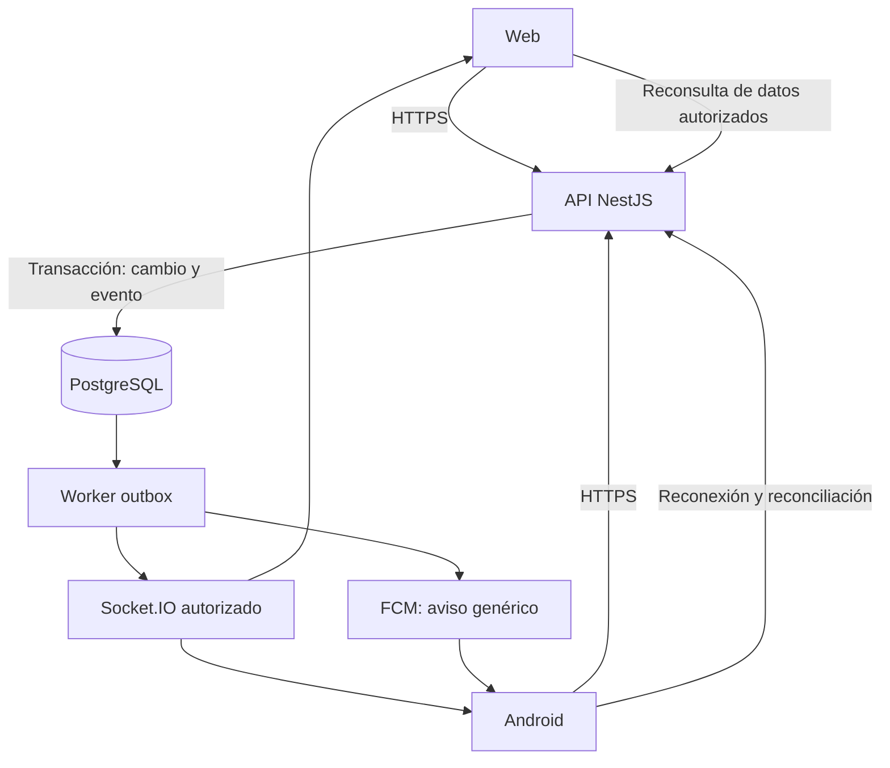

# Plan consolidado de aplicación móvil y sincronización

Fecha: 6 de octubre de 2026. Estado: propuesta; no implementada.

Proyecto: Guía Médica Monagas. Dominio: guiamedicamonagas.com. Backend productivo: gmm-independent.

Este documento compara PLAN-APP-MOVIL.md, el contexto adicional entregado y la propuesta previa. No autoriza despliegues ni cambios de código. Las duraciones, costes operativos y metas de rendimiento son estimaciones que deben validarse.

## 1. Decisión recomendada

Construir una app Android con React Native, Expo y TypeScript; conservar Next.js para la web y NestJS, Prisma y PostgreSQL como plataforma común. Primero se implementa y prueba la sincronización en la web; después se conectan las pantallas móviles.

Una app con experiencias de paciente y médico por rol. Administración y organizaciones permanecen en la web inicialmente. iOS se incorpora después con reutilización de lógica, pero con pruebas y publicación propias.

Las cuentas, permisos, consentimientos, documentos, citas y suscripciones viven en el backend existente. Firebase se utiliza únicamente para push, sin añadir Firestore ni otra base clínica.

## 2. Comparación y mejoras

| Punto | Decisión consolidada |
|---|---|
| Expo y TypeScript | Mantener. Compartir contratos y lógica pura; diseñar pantallas nativas. |
| Tiempo real primero | Mantener. Una demostración web/móvil debe validar la arquitectura antes de ampliar funciones. |
| Ningún aviso se pierde | Sustituir la promesa por persistencia transaccional, entrega al menos una vez, deduplicación, reintentos y reconciliación. Push no garantiza recepción inmediata. |
| ID creciente como cursor | No asumir orden de confirmación por un BIGSERIAL: transacciones pueden confirmar fuera de orden. Diseñar un log de entrega ordenado por destinatario o usar reconsulta completa inicialmente. |
| Redis como respaldo | Redis distribuye eventos entre instancias; PostgreSQL conserva la evidencia durable. Un adaptador Pub/Sub no equivale a recuperación persistente. |
| Funciones se encienden simultáneamente | Solo si la versión móvil ya contiene la función y soporta su contrato. Combinar flags, capacidades y versión instalada. |
| API nunca cambia | Mantener contratos compatibles dentro de v1; cambios incompatibles requieren nueva versión y periodo de coexistencia. |
| Sin cambios de proxy | Verificar upgrade, rutas y tiempos de espera. Puede requerirse ajustar únicamente la configuración propia del proyecto. |
| Datos nunca salen del servidor | El dispositivo los recibe y un PDF exportado puede quedar en Descargas, correo o WhatsApp. Documentar la frontera y obtener confirmación de exportación. |
| WebView siempre rechazado | No es una prohibición universal. Expo se elige por experiencia y capacidades; cualquier enfoque debe cumplir calidad, permisos y políticas. |
| Flutter no reutiliza nada | Puede reutilizar backend y contratos; comparte menos código de interfaz y lógica TypeScript. |
| EAS Update evita revisión | Solo actualizaciones compatibles con el runtime nativo y las políticas. Nuevos módulos y permisos requieren un nuevo binario. |
| Sin coste adicional de servidor | Medir conexiones, memoria, transferencia, almacenamiento y worker antes de afirmarlo. |
| Cuenta personal para la app médica | Planificar cuenta de organización verificada y D-U-N-S para este producto. |

## 3. Objetivos y límites

### Objetivos

- Misma información autorizada en web y móvil.
- Cambio visible automáticamente en sesiones abiertas.
- Recuperación tras desconexión y reinicios.
- Revocación de acceso coherente entre dispositivos.
- Publicación en Google Play con privacidad y soporte operativos.

### Límites

- Sin conexión no existe sincronización inmediata.
- Android puede suspender la app; push avisa y al volver a primer plano se reconcilian los datos.
- No se incluyen historias clínicas editables sin conexión en el primer lanzamiento.
- Una función apagada por revisión legal permanece apagada en ambos clientes.
- Los eventos públicos no revelan pacientes, reservas individuales ni datos clínicos.

Meta inicial: p95 menor de 2 segundos desde la confirmación del servidor hasta la actualización visible, bajo una carga y red definidas. Medir también p99, retraso del outbox, errores y recuperación. No garantizar simultaneidad absoluta.

## 4. Stack

| Área | Selección |
|---|---|
| App | React Native + Expo, SDK estable compatible elegido al iniciar |
| Navegación | Expo Router |
| Consultas y caché | TanStack Query |
| Estado local | React; Zustand solo donde exista necesidad concreta |
| Formularios | React Hook Form + Zod |
| Tiempo real | Socket.IO cliente y gateway NestJS |
| Sesiones | Access token en memoria; refresh token rotatorio en SecureStore |
| Push | expo-notifications + FCM directo desde backend para Android |
| Cámara y archivos | Módulos Expo para cámara, selectores, filesystem y compartir |
| UI | Componentes y tokens propios; evaluar NativeWind, calendario y listas en una prueba de compatibilidad |
| Persistencia de eventos | PostgreSQL outbox y worker del proyecto |
| Varias instancias | Redis Streams adapter si hace falta; validar reconexión y despliegue |
| Errores | Sentry como propuesta inicial, con filtrado y revisión de privacidad; Crashlytics es alternativa |
| Distribución | EAS Build/Submit, Play App Signing y AAB |
| Calidad | Tests API, React Native Testing Library, Maestro y pruebas manuales Android/TalkBack |

Usar development builds desde el inicio. No fijar combinaciones de Expo/React Native copiadas de un plan sin verificar su soporte actual.

## 5. Repositorio y contratos

Estructura propuesta:

```text
backend/                  API, worker, eventos y migraciones
frontend/                 Web existente
mobile/                   App Expo
packages/contracts/       DTO públicos, eventos y cliente generado
packages/domain/          Validaciones y funciones puras compatibles
packages/legal/           Textos y versiones legales
docs/                     Decisiones, operación y publicación
```

Elegir un solo esquema de workspaces y lockfiles tras probar Docker y CI. No reorganizar todo el repositorio como condición para comenzar. Los paquetes compartidos no importarán Prisma, secretos, APIs de navegador ni dependencias exclusivas del backend.

OpenAPI genera clientes tipados; los tests verifican contratos y errores. La autoridad de validación y permisos permanece en el servidor. Compartir Zod no convierte los datos recibidos del móvil en confiables.

Si Docker necesita paquetes externos a frontend/, ajustar su contexto y .dockerignore para excluir .env, credenciales y archivos locales. Registrar la revisión de builds antes de producción.

## 6. Diseño de sincronización



### Escritura

1. Validar sesión, permisos, consentimiento y versión del recurso.
2. Aplicar cambio y registrar evento en una sola transacción.
3. Responder con estado confirmado y nueva versión.
4. Worker procesa eventos con bloqueo de filas, reintentos y estado de error.
5. Cliente invalida las consultas afectadas y obtiene la representación autorizada.

Registrar eventos desde todos los caminos: web, móvil, administración, cron, vencimientos, revisión de pagos y BCV. No publicarlos antes de confirmar la transacción.

### Entrega y recuperación

- Cada evento tiene eventId, tipo, recurso, versión y destinatarios determinados por el servidor.
- El worker puede entregar más de una vez; el consumidor es idempotente.
- dispatcheado no significa recibido por todos los dispositivos.
- Un cursor global de IDs de inserción puede saltarse una transacción tardía. Para replay durable, asignar secuencias de entrega por destinatario después de confirmar el evento y serializar su publicación.
- Primera versión admite invalidación completa al reconectar como mecanismo seguro, mientras se construye replay incremental.
- Snapshot y cursor deben ser coherentes: conectar y almacenar temporalmente eventos durante la lectura inicial, o establecer un protocolo equivalente y probar la carrera.
- Cursores fuera de retención provocan RESET_REQUIRED y consulta completa; no devuelven silenciosamente una lista vacía.
- Replay aplica permisos actuales; no entrega datos por una autorización histórica revocada.
- Mantener comprobación periódica de respaldo y reconsulta al recuperar foco. WebSocket no es la única protección contra desactualización.

### Conflictos

- Reserva y pago: idempotency key y restricciones existentes de base de datos.
- Perfil, horario y talonario: version o ETag; ante conflicto devolver 409/412 y permitir revisar antes de reenviar.
- Cambios sensibles requieren confirmación del backend; no presentar emisión o reserva como completada de forma optimista.
- Eventos de disponibilidad pública invalidan horarios agregados con coalescencia y límites, sin exponer IDs de pacientes.

### Seguridad del canal

El servidor asigna salas; el cliente no puede elegir una sala arbitraria. Revalidar expiración, tokenVersion y permisos al conectar, reconectar y renovar. Revocaciones expulsan sesiones y eliminan caché sensible. La recuperación de conexión no debe saltarse autorización.

No utilizar IDs o tokens clínicos en URLs de socket, logs o métricas. El canal y el replay admiten límites de conexión y de tamaño. El acceso administrativo a identidades debe seguir condicionado por la bóveda, incluso si una sala administrativa está abierta.

## 7. Sesiones, push y enlaces

### Sesiones

- Revisar JWT actual antes de declarar que sirve sin cambios: expiración, audience, sesiones y revocación deben ser compatibles.
- Endpoint móvil o negociación explícita de transporte para renovar tokens; la web conserva cookies protegidas y su defensa CSRF.
- Refresh token en cuerpo solo en rutas diseñadas para ese transporte, sin logging de credenciales.
- Rotación, detección de reutilización, dispositivos y cierre remoto; cuenta y dispositivo no se identifican por un encabezado manipulable como única defensa.
- Límites por cuenta, IP y señales de abuso. Un identificador de instalación es auxiliar, no prueba de identidad.
- Mantener el MFA actual; biometría local no sustituye autenticación del servidor.

### Push

- Registrar token FCM por instalación y sesión; actualizarlo cuando cambie y desvincularlo al salir o cambiar de usuario.
- Payload genérico: tipo e identificador opaco, sin nombres de pacientes, síntomas ni contenido del récipe.
- Preferencias por usuario y canales Android; registrar entrega al proveedor sin afirmar que el usuario leyó.
- Credencial de servicio únicamente en backend, con mínimo privilegio y rotación. La configuración pública Android no es esa credencial.
- Reintentar errores temporales, limpiar tokens inválidos y evitar avisos a usuarios con permisos revocados.

### App Links

Publicar assetlinks.json usando el certificado de firma de Play, y comprobar rutas en teléfonos instalados desde la tienda. Verificación, recuperación y QR deben tener fallback web. Probar particularmente fragmentos de códigos; nunca consumir automáticamente tokens por abrir el enlace.

## 8. Alcance por versiones

| Función | MVP Android | Ampliación |
|---|---|---|
| Directorio, búsqueda y perfiles | Sí | Optimización y favoritos si se solicitan |
| Login, verificación, recuperación y seguridad | Sí | Métodos adicionales según decisión |
| Citas y disponibilidad | Sí | Funciones avanzadas de agenda |
| Pedidos de contacto y avisos | Sí | Nuevos canales según consentimiento |
| Paciente: código y permisos | Sí | Flujos avanzados de consentimiento |
| Médico: agenda, citas, mensajes y perfil | Sí | Estadísticas y publicaciones |
| Documentos con cámara/selectores | Sí, tras QA de legibilidad | Optimización adicional |
| Consulta del plan vigente | Sí | Compras únicamente con diseño de pagos aprobado |
| Récipes: ver y compartir | Condicional a correcciones y revisión legal | — |
| Emisión, anulación y talonario | Módulo posterior o hito opcional antes de lanzamiento | QA específica de identidad y PDF |
| Valoraciones | Solo si están habilitadas y soportadas | — |
| Administración y organizaciones | Web | Alcance separado |
| Edición clínica offline | Fuera de alcance | Requiere proyecto de seguridad propio |

Paciente y médico comparten una app, pero no todos los flujos de escritorio son necesarios en el primer lanzamiento. Los flags no crean pantallas inexistentes: config incluirá capacidades requeridas y versión mínima por función.

## 9. Privacidad y uso sin conexión

- Caché pública persistente limitada; información clínica en memoria por defecto.
- SecureStore para secretos pequeños, no para PDFs ni bases clínicas.
- Limpiar datos de usuario al cerrar sesión, revocar permisos o cambiar de cuenta.
- Bloquear capturas y previsualizaciones sensibles donde Android lo permita; no presentarlo como protección absoluta.
- Antes de exportar PDF, explicar que se guardará o compartirá fuera de la app. Archivos temporales con vencimiento; no prometer borrar copias ya exportadas.
- Fotos mediante selectores del sistema y cámara puntual; compresión compatible con legibilidad y sin metadatos innecesarios.
- SDK de errores sin cuerpos HTTP, tokens, códigos, PDFs, mensajes ni reproducciones de sesión clínica.
- Actualizar inventario de proveedores, retenciones y Data safety según comportamiento real de FCM, Expo y telemetría.
- Modo offline muestra estado y última actualización; no permite confirmar citas, pagos, consentimientos o récipes sin servidor.

## 10. Bloqueantes previos

Validar el estado actual antes de implementar, porque algunos puntos pueden haberse corregido:

1. Identidad del destinatario al emitir o entregar un récipe, incluidos representantes.
2. Límite atómico de envíos y de pedidos de contacto.
3. Manejo de códigos mal formados.
4. SMTP real probado para altas, recuperación y MFA.
5. Respaldos externos, restauración comprobada y recuperación de llaves.
6. Responsable legal y consentimiento actualizado.
7. Versiones de APIs y funcionamiento del proceso de eliminación.

El plan original menciona ADMIN_MFA_WAIVER_UNTIL=2026-10-24. El script local contiene la validación de vencimiento, pero aquí no se leyó el entorno productivo: esa fecha y SMTP deben confirmarse en el VPS. No prolongar la excepción como solución de publicación.

## 11. Google Play y monetización

- Planificar publicación como organización; Google incluye apps médicas entre los servicios que deben elegir este tipo de cuenta. Obtener D-U-N-S y completar verificación. No afirmar que toda organización debe constituirse como sociedad: validar la forma del titular con asesoría local. [Tipo de cuenta](https://support.google.com/googleplay/android-developer/answer/13634885?hl=en).
- Completar declaración de salud, Data safety, privacidad, público objetivo y acceso de revisores con datos ficticios. [Salud](https://support.google.com/googleplay/android-developer/answer/14738291?hl=en).
- Eliminación desde la app y página web; revisar el flujo completo, no solo que exista un enlace. Explicar retención justificada y plazos. [Eliminación](https://support.google.com/googleplay/android-developer/answer/13327111?hl=en).
- Objetivo actual para envío: API 36 según la consulta previa; confirmar de nuevo antes de compilar la versión final. Verificar páginas de memoria de 16 KB de todas las librerías nativas incluidas, no solo React Native. [Target API](https://support.google.com/googleplay/android-developer/answer/11926878?hl=en).
- AAB firmado, Play App Signing, control de versionCode y credenciales a nombre del titular.
- Los planes digitales no se venderán ni se promocionarán con enlaces de pago externos en el MVP. Si se añaden compras, definir Play Billing y validación de derechos en backend o el programa aplicable. Consultas clínicas y suscripciones digitales requieren análisis separado. [Pagos](https://support.google.com/googleplay/android-developer/answer/9858738?hl=en).
- Cuenta personal nueva: el requisito de 12 testers/14 días corresponde a esas cuentas, no al calendario técnico universal. La beta con usuarios representativos sigue siendo necesaria. [Pruebas](https://support.google.com/googleplay/android-developer/answer/14151465).
- Prueba interna, beta cerrada y primera publicación controlada. Verificar si el tipo de lanzamiento permite rollout por porcentajes; usar porcentajes en actualizaciones elegibles, sin asumirlos para la primera publicación.

## 12. Actualizaciones y operación

EAS Update solo para cambios compatibles con el runtime nativo y las políticas; cambios de módulos, permisos o SDK requieren nuevo binario. Preview antes de producción, rollout cuando corresponda y rollback probado. [Runtime](https://docs.expo.dev/eas-update/runtime-versions/).

GET /app/config propone minSupportedVersion, latestVersion, capabilities, legalVersions y maintenance. No bloquear rutas de renovación, configuración o eliminación por un middleware global de versión. Semver y Android versionCode cumplen funciones distintas.

Compatibilidad probada con la app vigente y al menos la anterior durante una ventana acordada. Cambios incompatibles se versionan; no forzar actualización por cada publicación web.

Staging con datos sintéticos, API/DB/Redis/almacenamiento propios y límites de recursos. Producción se amplía dentro de gmm-independent. Comprobar proxy y WebSocket, backups y salud; no reiniciar otros proyectos. Migraciones aditivas, flags apagados y despliegue gradual con reversión de aplicación.

## 13. Fases y puertas de aceptación

| Fase | Entregable y cierre | Tiempo orientativo |
|---|---|---|
| 0. Identidad y preparación | Titular, Play/D-U-N-S, SMTP, legal, alcance y auditoría de bloqueantes | 2–6 semanas externas, en paralelo |
| 1. Contratos y sesiones | OpenAPI, clientes, sesión móvil, dispositivos, config y staging; pruebas de revocación | 1–2 semanas |
| 2. Sincronización | Outbox, worker, web, recuperación y permisos; demostración de cita web/móvil | 2–3 semanas |
| 3. Base Android | Navegación, login, directorio, App Links y push en teléfono real | 1–2 semanas |
| 4. Paciente | Citas, contacto, permisos, seguridad y eliminación; recorridos completos | 2 semanas |
| 5. Médico | Agenda, mensajes, perfil, documentos y estado de plan | 2–3 semanas |
| 6. Calidad y tienda | Concurrencia, accesibilidad, carga, beta, ficha y paquete firmado | 2–3 semanas |
| Opcional récipes completos | Talonario, emisión, PDF, identidad y revisión legal | 2–3 semanas adicionales |

Base razonable: 12–16 semanas para el MVP con equipo pequeño experimentado; 14–19 si se incluye el módulo completo de récipes. Hay solapamientos posibles; trámites y revisión de tienda no tienen plazo garantizado. No cerrar cada fase con despliegue productivo automático: primero staging, aceptación y comprobaciones.

## 14. Pruebas y métricas

| Prueba | Criterio de aceptación |
|---|---|
| Cambio entre web y móvil | Visible sin recargar; medir p95 desde commit a render |
| Reinicio después del commit | Estado recuperado y evento reintentado |
| Eventos duplicados/desordenados | Sin efectos repetidos ni regresión de versiones |
| Transacción tardía con ID menor | Recuperación no omite su cambio |
| Reconexión y cursor vencido | Estado converge mediante replay o reset |
| Suspensión y consentimiento | Canal cerrado y datos retirados; API niega acceso |
| Dos reservas del mismo horario | Una confirmada; conflicto legible para la otra |
| Rotación de token y cambio de usuario | Sin filtración de caché ni push al usuario anterior |
| Flags en app antigua | Sin mostrar flujos incompatibles |
| Privacidad | Sin tokens ni contenido clínico en logs, push o telemetría |
| Android | Gama baja, TalkBack, texto ampliado, WiFi/datos y segundo plano |
| Carga | Concurrencia esperada más margen; sin degradar web ni otros proyectos |
| Recuperación operativa | Restauración y rollback ensayados |

Registrar backlog del outbox, edad del evento más antiguo, reconexiones, fallos de auth, errores API y crashes. Definir alertas y responsable de respuesta. La prueba de miles de conexiones dependerá de previsión de usuarios y capacidad; no ejecutarla contra producción compartida.

## 15. Costes y responsabilidades

Presupuestar desarrollo, QA, mantenimiento, cuenta Play, builds, distribución OTA, staging, backups, almacenamiento, correo y observabilidad. FCM figura entre los servicios sin coste en Firebase, pero servicios asociados pueden generar cargos. [Firebase](https://firebase.google.com/pricing).

Expo gratuito tiene cuotas; planes pagos incluyen diferencias de crédito, concurrencia, límites y uso, no solo velocidad. Recalcular antes de contratar. [Expo](https://expo.dev/pricing).

Reutilizar VPS puede ser viable, pero requiere medir CPU/RAM/conexiones y reservar recursos para los demás proyectos. No prometer coste operativo cero.

Responsables mínimos: titular de producto/cuentas; desarrollo backend y móvil; QA; asesoría legal; responsable de operación/soporte. Una persona puede asumir varios papeles, pero deben tener un propietario explícito.

## 16. Decisiones y orden de inicio

1. Confirmar titular, nombre e identificador Android.
2. Confirmar MVP de paciente y médico; récipes como hito condicionado.
3. Acordar ventanas de compatibilidad, retención de eventos y carga objetivo.
4. Confirmar FCM directo, telemetría y política de exportación.
5. Validar cuentas de tienda, SMTP y bloqueantes.
6. Probar sesión móvil y una cita sincronizada antes de construir el resto.

Estado final de esta entrega: plan preparado; no se implementó la app, no se modificó código y no se realizó commit, push o despliegue.
