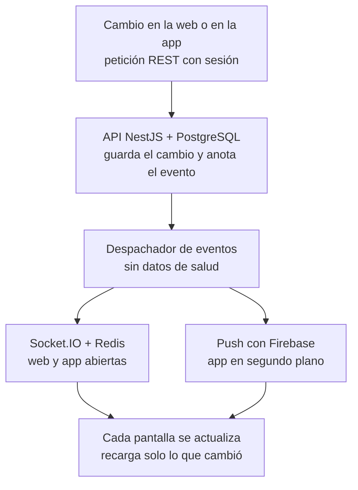

# Plan de la app Android sincronizada en tiempo real

> **Estado:** propuesta, sin implementar.
> **Fecha:** 2026-10-06 · **Preparado por:** Claude Opus 5.5
> **Alcance:** app para Google Play (Android). iPhone queda para después, con el mismo código.
> Basado en el código actual del repositorio y en los requisitos de Google Play vigentes a esta fecha (ver [Fuentes](#14-fuentes)).

## 1. Resumen

Recomendación: app nativa con **React Native + Expo**, conectada a la misma API (NestJS) y a la misma base de datos
(PostgreSQL) que la web, más una capa de tiempo real en el servidor que usan las dos.

Así no hay dos plataformas que mantener al día: los datos están en un solo lugar y la web y la app se enteran al
instante de cada cambio.

Este plan sigue la línea del «Plan maestro — App móvil iOS/Android» que el titular compartió el 2026-09-25 (Expo,
backend NestJS único, outbox + Socket.IO + push, OpenAPI), con dos cambios:

- **Solo Android al principio.**
- **El tiempo real se construye antes que las pantallas de la app** (en el plan maestro iba al final), porque ahora la
  sincronización total es el requisito central.

## 2. Stack recomendado

### 2.1 Por qué Expo + React Native

| Opción | Veredicto |
|---|---|
| **Expo + React Native** (recomendada) | Mismo lenguaje y mismas validaciones que la web (TypeScript, React, zod, react-hook-form). Es una app nativa de verdad: cámara, avisos en el teléfono, PDF y compartir. Los cambios de pantallas pueden llegar al teléfono sin esperar la revisión de Google (EAS Update). Sirve para iPhone después con el mismo código. |
| Envolver la web (Capacitor o TWA) | Más rápido al inicio, pero Google rechaza las apps que son solo un sitio envuelto. La cámara, los avisos y el uso con mala señal quedan limitados. Además, la web usa Next.js con servidor, que no se empaqueta tal cual. |
| Flutter | Buen rendimiento, pero otro lenguaje (Dart) y no se reutiliza nada del código actual. |
| Kotlin nativo | Máximo control, pero solo Android, otro lenguaje y todo desde cero. |

### 2.2 Versiones

- Expo SDK 56 (React Native 0.85, React 19.2) o la versión estable más reciente al empezar.
- Compilada para Android 16 (targetSdk 36), que Google Play exige desde el 31/08/2026.

### 2.3 Piezas de la app

| Necesidad | Pieza |
|---|---|
| Rutas y navegación | Expo Router (rutas por carpetas, como en Next.js) |
| Datos del servidor, caché y recarga | TanStack Query |
| Tiempo real | socket.io-client |
| Formularios y validación | react-hook-form + zod (los mismos esquemas que la web) |
| Estilos | NativeWind (los mismos colores de Tailwind de la web) |
| Listas largas | FlashList (fluidas en teléfonos de gama baja) |
| Agenda del médico | react-native-calendars (FullCalendar no funciona en el teléfono) |
| Sesión guardada | expo-secure-store (almacén cifrado de Android) |
| Avisos en el teléfono | expo-notifications + Firebase Cloud Messaging |
| Fotos, documentos y escanear el QR del récipe | expo-camera, expo-image-picker y expo-image-manipulator (para comprimir) |
| PDF por WhatsApp o correo | expo-file-system + expo-sharing |
| Bloquear capturas en pantallas sensibles | expo-screen-capture |
| Enlaces que abren la app | expo-linking + Android App Links |
| Actualizaciones sin pasar por la tienda | expo-updates (EAS Update) |
| Compilar y publicar | EAS Build y EAS Submit (o compilación propia en GitHub Actions) |
| Errores de la app | Crashlytics o Sentry (decisión pendiente) |

### 2.4 Código compartido y estructura del repositorio

```text
backend/    NestJS: + tiempo real, push y sesión para el teléfono
frontend/   Next.js: + cliente de tiempo real
mobile/     Expo (nuevo, con su propio package-lock)
shared/     tipos, validaciones, catálogo de eventos, textos legales
            y fechas en hora de Caracas (nuevo)
e2e/
```

- `shared/` lo usan la web y la app, para que cada regla (por ejemplo, el formato de la cédula o los textos legales)
  viva en un solo lugar.
- El build de la web en Docker hoy usa `./frontend` como contexto: hay que ajustarlo para que incluya `shared/`.

## 3. Cómo funciona la sincronización



### Reglas

1. **Una sola base de datos.** La web y la app no se copian datos entre sí; las dos leen y escriben en la misma API.
   Hoy la campana pregunta cada 60 segundos y las demás pantallas solo se actualizan al recargar. Con esto, cada
   pantalla se entera al instante.
2. **Los avisos de cambio no llevan datos de salud.** Solo dicen, por ejemplo, «la cita X cambió». La pantalla pide el
   dato por la API de siempre, con los mismos permisos, cifrado, bóveda y auditoría. El tiempo real no abre un camino
   nuevo a los datos.
3. **Ningún aviso se pierde.** Cada aviso se anota en la base en la misma transacción que el cambio (patrón *outbox*).
   Si el servidor se reinicia justo después de guardar, el aviso igual sale.
4. **Al volver la señal, el teléfono se pone al día.** Los avisos van numerados. El teléfono recuerda el último que
   recibió y, al reconectar, pide los que se perdió; si pasó demasiado tiempo, recarga todo.
5. **Si dos dispositivos guardan a la vez, decide el servidor.** Las citas ya no pueden solaparse porque la base de
   datos lo impide (restricción `Appointment_no_overlap`). Para el perfil, el horario y el talonario se agrega control
   de versión: el segundo en guardar ve «esto cambió en otro dispositivo» y no borra el cambio del primero.
6. **Las funciones también van sincronizadas.** La app lee del servidor las mismas funciones encendidas (récipes,
   valoraciones, organizaciones) y las mismas versiones legales. Si se enciende algo en el servidor, aparece en la web
   y en la app a la vez.
7. **Los datos no salen del servidor propio.** No se recomienda usar Firebase como base de datos ni sistemas que copien
   la información al teléfono para trabajar sin conexión: sacarían datos de salud del servidor, y las citas y los
   récipes deben validarse ahí. Firebase solo se usa para entregar los avisos en el teléfono.

**Meta:** con las dos pantallas abiertas, un cambio hecho en una aparece en la otra en menos de 1 o 2 segundos.

## 4. Cambios en el servidor (antes de la app)

### 4.1 Sesión para el teléfono

- El token de acceso ya viaja como `Authorization: Bearer` y sirve tal cual.
- El token de renovación hoy vive en una cookie del navegador (`gmm_refresh_token`). En la app viaja en la respuesta y
  se guarda en el almacén cifrado de Android.
- `RefreshToken` registra el tipo de cliente y el nombre del dispositivo. En «Seguridad» se ve la lista de
  dispositivos y se puede cerrar la sesión de cualquiera a distancia.
- La verificación en dos pasos sigue siendo por correo, sin Google Authenticator.
- Los intentos de inicio de sesión se limitan por cuenta y por teléfono, no solo por IP: las operadoras venezolanas
  comparten una misma IP entre muchos clientes (CGNAT).

### 4.2 Compatibilidad entre versiones

- Descripción formal de la API (OpenAPI) generada desde NestJS y, a partir de ella, un cliente tipado para la web y la
  app, con un catálogo de códigos de error.
- A `/api/v1` solo se le agregan campos; nunca se le quitan ni se les cambia el nombre, porque las apps instaladas
  tardan en actualizarse.
- `GET /app/config` devuelve la versión mínima aceptada, las funciones encendidas y las versiones legales. Si la app
  instalada es más vieja que la mínima, pide actualizarla.

### 4.3 Tiempo real

- Socket.IO en la ruta `/api/v1/realtime`, autenticado con la misma sesión. Entra por el bloque `/api/*` de Caddy y
  por Traefik sin tocar su configuración ni los otros proyectos del VPS.
- Cada aviso llega solo a quien le importa: el usuario, el médico, su organización o el equipo de administración
  (salas; ver el [anexo](#13-anexo-técnico-propuesta)).
- Un canal público por médico, para que los horarios libres se actualicen solos mientras alguien está agendando.
- Redis, que ya está en el servidor y hoy no se usa, queda como adaptador por si la API crece a más de un contenedor.
- Cerrar todas las sesiones (cambio de contraseña, «cerrar sesión en todos lados», suspensión) también desconecta los
  canales abiertos.

### 4.4 Avisos en el teléfono (push)

- Tabla de dispositivos con su token de Firebase.
- Salen desde la misma función (`notify()`) que hoy crea el aviso de la campana y el correo, con el mismo criterio: sin
  nombrar medicamentos ni diagnósticos.
- Cada tipo de aviso tiene su interruptor en «Notificaciones», como los correos opcionales.
- Canales de Android separados (citas, récipes, cuenta), para que cada persona decida cuáles suenan.
- La credencial de Firebase vive solo en el `.env.prod` del VPS.
- El modelo `PushSubscription` (aviso del navegador con VAPID) ya está migrado: con la misma pieza se puede activar
  después el aviso del navegador en la web.

### 4.5 Enlaces que abren la app

Con `/.well-known/assetlinks.json` en el dominio, los enlaces de los correos abren la app si está instalada y la web si
no:

- verificar el correo;
- restablecer la contraseña;
- verificar un récipe;
- invitaciones;
- enlaces cortos `/m/` y `/p/`.

### 4.6 La web también se conecta

Campana, agenda, citas, mensajes de pacientes, récipes, documentos, pagos y colas de administración se actualizan
solos, sin preguntar cada minuto. Esto mejora la web aunque la app todavía no salga.

## 5. Alcance de la primera versión

| Sin cuenta | Paciente | Médico |
|---|---|---|
| Buscar por especialidad y municipio | Agendar viendo los horarios libres en vivo | Agenda y citas en vivo |
| Ficha del médico | Mis citas y avisos | Mensajes de pacientes |
| Verificar un récipe escaneando su QR | Código de paciente y permisos | Pacientes |
| Registro e inicio de sesión | Mis récipes en PDF y por WhatsApp | Récipes: emitir, anular y compartir |
| | Descargar sus datos y pedir la eliminación de la cuenta | Talonario: fotografiar firma y sello |
| | Preferencias de avisos | Documentos de verificación con la cámara |
| | | Perfil, valoraciones y estado del plan |

- **Solo en la web:** administración y organizaciones (siguen en «Próximamente»). Estadísticas y publicaciones
  pasarían a la app en una segunda versión.
- **Récipes y valoraciones:** aparecen en la app solo cuando se encienden en el servidor (`PRESCRIPTIONS_ENABLED`,
  `REVIEWS_ENABLED`).
- **Pagos:** el médico ve su plan en la app, pero no puede comprarlo ni ve enlaces de compra ahí, por las reglas de
  pago de Google Play. El pago sigue en la web.

## 6. Seguridad y privacidad en el teléfono

- **Datos guardados:** la sesión va en el almacén cifrado del teléfono; la bóveda y los récipes nunca quedan guardados
  sin cifrar.
- **Capturas de pantalla:** las pantallas con datos sensibles (bóveda, récipes, documentos) las bloquean y no aparecen
  en la vista de apps recientes.
- **Avisos:** sin datos de salud, igual que los correos.
- **Fotos:** se comprimen antes de subirlas, para gastar menos datos móviles.
- **Medición:** la propia de la plataforma, sin rastreadores de terceros.
- **Errores de la app:** Crashlytics o Sentry, sin datos personales.
- **Nuevo proveedor:** Google Firebase (avisos). Hay que agregarlo en `/privacidad/proveedores` y en la política de
  privacidad, con revisión del abogado y un solo cambio de versión de los textos legales.

## 7. Requisitos de Google Play

1. **Cuenta de empresa con número D-U-N-S (bloqueante).** Google exige que las apps médicas las publique una
   organización con número D-U-N-S, así que hace falta una persona jurídica. El número es gratis pero puede tardar
   semanas: conviene pedirlo ya. Venezuela está admitida para registrarse. Las cuentas de organización no tienen la
   prueba obligatoria de 12 personas durante 14 días que se exige a las cuentas personales nuevas.
2. **Registro:** pago único de US$25 y verificación de identidad.
3. **Ficha de la tienda:** nombre, descripción, ícono, capturas, correo de soporte y URL de la política de privacidad
   (ya existe).
4. **Formularios de Google:**
   - seguridad de los datos (Data safety);
   - declaración de apps de salud (obligatoria para todas las apps);
   - clasificación por edades y público adulto;
   - cuentas de prueba de paciente y de médico para quien revise la app;
   - enlace para pedir la eliminación de la cuenta: `/reclamos?tipo=ACCOUNT_DELETION` ya existe en la web y también
     estaría dentro de la app.
5. **Requisitos técnicos:**
   - paquete AAB con la firma gestionada por Google Play;
   - targetSdk 36 (exigido desde el 31/08/2026);
   - permiso para mostrar avisos (Android 13 o superior);
   - pantalla de borde a borde y páginas de memoria de 16 KB (las versiones actuales de React Native ya cumplen).
6. **Lanzamiento:** prueba interna → prueba cerrada con médicos y pacientes reales → publicación por etapas (10 %,
   50 % y 100 % de los usuarios).

## 8. Fases y tiempos

| Fase | Qué incluye | Duración estimada |
|---|---|---|
| 0. Trámites (en paralelo, desde ya) | Persona jurídica y D-U-N-S, cuenta de Play, Firebase a nombre de la empresa, correo real (SMTP), datos del operador y revisión legal | 2 a 6 semanas, según terceros |
| 1. Servidor base | Sesión para el teléfono, OpenAPI, `/app/config` y límites por cuenta | 1 a 2 semanas |
| 2. Tiempo real | Eventos, Socket.IO, push y la web ya conectada | 1 a 2 semanas |
| 3. App base | Inicio de sesión con verificación por correo, directorio, enlaces y push | 1 a 2 semanas |
| 4. Paciente | Citas, avisos, código, permisos, récipes y privacidad | Unas 2 semanas |
| 5. Médico | Agenda, citas, mensajes, pacientes, récipes, talonario, documentos y perfil | 2 a 3 semanas |
| 6. Calidad y publicación | Pruebas en teléfonos de gama baja, TalkBack, ficha de Play, prueba con usuarios reales y revisión | Unas 2 semanas |

- **Total:** entre 10 y 13 semanas de desarrollo. Los trámites corren en paralelo y suelen ser lo que más tarda.
- **Las fases 1 y 2 mejoran la web por sí solas**, aunque la app todavía no esté publicada.
- **Cierre de cada fase:** como siempre: commit, push, `Actualizaciones.md` y despliegue en el VPS.

> **Ojo con el correo real (SMTP):** la app lo necesita para verificar cuentas, mandar códigos y recuperar
> contraseñas. Además, el 2026-10-24 vence la excepción de la verificación por correo de los administradores
> (`ADMIN_MFA_WAIVER_UNTIL`): sin SMTP, `deploy.sh` deja de desplegar desde ese día.

## 9. Pruebas

- **Servidor:**
  - el canal rechaza sesiones vencidas o cerradas;
  - un paciente no puede escuchar el canal de un médico;
  - ningún aviso se pierde ni llega dos veces a la pantalla;
  - los avisos push no llevan datos de salud;
  - los tokens de Firebase vencidos se limpian.
- **Sincronización de punta a punta (dos sesiones abiertas):**
  - el paciente agenda en una y la cita aparece en la agenda del médico en la otra, sin recargar;
  - un aviso leído en un dispositivo baja el contador en el otro;
  - anular un récipe actualiza la vista del paciente;
  - «cerrar sesión en todos lados» desconecta los otros dispositivos.
- **Señal inestable:** cortar la red del teléfono, hacer cambios en la web y devolver la red: el teléfono se pone al día
  solo.
- **App:** pruebas automáticas en emulador Android (Maestro) en CI; revisión manual en teléfonos de gama baja y con
  TalkBack.
- **Carga:** miles de conexiones simultáneas contra la API antes de lanzar.

## 10. Riesgos y mitigaciones

| Riesgo | Mitigación |
|---|---|
| La persona jurídica o el D-U-N-S tardan | Empezar los trámites ya; el desarrollo avanza en paralelo |
| Google rechaza la app por salud o datos | Declaración de salud y Data safety completos, descargo médico visible y cuentas de prueba para la revisión |
| Reglas de pago de Google Play | Sin compras ni enlaces de compra en la app |
| Señal inestable y datos caros | Reconexión con puesta al día, fotos comprimidas y caché |
| Apps viejas instaladas | La API solo agrega campos; versión mínima en `/app/config` |
| Datos de salud en el teléfono | Almacén cifrado, bloqueo de capturas y avisos sin datos de salud |
| SMTP pendiente | Bloquea la verificación de cuentas, el MFA y los despliegues desde el 2026-10-24 |
| Textos legales | Revisión del abogado y un solo cambio de versión legal |

## 11. Costos

| Concepto | Costo |
|---|---|
| Google Play | US$25, una sola vez |
| Avisos por Firebase | Gratis |
| Expo (compilar y actualizar la app) | El plan gratis alcanza para empezar; el de pago solo acelera las compilaciones |
| Servidor | Sin costo extra: el tiempo real va en la misma API y Redis ya está instalado |
| iPhone más adelante | US$99 al año a Apple, con el mismo código |

## 12. Decisiones pendientes del titular

1. ¿Se confirma Expo y React Native?
2. ¿La persona jurídica ya existe o hay que constituirla, y a nombre de quién se publica? De eso dependen el número
   D-U-N-S, la cuenta de Play y el nombre que verá la gente.
3. ¿Cómo se llamará la app y cuál será su identificador (por ejemplo `com.guiamedicamonagas.app`)? El identificador no
   se puede cambiar nunca después de publicar.
4. ¿Crashlytics o Sentry para registrar los errores?
5. ¿Primera versión con paciente y médico juntos, o primero solo paciente?

## 13. Anexo técnico (propuesta)

Nombres tentativos; se confirman al implementar.

### 13.1 Datos

| Modelo | Cambio |
|---|---|
| `RefreshToken` | + `clientType` (`WEB` o `ANDROID`), `deviceName` y `lastUsedAt` |
| `DeviceToken` (nuevo) | `userId`, `token` (único), `platform`, `appVersion`, `createdAt` y `lastSeenAt` |
| `User` | + `notificationPushOptOut`, igual que `notificationEmailOptOut` |
| `RealtimeEvent` (nuevo, outbox) | `id` creciente (sirve de cursor), `audience` (sala), `type`, `entityId`, `createdAt` y `dispatchedAt`; se borra a los pocos días (plazo a definir) |
| Perfil, horario y talonario | + control de versión para detectar ediciones simultáneas |

### 13.2 Endpoints y canal

| Ruta | Uso |
|---|---|
| `POST /auth/login`, `POST /auth/mfa/verify` | Con `client: "android"`, devuelven el token de renovación en el cuerpo |
| `POST /auth/refresh` | Acepta el token en el cuerpo para la app (la web sigue con la cookie) |
| `GET /auth/sessions`, `DELETE /auth/sessions/:id` | Dispositivos con sesión abierta y cierre a distancia |
| `GET /app/config` | Versión mínima, funciones encendidas y versiones legales |
| `POST /devices`, `DELETE /devices/:id` | Alta y baja del token de Firebase |
| `GET /realtime/missed?since=<id>` | Lo que se perdió el teléfono mientras no tuvo señal |
| `wss://…/api/v1/realtime` | Canal Socket.IO |

La app envía su versión en un encabezado (`X-App-Version`); si es menor que la mínima, la API responde `426` y la app
pide actualizar.

### 13.3 Salas

| Sala | Quién la escucha | Ejemplos |
|---|---|---|
| `user:{userId}` | El propio usuario, en todos sus dispositivos | Avisos, sus citas, sus récipes y el estado de la cuenta |
| `pro:{professionalId}` | El médico | Agenda, citas, mensajes de pacientes, valoraciones, documentos y pagos |
| `org:{organizationId}` | Miembros de la organización | Médicos y miembros (cuando se lancen las organizaciones) |
| `staff:{permiso}` | Administración con ese permiso | Colas de documentos, identidades, pagos y solicitudes |
| `public:pro:{professionalId}` | Cualquiera que esté viendo la ficha o agendando | Horarios libres |

### 13.4 Catálogo de eventos (inicial)

| Área | Eventos |
|---|---|
| Citas y agenda | `appointment.created`, `appointment.updated`, `appointment.cancelled`, `schedule.updated`, `availability.changed` |
| Avisos | `notification.created`, `notification.read` (con el contador de no leídos) |
| Mensajes de pacientes | `contact.created`, `contact.updated` |
| Récipes | `prescription.issued`, `prescription.annulled`, `prescription.delivered` |
| Verificación y documentos | `document.reviewed`, `verification.updated` |
| Pagos y planes | `payment.reviewed`, `subscription.updated` |
| Valoraciones | `review.published`, `review.replied` |
| Permisos del paciente | `grant.changed` |
| Sesión | `session.revoked` (cierra los canales abiertos) |

Cada evento lleva solo el tipo, el identificador y la sala. Nunca nombres, medicamentos, diagnósticos ni contenido.

## 14. Fuentes

- [Nivel de API exigido por Google Play](https://developer.android.com/google/play/requirements/target-sdk)
- [Prueba cerrada para cuentas personales nuevas](https://support.google.com/googleplay/android-developer/answer/14151465)
- [Cuentas de organización y D-U-N-S](https://support.google.com/googleplay/android-developer/answer/13634885)
- [Declaración de apps de salud](https://support.google.com/googleplay/android-developer/answer/14738291)
- [Países admitidos para registrarse](https://support.google.com/googleplay/android-developer/answer/9306917)
- [Expo SDK 56](https://expo.dev/changelog/sdk-56)
